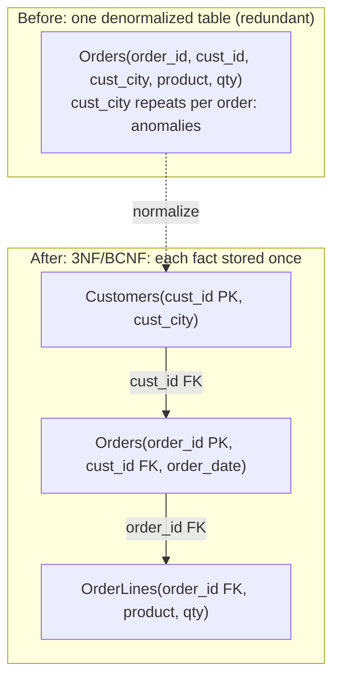

A spreadsheet that stores a customer's address on every one of their order rows
looks convenient until the customer moves: now the same fact lives in fifty
places, and updating forty-nine of them leaves the table self-contradicting. The
**relational model** is the discipline that prevents this. It says: store every
fact exactly once, in a table whose columns are chosen so that no column can
silently disagree with another<FN n="1" />. **Normalization** is the procedure that gets you
there, and the **normal forms** (1NF through BCNF) are the checkpoints along the
way<FN n="2" />.

## Relations, tuples, and keys

A **relation** is a table: a named set of **tuples** (rows), each tuple a fixed
list of **attributes** (columns) drawn from declared domains. "Set" is exact:
relational tuples are unordered and there are no duplicates. To address a
specific tuple you need a column, or combination of columns, whose value is
unique across the relation. A **superkey** is any set of attributes that
uniquely identifies a tuple; a **candidate key** is a superkey with no
removable attribute (drop any column and uniqueness breaks); the **primary key**
is one candidate key chosen as the official handle. A **foreign key** is an
attribute in one relation that references the primary key of another, the
mechanism that links tables without copying their contents.

## Functional dependencies

The structure that drives normalization is the **functional dependency** (FD).
Write $X \to Y$ (read "$X$ determines $Y$") when any two tuples that agree on the
attribute set $X$ must also agree on $Y$. The primary key determines every other
attribute by definition: if $K$ is a key of relation $R$ with attributes $A$,
then $K \to A$. Trouble starts when a *non-key* set determines something. In a
table

$$
\text{Orders}(\underline{\text{order\_id}},\ \text{cust\_id},\ \text{cust\_city},\ \text{product},\ \text{qty})
$$

the FD $\text{cust\_id} \to \text{cust\_city}$ holds (a customer has one city),
yet `cust_id` is not the key. That single misplaced dependency is the seed of
every anomaly below.

## The three anomalies

Redundancy, one fact stored in many rows, produces three concrete failure modes:

- **Update anomaly.** A customer moves city. The fact
  $\text{cust\_id} \to \text{cust\_city}$ is duplicated across all their order
  rows, so a correct update must touch every one. Miss a row and the relation now
  asserts two cities for one customer.
- **Insertion anomaly.** You cannot record a new customer's city until they place
  their first order, because the city only exists as a column of `Orders`. A fact
  that should stand alone is held hostage by an unrelated event.
- **Deletion anomaly.** Delete a customer's last order and their city vanishes
  with it. Removing one fact silently erases another.

All three trace to the same cause: an FD whose left side is not a key, forcing
the determined value to repeat.

## The normal forms

Each normal form forbids a sharper class of bad dependency.

**1NF (first normal form).** Every attribute holds a single atomic value: no
lists, no nested tables, no repeating groups of columns. This makes the relation
a flat table on which FDs are even definable.

**2NF (second normal form).** 1NF, plus no *partial* dependency: no non-key
attribute depends on only part of a composite key. If the key is
$(\text{order\_id}, \text{product})$ and $\text{order\_id} \to \text{order\_date}$,
then `order_date` depends on half the key and must move to a table keyed by
`order_id` alone.

**3NF (third normal form).** 2NF, plus no *transitive* dependency through a
non-key attribute: no non-key attribute determines another non-key attribute.
The $\text{cust\_id} \to \text{cust\_city}$ case is exactly this, `cust_id` is
not the key, yet it determines `cust_city`, so `cust_city` is split into a
`Customers` table.

**BCNF (Boyce-Codd normal form).** The clean statement that subsumes the others:
for *every* nontrivial FD $X \to Y$ that holds in the relation, $X$ must be a
superkey. BCNF is slightly stricter than 3NF (3NF tolerates a non-key
determinant when the determined attribute is itself part of a candidate key);
for most schemas the two coincide, and "every determinant is a key" is the rule
worth memorizing.

Decomposing the `Orders` table by these rules splits one redundant table into
three, each storing its fact once:

With `cust_city` living once in `Customers`, a move is a single-row update, a
new customer can be inserted before any order exists, and deleting an order
leaves the customer untouched. The next lesson asks what *workload* this clean
schema is good for, and where it falls short, in
[OLTP vs OLAP](K1/oltp-vs-olap).

<Footnotes>
  <FNItem n="1">**Codd, E. F.** (1970). "A relational model of data for large shared data banks". *Communications of the ACM*, 13(6), 377-387. [doi:10.1145/362384.362685](https://doi.org/10.1145/362384.362685). The founding paper of the relational model.</FNItem>
  <FNItem n="2">**Date, C. J.** (2003). *An Introduction to Database Systems* (8th ed.). Addison-Wesley. Standard treatment of functional dependencies and the normal forms 1NF through BCNF.</FNItem>
</Footnotes>
