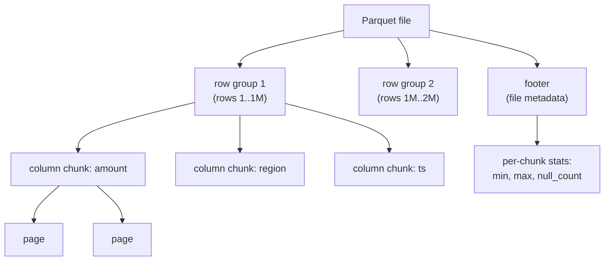
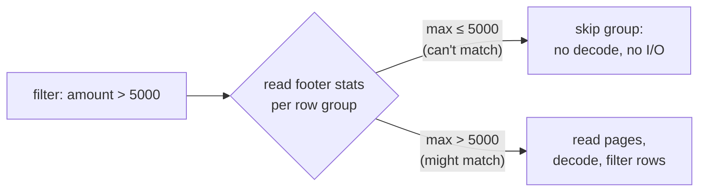

[Columnar layout](row-vs-columnar) and [lightweight encodings](compression-encoding)
are ideas; Parquet is the on-disk format that turns them into a real file. It is
the default for analytics because it answers a query by reading as little as
possible: only the columns projected, and within those, only the row groups whose
data *could* match the filter. The second half of that win comes from a few bytes
of statistics carried alongside the data, so the rest of this lesson is about how
the file is structured to make those statistics actionable.

## The nested layout: file → row group → column chunk → page

A Parquet file is not one flat column store; it is **horizontally partitioned**
into **row groups**, each holding a contiguous band of rows (often around a
million, or 128 MB of data). Within a row group, the values are stored
**vertically**: each column gets its own **column chunk**, a contiguous run of
that column's values for the rows in that group. A column chunk is further split
into **pages**, the smallest unit that is encoded and compressed as a whole.

So the file is column-major *inside* each row group, and row-major *across* row
groups. That hybrid is deliberate: column-major inside a group gives the
projection and compression wins, while cutting the file into row groups gives the
engine independent chunks it can skip or read in parallel.

## The footer carries the statistics

At the **end** of the file sits the **footer**, a block of metadata describing
everything above it: the schema, the byte offset of every row group and column
chunk (so a reader can seek straight to the bytes it wants), and, for each column
chunk, a small **statistics** record. The key fields are the chunk's **min** and
**max** value, its **null count**, and its row count. A reader opens the file by
reading the footer first, then uses it as an index into the body.

Storing the footer last is what lets a writer stream row groups out as they fill
and only finalize the metadata at the end, and it is why a reader needs just two
seeks (footer, then the targeted chunks) to answer a projected, filtered query.

## Predicate pushdown: skipping a row group without decoding it

The payoff is **predicate pushdown with row-group skipping**. Suppose a query
filters `WHERE amount > 5000`. For each row group, the engine reads the footer's
stats for the `amount` chunk, a `min` and a `max`, before touching any page. The
reasoning is a one-line interval test:

> If the chunk's `max` is $\le 5000$, then *every* value in the chunk fails the
> predicate, so no row in this group can match. The engine skips the entire row
> group: it never seeks to its pages, never decompresses, never decodes.

Concretely, a row group with `amount` stats `min = 12, max = 480` is pruned by the
filter `amount > 5000`, because $480 \le 5000$ guarantees no match. A group with
`max = 9000` cannot be ruled out, so the engine reads its pages and checks
row by row. The test is **conservative**: it only ever skips groups that are
*provably* all-non-matching, so it never drops a real result, and its power
depends on the data being clustered, stats on a column sorted (or partitioned) by
the filter give tight, non-overlapping `[min, max]` ranges that prune most groups,
while a randomly shuffled column gives wide overlapping ranges that prune nothing.

The same `min`/`max`/`null_count` stats also answer some aggregates outright
(`MAX(amount)` over a sorted column needs only the footer), and `null_count` lets
`IS NOT NULL` filters skip all-null chunks. Skipping at the row-group level is
coarse pruning *inside* a file; the [next lesson](partitioning-pruning) does the
same trick one level up, pruning whole files via the directory layout, and shows
why slicing too finely backfires.
