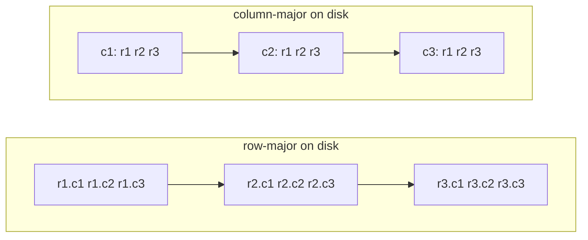

A table is a two-dimensional thing: rows and columns. Storage is one-dimensional:
a file is a sequence of bytes. So a storage engine has to choose an *order* in
which to flatten the table onto disk, and that choice decides which queries are
cheap. [Analytical workloads](K1/oltp-vs-olap) read a handful of columns across
millions of rows (`SELECT region, SUM(amount) ... GROUP BY region`). The layout
that lets such a query touch only the columns it asked for is the one that wins,
and that layout is columnar<FN n="1" />.

## Two ways to flatten a table

Take a table with $R$ rows and $C$ columns, where column $j$ stores values of a
fixed byte width $w_j$. The size of one row is $W = \sum_{j=1}^{C} w_j$ bytes, and
the whole table is $R \cdot W$ bytes either way. What differs is the *order* on
disk.

**Row-major (row store)** writes the table row by row: all $C$ fields of row 1,
then all $C$ fields of row 2, and so on. Row $i$ occupies one contiguous block of
$W$ bytes. This is how an [OLTP](K1/oltp-vs-olap) engine likes it: fetching or
updating a whole record is one contiguous read.

**Column-major (column store)** writes the table column by column: all $R$ values
of column 1, then all $R$ values of column 2. Column $j$ occupies one contiguous
block of $R \cdot w_j$ bytes. Reading one column is now a single contiguous scan,
and the other columns are nowhere near it<FN n="2" />.



## The bytes an analytical query must scan

A query that reads a subset $S \subseteq \{1, \dots, C\}$ of the columns has to
pull some number of bytes off disk before it can compute anything. The disk reads
in contiguous blocks, and the smallest unit it can skip is a contiguous run of
bytes belonging entirely to columns outside $S$. Count the bytes each layout
forces it to scan.

**Step 1: row-major.** The values of a wanted column are scattered: column $j$'s
value in row $i$ sits at offset $i \cdot W + \sum_{k<j} w_k$, so consecutive
values of one column are $W$ bytes apart, interleaved with every other column. To
read even one column you must stream past all the others. There is no contiguous
run that belongs only to unwanted columns, so the engine scans the entire table:

$$
B_{\text{row}} = R \cdot W = R \sum_{j=1}^{C} w_j .
$$

The cost does not depend on $|S|$ at all; reading 1 column costs the same as
reading every column.

**Step 2: column-major.** Each column is its own contiguous block, so the engine
seeks to the blocks of the columns in $S$ and reads only those. The bytes scanned
are

$$
B_{\text{col}} = R \sum_{j \in S} w_j .
$$

**Step 3: the ratio.** Dividing the two,

$$
\frac{B_{\text{row}}}{B_{\text{col}}} = \frac{\sum_{j=1}^{C} w_j}{\sum_{j \in S} w_j} ,
$$

which is large exactly when the query reads few of many columns: the wide-table,
narrow-projection shape of analytics<FN n="3" />. For a 50-byte row where the query wants two
4-byte columns, that ratio is about $50/8 \approx 6$: the row store moves roughly
six times the data to answer the same question. (This is the I/O argument alone;
columnar layout *also* makes each column compress far better, which the
[next lesson](compression-encoding) develops.)


## Worked example

Lay out a million-row, eight-column table and count the bytes a 2-column query
scans under each physical order.

```python
import numpy as np

n_rows = 1_000_000
# Byte width of each of the 8 columns (mixed types: two int64, two int32, ...).
widths = np.array([8, 8, 4, 4, 2, 1, 16, 8])     # bytes per value, per column
selected = np.array([0, 6])                       # the query reads columns 0 and 6

row_width = widths.sum()                           # bytes per full row
bytes_row = n_rows * row_width                     # row store: must scan everything
bytes_col = n_rows * widths[selected].sum()        # column store: only 2 columns

ratio = bytes_row / bytes_col
print(f"row width            = {row_width} bytes")
print(f"row-store  scanned   = {bytes_row/1e6:,.1f} MB")
print(f"column-store scanned = {bytes_col/1e6:,.1f} MB")
print(f"row / column ratio   = {ratio:.2f}x")

# Row store reads the whole table; column store reads only the projected columns.
assert bytes_row == n_rows * widths.sum()
assert bytes_col == n_rows * (widths[0] + widths[6])
assert bytes_col < bytes_row
assert np.isclose(ratio, widths.sum() / widths[selected].sum())
assert ratio > 2.0
print("columnar scans far fewer bytes for a narrow projection:", bytes_col < bytes_row)
```

The column store scans only the two requested columns while the row store scans
all eight, a ratio fixed by the row width over the projected width.

## Exercises

**Exercise 1.** A table has six columns of byte widths
$(8, 8, 4, 4, 2, 1)$ and $R = 2{,}000{,}000$ rows. A query projects the two 4-byte
columns. Compute the bytes scanned under row-major and column-major layout, and the
columnar advantage ratio.

<details>
<summary>Solution</summary>

**Step 1.** Row width is $W = 8+8+4+4+2+1 = 27$ bytes. A row store has no
contiguous all-unwanted run, so it scans the whole table:

$$
B_{\text{row}} = R \cdot W = 2{,}000{,}000 \cdot 27 = 54{,}000{,}000 \text{ bytes}.
$$

**Step 2.** A column store reads only the two projected blocks, total width
$4 + 4 = 8$ bytes per row:

$$
B_{\text{col}} = R \sum_{j \in S} w_j = 2{,}000{,}000 \cdot 8 = 16{,}000{,}000
\text{ bytes}.
$$

**Step 3.** The advantage is

$$
\frac{B_{\text{row}}}{B_{\text{col}}} = \frac{27}{8} \approx 3.4\times .
$$

The row store moves about 3.4 times the data to answer the same projection.

</details>

**Exercise 2.** Show that the columnar advantage $B_{\text{row}}/B_{\text{col}}$
equals the number of columns $C$ exactly when all columns have equal width and the
query projects a single column. Then state how the advantage changes as the
projection widens to $k$ of $C$ equal-width columns.

<details>
<summary>Solution</summary>

**Step 1.** With equal width $w_j = w$ for all $j$, the row store scans
$B_{\text{row}} = R \cdot C w$. Projecting a single column scans
$B_{\text{col}} = R \cdot w$.

**Step 2.** The ratio is

$$
\frac{B_{\text{row}}}{B_{\text{col}}} = \frac{R C w}{R w} = C ,
$$

the column count, independent of $R$ and $w$.

**Step 3.** Projecting $k$ of $C$ equal-width columns scans $B_{\text{col}} = R k w$,
so the advantage becomes $C/k$. It is largest ($C$) for a single-column projection
and falls toward 1 as $k \to C$: when a query reads every column, columnar layout
moves the same bytes as row layout. The columnar I/O win is exactly the
narrow-projection-of-a-wide-table shape.

</details>

**Exercise 3.** An OLTP workload fetches whole single rows by primary key
(`SELECT * WHERE id = ?`), one row at a time, thousands of times a second. Argue
from the byte-scan model why row-major storage suits this workload better than
columnar, the reverse of the analytical case.

<details>
<summary>Solution</summary>

**Step 1.** The query projects *all* $C$ columns of *one* row. In row-major layout
that row is a single contiguous block of $W$ bytes, fetched in one seek and one
read of $W$ bytes.

**Step 2.** In column-major layout the same row's $C$ fields are scattered across
$C$ separate column blocks, far apart on disk. Assembling one row requires $C$
seeks, one into each column block, to gather $C$ small fragments totalling $W$
bytes. The bytes are similar but the access pattern is $C$ random seeks instead of
one.

**Step 3.** Seeks, not bytes, dominate a point lookup. Row-major answers it with a
single contiguous read; columnar pays $C$ scattered seeks per row, multiplied by
thousands of lookups per second. Row layout wins for OLTP point access for the same
contiguity reason columnar wins for wide-table analytical scans: each layout keeps
contiguous exactly what its workload reads together.

</details>

**Exercise 4 (code).** For an 8-column table of widths
$(8, 8, 4, 4, 2, 1, 16, 8)$ and $R = 500{,}000$ rows, compute the bytes scanned for
a projection of columns $\{2, 7\}$ under each layout and the advantage ratio. Then
show that narrowing the projection to the single 1-byte column (index 5) strictly
increases the advantage.

<details>
<summary>Solution</summary>

```python
import numpy as np

widths = np.array([8, 8, 4, 4, 2, 1, 16, 8])
R = 500_000
W = widths.sum()                       # 51 bytes per row

S = np.array([2, 7])                    # project a 4-byte and an 8-byte column
bytes_row = R * W
bytes_col = R * widths[S].sum()
adv = bytes_row / bytes_col

assert bytes_col == R * (4 + 8)
assert np.isclose(adv, W / widths[S].sum())

# Narrower projection: just the 1-byte column -> larger advantage.
adv_narrow = (R * W) / (R * widths[5])
assert adv_narrow > adv

print(f"row width = {W} bytes")
print(f"row scanned = {bytes_row/1e6:.1f} MB, col scanned = {bytes_col/1e6:.1f} MB")
print(f"advantage(2 cols) = {adv:.2f}x, advantage(1-byte col) = {adv_narrow:.1f}x")
```

The two-column projection gives advantage $51/12 \approx 4.25\times$; projecting
only the 1-byte column raises it to $51/1 = 51\times$, confirming the advantage
$C$-over-projection-width grows as the projection narrows.

</details>

Storing one
column contiguously also makes its values uniform and predictable, which is what
lets the lightweight encodings of the [next lesson](compression-encoding) shrink
it so aggressively.

<Footnotes>
  <FNItem n="1">**Kleppmann, M.** (2017). *Designing Data-Intensive Applications.* O'Reilly. Chapter 3 motivates column-oriented storage for analytical scans.</FNItem>
  <FNItem n="2">**Abadi, D. J., Boncz, P., & Harizopoulos, S.** (2013). *The Design and Implementation of Modern Column-Oriented Database Systems.* Foundations and Trends in Databases. [doi:10.1561/1900000024](https://doi.org/10.1561/1900000024). A survey of columnar layout and its I/O advantages.</FNItem>
  <FNItem n="3">**Stonebraker, M., et al.** (2005). "C-Store: a column-oriented DBMS". *VLDB*. The influential research prototype that established the column-store design.</FNItem>
</Footnotes>
