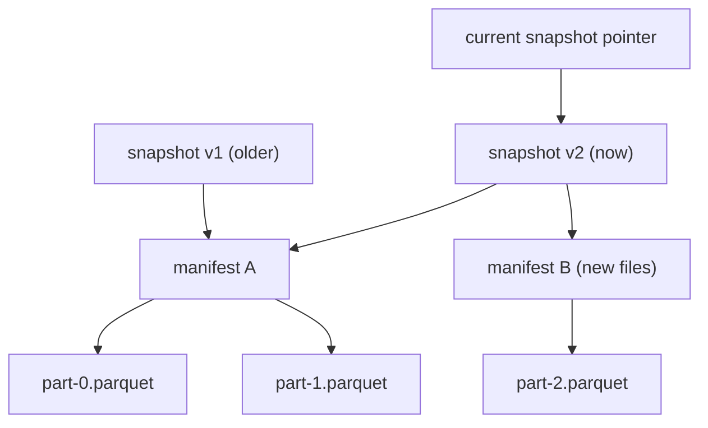
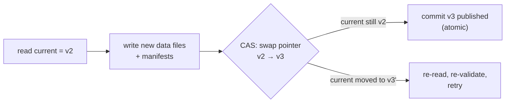

A [partitioned](partitioning-pruning) directory of [Parquet](parquet-internals)
files is fast to query but it is not a *table*. It has no notion of a commit, so a
reader can catch a writer mid-update and see half-written data; no schema it
enforces, so two files can disagree on columns; no history, so an overwrite is
gone forever. The objects sit in cheap **object storage** (S3, GCS), which gives
durability and scale but only single-object atomicity, no multi-file transaction<FN n="1" />.
A **table format**, Apache Iceberg, Delta Lake, or Apache Hudi, is a thin
**metadata layer** over those Parquet files that adds exactly the missing
warehouse semantics: atomic commits, schema enforcement and evolution, and time
travel. Data files stay open and columnar; the metadata is what makes them a
transactional table. That combination, warehouse semantics on data-lake storage,
is the **lakehouse**.

## The metadata layer: snapshots over manifests over data

The design separates **what data exists** from **which data the table currently
points at**. The Parquet files are immutable, you never edit one in place, and a
tree of metadata records which files make up the table *as of* a given version.

- **Data files** are the immutable Parquet files from the previous lessons.
- A **manifest** lists a set of data files together with their partition values
  and column [statistics](parquet-internals), so the planner can prune files
  without listing the storage directory.
- A **snapshot** is a complete, immutable picture of the table at one point in
  time: a pointer to the manifests that define the full file set of that version.
- A **table pointer** (a single catalog entry) names the **current** snapshot.

## A commit is an atomic snapshot swap

Writing data adds new immutable Parquet files and new manifests, then publishes a
**new snapshot** that references the combined file set, the old files plus the new
ones (or minus the removed ones). None of that is visible until the final step:
**atomically swapping the table pointer** from the old snapshot to the new one.
That swap is a single small write, exactly the [pointer swap](I2/model-registry)
the model registry used for deploys, and object stores support it as one atomic
compare-and-set operation.

Because publishing is one atomic write, a reader sees either the entire old
snapshot or the entire new one, never a half-applied mix: the table is
transactional even though it is spread across thousands of files.

**Optimistic concurrency** handles two writers at once<FN n="2" />. Each reads the current
snapshot $v$, prepares its commit, and tries to swap the pointer with the
condition "only if the current snapshot is still $v$." The first writer wins; the
second's compare-and-set fails because the pointer already moved, so it re-reads
the now-current snapshot, re-validates that its change does not conflict, and
retries. No locks are held, which suits high-latency object storage.

## Schema evolution and time travel

Two more warehouse features fall out of the same metadata layer.

**Schema evolution.** The schema (column names, types, and stable column **ids**)
lives in metadata, not baked into the file paths. Adding a column, renaming one,
or widening a type is a metadata change that defines a new schema version; old
Parquet files are read against it by column id, with absent columns served as
null. No data is rewritten to add a column.

**Time travel.** Because every snapshot is immutable and retained, the table keeps
its full history. A reader can ask for the table *as of* an older snapshot id or
timestamp, and the engine simply resolves the pointer to that snapshot and reads
its file set. This is what makes a query reproducible (rerun against the exact
snapshot a model trained on, the [data-versioning](I1/data-versioning) guarantee
at table scale) and what makes a bad write recoverable: roll back by repointing
the table at the previous good snapshot, the same atomic swap in reverse.

## Exercises

**Exercise 1.** A reader resolves the table pointer to snapshot v2 and begins
reading its manifests. While it reads, a writer commits v3, which deletes one of
v2's data files and adds two new ones. Explain why the in-progress reader still
sees a consistent v2 and does not error on the deleted file.

Solution

**Step 1.** Data files are immutable and a commit never edits or deletes bytes in
place; it publishes a new snapshot whose manifests reference a different file set.
Committing v3 writes new Parquet files and new manifests and swaps the table
pointer, but it does not physically remove v2's files at commit time.

**Step 2.** The reader captured the snapshot v2 pointer at the start and reads the
file set v2's manifests name. Those files all still exist on object storage, so
every read resolves. The v3 commit changed only which snapshot the *table pointer*
names, not the files v2 points at.

**Step 3.** The reader therefore sees the entire v2 snapshot, a complete consistent
version, with no half-applied mix and no missing file. The dropped file is removed
only later by a separate garbage-collection step that retains files reachable from
any retained snapshot, so an in-flight reader is never cut off. This is snapshot
isolation built from immutability plus an atomic pointer swap.

**Exercise 2.** Two jobs commit concurrently under optimistic concurrency. Job A
appends 100 rows; job B appends 50 different rows. Both read current snapshot v5,
prepare their files, and race to swap the pointer. Walk through what happens, and
contrast it with a case where both jobs instead try to *overwrite the same
partition*.

Solution

**Step 1.** Both read v5 and write their new data files and manifests. Each attempts
a compare-and-set: "swap the pointer to my new snapshot only if it is still v5."

**Step 2.** Append case. Say job A's CAS wins; the pointer becomes v6. Job B's CAS
fails because the pointer is no longer v5. Job B re-reads the now-current v6,
re-validates: two appends of disjoint new rows do not conflict, so B's files are
still valid on top of v6. B rebuilds its snapshot as v7 referencing v6's files plus
its own, and retries the CAS, which now succeeds. Both appends land.

**Step 3.** Overwrite case. If both jobs rewrite the *same* partition, B's
re-validation against v6 detects that A already replaced the files B assumed. B's
change now conflicts: applying it would silently drop A's overwrite. B must abort or
recompute against the new data rather than blindly retry. Optimistic concurrency
lets non-conflicting commits both succeed while forcing genuine write-write
conflicts to be resolved, all without holding a lock.

**Exercise 3.** A team adds a column `discount` to a lakehouse table holding ten
years of Parquet files, then asks to query the table *as of* a snapshot from before
the column existed. Explain, using schema evolution and time travel, why neither
operation rewrites old data files, and what a query against each schema version
sees for `discount`.

Solution

**Step 1.** Adding `discount` is a metadata change. The schema, column names, types,
and stable column ids, lives in the metadata layer, not in the file paths or file
bytes. The add defines a new schema version that includes a new column id for
`discount`; the ten years of Parquet files are untouched.

**Step 2.** A query against the *current* schema reads old files by column id. Old
files have no chunk for the `discount` id, so the engine serves that column as null
for their rows. New files written after the change carry real `discount` values. No
backfill rewrite is needed to introduce the column.

**Step 3.** Time travel to a pre-change snapshot resolves the table pointer to that
older snapshot and reads its file set against the schema in force then, which has no
`discount` column at all, so the column is simply absent from the result. Both
operations are pure metadata: immutable data files plus a versioned schema and
versioned snapshots give column addition and historical queries for free, with no
data movement.

Atomic snapshots, optimistic concurrency, schema evolution, and time travel are
the warehouse semantics, delivered on top of cheap object storage and open Parquet
files: the lakehouse. With storage settled, the next subsection turns to
processing that data at scale, starting with
[MapReduce and the shuffle](K3/mapreduce).

<Footnotes>
  <FNItem n="1">**Kleppmann, M.** (2017). *Designing Data-Intensive Applications.* O'Reilly. Background on atomicity, consistency, and the transaction semantics a table format must reconstruct over object storage.</FNItem>
  <FNItem n="2">**Armbrust, M., et al.** (2020). "Delta Lake: high-performance ACID table storage over cloud object stores". *VLDB*, 13(12), 3411-3424. [doi:10.14778/3415478.3415560](https://doi.org/10.14778/3415478.3415560). Describes atomic snapshot commits and optimistic concurrency over Parquet on object storage.</FNItem>
</Footnotes>
