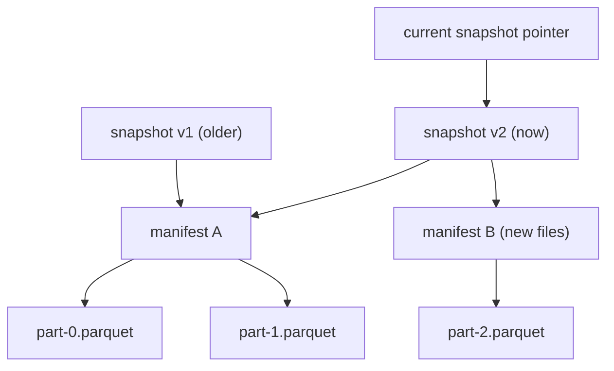
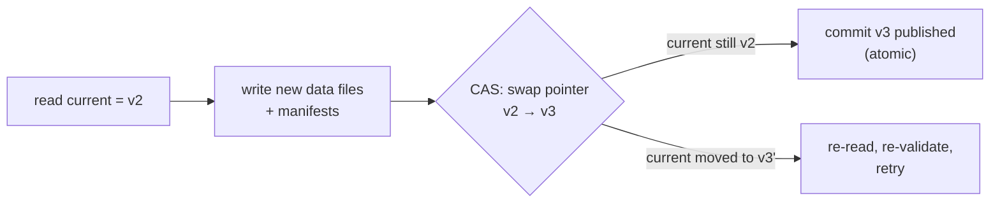

A [partitioned](partitioning-pruning) directory of [Parquet](parquet-internals)
files is fast to query but it is not a *table*. It has no notion of a commit, so a
reader can catch a writer mid-update and see half-written data; no schema it
enforces, so two files can disagree on columns; no history, so an overwrite is
gone forever. The objects sit in cheap **object storage** (S3, GCS), which gives
durability and scale but only single-object atomicity, no multi-file transaction.
A **table format**, Apache Iceberg, Delta Lake, or Apache Hudi, is a thin
**metadata layer** over those Parquet files that adds exactly the missing
warehouse semantics: atomic commits, schema enforcement and evolution, and time
travel. Data files stay open and columnar; the metadata is what makes them a
transactional table. That combination, warehouse semantics on data-lake storage,
is the **lakehouse**.

## The metadata layer: snapshots over manifests over data

The design separates **what data exists** from **which data the table currently
points at**. The Parquet files are immutable, you never edit one in place, and a
tree of metadata records which files make up the table *as of* a given version.

- **Data files** are the immutable Parquet files from the previous lessons.
- A **manifest** lists a set of data files together with their partition values
  and column [statistics](parquet-internals), so the planner can prune files
  without listing the storage directory.
- A **snapshot** is a complete, immutable picture of the table at one point in
  time: a pointer to the manifests that define the full file set of that version.
- A **table pointer** (a single catalog entry) names the **current** snapshot.

## A commit is an atomic snapshot swap

Writing data adds new immutable Parquet files and new manifests, then publishes a
**new snapshot** that references the combined file set, the old files plus the new
ones (or minus the removed ones). None of that is visible until the final step:
**atomically swapping the table pointer** from the old snapshot to the new one.
That swap is a single small write, exactly the [pointer swap](I2/model-registry)
the model registry used for deploys, and object stores support it as one atomic
compare-and-set operation.

Because publishing is one atomic write, a reader sees either the entire old
snapshot or the entire new one, never a half-applied mix: the table is
transactional even though it is spread across thousands of files.

**Optimistic concurrency** handles two writers at once. Each reads the current
snapshot $v$, prepares its commit, and tries to swap the pointer with the
condition "only if the current snapshot is still $v$." The first writer wins; the
second's compare-and-set fails because the pointer already moved, so it re-reads
the now-current snapshot, re-validates that its change does not conflict, and
retries. No locks are held, which suits high-latency object storage.

## Schema evolution and time travel

Two more warehouse features fall out of the same metadata layer.

**Schema evolution.** The schema (column names, types, and stable column **ids**)
lives in metadata, not baked into the file paths. Adding a column, renaming one,
or widening a type is a metadata change that defines a new schema version; old
Parquet files are read against it by column id, with absent columns served as
null. No data is rewritten to add a column.

**Time travel.** Because every snapshot is immutable and retained, the table keeps
its full history. A reader can ask for the table *as of* an older snapshot id or
timestamp, and the engine simply resolves the pointer to that snapshot and reads
its file set. This is what makes a query reproducible (rerun against the exact
snapshot a model trained on, the [data-versioning](I1/data-versioning) guarantee
at table scale) and what makes a bad write recoverable: roll back by repointing
the table at the previous good snapshot, the same atomic swap in reverse.

Atomic snapshots, optimistic concurrency, schema evolution, and time travel are
the warehouse semantics, delivered on top of cheap object storage and open Parquet
files: the lakehouse. With storage settled, the next subsection turns to
processing that data at scale, starting with
[MapReduce and the shuffle](K3/mapreduce).
