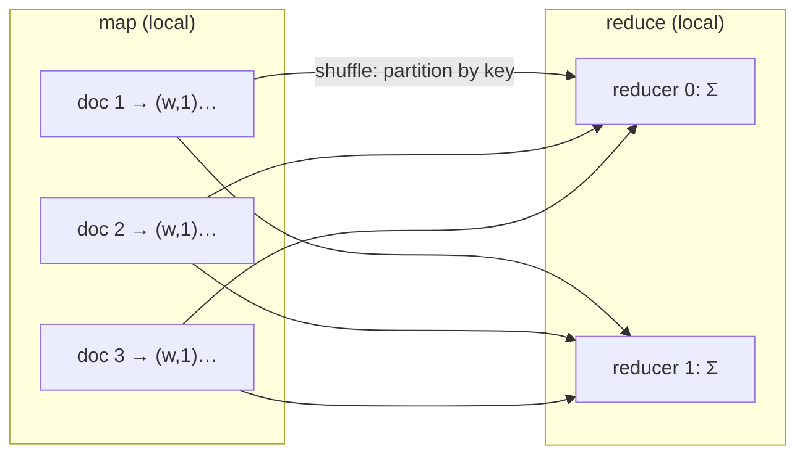

A single machine can scan a few gigabytes; an [analytical workload](K1/oltp-vs-olap)
routinely scans terabytes. The only way out is to split the data across many machines
and have them work in parallel. MapReduce is the model that makes this tractable: it
forces every distributed computation into three fixed phases, so the framework, not the
programmer, handles partitioning, scheduling, and failures<FN n="1" />. The phases are **map**
(transform each record independently), **shuffle** (regroup records by key across the
cluster), and **reduce** (aggregate each group). The first and third are embarrassingly
parallel and run locally; the middle one moves data across the network, and that is
where the cost lives.

## The three phases

A MapReduce job is defined by two functions the user writes.

The **map** function takes one input record and emits zero or more intermediate
**key-value pairs** $(k, v)$. It runs on the machine that already holds the input
partition, so it reads from local disk and never touches the network. For word count,
each input is a document and the map emits $(\text{word}, 1)$ for every word.

The **reduce** function takes a key $k$ and the list of all values emitted for that key,
$[v_1, v_2, \dots]$, and collapses them to an output. For word count it sums the list:
$\text{reduce}(w, [1,1,\dots,1]) = \sum_i 1$, the total count of that word.

Between them sits the part the user does not write. The **shuffle** must deliver every
pair with key $k$ to the single machine responsible for reducing $k$. Because the map
outputs are scattered across every machine and the keys for one reducer can come from
any of them, the shuffle is **all-to-all**: in the worst case every mapper sends data
to every reducer.



## Why the shuffle dominates

The map and reduce phases read and write **local** disk and scale with the data each
machine holds. The shuffle is different: it moves the **entire set of intermediate
records** across the network. If the map emits $I$ intermediate pairs total, the shuffle
transfers on the order of $I$ records between machines, and network bandwidth is one to
two orders of magnitude slower than local sequential disk, which is itself slower than
memory.

To see where each pair goes, the shuffle assigns key $k$ to a reducer by **hash
partitioning**:

$$
\text{partition}(k) = \operatorname{hash}(k) \bmod R,
$$

where $R$ is the number of reducers and $\operatorname{hash}$ is a fixed hash function.
Two properties make this work. First, it is **deterministic**: every mapper sends a given
key to the same reducer, so all values for $k$ converge on one machine. Second, for a
well-spread hash the keys split roughly evenly across the $R$ reducers, so the load
balances. (When the key distribution is itself skewed, that second property fails, and
one reducer is swamped; that is the [straggler problem](data-skew) two lessons on.)

The practical consequence: minimizing a MapReduce job means minimizing the intermediate
data crossing the shuffle. A **combiner**, a local pre-aggregation that sums the $1$s for
a word on the mapper before shipping, cuts the shuffle volume from "one record per word
occurrence" down to "one record per distinct word per mapper", often a large reduction<FN n="2" />.


## Worked example

A tiny end-to-end word count: map each document to $(\text{word}, 1)$ pairs, shuffle by
hash-partitioning keys across simulated partitions, then reduce each partition locally.
The reduced counts must match a direct count, and the shuffle volume is the number of
intermediate records moved.

```python
import numpy as np
import zlib
from collections import Counter

docs = [
    "the cat sat on the mat",
    "the dog sat on the log",
    "the cat and the dog",
]
P = 3  # simulated reducer partitions

# --- map: each document → (word, 1) pairs, emitted locally ---
mapped = [(w, 1) for doc in docs for w in doc.split()]

# --- shuffle: send each pair to partition hash(key) % P (all-to-all) ---
def partition_of(key):
    return zlib.crc32(key.encode()) % P

partitions = {p: [] for p in range(P)}
for word, one in mapped:
    partitions[partition_of(word)].append((word, one))

shuffle_volume = sum(len(v) for v in partitions.values())  # records crossing the network

# --- reduce: each partition sums its keys locally ---
reduced = {}
for p in range(P):
    local = {}
    for word, one in partitions[p]:
        local[word] = local.get(word, 0) + one
    reduced.update(local)

# --- ground truth: a direct single-machine count ---
direct = dict(Counter(w for doc in docs for w in doc.split()))

print("reduced counts:", dict(sorted(reduced.items())))
print("shuffle volume:", shuffle_volume, "intermediate records")

assert reduced == direct                    # the distributed result is exact
assert shuffle_volume == len(mapped)         # every intermediate pair crossed the shuffle
print("ok: distributed count matches, shuffle moved", shuffle_volume, "records")
```

The shuffle moved one record per word occurrence here precisely because no combiner ran;
a combiner would have collapsed repeated words per document first. This map-shuffle-reduce
skeleton is exactly what [Spark's DataFrame engine](spark-dataframes) compiles down to,
hiding the boilerplate while keeping the same shuffle boundary at its core.

<Footnotes>
  <FNItem n="1">**Dean, J., & Ghemawat, S.** (2008). "MapReduce: simplified data processing on large clusters". *Communications of the ACM*, 51(1), 107-113. [doi:10.1145/1327452.1327492](https://doi.org/10.1145/1327452.1327492). The original model: map, shuffle, reduce with framework-managed partitioning and fault tolerance.</FNItem>
  <FNItem n="2">**Kleppmann, M.** (2017). *Designing Data-Intensive Applications.* O'Reilly. Ch. 10 on batch processing covers combiners and the cost of the shuffle in MapReduce-style jobs.</FNItem>
</Footnotes>
