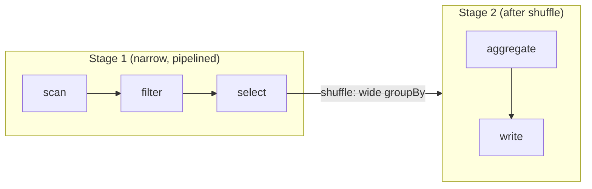

[MapReduce](mapreduce) forces every job into one rigid map-shuffle-reduce round, so a
multi-step pipeline becomes a chain of separate jobs, each writing its output to disk for
the next to read. Spark removes that overhead with two ideas: a **DataFrame**, a
distributed table you describe with relational operations<FN n="1" />, and **lazy evaluation**, where
those operations build a plan instead of running immediately. Spark sees the whole
pipeline before executing any of it, so it can fuse steps, skip needless disk writes, and
shuffle only where the computation genuinely demands it.

## Transformations are lazy; actions trigger

Every DataFrame operation is one of two kinds.

A **transformation** (`select`, `filter`, `groupBy`, `join`) returns a new DataFrame
describing *what* to compute, but runs nothing. Calling it just appends a node to a
**lineage**: a record of how this DataFrame derives from its parents back to the source<FN n="2" />.

An **action** (`count`, `collect`, `write`) asks for a concrete result. Only then does
Spark look at the accumulated lineage, compile it, and run the cluster.

This laziness is what lets Spark optimize. Because it holds the entire lineage before
executing, it can push a `filter` down to the scan so it reads fewer rows, drop columns no
downstream step uses, and combine adjacent operations into one pass over the data. None of
this is possible in a system that executes each call the moment it is written.

## Logical plan to physical DAG

When an action fires, Spark turns the lineage into an executable form in two stages.

**Step 1, the logical plan.** The lineage becomes a tree of relational operators
(scan, filter, project, aggregate). The optimizer rewrites this tree: reordering filters,
pushing projections toward the scan, folding constants. The result still says *what*, not
*how*.

**Step 2, the physical DAG.** Spark splits the optimized plan into **stages**. A stage is
a maximal run of operations that can execute as a single pass over the data **without
moving it between machines**. Stage boundaries fall exactly where the data must be
reshuffled. Within a stage, the work runs as parallel **tasks**, one per data partition.

The split into stages is governed by whether each transformation needs data from other
partitions, which is the narrow-versus-wide distinction.

## Narrow versus wide transformations

A **narrow** transformation computes each output partition from a single input partition.
`map`, `filter`, and `select` are narrow: a row's fate depends only on that row. Narrow
transformations **pipeline**: Spark fuses a chain of them into one stage and streams each
record through the whole chain in a single pass, with no network traffic.

A **wide** transformation computes an output partition from **many** input partitions,
because rows that must be combined (same group key, same join key) start out scattered
across the cluster. `groupBy`, `join`, and `distinct` are wide. A wide transformation
forces a **shuffle**: the same all-to-all, hash-partition-by-key movement from
[MapReduce](mapreduce). The shuffle is what ends a stage and begins the next.

## Exercises

**Exercise 1.** Classify each transformation in this pipeline as narrow or wide, then count
how many stages Spark compiles it into: `scan`, `filter`, `select`, `groupBy`, `count`,
`write`. State where each stage boundary falls.

Solution

**Step 1.** Classify each operation. `scan`, `filter`, and `select` are narrow: each output
row depends only on a single input row, so no data crosses the network. `groupBy` is wide:
it must bring rows with the same group key together from across partitions, forcing a
shuffle. `count` here is the aggregate that completes the group-by, and `write` is the
action that emits the result; both run after the shuffle.

**Step 2.** A stage is a maximal run of narrow operations with no data movement, so a stage
boundary falls exactly at the shuffle the `groupBy` introduces. Stage 1 fuses
`scan → filter → select` into one pipelined pass. The shuffle ends stage 1. Stage 2 runs the
post-shuffle `groupBy`/`count` aggregate and `write`.

**Step 3.** The pipeline compiles into $2$ stages, with the single boundary at the
`groupBy` shuffle.

**Exercise 2.** Spark holds the entire lineage before executing because transformations are
lazy. Explain concretely how this enables predicate pushdown, and why an eager system that
runs each call immediately cannot perform the same optimization.

Solution

**Step 1.** Under lazy evaluation, calling `filter` and `select` only appends nodes to the
lineage; nothing runs until an action like `write` fires. At that point Spark sees the whole
plan at once: the source scan, the filter predicate, and which columns survive downstream.

**Step 2.** With the full plan in hand, the optimizer can rewrite it before any I/O: it moves
the filter down to the scan so storage returns fewer rows, and drops columns no later step
references. The scan reads strictly less data than the literal top-down plan would.

**Step 3.** An eager system executes each call the moment it is written, so when `filter` is
called the upstream scan has already read and materialized the full table. The filter then
runs on data already in memory, and there is no remaining opportunity to push it into the
scan; the optimization requires knowing the filter exists before the scan runs, which only
deferred execution provides.

**Exercise 3.** A job reads a large table, then performs `join → groupBy → join`, with each
of the three wide operations forcing a shuffle. A colleague proposes caching the result
after the first join. Reason about how many stage boundaries the job has, and discuss the
trade-off of materializing an intermediate result between stages.

Solution

**Step 1.** Each wide transformation ends a stage and begins the next. With three wide
operations (`join`, `groupBy`, `join`) there are three shuffle boundaries. Counting the
initial scan-and-narrow work as the first stage, the job spans four stages: the pre-first-join
stage, then one stage after each of the three shuffles.

**Step 2.** Caching after the first join materializes that intermediate DataFrame in memory
or on disk. The benefit is reuse: if the cached result feeds more than one downstream branch,
or the job is retried after a failure, Spark replays from the cache instead of recomputing the
scan and first shuffle from the source lineage.

**Step 3.** The cost is the materialization itself: writing the intermediate consumes memory
or disk and adds a write pass that a purely pipelined plan would skip. If the intermediate is
consumed exactly once and no failure occurs, caching is pure overhead, since lineage-based
recomputation would never be triggered. Caching pays off when the intermediate is reused or
when recomputation across many stages is expensive enough to justify storing it.

Reading a Spark plan is therefore mostly counting shuffle boundaries: each one is a stage
break and the expensive part of the job. The two transformations that most often force a
shuffle are joins and group-bys, and the [next lesson](distributed-joins) shows that even
a join can sometimes avoid the shuffle entirely by broadcasting the smaller side.

<Footnotes>
  <FNItem n="1">**Armbrust, M., et al.** (2015). "Spark SQL: relational data processing in Spark". *SIGMOD*. [doi:10.1145/2723372.2742797](https://doi.org/10.1145/2723372.2742797). Introduces the DataFrame API and the Catalyst optimizer that compiles the logical plan to a physical DAG.</FNItem>
  <FNItem n="2">**Zaharia, M., et al.** (2012). "Resilient distributed datasets: a fault-tolerant abstraction for in-memory cluster computing". *NSDI*. RDDs and their lineage graph, the substrate DataFrames lower onto.</FNItem>
</Footnotes>
