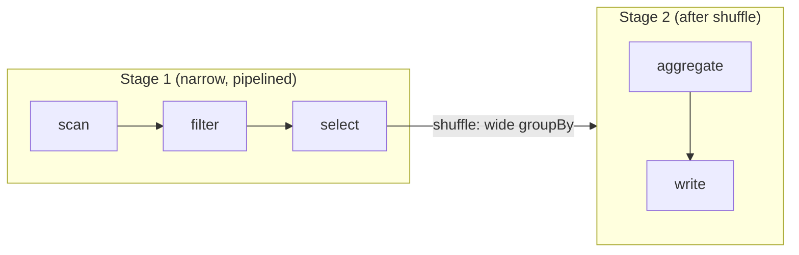

[MapReduce](mapreduce) forces every job into one rigid map-shuffle-reduce round, so a
multi-step pipeline becomes a chain of separate jobs, each writing its output to disk for
the next to read. Spark removes that overhead with two ideas: a **DataFrame**, a
distributed table you describe with relational operations, and **lazy evaluation**, where
those operations build a plan instead of running immediately. Spark sees the whole
pipeline before executing any of it, so it can fuse steps, skip needless disk writes, and
shuffle only where the computation genuinely demands it.

## Transformations are lazy; actions trigger

Every DataFrame operation is one of two kinds.

A **transformation** (`select`, `filter`, `groupBy`, `join`) returns a new DataFrame
describing *what* to compute, but runs nothing. Calling it just appends a node to a
**lineage**: a record of how this DataFrame derives from its parents back to the source.

An **action** (`count`, `collect`, `write`) asks for a concrete result. Only then does
Spark look at the accumulated lineage, compile it, and run the cluster.

This laziness is what lets Spark optimize. Because it holds the entire lineage before
executing, it can push a `filter` down to the scan so it reads fewer rows, drop columns no
downstream step uses, and combine adjacent operations into one pass over the data. None of
this is possible in a system that executes each call the moment it is written.

## Logical plan to physical DAG

When an action fires, Spark turns the lineage into an executable form in two stages.

**Step 1, the logical plan.** The lineage becomes a tree of relational operators
(scan, filter, project, aggregate). The optimizer rewrites this tree: reordering filters,
pushing projections toward the scan, folding constants. The result still says *what*, not
*how*.

**Step 2, the physical DAG.** Spark splits the optimized plan into **stages**. A stage is
a maximal run of operations that can execute as a single pass over the data **without
moving it between machines**. Stage boundaries fall exactly where the data must be
reshuffled. Within a stage, the work runs as parallel **tasks**, one per data partition.

The split into stages is governed by whether each transformation needs data from other
partitions, which is the narrow-versus-wide distinction.

## Narrow versus wide transformations

A **narrow** transformation computes each output partition from a single input partition.
`map`, `filter`, and `select` are narrow: a row's fate depends only on that row. Narrow
transformations **pipeline**: Spark fuses a chain of them into one stage and streams each
record through the whole chain in a single pass, with no network traffic.

A **wide** transformation computes an output partition from **many** input partitions,
because rows that must be combined (same group key, same join key) start out scattered
across the cluster. `groupBy`, `join`, and `distinct` are wide. A wide transformation
forces a **shuffle**: the same all-to-all, hash-partition-by-key movement from
[MapReduce](mapreduce). The shuffle is what ends a stage and begins the next.

Reading a Spark plan is therefore mostly counting shuffle boundaries: each one is a stage
break and the expensive part of the job. The two transformations that most often force a
shuffle are joins and group-bys, and the [next lesson](distributed-joins) shows that even
a join can sometimes avoid the shuffle entirely by broadcasting the smaller side.
