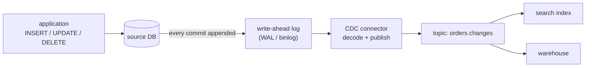
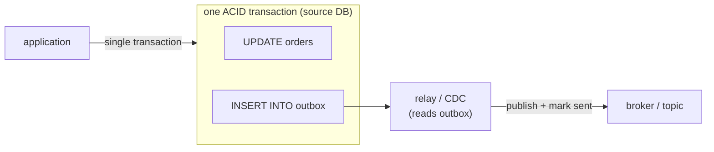

[Delivery semantics](K4/delivery-semantics) assumed an application was publishing
events to the [log](K4/log-and-kafka). But the system of record for most state is a
[transactional database](K1/oltp-vs-olap), and downstream consumers (a search index,
a cache, an analytics warehouse) need to know every time a row changes. The question
is how a row-level `INSERT`, `UPDATE`, or `DELETE` becomes an event on the stream.
Two answers exist, and the gap between them is large enough to be worth a lesson<FN n="1" />.

## Query-based polling, and why it leaks

The straightforward approach is **query-based polling**: run a query on a timer,
`SELECT * FROM orders WHERE updated_at > :last_seen`, and treat the returned rows as
change events. It needs no special database access, just an `updated_at` column, but
it is leaky on every axis:

- **It misses deletes.** A deleted row does not come back from a `SELECT`, so the
  consumer never learns the row is gone.
- **It misses intermediate states.** If a row is updated twice between two polls, the
  poll sees only the final value; the in-between change is lost.
- **It trades latency against load.** Polling often enough to be timely hammers the
  database with repeated scans; polling rarely to spare it makes the stream stale.

Polling reconstructs *what changed* by repeatedly photographing *current state*,
which is the wrong primitive.

## Log-based CDC reads the change directly

The database already keeps the exact thing the consumer wants. To guarantee
durability, every transactional database first appends each change to a
**write-ahead log** (the WAL in Postgres, the binlog in MySQL): an ordered,
append-only record of every committed row mutation, written *before* the change is
applied to the data files. It is the database's own internal stream of changes,
ordered exactly as they committed.

**Log-based change data capture (CDC)** taps that log. A CDC connector reads the WAL,
decodes each entry into a structured change event (`{op: UPDATE, table: orders, id:
42, before: {...}, after: {...}}`), and publishes it to a topic. Reading the WAL
fixes every leak of polling at once: deletes appear as `DELETE` entries, every
intermediate update is its own entry, the events arrive in exact commit order, and
the database does no extra query work because the connector reads a log it was
writing anyway. This is the standard way databases feed streams<FN n="2" />.



## The dual-write problem

CDC handles state that already lives in one database. A subtler failure appears when
an application must do two things on one logical action: update its database **and**
publish an event to the broker. The naive code does both writes in sequence:

```text
db.save(order)            # write 1: to the database
broker.publish(event)     # write 2: to the message broker
```

These are two separate systems with no shared transaction, so a crash between them
leaves the two inconsistent. If write 1 commits and the process dies before write 2,
the order exists but no event was published, and the search index and warehouse
never learn about it. If the code is reordered and write 2 succeeds but write 1 is
rolled back, an event announces an order that does not exist. This is the
**dual-write problem**: two independent writes cannot be made atomic by ordering
them, so on failure they diverge. Adding retries does not fix it; it converts loss
into duplicates, which is the same inconsistency in the other direction.

## The transactional outbox

The fix is to collapse two writes into one by **not writing to the broker at all**
from the application. Instead, the application writes the event into an **outbox**
table *in the same local database transaction* as the business update:

$$
\underbrace{\text{UPDATE orders} \;\wedge\; \text{INSERT INTO outbox}}_{\text{one ACID transaction}}
$$

Because both rows are written under a single transaction in one database, they commit
**atomically**: either both land or neither does, with no in-between for a crash to
expose. A separate **relay** process then reads the outbox table and publishes its
rows to the broker, marking each as sent (or, cleaner, the same [CDC
connector](K4/change-data-capture) above tails the outbox table off the WAL). The
dual-write across two systems is gone, replaced by one atomic write plus an
independent, retryable relay.



The relay can crash and retry freely: it publishes an outbox row, and if it dies
before marking it sent it simply republishes on restart. That is at-least-once
delivery, made safe by the [idempotent consumer](K4/delivery-semantics) from the last
lesson, which dedups on the event id the outbox row carries. The two patterns
compose: the outbox guarantees *no event is lost or invented*, idempotency guarantees
*no duplicate is double-counted*.

## Exercises

**Exercise 1.** A team uses query-based polling with `SELECT * FROM orders WHERE
updated_at > :last_seen`, running every 30 seconds. Between two polls, a single
order row is updated three times (PENDING, then PAID, then REFUNDED) and a
*different* order row is created and then deleted. List exactly which change
events the downstream consumer observes, and which it misses, and name the
property of polling each miss illustrates.

<details>
<summary>Solution</summary>

**Step 1.** The thrice-updated row. Polling photographs current state at the poll
boundary, so it returns the row once with its final value, REFUNDED. The consumer
sees a single change, REFUNDED, and never learns the row passed through PENDING or
PAID. This is the *missed intermediate states* leak: only the last value between
two polls survives.

**Step 2.** The created-then-deleted row. By the time the poll runs, the row no
longer exists, so the `SELECT` cannot return it. The consumer never learns the row
was created and never learns it was deleted, observing nothing at all for it. The
deletion specifically illustrates the *misses deletes* leak (a `DELETE` removes the
row a `SELECT` would have to return), compounded here by the create also being
collapsed away.

**Step 3.** Net result: of the four real mutations (three updates plus a
create/delete pair, five if you count the create separately), the consumer
observes exactly one event, REFUNDED. Log-based CDC reads each mutation as its own
WAL entry, so it would have emitted all of them in commit order, including both
deletes.

</details>

**Exercise 2.** A developer proposes to fix the dual-write problem by adding
retries: after `db.save(order)` commits, retry `broker.publish(event)` until it is
acknowledged. Explain why this still does not give the same guarantee as the
transactional outbox, and characterize precisely what failure mode survives.

<details>
<summary>Solution</summary>

**Step 1.** Retries address only one direction of failure. If the publish fails
transiently, retrying eventually succeeds, so no event is lost in that case. That
removes the "committed but never published" loss when the *broker* is the thing
that is flaky.

**Step 2.** But the application process itself can die between the database commit
and the publish, before any retry loop runs (a crash, an OOM kill, a deploy). The
order is committed, no event was published, and the in-memory retry state is gone
with the process. On restart there is no record that a publish is owed, so the
event is permanently lost. Retries cannot cover a failure of the very process that
holds the retry logic.

**Step 3.** Conversely, if the developer publishes first and retries the database
write, a process death after a successful publish announces an order that the
database never committed: an invented event. Either ordering leaves one
unrecoverable divergence because the two writes are in separate systems with no
shared transaction.

**Step 4.** The outbox removes this by making the event-record write part of the
*same* database transaction as the business update, so a crash cannot land one
without the other. The publish then becomes an independent, durable, retryable
relay reading committed outbox rows, which is exactly the case retries *do* handle
well.

</details>

**Exercise 3.** The outbox relay delivers at-least-once: it publishes an outbox
row and may crash before marking it sent, republishing on restart. Suppose instead
the relay marks a row sent *first*, then publishes. Contrast the failure mode of
this ordering with the original, say which delivery guarantee each gives, and
state which one the idempotent consumer from the previous lesson makes safe.

<details>
<summary>Solution</summary>

**Step 1.** Original ordering (publish, then mark sent). If the relay crashes
after publishing but before marking the row sent, the row still looks unsent on
restart, so the relay republishes it. The event reaches the broker one or more
times: this is **at-least-once** delivery, whose failure mode is duplicates.

**Step 2.** Reversed ordering (mark sent, then publish). If the relay crashes after
marking the row sent but before publishing, the row now looks sent and is never
retried, so the event is never published. The event reaches the broker zero or one
times: this is **at-most-once** delivery, whose failure mode is loss.

**Step 3.** Which is safe to combine. Duplicates are recoverable: the idempotent
consumer dedups on the event id the outbox row carries, so re-applying a duplicate
is a no-op and at-least-once becomes effectively-once. Loss is not recoverable
downstream, because a consumer cannot dedup an event it never receives. So the
original publish-then-mark ordering (at-least-once) is the correct one, and the
idempotent consumer is what makes its duplicates harmless.

</details>

With ingestion covered end to end, from the [log](K4/log-and-kafka) through windows,
watermarks, delivery, and CDC, the data is landing in the warehouse. The next
subsection turns to scheduling and shaping it once it arrives, starting with
[ETL versus ELT](K5/etl-vs-elt).

<Footnotes>
  <FNItem n="1">**Kleppmann, M.** (2017). *Designing Data-Intensive Applications.* O'Reilly. Ch. 11 contrasts query-based polling with log-based change data capture and motivates the transactional outbox.</FNItem>
  <FNItem n="2">**Kreps, J., Narkhede, N., & Rao, J.** (2011). "Kafka: a distributed messaging system for log processing". *NetDB*. The log as the integration backbone that databases stream their committed changes onto.</FNItem>
</Footnotes>
