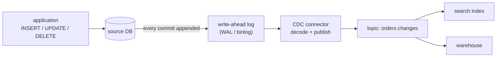
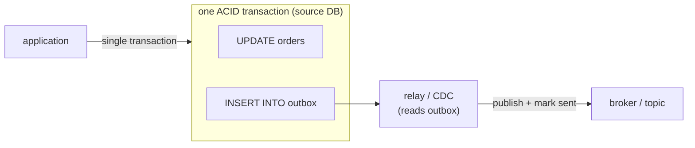

[Delivery semantics](K4/delivery-semantics) assumed an application was publishing
events to the [log](K4/log-and-kafka). But the system of record for most state is a
[transactional database](K1/oltp-vs-olap), and downstream consumers (a search index,
a cache, an analytics warehouse) need to know every time a row changes. The question
is how a row-level `INSERT`, `UPDATE`, or `DELETE` becomes an event on the stream.
Two answers exist, and the gap between them is large enough to be worth a lesson.

## Query-based polling, and why it leaks

The straightforward approach is **query-based polling**: run a query on a timer,
`SELECT * FROM orders WHERE updated_at > :last_seen`, and treat the returned rows as
change events. It needs no special database access, just an `updated_at` column, but
it is leaky on every axis:

- **It misses deletes.** A deleted row does not come back from a `SELECT`, so the
  consumer never learns the row is gone.
- **It misses intermediate states.** If a row is updated twice between two polls, the
  poll sees only the final value; the in-between change is lost.
- **It trades latency against load.** Polling often enough to be timely hammers the
  database with repeated scans; polling rarely to spare it makes the stream stale.

Polling reconstructs *what changed* by repeatedly photographing *current state*,
which is the wrong primitive.

## Log-based CDC reads the change directly

The database already keeps the exact thing the consumer wants. To guarantee
durability, every transactional database first appends each change to a
**write-ahead log** (the WAL in Postgres, the binlog in MySQL): an ordered,
append-only record of every committed row mutation, written *before* the change is
applied to the data files. It is the database's own internal stream of changes,
ordered exactly as they committed.

**Log-based change data capture (CDC)** taps that log. A CDC connector reads the WAL,
decodes each entry into a structured change event (`{op: UPDATE, table: orders, id:
42, before: {...}, after: {...}}`), and publishes it to a topic. Reading the WAL
fixes every leak of polling at once: deletes appear as `DELETE` entries, every
intermediate update is its own entry, the events arrive in exact commit order, and
the database does no extra query work because the connector reads a log it was
writing anyway. This is the standard way databases feed streams.



## The dual-write problem

CDC handles state that already lives in one database. A subtler failure appears when
an application must do two things on one logical action: update its database **and**
publish an event to the broker. The naive code does both writes in sequence:

```text
db.save(order)            # write 1: to the database
broker.publish(event)     # write 2: to the message broker
```

These are two separate systems with no shared transaction, so a crash between them
leaves the two inconsistent. If write 1 commits and the process dies before write 2,
the order exists but no event was published, and the search index and warehouse
never learn about it. If the code is reordered and write 2 succeeds but write 1 is
rolled back, an event announces an order that does not exist. This is the
**dual-write problem**: two independent writes cannot be made atomic by ordering
them, so on failure they diverge. Adding retries does not fix it; it converts loss
into duplicates, which is the same inconsistency in the other direction.

## The transactional outbox

The fix is to collapse two writes into one by **not writing to the broker at all**
from the application. Instead, the application writes the event into an **outbox**
table *in the same local database transaction* as the business update:

$$
\underbrace{\text{UPDATE orders} \;\wedge\; \text{INSERT INTO outbox}}_{\text{one ACID transaction}}
$$

Because both rows are written under a single transaction in one database, they commit
**atomically**: either both land or neither does, with no in-between for a crash to
expose. A separate **relay** process then reads the outbox table and publishes its
rows to the broker, marking each as sent (or, cleaner, the same [CDC
connector](K4/change-data-capture) above tails the outbox table off the WAL). The
dual-write across two systems is gone, replaced by one atomic write plus an
independent, retryable relay.



The relay can crash and retry freely: it publishes an outbox row, and if it dies
before marking it sent it simply republishes on restart. That is at-least-once
delivery, made safe by the [idempotent consumer](K4/delivery-semantics) from the last
lesson, which dedups on the event id the outbox row carries. The two patterns
compose: the outbox guarantees *no event is lost or invented*, idempotency guarantees
*no duplicate is double-counted*.

With ingestion covered end to end, from the [log](K4/log-and-kafka) through windows,
watermarks, delivery, and CDC, the data is landing in the warehouse. The next
subsection turns to scheduling and shaping it once it arrives, starting with
[ETL versus ELT](K5/etl-vs-elt).
