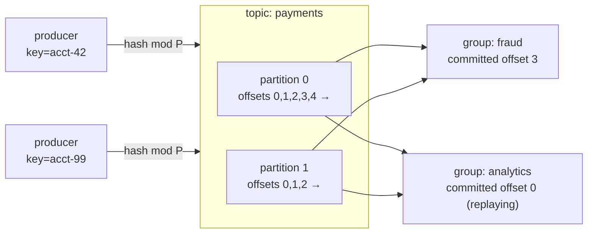

A [transactional database](K1/oltp-vs-olap) answers "what is the current state of
row 42?". A stream of events asks a different question: "what *happened*, in order,
and let me read it again later?". A bank does not just want the current balance; it
wants the ordered sequence of deposits and withdrawals that produced it, kept so
that a new consumer (a fraud detector, an analytics job) can replay the whole
history from the start. The data structure that serves this is the oldest one in
systems: an **append-only log**. Kafka is the system that made the log a
first-class piece of infrastructure<FN n="1" />, and its design is the vocabulary the rest of
this subsection uses.

## The log: append-only, totally ordered, replayable

A **log** is a sequence of records where the only write operation is *append to the
end*. Records are never updated in place and never deleted out of order; a record's
position in the sequence is its **offset**, a monotonically increasing integer
$0, 1, 2, \dots$ assigned when it lands. Three properties fall out of this and they
are the whole point:

- **Total order.** Within one log, record at offset $i$ provably happened before
  record at offset $i+1$. There is no ambiguity about sequence.
- **Immutability.** A record at offset $i$ never changes, so any number of readers
  can read it concurrently without locks; there is nothing to contend over.
- **Replayability.** A reader is just a cursor holding an offset. Reading does not
  consume the record (unlike a queue, where a `pop` removes it), so a new reader can
  start at offset $0$ and replay all of history, and an existing reader can rewind.

Storage stays cheap because appends are sequential disk writes, the fastest access
pattern a disk has, and old records are aged out by a **retention** policy (drop
records older than, say, seven days) rather than per-read deletion<FN n="2" />.

## Topics and partitions: ordering versus scale

A single log on a single machine has a ceiling: every record passes through one
disk, so throughput is bounded by that one disk. To scale horizontally you must
split the log across machines, but splitting breaks total order, because two
records on two different machines have no shared clock. Kafka resolves the tension
by giving up *global* order and keeping *per-key* order.

A **topic** is a named stream (`payments`, `clicks`). Each topic is split into a
fixed number of **partitions**, and each partition is itself an independent
append-only log with its own offset sequence, hosted on a broker. A **producer**
writing a record supplies a **key**; the partition is chosen by hashing it,

$$
\text{partition} = \operatorname{hash}(\text{key}) \bmod P,
$$

where $P$ is the partition count. Two consequences follow directly from this one
formula:

- **All records with the same key land in the same partition**, so they share that
  partition's single offset sequence and are therefore totally ordered with respect
  to each other. Every event for `account=42` is ordered; events for `account=42`
  and `account=99` may interleave arbitrarily, which is fine because they are
  independent.
- **Throughput scales with $P$.** Different keys spread across partitions, so $P$
  partitions on $P$ brokers give $P$ times the single-log throughput. Order is
  preserved exactly where it is needed (per key) and relaxed exactly where relaxing
  it buys scale (across keys).

The key choice is therefore a modeling decision: pick the field whose ordering you
must preserve. Key by `account_id` and per-account history is ordered; key randomly
and you get maximum spread but no ordering guarantee finer than "within a
partition".

## Consumer groups and offsets: who has read how far

A **consumer** reads a partition by holding an offset and asking for "everything at
or after offset $c$". The broker is stateless about this; it stores the records,
the consumer stores its position. Because the position is just an integer the
consumer **commits** back, two readers of the same partition are fully independent,
which is what makes replay free.

Readers are organized into **consumer groups**. A group is a set of consumer
processes that cooperate to read a topic exactly once *as a group*: Kafka assigns
each partition to one member of the group, so the $P$ partitions are divided among
the group's members and the work parallelizes up to $P$ ways. Crucially, each group
keeps its *own* committed offset per partition. The fraud-detection group and the
analytics group both read `payments` from their own positions and neither sees the
other; one can be live at the tip while the other replays last week.

The producers route by key into partitions; each partition is an ordered offset
sequence; each consumer group tracks its own offset per partition and so reads the
same data independently and at its own pace.

## Exercises

**Exercise 1.** A topic `payments` has $P = 4$ partitions. A producer writes records
keyed by `account_id`, using $\operatorname{partition} = \operatorname{hash}(\text{key})
\bmod P$ with a hash function that, for these four accounts, yields
$\operatorname{hash}(7) = 31$, $\operatorname{hash}(11) = 18$,
$\operatorname{hash}(15) = 40$, $\operatorname{hash}(99) = 26$. Compute each
account's partition. Then state which of these two orderings the log guarantees and
which it does not: (a) all events for account 7 in commit order; (b) the global
order of an account-7 event versus an account-15 event.

Solution

**Step 1.** Apply $\bmod 4$ to each hash. $31 \bmod 4 = 3$, $18 \bmod 4 = 2$,
$40 \bmod 4 = 0$, $26 \bmod 4 = 2$. So account 7 maps to partition 3, account 11 to
partition 2, account 15 to partition 0, and account 99 to partition 2.

**Step 2.** Ordering (a) is guaranteed. All events for account 7 share the key 7,
hence the same partition (3), hence one offset sequence, which is totally ordered.
Per-key order holds.

**Step 3.** Ordering (b) is not guaranteed. Account 7 lands in partition 3 and
account 15 in partition 0, two independent logs on possibly different brokers with
no shared clock. Their relative order is arbitrary. The log keeps per-key order and
gives up global order, which is exactly the trade that lets throughput scale with
$P$.

**Step 4.** Note accounts 11 and 99 collide into partition 2. They are still
mutually ordered within that partition's offset sequence, even though they are
unrelated keys; collisions cost interleaving, not correctness.

**Exercise 2.** Two consumer groups read `payments`: a `fraud` group with committed
offset 1200 on a partition, and an `analytics` group replaying the same partition
from offset 0. The partition's tip (latest offset) is 1500. Explain why each group
can sit at a different offset without interfering, and compute each group's lag.
Then say what a queue (where a read consumes the record) could not do here.

Solution

**Step 1.** The broker is stateless about reader position: it stores the immutable
records, and each consumer group stores its *own* committed offset per partition.
Reading does not mutate or remove a record, so the fraud group at 1200 and the
analytics group at 0 are independent cursors over the same shared, read-only log.
Neither advances the other.

**Step 2.** Lag is the distance from a group's committed offset to the tip.
Fraud lag $= 1500 - 1200 = 300$ records behind. Analytics lag $= 1500 - 0 = 1500$
records behind (it is replaying the full history).

**Step 3.** A queue cannot do this. In a queue a `pop` consumes (removes) the
record, so the first reader to take a record prevents any other reader from seeing
it. Two independent full readings of the same history, one live at the tip and one
replaying from the start, are only possible because the log is replayable: position
is the reader's, not the data's.

**Exercise 3.** A team needs strict per-customer ordering of events and currently
keys records by `customer_id` into a topic with $P = 8$ partitions. Traffic grows
and they want more parallelism, so an engineer proposes switching the producer to a
*random* key per record to spread load evenly across partitions. Explain the
ordering consequence of this change and propose a key choice that scales throughput
without breaking the requirement.

Solution

**Step 1.** What random keying buys. Random keys hash uniformly across all 8
partitions, so load is maximally spread and throughput is as high as $P$ partitions
allow. That is the upside the engineer is chasing.

**Step 2.** What it breaks. Ordering is guaranteed only *within* a partition. With
random keys, two events for the same customer can hash to different partitions, on
different brokers with no shared clock, so their relative order is lost. The strict
per-customer ordering requirement is violated. The key is not a load knob, it is the
declaration of what must stay ordered.

**Step 3.** The fix. Keep keying by `customer_id`. Per-customer order is preserved
because all of a customer's events share a key and therefore a partition, while
*different* customers still spread across the 8 partitions and parallelize. To scale
further, raise the partition count $P$ (more partitions, still keyed by customer):
more customers fan out across more brokers, throughput rises, and each customer's
stream stays totally ordered. Order is preserved exactly where it is needed and
relaxed exactly where relaxing it buys scale.

This append-only, partitioned, offset-addressed log is the substrate every later
lesson assumes. The next lesson takes the unbounded stream it delivers and asks the
first hard question of stream processing: how do you compute an aggregate over data
that never ends? That is [windowing](K4/windowing).

<Footnotes>
  <FNItem n="1">**Kreps, J., Narkhede, N., & Rao, J.** (2011). "Kafka: a distributed messaging system for log processing". *NetDB*. The original Kafka design: partitioned topics, offsets, and consumer pull.</FNItem>
  <FNItem n="2">**Kleppmann, M.** (2017). *Designing Data-Intensive Applications.* O'Reilly. Ch. 11 develops the log abstraction, partitioning for scale, consumer offsets, and log retention.</FNItem>
</Footnotes>
