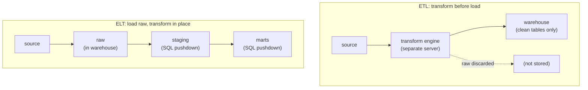

A pipeline that moves data from a source into a [warehouse](K1/dimensional-modeling)
has to decide *where* the cleaning, joining, and aggregating happens. Two orderings
of the same three verbs name the two architectures. **ETL** extracts, **t**ransforms
on a separate engine, then **l**oads the finished tables. **ELT** extracts, **l**oads
the raw data first, then **t**ransforms it in place inside the warehouse. The letters
look like a trivial reshuffle, but moving the transform step changes which machine
does the heavy work, what you can recompute, and what you keep. The modern default
flipped from ETL to ELT, and the reason is economic, not aesthetic.

## ETL: transform before you land the data

In the ETL model a dedicated transformation engine (historically a tool running on
its own server cluster) sits between source and warehouse. It pulls raw records,
applies every business rule, deduplicates, joins reference tables, and produces the
clean, modeled output. Only that finished output is written to the warehouse. The
raw input is never stored in the warehouse; it passes through the transform engine
and is discarded.

This made sense when warehouse storage and warehouse compute were both expensive and
fixed. You did not want to pay to store raw data you would immediately rewrite, and
you did not want transformation queries competing for the warehouse's scarce CPU. So
you bought a separate box to do the transforms and kept the warehouse lean.

The cost shows up when a rule changes. Suppose last quarter's "active customer"
definition was wrong. The corrected rows depend on raw input the warehouse never
kept, so you cannot recompute from inside the warehouse; you must re-extract from the
source (if it still holds that history) and rerun the external engine. The raw layer
that would let you reprocess locally does not exist.

## ELT: land the raw data, then transform in place

In the ELT model you load the raw, untransformed records into the warehouse first,
then express every transformation as SQL that runs *inside* the warehouse. The raw
data stays. Transformation reads the raw tables and writes derived tables alongside
them, in the same system.

Two changes in cloud infrastructure made this the better trade:

- **Storage got cheap.** Object storage and columnar warehouse storage cost a small
  fraction of what dedicated storage cost a decade earlier, so keeping the raw layer
  around is no longer a meaningful line item. Raw data you keep is raw data you can
  reprocess.
- **Warehouse compute got elastic.** A modern cloud warehouse separates storage from
  compute and scales compute on demand. Running a heavy transformation query no
  longer starves the rest of the warehouse, because you can spin compute up for the
  transform and down afterward. The separate transform box stops earning its keep.

The phrase for "do the transform inside the warehouse" is **pushdown**: the work is
pushed down into the engine that already holds the data, instead of pulled out to a
separate engine. Pushdown wins because moving compute to the data is cheaper than
moving data to the compute, and because the warehouse's query optimizer is built to
run exactly these joins and aggregations at scale.

## The raw / staging / mart layering

Keeping the raw data invites a discipline for organizing the transforms that read it.
ELT pipelines settle into three layers, each a set of tables built from the one
before:

- **Raw** (sometimes called the landing or bronze layer): source records loaded
  untouched, append-only, the faithful copy you can always reprocess from.
- **Staging**: lightly cleaned, one staging table per source table, fixing types,
  renaming columns, standardizing nulls. No business logic yet, just a tidy version
  of raw.
- **Marts**: the modeled, business-facing tables (the [dimensional models](K1/dimensional-modeling)
  with their fact and dimension tables) that analysts and dashboards query.

Because raw is retained, any fix to staging or mart logic is a pure recomputation:
change the SQL, rerun, and the corrected tables fall out of the raw layer that never
moved.

The diagram makes the structural difference concrete: ETL's transform sits outside
the warehouse and throws raw away; ELT's transform is a chain of in-warehouse steps
over a retained raw layer. Once transformation lives inside the warehouse as SQL, the
next question is how to manage that SQL so it stays trustworthy, which the
[next lesson](K5/transformation-as-code) answers by treating transformations as
tested, version-controlled code.
