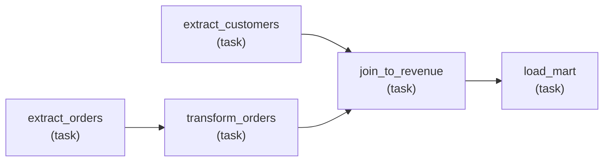
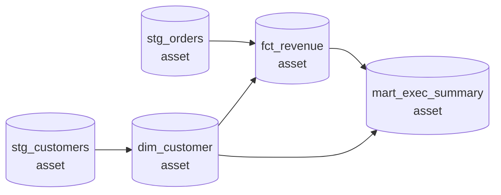

A [scheduled, partitioned pipeline](K5/scheduling-backfills) needs a system to run it:
an **orchestrator** that triggers the work, respects dependencies, retries failures,
and lets you backfill the past. Two philosophies have emerged for what the orchestrator
should reason about. The **task-centric** model (the Airflow lineage) describes the
*steps*: run these operations in this order. The **asset-centric** model (the Dagster
lineage) describes the *outputs*: here are the data assets and what each depends on,
now keep them up to date. The same pipeline can be expressed either way, and the choice
shapes what is easy and what is awkward.

## Task-centric: a DAG of operations

In the task-centric model you author a [DAG](I1/orchestration-dags) whose nodes are
**tasks**, units of work like "run this SQL", "call this API", "move this file". You
wire the edges by hand: `extract >> transform >> load`. The orchestrator's job is to
execute the tasks in a valid topological order, retrying and skipping per the edges
you drew<FN n="1" />. The DAG is **imperative**: it says *do this, then that*. What a task reads or
writes is opaque to the orchestrator; a task is a black box that the scheduler knows
only as "ran" or "failed".

This makes **ordering** and **arbitrary work** easy. Any operation that fits in a task
slots in, and the explicit edges give precise control over sequence. The cost is that
the orchestrator does not know what data each task produces, so it cannot answer
questions about the data. If `load_mart` is stale, the system knows which *tasks* ran,
not which *table* is out of date or why. Lineage over the data exists only in your head
or in a separate catalog.

## Asset-centric: a graph of data assets

In the asset-centric model you declare **assets**, the tables, files, and models the
pipeline produces, and for each asset you declare which other assets it depends on.
You do not wire task edges; you state "`fct_revenue` is built from `stg_orders` and
`dim_customer`", and the orchestrator **derives** the runs needed to materialize it.
The graph is **declarative**: it says *these outputs should exist and here is what each
is made of*, and the system computes the steps. This is the same dependency-as-data
idea as [transformation-as-code](K5/transformation-as-code), promoted to the
orchestrator itself.

Because the orchestrator knows the assets and their edges, it gets several things for
free. **Lineage** is the asset graph itself: every table's upstream and downstream are
first-class. **Partial refresh** is natural: to fix one asset, materialize that asset
and its descendants, leaving untouched assets alone, because the system knows exactly
what each run produces. **Observability** is per-asset: "`fct_revenue` last
materialized at 09:00, 1.2M rows, passed its checks" is a question the system can
answer, where the task-centric system could only report which tasks ran.

## What each makes easy

The trade is a clean one. The task-centric model is maximally general about *what* runs
and gives explicit control over *order*, at the price of being blind to the data the
tasks move<FN n="2" />. The asset-centric model trades some of that generality (everything is
framed as producing an asset) for native lineage, surgical partial refresh, and
data-level observability.

| Concern | Task-centric (Airflow) | Asset-centric (Dagster) |
|---|---|---|
| Unit of reasoning | task (an operation) | asset (a data object) |
| Dependencies | hand-wired task edges | declared per asset, runs derived |
| Lineage over data | external / manual | the asset graph itself |
| Partial refresh | rerun chosen tasks | materialize an asset + descendants |
| Observability | "which tasks ran" | "which table is fresh, how many rows" |
| Best fit | heterogeneous operational steps | data-producing transformation graphs |

Neither is strictly better: a pipeline that is mostly arbitrary operations leans
task-centric, and one that is mostly producing analytical tables leans asset-centric.
With orchestration covered, the pipeline can reliably build its tables; the
[next subsection](K6/data-quality-dimensions) turns to whether the tables those runs
produce are actually *correct*, making data quality measurable and enforceable.

<Footnotes>
  <FNItem n="1">**Apache Software Foundation.** "Apache Airflow documentation". [airflow.apache.org](https://airflow.apache.org/docs/). Airflow's task-centric DAGs, operators, and `>>` dependency wiring are the reference for imperative task orchestration.</FNItem>
  <FNItem n="2">**Reis, J., & Housley, M.** (2022). *Fundamentals of Data Engineering.* O'Reilly. Surveys orchestration frameworks and the shift toward declarative, asset-aware pipelines.</FNItem>
</Footnotes>
