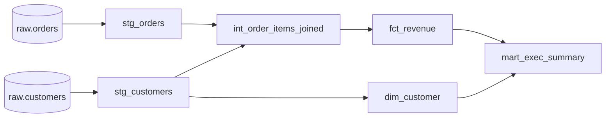

Once [ELT pushes transformation into the warehouse](K5/etl-vs-elt), the transforms
are just SQL. The naive way to run them is a pile of scripts a person executes in
some remembered order: build the staging tables, then run the join, then the
aggregation, hoping nothing ran out of sequence. That pile has no record of why a
column exists, no test that it is correct, and no map of what breaks if a source
column is renamed. The fix is to stop treating transformations as scripts and start
treating them as **code**: each transformation a named, version-controlled unit whose
dependencies are declared, not remembered. This is the mental model popularized by
**dbt**; what matters here is the model, not the tool's syntax.

## A model is a SELECT plus a materialization

The atomic unit is a **model**: a single `SELECT` statement that defines one derived
table, plus an instruction for how to **materialize** it, as a physical `table` or as
a `view` (a saved query that recomputes on read). The author writes only the
`SELECT`; the framework wraps it in the `CREATE TABLE AS` or `CREATE VIEW AS` and
manages the object in the warehouse. One file, one model, one output relation. The
[raw / staging / mart layers](K5/etl-vs-elt) become folders of these models:
`stg_orders` selects from raw orders, `dim_customer` selects from staging, and so on.

## References between models build a DAG

A model does not hard-code the name of the table it reads. It declares a **reference**
to another model. When `fct_revenue` references `stg_orders` and `dim_customer`, two
things follow from that one declaration:

- **Ordering.** A reference is a dependency edge: the referenced model must be built
  first. The full set of references over all models is a
  [directed acyclic graph](I1/orchestration-dags), and the framework computes a build
  order from it by topological sort. Nobody hand-orders the scripts; the order is
  derived from the references.
- **Lineage.** The same edges, read the other direction, are **lineage**: a map of
  what feeds what. You can ask "what depends on `stg_orders`?" and get every
  downstream model, which is exactly the blast-radius question you need answered
  before changing a column.

The graph is not drawn by hand; it is the transitive closure of the `ref` declarations
inside the model files. Reading it left to right is the build order; reading any node's
descendants is its lineage.

## Version control, tests, and the payoff

Because each model is a file of SQL, the whole transformation layer lives in a git
repository. That brings the ordinary engineering disciplines to data:

- **Version control.** Every change to a transformation is a diff with an author, a
  timestamp, and a review. You can see when the revenue definition changed and roll
  it back like any code.
- **Tests.** A test is an assertion expressed as a query that should return zero
  rows: "no null `customer_id` in `dim_customer`", "`order_id` is unique in
  `fct_revenue`", "every `fct_revenue.customer_id` exists in `dim_customer`". The
  framework runs them after the build; a non-empty result is a failure. The
  validation [dimensions](K6/data-quality-dimensions) of the next subsection are what
  these tests encode.
- **Lineage as a first-class artifact.** The DAG is generated documentation: it shows,
  for any table a dashboard breaks on, the exact chain of models back to raw.

The result is that a transformation layer stops being a fragile sequence of scripts
and becomes a tested, version-controlled DAG with end-to-end lineage. This is the
general mental model for any warehouse; [dbt for AI data](J5/dbt-transformations)
applies the same models, refs, and tests to the feature and training tables an ML
system consumes. The next lesson sharpens one detail of how these models run, by
processing only the rows that changed instead of rebuilding every table from scratch,
in [incremental models](K5/incremental-processing).
