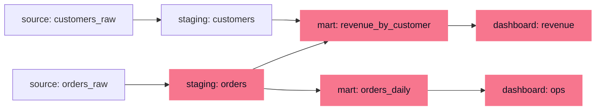

A number on an executive dashboard is the end of a long chain: it was aggregated
from a marts table, which joined two staging tables, which were loaded from raw
source extracts. When that number looks wrong, or when a producer wants to
[change a column's type](K6/schema-evolution-contracts), the first question is
*what does this depend on, and what depends on it?* Answering it from memory does
not scale past a handful of tables. **Data lineage** answers it structurally: it
records the dependency graph of the whole pipeline, so "what breaks if I change
this" and "where did this bad value enter" become graph traversals rather than
guesswork.

## Lineage is a DAG over datasets

Lineage is a **directed acyclic graph** (DAG): nodes are datasets (or, at finer
grain, individual columns), and an edge $u \to v$ means $v$ is *derived from* $u$,
some transform reads $u$ and writes $v$. It is acyclic because a pipeline flows
forward, raw sources to staging to marts to dashboards; nothing downstream feeds
back into its own input. This is the same object as the
[task DAG](K5/transformation-as-code) an orchestrator schedules, read for a
different purpose: the orchestrator uses it to *order execution*, lineage uses it
to *reason about dependence*.

The highlighted nodes above are the **blast radius** of a change to
`staging: orders`: everything reachable from it downstream.

## Two traversals answer two questions

The graph carries direction, so traversing it *with* the edges and *against* them
answers opposite questions, both using the [traversal](A5/graph-traversal)
machinery from foundations.

**Downstream traversal (blast radius).** Start at a node and follow edges
*forward*, collecting every node reachable. That reachable set is exactly what a
change to the start node can affect. Before retyping `staging.orders.amount`, the
downstream set tells you which marts and dashboards must be reviewed and notified;
nothing outside the set can be touched, which bounds the work and the risk.

**Upstream traversal (root cause).** Start at the symptom, a wrong number on a
dashboard, and follow edges *backward*, collecting every node it was derived from.
That set is the suspect list for where the bad value entered. Walking it from the
dashboard back toward the sources, checking each node's
[quality dimensions](K6/data-quality-dimensions) as you go, localizes the defect
to the first upstream node that is already wrong.

## Column-level vs table-level

Lineage can be recorded at two grains. **Table-level** lineage has one node per
dataset; it is cheap to capture and enough to scope a blast radius coarsely.
**Column-level** lineage tracks which *input columns* feed each *output column*,
so a change to `customers_raw.region` shows it flows into
`revenue_by_customer.region` but not into `orders_daily`. Column-level lineage
shrinks the blast radius from "every table that touches this dataset" to "the
specific columns derived from this column", which is the difference between
notifying ten teams and notifying the one that actually consumes the field.

**Provenance** is the audit companion to lineage: for a given output value, the
record of exactly which inputs, transform version, and run produced it, the same
back-pointer a [model registry](I2/model-registry) keeps for a trained artifact.
Lineage tells you the shape of the dependency graph; provenance pins a specific
value to the specific run that made it.

The next lesson watches these datasets *operationally*, freshness, volume, and
null rates over time, so a feed that breaks upstream is flagged before its bad
values propagate down the lineage graph you just learned to traverse:
[data observability](K6/data-observability).
