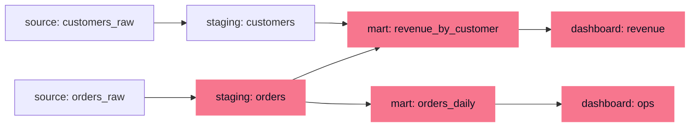

A number on an executive dashboard is the end of a long chain: it was aggregated
from a marts table, which joined two staging tables, which were loaded from raw
source extracts. When that number looks wrong, or when a producer wants to
[change a column's type](K6/schema-evolution-contracts), the first question is
*what does this depend on, and what depends on it?* Answering it from memory does
not scale past a handful of tables. **Data lineage** answers it structurally: it
records the dependency graph of the whole pipeline, so "what breaks if I change
this" and "where did this bad value enter" become graph traversals rather than
guesswork<FN n="1" />.

## Lineage is a DAG over datasets

Lineage is a **directed acyclic graph** (DAG): nodes are datasets (or, at finer
grain, individual columns), and an edge $u \to v$ means $v$ is *derived from* $u$,
some transform reads $u$ and writes $v$. It is acyclic because a pipeline flows
forward, raw sources to staging to marts to dashboards; nothing downstream feeds
back into its own input. This is the same object as the
[task DAG](K5/transformation-as-code) an orchestrator schedules, read for a
different purpose: the orchestrator uses it to *order execution*, lineage uses it
to *reason about dependence*.

The highlighted nodes above are the **blast radius** of a change to
`staging: orders`: everything reachable from it downstream.

## Two traversals answer two questions

The graph carries direction, so traversing it *with* the edges and *against* them
answers opposite questions, both using the [traversal](A5/graph-traversal)
machinery from foundations.

**Downstream traversal (blast radius).** Start at a node and follow edges
*forward*, collecting every node reachable. That reachable set is exactly what a
change to the start node can affect. Before retyping `staging.orders.amount`, the
downstream set tells you which marts and dashboards must be reviewed and notified;
nothing outside the set can be touched, which bounds the work and the risk.

**Upstream traversal (root cause).** Start at the symptom, a wrong number on a
dashboard, and follow edges *backward*, collecting every node it was derived from.
That set is the suspect list for where the bad value entered. Walking it from the
dashboard back toward the sources, checking each node's
[quality dimensions](K6/data-quality-dimensions) as you go, localizes the defect
to the first upstream node that is already wrong.

## Column-level vs table-level

Lineage can be recorded at two grains. **Table-level** lineage has one node per
dataset; it is cheap to capture and enough to scope a blast radius coarsely.
**Column-level** lineage tracks which *input columns* feed each *output column*,
so a change to `customers_raw.region` shows it flows into
`revenue_by_customer.region` but not into `orders_daily`. Column-level lineage
shrinks the blast radius from "every table that touches this dataset" to "the
specific columns derived from this column", which is the difference between
notifying ten teams and notifying the one that actually consumes the field.

**Provenance** is the audit companion to lineage: for a given output value, the
record of exactly which inputs, transform version, and run produced it, the same
back-pointer a [model registry](I2/model-registry) keeps for a trained artifact<FN n="2" />.
Lineage tells you the shape of the dependency graph; provenance pins a specific
value to the specific run that made it.

## Exercises

**Exercise 1.** Consider the lineage DAG drawn above: `orders_raw` and
`customers_raw` are sources; `orders` and `customers` are staging tables derived
from them; `revenue_by_customer` is a mart joining `orders` and `customers`;
`orders_daily` is a mart derived from `orders`; `revenue` and `ops` are dashboards
reading `revenue_by_customer` and `orders_daily` respectively. List the blast
radius of a change to `customers_raw`, that is, every node a change to it can
affect.

Solution

**Step 1.** Blast radius is the set of nodes reachable by following edges
*forward* from the start node. Start at `customers_raw` and take its only outgoing
edge to `customers`.

**Step 2.** From `customers`, follow the edge into `revenue_by_customer` (the join
that reads `customers`).

**Step 3.** From `revenue_by_customer`, follow the edge into the `revenue`
dashboard. No further forward edges remain.

The reachable set, excluding the start node, is
`{customers, revenue_by_customer, revenue}`. Note `orders_daily` and `ops` are
*not* reachable: nothing derived from `customers_raw` feeds them, so they are
outside the blast radius and need not be reviewed.

**Exercise 2.** A number on the `revenue` dashboard is wrong. Describe the
upstream traversal that localizes the defect, and explain why walking from the
dashboard toward the sources (rather than the reverse) is the order that pins down
the *first* place the value went bad.

Solution

**Step 1.** Upstream traversal follows edges *backward* from the symptom,
collecting every node the wrong value was derived from. From `revenue` the suspect
set is `{revenue_by_customer, orders, customers, orders_raw, customers_raw}`: the
mart, its two staging inputs, and their two sources.

**Step 2.** Each suspect is checked against its quality dimensions (is it complete,
valid, consistent). The defect is the *first upstream node that is already wrong*:
every node downstream of it is wrong only because it inherited the bad value.

**Step 3.** Walking from the dashboard toward the sources means checking the most
derived nodes first. The moment a node is found correct, everything upstream of it
on that path is exonerated, so the search narrows toward the boundary between a
correct upstream node and the first incorrect one. That boundary is exactly where
the value entered, which is what localizing the root cause means.

**Exercise 3.** A producer wants to retype `customers_raw.region` from a free-text
string to an enumerated code. Under table-level lineage, ten downstream tables
touch `customers_raw` and all ten teams are notified. Explain how column-level
lineage shrinks this notification set, and state the precise condition under which
a downstream table can be safely excluded.

Solution

**Step 1.** Table-level lineage records one node per dataset, so any change to
`customers_raw` marks *every* table derived from `customers_raw` as potentially
affected. It cannot distinguish a change to `region` from a change to any other
column, so all ten consuming tables are in scope.

**Step 2.** Column-level lineage records which *input columns* feed each *output
column*. A retype of `customers_raw.region` propagates only along edges that
actually carry `region`. A downstream table is affected only if at least one of
its columns is derived (directly or transitively) from `customers_raw.region`.

**Step 3.** A downstream table can be safely excluded precisely when *none* of its
columns trace back to `customers_raw.region`, even if it reads other columns of
`customers_raw`. This is the difference between notifying all ten teams and
notifying only the subset whose output columns depend on the retyped field.

The next lesson watches these datasets *operationally*, freshness, volume, and
null rates over time, so a feed that breaks upstream is flagged before its bad
values propagate down the lineage graph you just learned to traverse:
[data observability](K6/data-observability).

<Footnotes>
  <FNItem n="1">**Reis, J., & Housley, M.** (2022). *Fundamentals of Data Engineering.* O'Reilly. Treats lineage as a cross-cutting concern for impact analysis, debugging, and governance.</FNItem>
  <FNItem n="2">**Kleppmann, M.** (2017). *Designing Data-Intensive Applications.* O'Reilly. Frames derived data and dataflow as a directed graph and motivates provenance for reasoning about where values come from.</FNItem>
</Footnotes>
