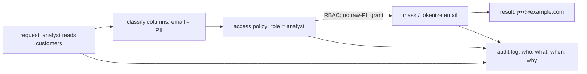

The data a pipeline moves is not all equal. A product catalog is public; an
internal sales forecast is confidential; an email address, a national id, or a
health record is **personal data**, and mishandling it is not just a quality
problem but a legal one. **Data governance** is the layer that classifies data by
sensitivity and enforces who may see it, in what form, and for what purpose, with
a record an auditor can read<FN n="1" />. This lesson covers the classification, the
protection techniques, and the compliance regimes that make governance a
requirement rather than a courtesy.

## Classify first

Every protection decision starts from a **classification** of the data. A common
four-level scheme:

- **Public**: safe to disclose freely (a published price list).
- **Internal**: not secret but not for outsiders (org charts, internal metrics).
- **PII** (personally identifiable information): identifies a person, name,
  email, phone, address, account id.
- **Sensitive**: PII whose exposure carries heightened risk, health, financial,
  biometric, or government-id data, often under stricter legal rules.

Classification is a property of a *column*, and it rides on the
[lineage graph](K6/data-lineage): once a source column is tagged PII, every
downstream column derived from it inherits the tag, so a single classification at
the source propagates protection through the pipeline.

## Protection techniques

Classification drives which technique applies:

- **Masking**: replace part or all of a value with a placeholder for display, e.g.
  `j•••@example.com`. The underlying value is unchanged; only what a low-privilege
  reader *sees* is obscured.
- **Tokenization / pseudonymization**: replace a PII value with a surrogate
  **token** through a reversible mapping held in a separate, guarded vault. Joins
  and analytics still work on the stable token, but the token carries no personal
  information on its own, so a leaked analytics table does not leak identities.
- **Encryption**: store the value as ciphertext so that without the key it is
  unreadable, protecting data at rest and in transit.
- **Role-based access control** (RBAC): grant a **role** access to specific rows
  or columns, and assign users to roles. Column-level RBAC hides the PII columns
  from an analyst role; row-level RBAC restricts a regional team to its own rows.

## A request through the governance boundary

A read request does not touch raw data directly. It passes through
classification, an access policy that decides what the requester's role may see,
and the masking or tokenization that enforces it, and the whole transaction is
written to an **audit log**.

The audit log is the governance artifact: it records who requested what, under
which role, when, and for what stated purpose, the same immutable transition
record a [model registry](I2/model-registry) keeps for promotions.

## Compliance regimes

Regulations such as the EU's **GDPR** and Brazil's **LGPD** turn these techniques
into obligations<FN n="2" />. The load-bearing principles:

- **Purpose limitation**: personal data may be used only for the specific purpose
  the subject consented to, so the audit log records *why* each access happened,
  not only that it did.
- **Data minimization**: collect and retain only the personal data a purpose
  actually needs; a field with no purpose should not be stored.
- **Right to deletion (erasure)**: a data subject can demand that their personal
  data be removed. Satisfying it means finding *every* copy of that person's data
  across raw, staging, and marts, which is exactly a downstream
  [lineage traversal](K6/data-lineage) from the source records: lineage is what
  makes deletion-by-tracing tractable instead of a manual hunt through every
  table.
- **Audit trail**: an immutable, queryable record of access and processing, the
  evidence a regulator asks for.

Lineage is the thread that ties governance together: it propagates classification
from source to dashboard and it scopes a deletion request to the exact set of
downstream records, so the [traversal](A5/graph-traversal) machinery does double
duty as a compliance tool.

## Exercises

**Exercise 1.** A `customers` table has columns `name`, `email`, `signup_date`,
`internal_segment`, and `national_id`. Assign each column one of the four
classification levels (public, internal, PII, sensitive) and justify the two that
are most consequential to get right.

Solution

**Step 1.** Apply the definitions column by column. `name` identifies a person, so
PII. `email` identifies a person (and is a contact handle), so PII. `signup_date`
on its own does not identify anyone, but it is a business attribute not meant for
outsiders, so internal. `internal_segment` is a derived business label, internal.
`national_id` is a government identifier, the canonical sensitive class.

**Step 2.** The two most consequential are `national_id` and `email`.
Mismatched-low on `national_id` (treating it as merely internal) skips the
stricter legal handling sensitive data requires and is the costliest error.
`email` matters because it is both a direct identifier and the field most likely
to be joined or exported, so under-classifying it leaks identities through
analytics tables.

The final assignment: `name` = PII, `email` = PII, `signup_date` = internal,
`internal_segment` = internal, `national_id` = sensitive.

**Exercise 2.** An analytics team needs to count distinct customers per region and
join orders to customers, but must never see raw email addresses. Compare masking
and tokenization for this requirement and explain why one of them fails the join
requirement.

Solution

**Step 1.** Masking replaces part or all of a value with a placeholder for
display, e.g. `j•••@example.com`. Two different raw emails can mask to the same
placeholder, and the masked form is not a stable key, so a join on the masked
column either collides distinct people or fails to match the same person across
tables. Masking therefore breaks the distinct-count and the join.

**Step 2.** Tokenization replaces each raw email with a stable surrogate token
through a reversible mapping held in a guarded vault. The same email always maps to
the same token, and different emails map to different tokens, so the token is a
valid join key and a valid distinct-count key. The token carries no personal
information on its own, so the analytics team meets both requirements without ever
seeing a raw email.

**Step 3.** Tokenization is the correct choice. Masking is for display to a human
reader; tokenization preserves referential structure for analytics, which is what
the join and distinct-count need.

**Exercise 3.** A data subject exercises their GDPR right to deletion. Explain why
satisfying this request is a lineage traversal, which direction it traverses, and
what would go wrong if the organization relied on memory instead of recorded
lineage.

Solution

**Step 1.** The right to erasure requires removing *every* copy of that person's
data. Their data starts in source records and flows through staging into marts and
downstream tables. Finding every copy means enumerating everything derived from the
source records, which is a downstream (forward) traversal of the lineage graph from
the source nodes holding that person's rows.

**Step 2.** It traverses *downstream*: from the source records, follow edges
forward to collect every dataset that carries data derived from those records. That
reachable set is exactly the set of places a deletion must reach.

**Step 3.** Without recorded lineage, the organization would hunt manually through
every table, with no guarantee of completeness. A single missed downstream copy
means the person's data persists somewhere, which is both a failed erasure and a
compliance violation. Recorded lineage makes the deletion scope a tractable graph
query instead of an error-prone manual search.

This closes pillar K. The Data Engineer path threads the whole discipline, from
[data modeling](K1/relational-model) through transformation and orchestration to
the quality, lineage, and governance of this subsection, and it feeds the pillars
downstream: the clean, contracted, observable datasets built here are the inputs
that pillar I's [ML pipelines](I1/drift-detection) train on and that pillar J's AI
data platform serves.

<Footnotes>
  <FNItem n="1">**Reis, J., & Housley, M.** (2022). *Fundamentals of Data Engineering.* O'Reilly. The security and data-management chapters cover classification, access control, masking, and the governance lifecycle.</FNItem>
  <FNItem n="2">**European Parliament and Council.** (2016). "Regulation (EU) 2016/679 (General Data Protection Regulation, GDPR)". *Official Journal of the European Union*. Codifies purpose limitation, data minimization, the right to erasure, and audit obligations.</FNItem>
</Footnotes>
