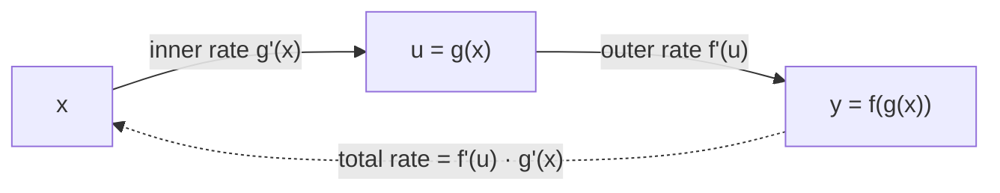

Most functions worth differentiating are compositions: $e^{-x^2/2}$ is "square,
negate-and-halve, exponentiate"; a neural network is dozens of layers of "linear
map, then nonlinearity". The **chain rule** differentiates compositions, and it
deserves more attention than any other rule in this discipline: training a
network is the chain rule applied a few billion times per second<FN ns="1, 3" />.

## The statement

If $g$ is differentiable at $x$ and $f$ is differentiable at $g(x)$, then the
composite $f \circ g$ is differentiable at $x$, and

$$
(f \circ g)'(x) = f'(g(x)) \cdot g'(x) .
$$

In Leibniz notation, with $u = g(x)$ and $y = f(u)$:

$$
\frac{dy}{dx} = \frac{dy}{du} \cdot \frac{du}{dx} ,
$$

which looks like fractions canceling. It is not a proof (the $du$'s are not
numbers), but it is the right mnemonic: rates multiply through a chain.



Why multiplication is obviously right: rates are exchange rates. If $u$
changes $3$ times as fast as $x$, and $y$ changes $5$ times as fast as $u$,
then $y$ changes $15$ times as fast as $x$. Currencies compose the same way:
dollars per euro times euros per yen is dollars per yen.

## The derivation, by composing linear approximations

The honest proof comes from the derivative's defining property in increment
form: differentiability of $g$ at $x$ means the change in $g$ is its linear
part plus an error that dies faster than the step,

$$
g(x + h) - g(x) = g'(x)\, h + \varepsilon_1(h)\, h,
\qquad \varepsilon_1(h) \to 0 \text{ as } h \to 0,
$$

and likewise for $f$ at $u = g(x)$, with step $k$:

$$
f(u + k) - f(u) = f'(u)\, k + \varepsilon_2(k)\, k,
\qquad \varepsilon_2(k) \to 0 .
$$

**Step 1.** Feed the first expansion into the second. The inner step that $g$
hands to $f$ is

$$
k = g(x+h) - g(x) = \left[ g'(x) + \varepsilon_1(h) \right] h .
$$

**Step 2.** Substitute that $k$:

$$
f(g(x+h)) - f(g(x)) = \left[ f'(u) + \varepsilon_2(k) \right] \cdot \left[ g'(x) + \varepsilon_1(h) \right] \cdot h .
$$

**Step 3.** Divide by $h$ and send $h \to 0$. Then $k \to 0$ (Step 1: $k$ is a
bounded multiple of $h$), so both $\varepsilon$'s vanish, and the bracketed
product converges to $f'(u) \cdot g'(x)$, which proves the rule<FN n="2" />. (The
increment form sidesteps the classical trap of dividing by $k$, which can be
zero even for $h \neq 0$.)

The derivation *is* the slogan: **near a point, every differentiable function
acts like multiplication by its derivative, and composing two
multiplications multiplies the factors.** L4 upgrades the factors to matrices
and nothing else changes; that upgraded sentence is backpropagation.

## Using it

**Worked example 1.** $y = (3x^2 + 1)^7$. Outer $f(u) = u^7$, inner
$u = 3x^2 + 1$:

$$
y' = 7u^6 \cdot u' = 7\,(3x^2+1)^6 \cdot 6x = 42x\,(3x^2+1)^6 .
$$

No expansion of a degree-14 polynomial required.

**Worked example 2 (the Gaussian's bell).** $y = e^{-x^2/2}$. Outer
$e^u$, inner $u = -x^2/2$, $u' = -x$:

$$
y' = e^{-x^2/2} \cdot (-x) = -x\, e^{-x^2/2} .
$$

Negative for $x \gt 0$, positive for $x \lt 0$: the bell falls away from its
peak at $0$ on both sides, as it must.

**Worked example 3 (three links).** $y = \sin^2(5x)$ is
$x \mapsto 5x \mapsto \sin(5x) \mapsto (\cdot)^2$, and the factors multiply
right through:

$$
y' = 2\sin(5x) \cdot \cos(5x) \cdot 5 = 10 \sin(5x)\cos(5x) .
$$

The rule nests to any depth; the derivative collects one factor per link.

**The frequency picture.** For $y = \sin(x^2)$, the chain rule gives
$y' = 2x \cos(x^2)$. The inner rate $2x$ grows with $x$, and the figure shows
what that means: the composite oscillates faster and faster, and its
derivative's envelope widens linearly. The inner function stretches the input
axis; the chain rule's inner factor is the local stretch.


**Inverse functions for free.** If $f^{-1}$ undoes $f$, differentiate both
sides of $f(f^{-1}(y)) = y$ with the chain rule:
$f'(f^{-1}(y)) \cdot (f^{-1})'(y) = 1$, so

$$
(f^{-1})'(y) = \frac{1}{f'(f^{-1}(y))} .
$$

Applied to $f = e^x$, $f^{-1} = \ln$: $(\ln y)' = 1 / e^{\ln y} = 1/y$. The
logarithm's derivative is $1/x$, a fact used constantly from here on.

The error to name: **forgetting the inner factor.** The claim
"$(e^{-x^2/2})' = e^{-x^2/2}$" pattern-matches on "$e$ to something is its own
derivative" and silently drops the factor $-x$. The rule's contract is that
the outer derivative is evaluated *at the inner function* and then
*multiplied by the inner derivative*; skipping either half gives an answer
that is wrong everywhere except by accident. The code's last check catches
this exact mistake numerically.

## Check it on arrays

```python
import numpy as np

x = np.linspace(-2.0, 2.0, 9)
h = 1e-6
num = lambda fn: (fn(x + h) - fn(x - h)) / (2 * h)

# Example 1: (3x^2+1)^7
lhs = num(lambda t: (3 * t**2 + 1) ** 7)
rhs = 42 * x * (3 * x**2 + 1) ** 6
assert np.allclose(lhs, rhs, rtol=1e-5)

# Example 2: the Gaussian bell
lhs = num(lambda t: np.exp(-(t**2) / 2))
rhs = -x * np.exp(-(x**2) / 2)
assert np.allclose(lhs, rhs, rtol=1e-6, atol=1e-9)

# Example 3, three links deep: sin^2(5x)
lhs = num(lambda t: np.sin(5 * t) ** 2)
rhs = 10 * np.sin(5 * x) * np.cos(5 * x)
assert np.allclose(lhs, rhs, rtol=1e-5, atol=1e-8)

# Inverse-function rule: (ln y)' = 1/y on positive inputs
y = np.linspace(0.5, 4.0, 8)
lhs = (np.log(y + h) - np.log(y - h)) / (2 * h)
assert np.allclose(lhs, 1 / y, rtol=1e-8)

# The classic mistake: dropping the inner factor of the bell curve
wrong = np.exp(-(x**2) / 2)                 # claims (e^{-x^2/2})' = itself
right = num(lambda t: np.exp(-(t**2) / 2))
print("max gap, wrong vs true derivative:", np.abs(wrong - right).max().round(3))
assert not np.allclose(wrong, right)
```

All three worked examples and the inverse-function rule agree with central
differences to at least five digits, and the dropped-inner-factor "derivative"
misses by order one: the inner factor is not a refinement, it is most of the
answer.

## Exercises

**Exercise 1.** Differentiate (a) $y = \sqrt{1 + x^4}$ and
(b) $y = \ln(\cos x)$, identifying the outer and inner functions in each.

<details>
<summary>Solution</summary>

**(a)** Outer $\sqrt{u} = u^{1/2}$ with derivative $\tfrac12 u^{-1/2}$; inner
$u = 1 + x^4$ with $u' = 4x^3$:

$$
y' = \frac{1}{2\sqrt{1 + x^4}} \cdot 4x^3 = \frac{2x^3}{\sqrt{1+x^4}} .
$$

**(b)** Outer $\ln u$ with derivative $1/u$; inner $u = \cos x$ with
$u' = -\sin x$:

$$
y' = \frac{1}{\cos x} \cdot (-\sin x) = -\tan x .
$$

Defined wherever $\cos x \gt 0$, matching the domain of $\ln(\cos x)$ itself.

</details>

**Exercise 2.** A model's loss depends on a weight through two stages:
$\ell = (y - 3)^2$ where $y = \tanh(wx)$, with input $x$ fixed. Using
$(\tanh u)' = 1 - \tanh^2 u$, find $\dfrac{d\ell}{dw}$ by the chain rule, and
evaluate the sign at $w = 0$, $x = 1$.

<details>
<summary>Solution</summary>

**Step 1.** The chain is $w \mapsto u = wx \mapsto y = \tanh u \mapsto \ell =
(y-3)^2$. One factor per link, outermost first:

$$
\frac{d\ell}{dw}
= \underbrace{2(y - 3)}_{d\ell/dy}
\cdot \underbrace{\left(1 - \tanh^2 u\right)}_{dy/du}
\cdot \underbrace{x}_{du/dw} .
$$

**Step 2.** At $w = 0$, $x = 1$: $u = 0$, $\tanh 0 = 0$, so $y = 0$ and

$$
\frac{d\ell}{dw} = 2(0 - 3) \cdot (1 - 0) \cdot 1 = -6 .
$$

**Step 3.** The sign is negative: increasing $w$ *decreases* the loss
(pushing $y = \tanh(w)$ up toward the target $3$, as far as saturation
allows). Gradient descent would therefore increase $w$. This three-factor
product is a one-weight backpropagation, computed by hand.

</details>

**Exercise 3 (code).** Build the chain $\ell(w) = (\tanh(w x) - 3)^2$ from
Exercise 2 with $x = 1.0$, and verify the chain-rule formula against central
differences at $w \in \lbrace -1, -0.5, 0, 0.5, 1 \rbrace$, asserting
agreement to $10^{-6}$ and that the derivative at $w = 0$ is $-6$.

<details>
<summary>Solution</summary>

```python
import numpy as np

xval = 1.0
loss = lambda w: (np.tanh(w * xval) - 3.0) ** 2

def dloss(w):
    u = w * xval
    y = np.tanh(u)
    return 2 * (y - 3.0) * (1 - np.tanh(u) ** 2) * xval   # 3 chain factors

w = np.array([-1.0, -0.5, 0.0, 0.5, 1.0])
h = 1e-6
numeric = (loss(w + h) - loss(w - h)) / (2 * h)
analytic = dloss(w)
print("analytic:", analytic.round(6))
print("numeric :", numeric.round(6))
assert np.allclose(analytic, numeric, atol=1e-6)
assert np.isclose(dloss(0.0), -6.0)
```

The three-factor product matches the numerical derivative at every test
point, and the $w = 0$ value is the hand-computed $-6$. Frameworks autodiff
exactly this product, factor by factor, from the loss backward.

</details>

The chain rule assumed the relation comes as $y = f(x)$; the next lesson
differentiates relations that refuse that form, like circles, and uses the
logarithm to tame products and variable powers.

<Footnotes>
  <FNItem n="1">**Rumelhart, D. E., Hinton, G. E., & Williams, R. J.** (1986). "Learning representations by back-propagating errors". *Nature*, 323, 533-536. Backpropagation as systematic chain-rule application. [doi:10.1038/323533a0](https://doi.org/10.1038/323533a0)</FNItem>
  <FNItem n="2">**Spivak, M.** (2008). *Calculus* (4th ed.). Publish or Perish. Ch. 10, the chain rule with the increment-form proof.</FNItem>
  <FNItem n="3">**Stewart, J.** (2015). *Calculus: Early Transcendentals* (8th ed.). Cengage Learning. Ch. 3.4, the chain rule and its applications.</FNItem>
</Footnotes>
