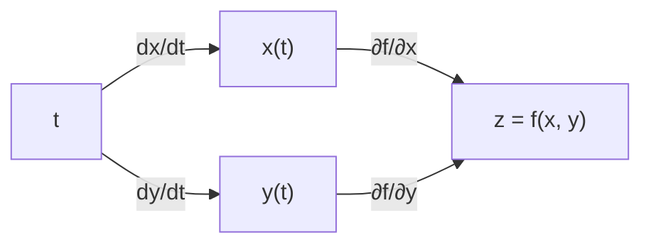

Two lessons ago a function had all its partial derivatives at a point and
still failed to be continuous there. So "has partials" is too weak to be
the definition of differentiable in $\mathbb{R}^n$. The right definition
promotes L2's increment form, "the change in $f$ is a linear part plus a
smaller-than-linear error", with the linear part upgraded from a number to
a **linear map**. Once differentiability means *locally linear*, the chain
rule becomes what it always wanted to be: composition of linear maps,
which is matrix multiplication. That sentence is backpropagation's entire
mathematical content<FN n="1" />.

## Differentiability, properly

$f : \mathbb{R}^n \to \mathbb{R}$ is **differentiable at $\mathbf{a}$** if
there exists a vector $\mathbf{g}$ such that

$$
f(\mathbf{a} + \mathbf{h}) = f(\mathbf{a}) + \mathbf{g} \cdot \mathbf{h} + o(\lVert \mathbf{h} \rVert),
$$

where $o(\lVert \mathbf{h} \rVert)$ denotes an error term whose ratio to
$\lVert \mathbf{h} \rVert$ goes to $0$ as $\mathbf{h} \to \mathbf{0}$ (the
little-o of L1, recycled). The linear function
$\mathbf{h} \mapsto \mathbf{g} \cdot \mathbf{h}$ is the **total
derivative** of $f$ at $\mathbf{a}$.

Three immediate consequences lock the earlier lessons together:

- Taking $\mathbf{h} = t \mathbf{e}_i$ shows $\mathbf{g}$'s components are
  forced: $g_i = f_{x_i}(\mathbf{a})$, so $\mathbf{g} = \nabla f(\mathbf{a})$.
  When the total derivative exists, it *is* the gradient acting by dot
  product, and the directional-derivative formula
  $D_\mathbf{u} f = \nabla f \cdot \mathbf{u}$ from last lesson is the
  definition read along $\mathbf{h} = t\mathbf{u}$.
- The error bound covers **all** approach directions at once, which is
  exactly what bare partials (two axis directions) failed to do. The
  pathological $xy/(x^2+y^2)$ has partials but no total derivative at the
  origin; no single linear map fits all paths.
- Geometrically, for $n = 2$ the claim is that the **tangent plane**
  $z = f(\mathbf{a}) + \nabla f(\mathbf{a}) \cdot (\mathbf{x} - \mathbf{a})$
  hugs the surface to better than first order: the 2D version of L2's
  tangent line, with the same quadratic peel-away.

The practical sufficient condition (proved via the MVT): **if all partials
exist and are continuous near $\mathbf{a}$, then $f$ is differentiable at
$\mathbf{a}$.** Every formula-built function in this pillar qualifies away
from its singularities, which is why the pathology needed a stitched-
together quotient.


## Vector-valued maps

Nothing above needed the output to be one-dimensional. For
$\mathbf{F} : \mathbb{R}^n \to \mathbb{R}^m$ (an $m$-vector of component
functions $F_1, \dots, F_m$), differentiability at $\mathbf{a}$ means

$$
\mathbf{F}(\mathbf{a} + \mathbf{h}) = \mathbf{F}(\mathbf{a}) + J \mathbf{h} + o(\lVert \mathbf{h} \rVert)
$$

for some $m \times n$ matrix $J$: each component supplies one row, its
gradient. The matrix is the **Jacobian**, next lesson's protagonist; here
it is needed only as "the linear map in the middle".

## The multivariable chain rule

Compose $\mathbf{g} : \mathbb{R}^k \to \mathbb{R}^n$ with
$f : \mathbb{R}^n \to \mathbb{R}^m$. If each is differentiable, so is
$f \circ \mathbf{g}$, and

$$
D(f \circ \mathbf{g})(\mathbf{a}) = Df(\mathbf{g}(\mathbf{a})) \; \cdot \; D\mathbf{g}(\mathbf{a}) :
$$

**the derivative of a composition is the product of the derivatives**, as
matrices, outer evaluated at the inner's output. The proof is L2's
increment-substitution argument verbatim, with matrix norms in place of
absolute values: feed one linear-plus-small expansion into the other, and
the cross terms stay small.

The workhorse special case threads a curve through a field. If
$\mathbf{x}(t)$ moves through $\mathbb{R}^n$ and $f$ is a scalar field,

$$
\frac{d}{dt} f(\mathbf{x}(t)) = \nabla f(\mathbf{x}(t)) \cdot \mathbf{x}'(t)
= \sum_{i=1}^n \frac{\partial f}{\partial x_i} \frac{dx_i}{dt} :
$$

total change is each variable's contribution, summed. **The sum is the new
ingredient** relative to L2, and it is the named confusion of this lesson:
when a variable reaches the output through several routes, the routes
*add*. With $z = f(x, y)$, $x = x(t)$, $y = y(t)$, forgetting the
$y$-route and writing $\dot z = f_x \dot x$ is the multivariable analogue
of L2's dropped inner factor, and it is wrong by an entire term.



Multiply along each path, add across paths: the chain rule as graph
traversal. Autodiff frameworks literally walk this graph; the backward
pass visits it right-to-left, which is why the rule's matrix form is the
engine of training.

**Worked example.** $z = x^2 y$ with $x = \cos t$, $y = \sin t$: how fast
does $z$ change along the circle?

**Step 1.** Partials: $z_x = 2xy$, $z_y = x^2$. Rates:
$\dot x = -\sin t$, $\dot y = \cos t$.

**Step 2.** Sum over the two paths:

$$
\frac{dz}{dt} = 2xy \,(-\sin t) + x^2 \cos t
= -2 \cos t \sin^2 t + \cos^3 t .
$$

At $t = \pi/4$: $-2 \cdot \frac{\sqrt2}{2} \cdot \frac12 + \frac{2\sqrt2}{8}
= -\frac{\sqrt2}{2} + \frac{\sqrt2}{4} = -\frac{\sqrt2}{4} \approx -0.3536$.

**Worked example (several intermediate variables).** A network layer in
miniature: $\ell$ depends on outputs $u$ and $v$, each depending on a
shared weight $w$. Then

$$
\frac{d\ell}{dw} = \frac{\partial \ell}{\partial u} \frac{du}{dw} + \frac{\partial \ell}{\partial v} \frac{dv}{dw} .
$$

Weight sharing (convolutions, recurrence, tied embeddings) is this
formula: one parameter, several paths, gradients summed. The code below
checks a concrete instance.

## Check it on arrays

```python
import numpy as np

h = 1e-6

# Curve through a field: z = x^2 y on the unit circle
t0 = np.pi / 4
z_of_t = lambda t: np.cos(t) ** 2 * np.sin(t)
num = (z_of_t(t0 + h) - z_of_t(t0 - h)) / (2 * h)
x, y = np.cos(t0), np.sin(t0)
chain = 2 * x * y * (-np.sin(t0)) + x**2 * np.cos(t0)
assert np.isclose(num, chain, atol=1e-9)
assert np.isclose(chain, -np.sqrt(2) / 4)

# Dropping a path gives a wrong answer
wrong = 2 * x * y * (-np.sin(t0))               # only the x-route
assert not np.isclose(num, wrong, atol=1e-3)
print("true dz/dt:", round(chain, 6), " one-path 'chain rule':", round(wrong, 6))

# Weight sharing: l = u*v with u = w^2, v = sin(w); dl/dw via two paths
w0 = 0.8
l_of_w = lambda w: (w**2) * np.sin(w)
num = (l_of_w(w0 + h) - l_of_w(w0 - h)) / (2 * h)
u, v = w0**2, np.sin(w0)
two_paths = v * (2 * w0) + u * np.cos(w0)       # dl/du*du/dw + dl/dv*dv/dw
assert np.isclose(num, two_paths, atol=1e-8)

# Differentiability: the tangent plane error is o(||h||) for f = x^2 + 0.5 y^2
f = lambda p: p[0] ** 2 + 0.5 * p[1] ** 2
a = np.array([0.8, -0.6])
g = np.array([2 * a[0], 1.0 * a[1]])            # gradient at a
rng = np.random.default_rng(0)
dirs = rng.normal(size=(500, 2))
dirs /= np.linalg.norm(dirs, axis=1, keepdims=True)
for r in [1e-2, 1e-3, 1e-4]:
    H = r * dirs
    err = np.abs(f((a + H).T) - f(a) - H @ g)
    print(f"r={r}: max error/r = {(err.max() / r):.2e}")
assert (np.abs(f((a + r * dirs).T) - f(a) - (r * dirs) @ g).max() / r) < 1e-3
```

The two-path sum matches the direct derivative while the one-path version
misses by the whole second term, the weight-sharing gradient checks out,
and the tangent-plane error divided by the step size dies as the step
shrinks, across 500 random directions: little-o, observed.

## Exercises

**Exercise 1.** Let $z = e^{x} \sin y$ with $x = st^2$ and $y = s^2 t$.
Compute $\partial z/\partial s$ and $\partial z/\partial t$ by the chain
rule, and evaluate both at $s = 1, t = \pi$. (Use
$e^{\pi^2}$ symbolically; no decimal needed.)

<details>
<summary>Solution</summary>

**Step 1.** Outer partials: $z_x = e^x \sin y$, $z_y = e^x \cos y$. Inner
partials: $x_s = t^2$, $x_t = 2st$, $y_s = 2st$, $y_t = s^2$.

**Step 2.** Two routes to $z$ from each of $s$ and $t$, summed:

$$
\frac{\partial z}{\partial s} = e^x \sin y \cdot t^2 + e^x \cos y \cdot 2st,
\qquad
\frac{\partial z}{\partial t} = e^x \sin y \cdot 2st + e^x \cos y \cdot s^2 .
$$

**Step 3.** At $s = 1$, $t = \pi$: $x = \pi^2$, $y = \pi$, so
$\sin y = 0$, $\cos y = -1$:

$$
\frac{\partial z}{\partial s} = 0 + e^{\pi^2} \cdot (-1) \cdot 2\pi = -2\pi e^{\pi^2},
\qquad
\frac{\partial z}{\partial t} = 0 + e^{\pi^2} \cdot (-1) \cdot 1 = -e^{\pi^2} .
$$

</details>

**Exercise 2.** A differentiable $f : \mathbb{R}^n \to \mathbb{R}$ is
evaluated along the descent curve defined by
$\mathbf{x}'(t) = -\nabla f(\mathbf{x}(t))$ (gradient flow). Show that

$$
\frac{d}{dt} f(\mathbf{x}(t)) = -\lVert \nabla f(\mathbf{x}(t)) \rVert^2 \le 0 ,
$$

and conclude that $f$ never increases along the flow, strictly decreasing
wherever the gradient is nonzero.

<details>
<summary>Solution</summary>

**Step 1.** Chain rule along the curve:

$$
\frac{d}{dt} f(\mathbf{x}(t)) = \nabla f(\mathbf{x}(t)) \cdot \mathbf{x}'(t) .
$$

**Step 2.** Substitute the flow equation
$\mathbf{x}' = -\nabla f$:

$$
\frac{d}{dt} f = \nabla f \cdot \left( -\nabla f \right) = -\lVert \nabla f \rVert^2 .
$$

**Step 3.** A squared norm is nonnegative, so the derivative of $f$ along
the flow is $\le 0$ everywhere, and $\lt 0$ exactly where
$\nabla f \ne \mathbf{0}$. The value can only stall at critical points.
Gradient descent is the Euler discretization of this flow, and L6's
descent guarantee is the discrete shadow of this one-line computation.

</details>

**Exercise 3 (code).** Build the two-layer scalar "network"
$\ell(w_1, w_2) = \left( \tanh(w_2 \tanh(w_1 x)) - y \right)^2$ with
$x = 1.5$, $y = 0.5$. Hand-derive the chain-rule expressions for
$\partial \ell/\partial w_1$ and $\partial \ell/\partial w_2$, implement
them, and verify both against central differences at
$(w_1, w_2) = (0.4, -0.7)$.

<details>
<summary>Solution</summary>

**Derivation.** Forward: $a = w_1 x$, $h = \tanh a$, $b = w_2 h$,
$p = \tanh b$, $\ell = (p - y)^2$. Backward, multiplying local derivatives
along each path ($\tanh' u = 1 - \tanh^2 u$):

$$
\frac{\partial \ell}{\partial w_2} = 2(p - y)(1 - p^2)\, h,
\qquad
\frac{\partial \ell}{\partial w_1} = 2(p - y)(1 - p^2)\, w_2 \,(1 - h^2)\, x .
$$

```python
import numpy as np

x, y = 1.5, 0.5

def forward(w1, w2):
    a = w1 * x
    h_ = np.tanh(a)
    b = w2 * h_
    p = np.tanh(b)
    return (p - y) ** 2, h_, p

def grads(w1, w2):
    _, h_, p = forward(w1, w2)
    up = 2 * (p - y) * (1 - p**2)          # shared upstream factor
    return up * w2 * (1 - h_**2) * x, up * h_

w1, w2 = 0.4, -0.7
eps = 1e-6
g1, g2 = grads(w1, w2)
n1 = (forward(w1 + eps, w2)[0] - forward(w1 - eps, w2)[0]) / (2 * eps)
n2 = (forward(w1, w2 + eps)[0] - forward(w1, w2 - eps)[0]) / (2 * eps)
print("analytic:", (round(g1, 8), round(g2, 8)))
print("numeric :", (round(n1, 8), round(n2, 8)))
assert np.isclose(g1, n1, atol=1e-7) and np.isclose(g2, n2, atol=1e-7)
```

Both hand-derived gradients match central differences to seven decimals.
The shared factor `up` is the "upstream gradient" a framework would pass
backward once and reuse for both parameters: backpropagation's economy,
visible at two weights.

</details>

The total derivative of a vector-valued map is a matrix waiting to be
named; the next lesson names it the Jacobian, composes Jacobians by matrix
multiplication, and reads volume change off the determinant.

<Footnotes>
  <FNItem n="1">**Rumelhart, D. E., Hinton, G. E., & Williams, R. J.** (1986). "Learning representations by back-propagating errors". *Nature*, 323, 533-536. The multivariable chain rule, applied through a computation graph. [doi:10.1038/323533a0](https://doi.org/10.1038/323533a0)</FNItem>
  <FNItem n="2">**Marsden, J. E., & Tromba, A. J.** (2012). *Vector Calculus* (6th ed.). W. H. Freeman. Ch. 2.3 and 2.5, differentiability as best linear approximation and the chain rule.</FNItem>
  <FNItem n="3">**Spivak, M.** (1965). *Calculus on Manifolds.* Benjamin. Ch. 2, the total derivative in full generality, for the reader who wants the n-dimensional theory straight.</FNItem>
</Footnotes>
