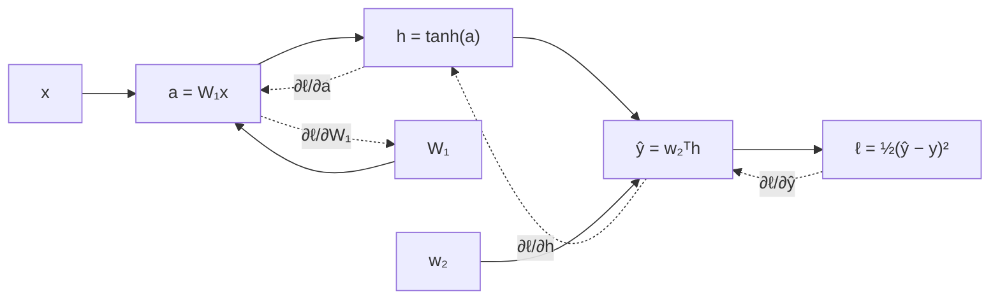

This pillar opened by promising that training a neural network is
calculus from these lessons and nothing more. Time to collect. A network
is a composition of maps; its training gradient is a product of
Jacobians (L4); evaluating that product right-to-left, reusing each
partial product, is **backpropagation**. No new mathematics enters this
lesson, which is precisely the point: the algorithm that trains every
model in this tree is bookkeeping on top of the multivariable chain
rule<FN n="1" />.

## The network as a composition

A two-layer network for one input
$\mathbf{x} \in \mathbb{R}^2$ and scalar target $y$:

$$
\mathbf{a} = W_1 \mathbf{x}, \qquad
\mathbf{h} = \tanh(\mathbf{a}), \qquad
\hat y = \mathbf{w}_2^\top \mathbf{h}, \qquad
\ell = \tfrac12 (\hat y - y)^2 ,
$$

with parameters $W_1 \in \mathbb{R}^{3 \times 2}$,
$\mathbf{w}_2 \in \mathbb{R}^3$. As a pipeline:



Training needs $\partial \ell / \partial W_1$ and
$\partial \ell / \partial \mathbf{w}_2$. The chain rule (L4) says:
multiply the Jacobians of the stages. The only decision left is the
order of multiplication, and that decision is the algorithm.

## Reverse mode: why backward wins

The end-to-end derivative is a product of stage Jacobians. For the path
from $\mathbf{a}$ to $\ell$:

$$
\frac{\partial \ell}{\partial \mathbf{a}}
= \underbrace{\frac{\partial \ell}{\partial \hat y}}_{1 \times 1}
\underbrace{\frac{\partial \hat y}{\partial \mathbf{h}}}_{1 \times 3}
\underbrace{\frac{\partial \mathbf{h}}{\partial \mathbf{a}}}_{3 \times 3} .
$$

Multiplied left-to-right, every intermediate product is a **row
vector**: cheap. Multiplied right-to-left it would build
matrix-times-matrix products: for layers of width $n$, a factor-$n$
overcharge per stage. With one scalar output and millions of inputs
(parameters), the left-anchored order wins enormously, and
"left-anchored through the composition" means traversing the network
**backward** from the loss. That cost argument, made in L4's Jacobian
lesson, is the entire reason the algorithm runs in reverse<FN n="2" />.
(One forward pass per *input* direction, by contrast, is forward-mode
autodiff: the right tool when outputs outnumber inputs, which is the
transpose of training's situation.)

## The backward pass, derived

Work outward-in, each line one chain-rule application, each quantity an
"upstream gradient" reused by everything before it. Writing
$\delta_{\hat y} = \partial \ell / \partial \hat y$ etc.:

**Step 1 (loss).** $\ell = \tfrac12(\hat y - y)^2$, so
$\delta_{\hat y} = \hat y - y$, a scalar.

**Step 2 (output layer).** $\hat y = \mathbf{w}_2^\top \mathbf{h}$ is
linear in each argument:

$$
\delta_{\mathbf{h}} = \delta_{\hat y}\, \mathbf{w}_2,
\qquad
\frac{\partial \ell}{\partial \mathbf{w}_2} = \delta_{\hat y}\, \mathbf{h} .
$$

(Differentiating a dot product with respect to one factor yields the
other, the first matrix-calculus identity of A1, met here from first
principles.)

**Step 3 (activation).** $\mathbf{h} = \tanh(\mathbf{a})$ acts
elementwise, so its Jacobian is diagonal,
$\operatorname{diag}(1 - \mathbf{h}^2)$, and

$$
\delta_{\mathbf{a}} = \left( 1 - \mathbf{h}^2 \right) \odot \delta_{\mathbf{h}} ,
$$

an elementwise product ($\odot$): the L2 chain rule applied three times
in parallel.

**Step 4 (input layer).** $\mathbf{a} = W_1 \mathbf{x}$:

$$
\frac{\partial \ell}{\partial W_1} = \delta_{\mathbf{a}}\, \mathbf{x}^\top ,
$$

an outer product: entry $(i, j)$ is (how much $\ell$ cares about
$a_i$) times (how much $a_i$ moves per unit of $W_{1,ij}$, which is
$x_j$). Every parameter's gradient came from one shared backward sweep:
the work is one forward pass plus one backward pass, regardless of how
many parameters exist. That economy, not any new derivative rule, is
why training a billion parameters is feasible.

Two facts the derivation makes obvious that folklore obscures. First,
the forward activations ($\mathbf{h}$, $\mathbf{x}$) appear in the
gradient formulas, which is why frameworks cache them and why memory,
not compute, often limits batch size. Second, $\delta_{\mathbf{a}}$
carries the factor $1 - \mathbf{h}^2$, which is near zero wherever
$\tanh$ saturates: gradients shrink as they pass through saturated
units, and stacking many such layers multiplies many small factors,
the **vanishing gradient problem**, visible already in a two-layer
derivation as a product of activation slopes (L2's chain factors,
compounding).

The named confusion, for the record: **backpropagation is not a
training algorithm; it is a derivative-computing algorithm.** It
produces $\nabla \ell$; *gradient descent* (two lessons ago) then
spends it. "Trained with backprop" conflates the bookkeeper with the
decision-maker, and every optimizer in A3 consumes the same backward
pass.


## Check it on arrays

```python
import numpy as np

rng = np.random.default_rng(0)
W1 = rng.normal(0, 1.0, (3, 2))
w2 = rng.normal(0, 1.0, 3)
x = np.array([0.6, -0.4])
y = 0.7

def loss(W1, w2):
    h = np.tanh(W1 @ x)
    return 0.5 * (w2 @ h - y) ** 2

# Backward pass, exactly the four derivation steps
a = W1 @ x
h = np.tanh(a)
yhat = w2 @ h
d_yhat = yhat - y                      # step 1
g_w2 = d_yhat * h                      # step 2 (parameter gradient)
d_h = d_yhat * w2                      # step 2 (upstream for layer below)
d_a = (1 - h**2) * d_h                 # step 3
g_W1 = np.outer(d_a, x)                # step 4

# Finite-difference audit of all 9 parameters
eps = 1e-6
fd_W1 = np.zeros_like(W1)
for i in range(3):
    for j in range(2):
        P, M = W1.copy(), W1.copy()
        P[i, j] += eps
        M[i, j] -= eps
        fd_W1[i, j] = (loss(P, w2) - loss(M, w2)) / (2 * eps)
fd_w2 = np.zeros_like(w2)
for i in range(3):
    P, M = w2.copy(), w2.copy()
    P[i] += eps
    M[i] -= eps
    fd_w2[i] = (loss(W1, P) - loss(W1, M)) / (2 * eps)

assert np.allclose(g_W1, fd_W1, atol=1e-8)
assert np.allclose(g_w2, fd_w2, atol=1e-8)
print("all 9 gradients match finite differences")

# Spend the gradients: 300 descent steps fit the target
for _ in range(300):
    a = W1 @ x; h = np.tanh(a); yhat = w2 @ h
    d = yhat - y
    w2 = w2 - 0.1 * d * h
    W1 = W1 - 0.1 * np.outer((1 - h**2) * (d * w2), x)
assert abs(np.tanh(W1 @ x) @ w2 - y) < 1e-6

# Vanishing gradients: product of tanh slopes through a deep stack
depth, widths = 20, 0.9
slope_product = 1.0
v = 2.5                                # a saturating pre-activation
for _ in range(depth):
    hh = np.tanh(v)
    slope_product *= (1 - hh**2)
print("20-layer saturated slope product:", slope_product)
assert slope_product < 1e-20
```

All nine analytic gradients survive the finite-difference audit to
eight decimals, three hundred descent steps spend those gradients to
fit the target to $10^{-6}$, and twenty saturated $\tanh$ slopes
multiply down to $10^{-21}$: the algorithm, its purpose, and its most
famous failure mode, in thirty lines of numpy.

## Exercises

**Exercise 1.** Extend the backward pass one stage: with a bias,
$\mathbf{a} = W_1 \mathbf{x} + \mathbf{b}$, derive
$\partial \ell / \partial \mathbf{b}$, and explain in one sentence why
it equals $\delta_{\mathbf{a}}$ itself.

<details>
<summary>Solution</summary>

**Step 1.** The map from $\mathbf{b}$ to $\mathbf{a}$ (holding all else
fixed) is the identity shift $\mathbf{a} = \text{const} + \mathbf{b}$,
whose Jacobian is the identity matrix $I$.

**Step 2.** Chain rule:

$$
\frac{\partial \ell}{\partial \mathbf{b}}
= \frac{\partial \mathbf{a}}{\partial \mathbf{b}}^{\!\top} \delta_{\mathbf{a}}
= I\, \delta_{\mathbf{a}} = \delta_{\mathbf{a}} .
$$

**Step 3.** One sentence: the bias feeds into $\mathbf{a}$ at rate one,
so whatever the loss wants from $\mathbf{a}$ it wants identically from
$\mathbf{b}$. (In a batched setting the same logic sums
$\delta_{\mathbf{a}}$ over the batch: the multi-path additivity of the
L4 chain rule, since every example routes through the same bias.)

</details>

**Exercise 2.** For a deep linear chain
$\hat y = w_L w_{L-1} \cdots w_1 x$ of scalar weights (no activations),
show that $\partial \hat y / \partial w_i = x \prod_{j \neq i} w_j$,
and use it to explain both vanishing and exploding gradients in terms
of the weights' magnitudes.

<details>
<summary>Solution</summary>

**Step 1.** $\hat y$ is linear in each single $w_i$ with coefficient
equal to everything else:

$$
\hat y = w_i \cdot \left( x \prod_{j \ne i} w_j \right)
\quad \Longrightarrow \quad
\frac{\partial \hat y}{\partial w_i} = x \prod_{j \neq i} w_j ,
$$

which is also the chain rule walked through the stages, each stage
contributing its local slope $w_j$.

**Step 2.** The gradient's magnitude is a product of $L - 1$ weight
magnitudes. With $\lvert w_j \rvert \approx r$ throughout:
$\lvert \partial \hat y / \partial w_i \rvert \approx \lvert x \rvert\,
r^{L-1}$, a geometric sequence in depth (L1). For $r \lt 1$ it
collapses (vanishing: $0.9^{50} \approx 0.005$), for $r \gt 1$ it
blows up (exploding: $1.1^{50} \approx 117$), and only $r \approx 1$
keeps deep gradients usable. Initialization schemes and normalization
layers (D1) exist to hold the effective $r$ near one; with
nonlinearities, the activation slopes join the product, as the code's
saturation experiment showed.

</details>

**Exercise 3 (code).** Gradient checking is the professional version of
this lesson's audit. Implement `numerical_grad(f, params, eps)` for the
two-layer network with bias (Exercise 1's architecture), and verify the
analytic backward pass for *three different inputs and targets at
once*, using the summed loss over the batch. Confirm the bias gradient
equals the sum of the per-example $\delta_{\mathbf{a}}$ vectors.

<details>
<summary>Solution</summary>

```python
import numpy as np

rng = np.random.default_rng(1)
W1 = rng.normal(0, 1.0, (3, 2))
b = rng.normal(0, 0.3, 3)
w2 = rng.normal(0, 1.0, 3)
X = rng.normal(0, 1.0, (4, 2))         # batch of 4 inputs
Y = rng.normal(0, 1.0, 4)

def loss(W1, b, w2):
    H = np.tanh(X @ W1.T + b)          # (4, 3)
    return 0.5 * np.sum((H @ w2 - Y) ** 2)

# Analytic backward pass, batched
A = X @ W1.T + b
H = np.tanh(A)
d_yhat = H @ w2 - Y                    # (4,)
g_w2 = H.T @ d_yhat
d_A = (1 - H**2) * np.outer(d_yhat, w2)
g_b = d_A.sum(axis=0)                  # bias: sum of per-example deltas
g_W1 = d_A.T @ X

def numerical_grad(arr):
    g = np.zeros_like(arr)
    flat = arr.ravel()
    for i in range(flat.size):
        old = flat[i]
        flat[i] = old + 1e-6
        up = loss(W1, b, w2)
        flat[i] = old - 1e-6
        dn = loss(W1, b, w2)
        flat[i] = old
        g.ravel()[i] = (up - dn) / 2e-6
    return g

assert np.allclose(g_W1, numerical_grad(W1), atol=1e-7)
assert np.allclose(g_b, numerical_grad(b), atol=1e-7)
assert np.allclose(g_w2, numerical_grad(w2), atol=1e-7)
print("batched backward pass passes the gradient check on all 12 parameters")
```

Twelve parameters, three tensors, one batch: the analytic sweep matches
the numerical audit to seven decimals, and the bias gradient is the
column-sum of $\delta_A$ exactly as the multi-path chain rule requires.
This check, slow but unimpeachable, is how every autodiff
implementation is validated; D1's autodiff lesson industrializes what
these thirty lines do by hand.

</details>

That closes pillar L. The chain rule built the backward pass, Taylor
expansions priced the steps, and the Hessian explained the terrain;
from here, A1's matrix calculus makes these computations fluent at
tensor scale, A3 turns descent into a family of industrial optimizers,
and D1 runs the same backward pass through real architectures.

<Footnotes>
  <FNItem n="1">**Rumelhart, D. E., Hinton, G. E., & Williams, R. J.** (1986). "Learning representations by back-propagating errors". *Nature*, 323, 533-536. The paper that named the backward sweep. [doi:10.1038/323533a0](https://doi.org/10.1038/323533a0)</FNItem>
  <FNItem n="2">**Baydin, A. G., Pearlmutter, B. A., Radul, A. A., & Siskind, J. M.** (2018). "Automatic differentiation in machine learning: a survey". *JMLR*, 18(153), 1-43. Forward vs reverse mode and the cost asymmetry. [arXiv:1502.05767](https://arxiv.org/abs/1502.05767)</FNItem>
  <FNItem n="3">**Goodfellow, I., Bengio, Y., & Courville, A.** (2016). *Deep Learning.* MIT Press. Ch. 6.5, back-propagation and other differentiation algorithms. [https://www.deeplearningbook.org](https://www.deeplearningbook.org)</FNItem>
</Footnotes>
