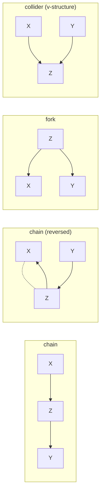

Pillar B5 assumes the causal DAG is given: an expert draws the arrows, and the
job is to estimate an effect along them. Causal discovery asks the prior
question. Given only a sample of the variables, with no arrows drawn, how much of
the graph can be read back out? The answer is partial and precise: observational
data pins down which variables are adjacent and which triples form a collider, but
leaves the direction of many remaining edges genuinely undetermined.

## What the data sees: the independence pattern

A structural causal model (B5) factorizes the joint distribution along a DAG
$G$ with vertices $V$. The only handle observational data offers on $G$ is the
set of conditional independencies it satisfies. Write $X \perp Y \mid Z$ to mean
$X$ is independent of $Y$ given the variable set $Z$. The **Markov assumption**
says every d-separation in $G$ (B5/d-separation) implies an independence in the
distribution $P$; **faithfulness** says the converse, that every independence in
$P$ comes from a d-separation in $G$, with no accidental cancellations<FN n="1" />.

Under both assumptions the observable footprint of $G$ is exactly its
d-separation relation. Two graphs that encode the same d-separations are
indistinguishable from any amount of observational data. This is the central
limitation of discovery, so it deserves a name.

> **Observational equivalence.** Two DAGs $G_1$ and $G_2$ are *observationally
> equivalent* (Markov equivalent) if they entail exactly the same set of
> conditional independencies. No test on i.i.d. samples from $P$ can tell them
> apart.

## The three-variable case

The smallest interesting case is three variables connected as a path. There are
four ways to direct a path $X - Z - Y$:



The chain $X \to Z \to Y$, its reverse $X \leftarrow Z \leftarrow Y$, and the
fork $X \leftarrow Z \to Y$ all entail the same single independence
$X \perp Y \mid Z$: conditioning on the middle variable $Z$ blocks the path. The
collider $X \to Z \leftarrow Y$ entails the opposite pattern, $X \perp Y$
marginally but $X \not\perp Y \mid Z$, because conditioning on a collider
*opens* the path.

So the three non-collider orientations are mutually indistinguishable, while the
collider stands alone. The data can detect that $Z$ is or is not a collider on
this triple, but among the non-collider directions it cannot choose.

## Markov equivalence: the Verma-Pearl characterization

The three-variable case generalizes exactly. Two DAGs are Markov equivalent if
and only if they share two structural features<FN n="2" />:

1. the same **skeleton**: the undirected graph obtained by dropping all arrowheads
   (the same adjacencies); and
2. the same **v-structures** (immoralities): triples $X \to Z \leftarrow Y$
   where $X$ and $Y$ are *not* adjacent.

The non-adjacency clause matters. If $X$ and $Y$ were adjacent, the triple would
not constrain any independence, so it imposes no testable signature. A genuine
v-structure is the one configuration whose two arrowheads the data can verify,
through the marginal-independent-but-conditionally-dependent pattern above.

**Step 1.** Suppose $G_1$ and $G_2$ have the same skeleton and same
v-structures. Two graphs with the same skeleton and same v-structures have the
same d-separations (the d-separation status of any path depends only on which of
its triples are colliders and which are not, and both are fixed by these two
features). Equal d-separations means equal entailed independencies, so the graphs
are Markov equivalent.

**Step 2.** Conversely, if two DAGs are Markov equivalent they must share a
skeleton: an edge between $X$ and $Y$ exists exactly when no set $Z$ makes
$X \perp Y \mid Z$, a purely independence-level fact. They must also share
v-structures, since an unshielded collider at $Z$ is the unique pattern that
makes $X \not\perp Y \mid Z$ while $X \perp Y \mid (Z \setminus \{Z\})$ holds for
some separating set excluding $Z$. Differing on either feature would produce a
detectable independence difference.

The class of all DAGs sharing one skeleton and v-structure set is the **Markov
equivalence class** (MEC). Discovery from observational data can, at best, return
the MEC, never a single DAG inside it.

## Summarizing a class: the CPDAG

A MEC is awkward to report as a list of DAGs; the class can be exponentially
large. The compact summary is a single mixed graph that keeps an arrowhead only
where every DAG in the class agrees.

> **CPDAG (essential graph).** The *completed partially directed acyclic graph*
> of a MEC has the shared skeleton, a *directed* edge $X \to Y$ wherever every
> DAG in the class orients it $X \to Y$ (a **compelled** edge), and an
> *undirected* edge $X - Y$ wherever some member orients it each way (a
> **reversible** edge).

A directed edge in the CPDAG is a causal direction the data has settled. An
undirected edge marks a genuine ambiguity: both directions are consistent with
every independence the sample can exhibit. The v-structure arrowheads are always
compelled; further edges become compelled only through the propagation rules of
the next lesson, which forbid creating a new cycle or a new v-structure.

## How undetermined is the orientation?

The fraction of edges left undirected is not small. The figure samples random
DAGs over a fixed variable order at several edge densities and counts the
**covered** edges, those whose reversal keeps the skeleton and v-structures of
that DAG unchanged. An edge $X \to Y$ is covered exactly when $X$ and $Y$ have
the same other parents, so reversing it creates no new immorality. A covered edge
is locally free to flip; whether it is finally left undirected in the CPDAG also
depends on whether the orientation rules compel it from elsewhere, so this count
is an intuition for the ambiguity, not the exact CPDAG undirected-edge fraction.
Sparse graphs leave a large fraction of edges flippable; even dense graphs leave
a noticeable share.


A concrete reading: at edge probability $p = 0.3$ over eight variables, roughly a
quarter of the edges are covered, the kind of local ambiguity a CPDAG records as
"direction unknown". Background knowledge or interventional data is what closes
that gap.

## A worked check

The cleanest numerical confirmation is the collider asymmetry that drives the
whole theory. Simulate a chain and a collider on the same three variables and read
off which conditioning set breaks the $X$-$Y$ dependence.

```python
import numpy as np

rng = np.random.default_rng(0)
n = 20000

def partial_corr(a, b, c):
    # correlation of a and b after regressing each on [1, c]
    Z = np.column_stack([np.ones(n), c])
    ra = a - Z @ np.linalg.lstsq(Z, a, rcond=None)[0]
    rb = b - Z @ np.linalg.lstsq(Z, b, rcond=None)[0]
    return np.corrcoef(ra, rb)[0, 1]

# Chain X -> Z -> Y: conditioning on Z should kill the X-Y dependence
x = rng.normal(0, 1, n)
z = x + rng.normal(0, 1, n)
y = z + rng.normal(0, 1, n)
print("chain  rho(X,Y)      =", round(np.corrcoef(x, y)[0, 1], 3))
print("chain  rho(X,Y | Z)  =", round(partial_corr(x, y, z), 3))

# Collider X -> Z <- Y: conditioning on Z should CREATE dependence
x2 = rng.normal(0, 1, n)
y2 = rng.normal(0, 1, n)
z2 = x2 + y2
print("colli  rho(X,Y)      =", round(np.corrcoef(x2, y2)[0, 1], 3))
print("colli  rho(X,Y | Z)  =", round(partial_corr(x2, y2, z2), 3))

# the data distinguishes collider from non-collider, not the chain's direction
assert abs(partial_corr(x, y, z)) < 0.05            # chain: blocked by Z
assert abs(partial_corr(x2, y2, z2)) > 0.3          # collider: opened by Z
```

The chain's $X$-$Y$ dependence vanishes once $Z$ is held fixed, while the
collider's appears only once $Z$ is held fixed. That single sign flip is the one
direction-level fact observational data exposes; the chain's own arrow direction
is not in the output.

## Exercises

**Exercise 1.** List every DAG on three variables $\{X, Z, Y\}$ with skeleton
$X - Z - Y$ (so $X$ and $Y$ are not adjacent). Group them into Markov equivalence
classes and give the CPDAG of each class.

<details>
<summary>Solution</summary>

**Step 1.** With the path skeleton there are four orientations: chain
$X \to Z \to Y$, reverse chain $X \leftarrow Z \leftarrow Y$, fork
$X \leftarrow Z \to Y$, and collider $X \to Z \leftarrow Y$.

**Step 2.** The first three have no v-structure (the only candidate triple is
$X, Z, Y$, and $Z$ is not a collider in any of them), so they share skeleton and
(empty) v-structure set: one MEC of size 3. The collider has the unique
v-structure $X \to Z \leftarrow Y$, so it is alone: one MEC of size 1.

**Step 3.** The class of three has both edges reversible, so its CPDAG is the
undirected path $X - Z - Y$. The collider's CPDAG keeps both arrowheads:
$X \to Z \leftarrow Y$.

</details>

**Exercise 2.** Show that an edge $X \to Y$ in a DAG can be reversed to
$X \leftarrow Y$ without changing the Markov equivalence class if and only if $X$
and $Y$ have the same parents apart from each other, that is
$\mathrm{pa}(X) = \mathrm{pa}(Y) \setminus \{X\}$. (Such an edge is called
*covered*.)

<details>
<summary>Solution</summary>

**Step 1.** Reversing $X \to Y$ never changes the skeleton (the same pair stays
adjacent), so equivalence hinges on v-structures.

**Step 2.** A v-structure involving this edge is a triple $W \to Y \leftarrow X$
with $W$ a parent of $Y$ not adjacent to $X$, or after reversal
$W' \to X \leftarrow Y$ with $W'$ a parent of $X$ not adjacent to $Y$. The set of
v-structures is preserved exactly when every parent of $Y$ other than $X$ is also
a parent of $X$, and every parent of $X$ is also a parent of $Y$. Together these
say $\mathrm{pa}(X) = \mathrm{pa}(Y) \setminus \{X\}$.

**Step 3.** When the parent sets match this way, reversal creates no new
immorality and destroys none, and (since the shared parents already point into
both endpoints) introduces no cycle, so the new graph is a DAG in the same MEC.
When they differ, the reversal adds or removes a v-structure, changing the class.

</details>

**Exercise 3 (code).** Two DAGs on four variables have the same skeleton. DAG A
is the chain $1 \to 2 \to 3 \to 4$; DAG B is $1 \to 2 \leftarrow 3 \to 4$.
Write a numpy check that recovers each graph's skeleton and v-structure set from
its adjacency matrix, and assert the two are *not* Markov equivalent.

<details>
<summary>Solution</summary>

```python
import numpy as np

# adjacency[i, j] = 1 means i -> j
A = np.array([[0,1,0,0],[0,0,1,0],[0,0,0,1],[0,0,0,0]])  # 1->2->3->4
B = np.array([[0,1,0,0],[0,0,0,0],[0,1,0,1],[0,0,0,0]])  # 1->2<-3->4

def skeleton(G):
    U = (G + G.T) > 0          # undirected adjacency
    return U.astype(int)

def vstructures(G):
    d = G.shape[0]
    U = skeleton(G)
    vs = set()
    for z in range(d):
        parents = [p for p in range(d) if G[p, z]]
        for i in range(len(parents)):
            for j in range(i + 1, len(parents)):
                a, b = parents[i], parents[j]
                if not U[a, b]:                  # a, b non-adjacent => collider
                    vs.add((min(a, b), z, max(a, b)))
    return vs

same_skel = np.array_equal(skeleton(A), skeleton(B))
print("same skeleton:", same_skel)
print("v-structures A:", vstructures(A))
print("v-structures B:", vstructures(B))

# same skeleton (path 1-2-3-4) but B has the v-structure (0,1,2); A has none
assert same_skel
assert vstructures(A) != vstructures(B)
assert (0, 1, 2) in vstructures(B)
```

Both graphs share the skeleton $1-2-3-4$, but B carries the immorality
$1 \to 2 \leftarrow 3$ that A lacks, so they sit in different equivalence classes.

</details>

The next lesson turns this characterization into an algorithm: the PC algorithm
recovers the skeleton by conditional-independence testing, then orients the
v-structures and propagates the forced consequences into a CPDAG.

<Footnotes>
  <FNItem n="1">**Spirtes, P., Glymour, C., & Scheines, R.** (2000). *Causation, Prediction, and Search*, 2nd ed. MIT Press. The Markov and faithfulness conditions and the foundations of constraint-based discovery. [doi:10.7551/mitpress/1754.001.0001](https://doi.org/10.7551/mitpress/1754.001.0001)</FNItem>
  <FNItem n="2">**Verma, T., & Pearl, J.** (1990). "Equivalence and synthesis of causal models". *Proceedings of the 6th Conference on Uncertainty in Artificial Intelligence (UAI)*, 255-270. The same-skeleton-and-v-structures characterization of Markov equivalence. [arXiv:1304.1108](https://arxiv.org/abs/1304.1108)</FNItem>
</Footnotes>
