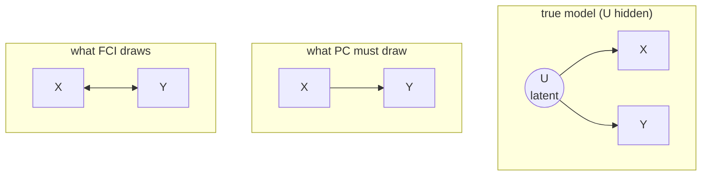

The PC algorithm assumes **causal sufficiency**: every common cause of two
measured variables is itself measured. That assumption is rarely safe. If a hidden
variable drives two observed ones, PC sees their dependence and draws a direct
edge between them that does not exist. The Fast Causal Inference (FCI) algorithm
drops causal sufficiency and returns a richer object, a partial ancestral graph,
that can express "these two are associated through an unobserved common cause"
rather than forcing a direct edge<FN ns="1, 3" />.

## How causal sufficiency fails

Suppose the true model is $X \leftarrow U \to Y$ with $U$ unobserved, and $X, Y$
are the only measured variables. The data show $X \not\perp Y$ with no
conditioning set available to separate them (the one separator, $U$, is hidden).
PC, assuming sufficiency, can only explain an inseparable pair by a direct edge,
so it reports $X \to Y$ or $X \leftarrow Y$, both wrong. The marginal dependence is
real; the direct causal arrow is an artifact of the missing variable.



## Marks on an edge

FCI edges carry a mark at each end, and the mark encodes what is known about
ancestry. Three marks appear:

- an **arrowhead** ($>$) at the $Y$ end of $X \mathbin{*}\!\!\to Y$ means $Y$ is
  **not** an ancestor of $X$ (no directed path $Y \to \cdots \to X$);
- a **tail** ($-$) at the $X$ end of $X \to Y$ means $X$ **is** an ancestor of $Y$;
- a **circle** ($\circ$) means the mark is undetermined: the data leave open
  whether that endpoint is an ancestor.

Combining the two endpoint marks gives the edge types FCI can output:

| Edge | Reading |
|---|---|
| $X \to Y$ | $X$ causes $Y$ (ancestor), and $Y$ does not cause $X$ |
| $X \leftrightarrow Y$ | a latent common cause of $X$ and $Y$; neither is the other's ancestor |
| $X \mathbin{\circ}\!\!\to Y$ | $Y$ is not an ancestor of $X$; the $X$ end is unresolved |
| $X \mathbin{\circ}\!\!-\!\!\mathbin{\circ} Y$ | both endpoints unresolved |

The **bidirected** edge $X \leftrightarrow Y$ is the new vocabulary: it states that
the association between $X$ and $Y$ runs through an unobserved common cause, with
no direct effect in either direction. PC has no way to write this; FCI does.

## The partial ancestral graph

The object FCI returns is a **partial ancestral graph** (PAG), the analogue of the
CPDAG once latents are allowed. A PAG represents an entire equivalence class of
causal structures, now including DAGs with hidden variables (and, in the general
version, selection variables that have been conditioned on). Every member of the
class agrees on the marks the PAG shows; a circle marks where members disagree.

> **PAG.** A partial ancestral graph over the observed variables has, on each
> edge, two marks from $\{\text{arrowhead}, \text{tail}, \text{circle}\}$. A tail
> or arrowhead is *invariant*: every causal structure (with possible latents)
> consistent with the data has that ancestry. A circle marks an endpoint left
> undetermined by the data.

FCI builds the PAG in the PC spirit. It first recovers an adjacency skeleton by
conditional-independence testing, but allows separating sets drawn from a larger
pool (the "Possible-D-SEP" sets) so that a pair confounded by a latent is not
forced adjacent. It then orients v-structures and applies an extended set of
orientation rules, the FCI rules, which propagate arrowheads and tails under the
weaker assumptions<FN n="2" />. Where PC's Meek rules forbade new colliders and cycles, the
FCI rules additionally respect that an unresolved endpoint may hide a latent
common cause.

## Reading a bidirected edge

The bidirected edge is the whole point, so it is worth stating its meaning
precisely. $X \leftrightarrow Y$ asserts two things at once: $X$ is not an ancestor
of $Y$ (arrowhead at $Y$), and $Y$ is not an ancestor of $X$ (arrowhead at $X$).
If neither causes the other yet they are dependent and cannot be separated, the
only remaining explanation under the model is a common cause that was never
measured. The arrowheads are the data's way of ruling out both direct directions.

A worked separation check makes the confounded case concrete. With a latent $U$
driving both $X$ and $Y$, the pair is dependent and **no** observed variable
separates them, the signature FCI reads as a bidirected edge rather than a direct
arrow.

```python
import numpy as np

rng = np.random.default_rng(0)
n = 20000

# true model: U is a hidden common cause of X and Y; Z is an observed variable
# that does NOT separate X and Y (it sits off the confounding path)
U = rng.normal(0, 1, n)               # latent
X = U + rng.normal(0, 1, n)
Y = U + rng.normal(0, 1, n)
Z = rng.normal(0, 1, n)               # unrelated observed variable

def pcorr(a, b, C):
    if C is None:
        return np.corrcoef(a, b)[0, 1]
    M = np.column_stack([np.ones(n), C])
    ra = a - M @ np.linalg.lstsq(M, a, rcond=None)[0]
    rb = b - M @ np.linalg.lstsq(M, b, rcond=None)[0]
    return np.corrcoef(ra, rb)[0, 1]

print("rho(X, Y)        =", round(pcorr(X, Y, None), 3))
print("rho(X, Y | Z)    =", round(pcorr(X, Y, Z), 3))

# X and Y are dependent and no OBSERVED set separates them: with U hidden, the
# only model-consistent explanation is a latent common cause -> bidirected edge
assert abs(pcorr(X, Y, None)) > 0.3       # marginally dependent
assert abs(pcorr(X, Y, Z)) > 0.3          # still dependent given the observed Z
print("no observed separator -> FCI draws X <-> Y")
```

The pair stays dependent both marginally and after conditioning on the only other
observed variable. Because no observed set blocks the association, FCI cannot
attribute it to a direct edge under the latent-allowing model; it draws
$X \leftrightarrow Y$, correctly signaling an unmeasured common cause instead of a
phantom direct effect.

## Exercises

**Exercise 1.** A study measures $X$ and $Y$, finds them dependent, and finds no
observed variable that separates them. Under causal sufficiency (PC) versus
without it (FCI), what does each algorithm conclude, and which is the safer claim?

<details>
<summary>Solution</summary>

**Step 1.** PC assumes every common cause is observed. An inseparable dependent
pair, under that assumption, can only be a direct edge, so PC orients $X - Y$ as a
direct causal link (left undirected if the v-structure rules do not fix it).

**Step 2.** FCI does not assume sufficiency. It allows a hidden common cause, so an
inseparable pair with arrowheads at both ends is reported as $X \leftrightarrow Y$:
association through a latent, with neither variable an ancestor of the other.

**Step 3.** FCI's claim is safer: it does not assert a direct effect the data
cannot justify. PC's direct edge is only correct if no latent confounder exists,
which the data alone cannot guarantee.

</details>

**Exercise 2.** Explain why an arrowhead in a PAG is a stronger statement than a
directed edge in a CPDAG, in terms of what each rules out.

<details>
<summary>Solution</summary>

**Step 1.** In a CPDAG, a directed edge $X \to Y$ means: among the DAGs in the
(causally sufficient) equivalence class, all orient this edge $X \to Y$. It is a
statement about edge direction within a no-latent model.

**Step 2.** In a PAG, an arrowhead at $Y$ on $X \mathbin{*}\!\!\to Y$ means $Y$ is
not an ancestor of $X$ across *all* structures consistent with the data, including
those with arbitrary latent confounders and selection variables. It rules out
$Y \to \cdots \to X$ in a far larger model class.

**Step 3.** So the PAG arrowhead is invariant under a weaker, more permissive set
of assumptions, which makes it the stronger and more robust claim about ancestry.

</details>

**Exercise 3.** The true model is $X \to M \leftarrow Y$ with an additional latent
$U$ such that $U \to X$ and $U \to Y$. List the marginal and conditional
(in)dependencies among the observed $\{X, M, Y\}$, and argue what edge FCI places
between $X$ and $Y$.

<details>
<summary>Solution</summary>

**Step 1.** $M$ is a collider on the path $X \to M \leftarrow Y$, so marginally
the collider path is blocked. But $U$ opens a back-door path $X \leftarrow U \to Y$,
making $X \not\perp Y$ marginally.

**Step 2.** Conditioning on $M$ (the collider) opens the collider path, keeping
$X \not\perp Y \mid M$. Conditioning on nothing observed removes the $U$ path,
since $U$ is unmeasured. So no observed set separates $X$ and $Y$: they are
dependent under every available conditioning set.

**Step 3.** With no observed separator and no evidence that either is the other's
ancestor (the dependence is carried by the latent $U$, not a direct effect), FCI
places a bidirected edge $X \leftrightarrow Y$, recording the unmeasured common
cause $U$.

</details>

This closes M1: from "the data only identifies an equivalence class" through
constraint-, score-, and function-based discovery to the latent-aware PAG. M2
takes the discovered or assumed graph as given and turns to estimating
*heterogeneous* treatment effects, the CATE as a function of covariates.

<Footnotes>
  <FNItem n="1">**Spirtes, P., Glymour, C., & Scheines, R.** (2000). *Causation, Prediction, and Search*, 2nd ed. MIT Press, Ch. 6. The FCI algorithm, partial ancestral graphs, and discovery without causal sufficiency. [doi:10.7551/mitpress/1754.001.0001](https://doi.org/10.7551/mitpress/1754.001.0001)</FNItem>
  <FNItem n="2">**Zhang, J.** (2008). "On the completeness of orientation rules for causal discovery in the presence of latent confounders and selection bias". *Artificial Intelligence*, 172(16-17), 1873-1896. The complete FCI orientation rules and PAG semantics. [doi:10.1016/j.artint.2008.08.001](https://doi.org/10.1016/j.artint.2008.08.001)</FNItem>
  <FNItem n="3">**Glymour, C., Zhang, K., & Spirtes, P.** (2019). "Review of causal discovery methods based on graphical models". *Frontiers in Genetics*, 10, 524. Survey placing PC, GES, LiNGAM, and FCI in one framework. [doi:10.3389/fgene.2019.00524](https://doi.org/10.3389/fgene.2019.00524)</FNItem>
</Footnotes>
