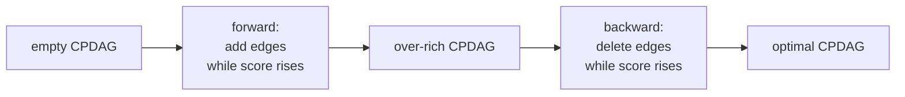

The PC algorithm asks a sequence of yes/no independence questions and pieces the
answers together. Score-based discovery takes the opposite stance: assign every
candidate graph a single number measuring how well it explains the data, then
search for the highest-scoring graph. Greedy Equivalence Search (GES) is the
canonical score-based method, and it searches not over DAGs but over their
equivalence classes, the CPDAGs of the previous lessons<FN n="1" />.

## A score for a graph

The score must reward fit and penalize complexity, or the fully connected graph
(which can fit any sample) always wins. The Bayesian Information Criterion (BIC)
does both. For a DAG $G$ with parameters $\hat\theta$ fit by maximum likelihood on
$n$ samples, define

$$
\mathrm{BIC}(G) = \log P(\text{data} \mid G, \hat\theta) - \frac{\log n}{2}\, |G|,
$$

where $\log P(\text{data} \mid G, \hat\theta)$ is the maximized log-likelihood
and $|G|$ is the number of free parameters (one per edge weight plus the noise
variances). The first term grows as $G$ explains more variance; the second is a
fixed cost of $\tfrac{1}{2}\log n$ per parameter. Higher BIC is better.

## Decomposability

The property that makes search feasible is that the score is a sum of local
terms, one per variable. For a Gaussian or multinomial model the log-likelihood
factorizes along the graph, so

$$
\mathrm{BIC}(G) = \sum_{j=1}^{d} \mathrm{score}(X_j \mid \mathrm{pa}_G(X_j)),
$$

where $\mathrm{pa}_G(X_j)$ is the parent set of $X_j$ in $G$ and each local term
is the regression log-likelihood of $X_j$ on its parents minus its parameter
penalty. **Decomposability** means a single edge change, adding or removing one
arrow into $X_j$, alters only the term for $X_j$. Evaluating a neighbor of the
current graph then costs one local regression, not a full re-fit, which is what
keeps the greedy search affordable.

## Score equivalence and consistency

Two more properties matter. A score is **score-equivalent** if every DAG in one
Markov equivalence class receives the same score. Gaussian and multinomial BIC are
score-equivalent, because equivalent DAGs imply the same likelihood and the same
parameter count. This is why GES can search over CPDAGs: every member of a class
has one shared score, so the class is the natural unit.

A score is **consistent** if, as $n \to \infty$, it ranks the data-generating
equivalence class strictly above every other. BIC is consistent: an extra edge
that explains no real dependence raises the log-likelihood by an amount that is
$O_p(1)$, while the penalty $\tfrac{1}{2}\log n$ per parameter grows without
bound, so spurious edges are eventually rejected. The figure shows this tradeoff
on a four-variable chain: adding the three true edges lifts the log-likelihood
sharply, a fourth spurious edge barely moves it, and BIC (fit minus penalty)
peaks exactly at the true edge set.


## The GES search

GES walks the space of CPDAGs in two phases, forward then backward.

> **Forward phase.** Start from the empty graph. Repeatedly consider every single
> edge addition that yields a valid CPDAG; apply the one that increases the score
> the most. Stop when no addition improves the score.
>
> **Backward phase.** From the forward optimum, repeatedly consider every single
> edge deletion; apply the one that increases the score the most. Stop when no
> deletion improves the score.

The two phases are not symmetric padding. The forward phase tends to overshoot,
adding edges that capture true dependence but also a few that are artifacts of the
greedy order; the backward phase removes exactly those. Chickering proved that
with a consistent, score-equivalent, decomposable score and these two phases, GES
returns the true equivalence class in the large-sample limit<FN n="2" />.



The moves are defined on CPDAGs through *insert* and *delete* operators that name
an edge plus a subset of common neighbors; each operator maps one CPDAG to a
neighboring one and changes the score by a single local term, preserving
decomposability across the equivalence-class search.

## A worked scoring pass

The core operation is the local BIC term. The following computes it for a Gaussian
model and verifies that, on a chain, adding the true parent strictly raises the
local score while adding a spurious extra parent lowers it once the penalty is
counted.

```python
import numpy as np

rng = np.random.default_rng(0)
n = 2000
X0 = rng.normal(0, 1, n)
X1 = X0 + rng.normal(0, 1, n)          # X1's true parent is X0
X2 = X1 + rng.normal(0, 1, n)          # X2's true parent is X1, not X0
data = np.column_stack([X0, X1, X2])

def local_bic(target, parents):
    y = data[:, target]
    if parents:
        Z = np.column_stack([np.ones(n)] + [data[:, p] for p in parents])
    else:
        Z = np.ones((n, 1))
    resid = y - Z @ np.linalg.lstsq(Z, y, rcond=None)[0]
    sigma2 = max((resid @ resid) / n, 1e-12)
    loglik = -0.5 * n * (np.log(2 * np.pi * sigma2) + 1)
    k = len(parents) + 1               # slopes + noise variance
    return loglik - 0.5 * np.log(n) * k

# scoring X1: empty vs true parent {X0}
s_empty = local_bic(1, [])
s_true  = local_bic(1, [0])
# scoring X2: true parent {X1} vs adding the spurious extra parent X0
s_one   = local_bic(2, [1])
s_two   = local_bic(2, [1, 0])

print(f"X1 | {{}}     {s_empty:9.1f}")
print(f"X1 | {{X0}}   {s_true:9.1f}   (true edge)")
print(f"X2 | {{X1}}   {s_one:9.1f}")
print(f"X2 | {{X1,X0}}{s_two:9.1f}   (spurious extra parent)")

assert s_true > s_empty          # the real edge X0 -> X1 improves the score
assert s_one  > s_two            # the spurious edge X0 -> X2 is penalized away
```

The true edge $X_0 \to X_1$ raises $X_1$'s local score; the spurious edge
$X_0 \to X_2$ (redundant given $X_1$) explains almost no extra variance and so
loses to the penalty. A greedy search comparing these local deltas adds the first
and rejects the second.

## Exercises

**Exercise 1.** Show that for a Gaussian model the local BIC term for regressing
$X_j$ on parents $\mathrm{pa}(X_j)$ can be written
$-\tfrac{n}{2}\log\hat\sigma_j^2 + \text{const} - \tfrac{1}{2}\log n \cdot k_j$,
where $\hat\sigma_j^2$ is the residual variance and $k_j$ the parameter count.
Then argue that adding a parent that reduces $\hat\sigma_j^2$ by a vanishing
fraction is rejected as $n \to \infty$.

<details>
<summary>Solution</summary>

**Step 1.** The maximized Gaussian log-likelihood of the residuals is
$-\tfrac{n}{2}\log(2\pi\hat\sigma_j^2) - \tfrac{n}{2}$, since at the MLE the
exponent sum equals $n/2$. Collecting the $n$-constants gives
$-\tfrac{n}{2}\log\hat\sigma_j^2 + \text{const}$. Subtracting the penalty
$\tfrac{1}{2}\log n \cdot k_j$ yields the stated form.

**Step 2.** Adding one parent changes the score by
$-\tfrac{n}{2}(\log\hat\sigma_{\text{new}}^2 - \log\hat\sigma_{\text{old}}^2) - \tfrac{1}{2}\log n$.
If the new parent explains no real dependence, the variance
ratio satisfies $\hat\sigma_{\text{new}}^2 / \hat\sigma_{\text{old}}^2 = 1 - O_p(1/n)$,
so the first term is $O_p(1)$ while the penalty grows like
$\tfrac{1}{2}\log n \to \infty$. The change is eventually negative, so the edge is
rejected. This is the consistency of BIC.

</details>

**Exercise 2.** Explain why GES can search over CPDAGs rather than DAGs, and why
that is an advantage. Use the score-equivalence property in your answer.

<details>
<summary>Solution</summary>

**Step 1.** Score equivalence means every DAG within one Markov equivalence class
gets the same BIC. So the score is a function of the *class*, not of any
particular member, and a CPDAG (which names exactly one class) is the right object
to score.

**Step 2.** The advantage is twofold. First, the search space collapses: many
DAGs map to one CPDAG, so GES never wastes moves distinguishing graphs the data
cannot distinguish. Second, the target of discovery is the equivalence class
anyway (the previous lessons), so returning a CPDAG matches what is identifiable
without any post-processing. The insert/delete operators move between neighboring
classes while keeping the score decomposable.

</details>

**Exercise 3 (code).** Implement a one-step greedy forward decision for a single
target. Given $X_2$ generated from $X_1$ (with $X_0$ an unrelated extra), compute
the local-BIC gain of adding each candidate parent to the empty set and assert the
greedy choice is $X_1$, not $X_0$.

<details>
<summary>Solution</summary>

```python
import numpy as np

rng = np.random.default_rng(1)
n = 3000
X0 = rng.normal(0, 1, n)               # unrelated to the target
X1 = rng.normal(0, 1, n)
X2 = 1.5 * X1 + rng.normal(0, 1, n)    # true parent is X1
data = np.column_stack([X0, X1, X2])

def local_bic(target, parents):
    y = data[:, target]
    Z = np.column_stack([np.ones(n)] + [data[:, p] for p in parents]) if parents else np.ones((n, 1))
    resid = y - Z @ np.linalg.lstsq(Z, y, rcond=None)[0]
    sigma2 = max((resid @ resid) / n, 1e-12)
    loglik = -0.5 * n * (np.log(2 * np.pi * sigma2) + 1)
    return loglik - 0.5 * np.log(n) * (len(parents) + 1)

base = local_bic(2, [])
gain0 = local_bic(2, [0]) - base       # adding X0
gain1 = local_bic(2, [1]) - base       # adding X1
print(f"gain from X0: {gain0:8.2f}")
print(f"gain from X1: {gain1:8.2f}")

# greedy adds the single edge with the largest positive score gain
assert gain1 > gain0
assert gain1 > 0 and gain0 < 0         # X1 helps, X0 is rejected
```

Adding $X_1$ produces a large positive gain (it is the real parent), while adding
the unrelated $X_0$ produces a negative gain once the penalty is paid. The greedy
forward step picks $X_1$.

</details>

The next lesson attacks the orientations that score- and constraint-based methods
both leave undirected: functional models exploit non-Gaussianity and nonlinearity
to choose a direction inside the equivalence class.

<Footnotes>
  <FNItem n="1">**Chickering, D. M.** (2002). "Optimal structure identification with greedy search". *Journal of Machine Learning Research*, 3, 507-554. Defines GES and proves its large-sample optimality over equivalence classes. [doi:10.1162/153244303321897717](https://doi.org/10.1162/153244303321897717)</FNItem>
  <FNItem n="2">**Schwarz, G.** (1978). "Estimating the dimension of a model". *The Annals of Statistics*, 6(2), 461-464. The Bayesian Information Criterion and its consistency. [doi:10.1214/aos/1176344136](https://doi.org/10.1214/aos/1176344136)</FNItem>
</Footnotes>
