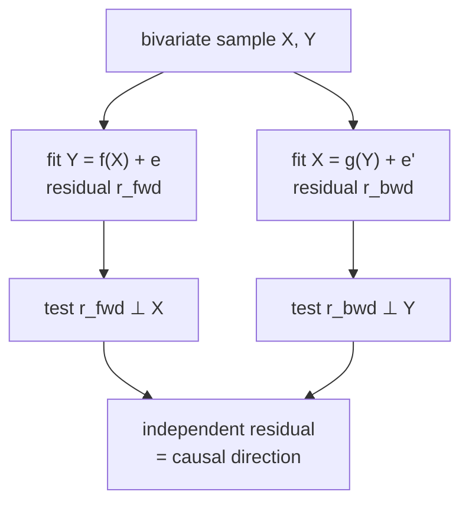

Constraint- and score-based discovery both stop at the CPDAG: a chain
$X \to Y$ and its reverse $Y \to X$ are indistinguishable to either. They are
indistinguishable because both methods use only the independence structure, which
is symmetric for two variables with no third to condition on. Functional models
break the tie by restricting the *form* of the structural equations. Once the
noise is non-Gaussian, or the mechanism is nonlinear, the causal direction leaves
a statistical signature the reverse direction cannot fake<FN n="1" />.

## Why two Gaussians are symmetric

Take the linear model $Y = bX + \varepsilon$ with $X$ and $\varepsilon$
independent. If both $X$ and $\varepsilon$ are Gaussian, then $(X, Y)$ is jointly
Gaussian, and a jointly Gaussian pair can be written equally as $Y = bX +
\varepsilon$ or as $X = b'Y + \varepsilon'$ with $\varepsilon' \perp Y$. Both
factorizations have independent noise, so nothing distinguishes them. Gaussianity
is the special case that hides the direction; everything below exploits departures
from it.

## LiNGAM: the linear non-Gaussian acyclic model

LiNGAM assumes the data follow a linear structural model whose noise terms are
mutually independent and **non-Gaussian** (at most one may be Gaussian). Stacking
the $d$ variables into a vector $x$,

$$
x = B x + e,
$$

where $B$ is a strictly lower-triangular matrix under some unknown causal
ordering (the acyclicity assumption) and $e$ is a vector of independent
non-Gaussian noises. Solving for $x$ gives the reduced form

$$
x = (I - B)^{-1} e = A e, \qquad A = (I - B)^{-1}.
$$

This is exactly the model of **independent component analysis** (ICA): an observed
mixture $x$ is a linear map $A$ applied to independent sources $e$. The key ICA
theorem says that when the sources are non-Gaussian and independent, the mixing
matrix $A$ is identifiable up to permutation and scaling of its columns<FN n="2" />.

**Step 1.** Run ICA on $x$ to recover $W = A^{-1}$ up to row permutation and
scaling. ICA succeeds because non-Gaussian independent sources have a unique
unmixing (Gaussian sources do not, which is why at most one Gaussian noise is
allowed).

**Step 2.** Resolve the permutation. The true $W = I - B$ has all-nonzero
diagonal entries (each variable depends on its own noise), so permute $W$'s rows
to make the diagonal free of zeros; that permutation aligns each estimated source
with its variable.

**Step 3.** Resolve the scaling by dividing each row of $W$ by its diagonal
entry, giving a matrix with unit diagonal. Then $B = I - W_{\text{scaled}}$.

**Step 4.** Recover the causal order. The true $B$ is permutable to strict lower
triangularity; find the permutation that makes $B$ lower-triangular (zeros on and
above the diagonal). That order is the topological order of the DAG, and the
nonzero entries of $B$ are its directed edges with weights.

Unlike a CPDAG, the output is a single fully directed DAG. The non-Gaussianity
supplied the orientation that the independence structure alone could not.

## Additive noise models: the nonlinear route

When the relationship is nonlinear, even Gaussian noise can orient an edge. The
**additive noise model** (ANM) for a pair writes

$$
Y = f(X) + \varepsilon, \qquad \varepsilon \perp X,
$$

with $f$ an arbitrary (typically nonlinear) function and noise independent of the
cause. The identifiability result: for generic nonlinear $f$ and generic noise
distributions, there is **no** function $g$ and noise $\tilde\varepsilon \perp Y$
with $X = g(Y) + \tilde\varepsilon$. The forward model admits independent
residuals; the reverse model does not<FN n="3" />.

This gives a direct test. Fit $Y$ on $X$, take the residual
$r = Y - \hat f(X)$, and test whether $r \perp X$. Fit $X$ on $Y$, take that
residual, and test independence with $Y$. The direction whose residual is
independent of its regressor is the causal direction.

The figure shows the asymmetry for $Y = X + \varepsilon$ with uniform (hence
non-Gaussian) $X$ and $\varepsilon$. Regressing $Y$ on $X$ leaves a residual with
no visible structure against $X$; regressing $X$ on $Y$ leaves a residual whose
spread varies with $Y$, the tell of a dependent residual and the wrong direction.




## A worked direction test

The following measures the asymmetry numerically. For a linear non-Gaussian pair,
the residual of the correct regression is independent of its regressor, while the
wrong direction's residual is not: its *spread* grows with the magnitude of the
regressor. A simple proxy for the independence test is therefore the correlation
between the absolute residual and the absolute regressor; the forward direction
drives it near zero.

```python
import numpy as np

rng = np.random.default_rng(0)
n = 4000
x = rng.uniform(-1, 1, n)              # non-Gaussian cause
y = x + rng.uniform(-0.4, 0.4, n)      # true model X -> Y, non-Gaussian noise

def residual(a, b):                    # residual of a regressed on [1, b]
    Z = np.column_stack([np.ones(n), b])
    return a - Z @ np.linalg.lstsq(Z, a, rcond=None)[0]

# dependence proxy: |corr(|residual|, |regressor|)| (0 if residual ⊥ regressor)
def dep_score(resid, regressor):
    return abs(np.corrcoef(np.abs(resid), np.abs(regressor))[0, 1])

r_fwd = residual(y, x)                 # forward: Y on X
r_bwd = residual(x, y)                 # backward: X on Y

dep_fwd = dep_score(r_fwd, x)
dep_bwd = dep_score(r_bwd, y)
print(f"forward  X -> Y  dependence {dep_fwd:.4f}")
print(f"backward Y -> X  dependence {dep_bwd:.4f}")

# the causal direction is the one with the more independent residual
assert dep_fwd < dep_bwd
print("chosen direction:", "X -> Y" if dep_fwd < dep_bwd else "Y -> X")
```

The forward residual scores far lower on the dependence proxy than the backward
residual, so the test selects $X \to Y$, the true direction. The same idea, with a
proper nonparametric independence test, is the engine of both LiNGAM (linear,
non-Gaussian) and the ANM (nonlinear, any noise).

## Exercises

**Exercise 1.** Explain precisely why the linear Gaussian pair
$Y = bX + \varepsilon$ ($\varepsilon \perp X$, both Gaussian) cannot be oriented by
the residual-independence test, while the same model with uniform noise can.

<details>
<summary>Solution</summary>

**Step 1.** For the Gaussian case, $(X, Y)$ is jointly Gaussian. The reverse
regression $X = b' Y + \varepsilon'$ with $b' = \mathrm{Cov}(X,Y)/\mathrm{Var}(Y)$
produces a residual $\varepsilon'$ that is uncorrelated with $Y$, and for jointly
Gaussian variables uncorrelated implies independent. So *both* directions yield
independent residuals; the test cannot choose.

**Step 2.** For uniform noise, $(X, Y)$ is not jointly Gaussian. The reverse
residual $\varepsilon'$ is uncorrelated with $Y$ by construction but not
independent of it (uncorrelated does not imply independent outside the Gaussian
world). The forward residual remains genuinely independent of $X$. So only the
forward direction passes the independence test, breaking the symmetry.

</details>

**Exercise 2.** In the LiNGAM reduced form $x = A e$ with $A = (I - B)^{-1}$,
show that the true unmixing $W = A^{-1}$ equals $I - B$ and therefore has a
nonzero diagonal. Explain how this fact resolves the row-permutation ambiguity
that ICA leaves.

<details>
<summary>Solution</summary>

**Step 1.** From $A = (I - B)^{-1}$, inverting gives $W = A^{-1} = I - B$. Since
$B$ is strictly lower triangular under the causal order, it has zero diagonal, so
$I - B$ has all-ones on the diagonal: every diagonal entry of $W$ is nonzero.

**Step 2.** ICA recovers $W$ only up to a row permutation $P$ and a diagonal
scaling. The correct $P$ is the one that makes every diagonal entry of $PW$
nonzero (each variable must load on its own noise source). Generically this
permutation is unique, so requiring a zero-free diagonal pins it down. Dividing
each row by its diagonal entry then removes the scaling and yields $I - B$,
from which $B$ and the edges follow.

</details>

**Exercise 3 (code).** Generate a three-variable linear non-Gaussian chain
$X_0 \to X_1 \to X_2$ with uniform noise. Without running full ICA, recover the
root of the chain by the DirectLiNGAM ordering idea: the **source** variable is
the most *exogenous* one. Test each candidate by regressing every other variable
on it and measuring how dependent the leftover residual still is on that
candidate; only for the true root is the residual genuinely independent (a
non-Gaussian signature). Assert the candidate with the lowest total dependence is
$X_0$.

<details>
<summary>Solution</summary>

```python
import numpy as np

rng = np.random.default_rng(0)
n = 5000
X0 = rng.uniform(-1, 1, n)
X1 = X0 + rng.uniform(-0.4, 0.4, n)
X2 = X1 + rng.uniform(-0.4, 0.4, n)
data = np.column_stack([X0, X1, X2])

# DirectLiNGAM root test: regress every other variable on the candidate and sum
# the leftover dependence (|corr(|residual|, |candidate|)|). The true root leaves
# independent residuals; a non-root leaves residuals whose spread tracks it.
def exo_dependence(cand):
    xc = data[:, cand]
    total = 0.0
    for o in range(3):
        if o == cand:
            continue
        b = np.cov(xc, data[:, o])[0, 1] / xc.var()   # slope of o on cand
        r = data[:, o] - b * xc                         # residual
        total += abs(np.corrcoef(np.abs(r), np.abs(xc))[0, 1])
    return total

scores = [exo_dependence(j) for j in range(3)]
print("exogeneity scores:", [round(s, 3) for s in scores])
root = int(np.argmin(scores))
print("recovered root:", root)

assert root == 0          # X0 is the source of the chain
```

The root $X_0$ scores lowest: regressing $X_1$ and $X_2$ on it leaves residuals
that are genuinely independent of $X_0$, so the absolute-value correlation is near
zero. A non-root such as $X_2$ is a *cause's effect*, so regressing the others on
it leaves residuals whose spread still tracks it, inflating the score. This
identifies the top of the causal order; peeling it off and recursing gives the
full LiNGAM ordering.

</details>

The next lesson keeps the goal of a single directed weighted graph but replaces the
discrete search entirely: NOTEARS casts structure learning as smooth continuous
optimization with a differentiable acyclicity constraint.

<Footnotes>
  <FNItem n="1">**Shimizu, S., Hoyer, P. O., Hyvärinen, A., & Kerminen, A.** (2006). "A linear non-Gaussian acyclic model for causal discovery". *Journal of Machine Learning Research*, 7, 2003-2030. The LiNGAM model and its ICA-based identification. [doi:10.5555/1248547.1248619](https://doi.org/10.5555/1248547.1248619)</FNItem>
  <FNItem n="2">**Comon, P.** (1994). "Independent component analysis, a new concept?". *Signal Processing*, 36(3), 287-314. Identifiability of the mixing matrix for non-Gaussian independent sources. [doi:10.1016/0165-1684(94)90029-9](https://doi.org/10.1016/0165-1684(94)90029-9)</FNItem>
  <FNItem n="3">**Hoyer, P. O., Janzing, D., Mooij, J. M., Peters, J., & Schölkopf, B.** (2009). "Nonlinear causal discovery with additive noise models". *Advances in Neural Information Processing Systems (NeurIPS) 21*, 689-696. Identifiability of cause and effect under nonlinear additive noise. [doi:10.5555/2981780.2981866](https://doi.org/10.5555/2981780.2981866)</FNItem>
</Footnotes>
