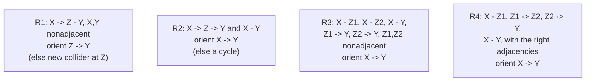

The previous lesson showed that observational data identifies a DAG only up to its
Markov equivalence class, summarized by a CPDAG. The PC algorithm (named for its
authors Peter Spirtes and Clark Glymour) is the canonical procedure that produces
that CPDAG from data, using nothing but a conditional-independence test as an
oracle<FN n="1" />. It runs in three phases: build the skeleton, orient the
v-structures, then propagate the forced edges.

## The independence oracle

The algorithm treats a conditional-independence test as a black box returning a
verdict on $X \perp Y \mid Z$ for a variable set $Z$. For jointly Gaussian data
the natural test is on the **partial correlation** $\rho_{XY \cdot Z}$, the
correlation of $X$ and $Y$ after regressing each on $Z$. Under the Gaussian
model, $\rho_{XY \cdot Z} = 0$ is equivalent to $X \perp Y \mid Z$, so the test
checks whether the sample partial correlation is statistically distinguishable
from zero using Fisher's z-transform.

The figure shows why conditioning is the whole game. For a chain
$X_1 \to X_2 \to X_3$, the marginal correlation $\rho(X_1, X_3)$ is large and
centered far from zero, while the partial correlation $\rho(X_1, X_3 \mid X_2)$ is
centered at zero. Conditioning on the right variable is what reveals the missing
edge.


## Phase 1: the skeleton

Start from the complete undirected graph on all $d$ variables: every pair
adjacent. An edge between $X$ and $Y$ should survive only if **no** conditioning
set renders them independent, since adjacency in the true DAG means no set
d-separates the pair. The algorithm removes edges by searching conditioning sets
of growing size.

> **Skeleton phase.** For separating-set size $k = 0, 1, 2, \dots$: for each
> adjacent pair $(X, Y)$, test $X \perp Y \mid Z$ over every $Z$ of size $k$ drawn
> from the current neighbors of $X$ (or of $Y$). If any such test passes, delete
> the edge $X - Y$ and record that $Z$ as the **separating set**
> $\mathrm{sepset}(X, Y)$. Stop when no vertex has more than $k$ remaining
> neighbors.

Two design points make this efficient. First, the conditioning sets are drawn
from the *current* neighbors, which shrink as edges are deleted, rather than from
all $d - 2$ other variables; this is what keeps PC tractable on sparse graphs.
Second, the increasing-$k$ order means the smallest separating set is found first,
which the orientation phase needs. The output is the correct skeleton (the right
adjacencies) together with one separating set per deleted edge.

## Phase 2: orient the v-structures

The skeleton has no arrows yet. The only arrowheads the data justifies are the
v-structures, and the separating sets recorded in phase 1 reveal exactly where
they are.

> **Collider rule.** For every unshielded triple $X - Z - Y$ (meaning $X - Z$ and
> $Z - Y$ are edges but $X - Y$ is not), orient it as the collider
> $X \to Z \leftarrow Y$ **if and only if** $Z \notin \mathrm{sepset}(X, Y)$.

The logic is the collider asymmetry from the previous lesson. If $X$ and $Y$ were
separated by a set that *excludes* $Z$, then $Z$ cannot be on the blocked path as
a chain or fork middle (those are blocked only by conditioning *on* $Z$), so $Z$
must be a collider. If instead $Z \in \mathrm{sepset}(X, Y)$, conditioning on $Z$
is what blocked the pair, so $Z$ is a non-collider and the triple stays
unoriented for now.

**Step 1.** Suppose $X - Z - Y$ is unshielded and $Z \notin \mathrm{sepset}(X,
Y)$. In the true DAG some set $S = \mathrm{sepset}(X, Y)$ d-separates $X$ and $Y$.
The path $X - Z - Y$ is one path between them, and $S$ blocks it. With
$Z \notin S$, the only way $S$ blocks this length-two path is by $Z$ being a
collider on it (an unconditioned collider blocks the path), giving
$X \to Z \leftarrow Y$.

**Step 2.** Suppose instead $Z \in S$. Then $S$ blocks the path $X - Z - Y$ by
conditioning on the non-collider $Z$ (a chain or fork middle). So $Z$ is not a
collider, and the triple must not be oriented as one.

## Phase 3: Meek's propagation rules

V-structures are not the only compelled edges. Once some arrowheads are placed,
others are forced by two constraints the final graph must satisfy: it must stay
acyclic, and it must introduce **no new v-structure** beyond those already found
(a new immorality would mean a different equivalence class). Meek's four rules
apply these constraints until nothing changes<FN n="2" />.



The two rules that carry most of the work:

- **Rule 1 (no new collider).** If $X \to Z$ is directed and $Z - Y$ is undirected
  with $X$ and $Y$ non-adjacent, orient $Z \to Y$. Orienting it the other way,
  $Y \to Z$, would make $X \to Z \leftarrow Y$ a new v-structure, which the data
  did not support.
- **Rule 2 (no cycle).** If $X \to Z \to Y$ is a directed path and $X - Y$ is
  undirected, orient $X \to Y$. The reverse $Y \to X$ would close the cycle
  $X \to Z \to Y \to X$.

Rules 3 and 4 handle the two remaining configurations where leaving an edge
undirected would, under every legal completion, force a cycle or a new collider.
Iterating all four to a fixed point yields the CPDAG: every still-undirected edge
is genuinely reversible.

## A worked skeleton phase

The skeleton phase is the part with real computation. The following runs phase 1
on a four-variable chain $X_0 \to X_1 \to X_2 \to X_3$ using a partial-correlation
threshold as the oracle, and recovers the correct adjacencies.

```python
import numpy as np

rng = np.random.default_rng(0)
n, d = 4000, 4

# true graph: chain X0 -> X1 -> X2 -> X3
X0 = rng.normal(0, 1, n)
X1 = X0 + rng.normal(0, 1, n)
X2 = X1 + rng.normal(0, 1, n)
X3 = X2 + rng.normal(0, 1, n)
data = np.column_stack([X0, X1, X2, X3])

def pcorr(i, j, K):
    # partial correlation of vars i, j given the columns in K
    a, b = data[:, i], data[:, j]
    if K:
        Z = np.column_stack([np.ones(n)] + [data[:, k] for k in K])
        a = a - Z @ np.linalg.lstsq(Z, a, rcond=None)[0]
        b = b - Z @ np.linalg.lstsq(Z, b, rcond=None)[0]
    return np.corrcoef(a, b)[0, 1]

from itertools import combinations
adj = {i: set(range(d)) - {i} for i in range(d)}   # start complete
sepset = {}
thresh = 0.03

k = 0
while max(len(adj[i]) for i in range(d)) - 1 >= k:
    for i in range(d):
        for j in list(adj[i]):
            if j <= i:
                continue
            others = list(adj[i] - {j})
            for K in combinations(others, k):
                if abs(pcorr(i, j, K)) < thresh:
                    adj[i].discard(j); adj[j].discard(i)
                    sepset[(i, j)] = sepset[(j, i)] = set(K)
                    break
    k += 1

edges = sorted((i, j) for i in range(d) for j in adj[i] if i < j)
print("recovered skeleton edges:", edges)
print("sepset(0,2):", sepset.get((0, 2)))
# the chain skeleton is exactly the three consecutive edges
assert edges == [(0, 1), (1, 2), (2, 3)]
assert sepset[(0, 2)] == {1}        # X0, X2 separated by X1 (a non-collider)
```

The recovered skeleton is the chain, and the separating set of the non-adjacent
pair $(X_0, X_2)$ is $\{X_1\}$. Because $X_1 \in \mathrm{sepset}(X_0, X_2)$, the
collider rule correctly declines to orient $X_0 \to X_1 \leftarrow X_2$, leaving
the chain's middle as a non-collider.

## Exercises

**Exercise 1.** In phase 1 the conditioning sets for testing edge $(X, Y)$ are
drawn from the current neighbors of $X$, not from all other variables. Explain
why this is sound (it never deletes a true edge) and why it matters for
efficiency.

<details>
<summary>Solution</summary>

**Soundness.** If $X$ and $Y$ are non-adjacent in the true DAG, they are
d-separated by some set, and a standard result guarantees they are separated by a
subset of the neighbors of $X$ (or of $Y$) in the true skeleton. Since the working
adjacency set always *contains* the true neighbors during phase 1 (edges are only
removed when an independence is found), the required separating set is available
among the current neighbors. So restricting to neighbors never misses a valid
separator and never deletes a true edge.

**Efficiency.** Searching subsets of all $d - 2$ other variables is exponential in
$d$. Restricting to neighbors makes the search exponential only in the maximum
degree, which is small for sparse graphs. This is what makes PC practical on
graphs with many variables but few edges per node.

</details>

**Exercise 2.** Take the skeleton $X - Z - Y$ with $X, Y$ non-adjacent, plus a
fourth edge $Z - W$ with $W$ adjacent to nothing else. Suppose the collider rule
orients $X \to Z \leftarrow Y$. Apply Meek's rules and give the resulting CPDAG.

<details>
<summary>Solution</summary>

**Step 1.** After the collider rule the directed edges are $X \to Z$ and
$Y \to Z$; the edge $Z - W$ is still undirected.

**Step 2.** Consider Rule 1 on the triple $X \to Z - W$. If $W$ and $X$ are
non-adjacent (they are, $W$ touches only $Z$), orienting $W \to Z$ would create a
new v-structure $X \to Z \leftarrow W$ that the data did not find. So Rule 1
forces $Z \to W$.

**Step 3.** No further rule applies. The CPDAG is
$X \to Z \leftarrow Y$ together with $Z \to W$: every edge is directed.

</details>

**Exercise 3 (code).** Continuing the worked chain example, add the v-structure
orientation: after recovering the skeleton, for every unshielded triple decide
whether it is a collider using the recorded separating sets. Assert that the chain
produces **no** colliders (every middle vertex is in the relevant separating set).

<details>
<summary>Solution</summary>

```python
import numpy as np
from itertools import combinations

rng = np.random.default_rng(0)
n, d = 4000, 4
X0 = rng.normal(0, 1, n); X1 = X0 + rng.normal(0, 1, n)
X2 = X1 + rng.normal(0, 1, n); X3 = X2 + rng.normal(0, 1, n)
data = np.column_stack([X0, X1, X2, X3])

def pcorr(i, j, K):
    a, b = data[:, i], data[:, j]
    if K:
        Z = np.column_stack([np.ones(n)] + [data[:, k] for k in K])
        a = a - Z @ np.linalg.lstsq(Z, a, rcond=None)[0]
        b = b - Z @ np.linalg.lstsq(Z, b, rcond=None)[0]
    return np.corrcoef(a, b)[0, 1]

adj = {i: set(range(d)) - {i} for i in range(d)}
sepset = {}; thresh = 0.03; k = 0
while max(len(adj[i]) for i in range(d)) - 1 >= k:
    for i in range(d):
        for j in list(adj[i]):
            if j <= i: continue
            for K in combinations(list(adj[i] - {j}), k):
                if abs(pcorr(i, j, K)) < thresh:
                    adj[i].discard(j); adj[j].discard(i)
                    sepset[(i, j)] = sepset[(j, i)] = set(K); break
    k += 1

# orient v-structures: unshielded triple i - z - j, collider iff z not in sepset
colliders = []
for z in range(d):
    nb = sorted(adj[z])
    for i, j in combinations(nb, 2):
        if j not in adj[i] and i not in adj[j]:       # unshielded
            if z not in sepset.get((i, j), set()):
                colliders.append((i, z, j))

print("colliders found:", colliders)
assert colliders == []        # a pure chain has no v-structures
```

Every consecutive triple has its middle vertex inside the separating set, so the
collider rule fires for none of them: the chain's CPDAG is the undirected path,
which is correct since all three orientations of a chain are equivalent.

</details>

The next lesson takes a different route to the same CPDAG space: instead of
testing independencies one at a time, score-based discovery assigns each graph a
single number and searches for the maximizer.

<Footnotes>
  <FNItem n="1">**Spirtes, P., Glymour, C., & Scheines, R.** (2000). *Causation, Prediction, and Search*, 2nd ed. MIT Press, Ch. 5. The PC algorithm: skeleton, collider orientation, and consistency. [doi:10.7551/mitpress/1754.001.0001](https://doi.org/10.7551/mitpress/1754.001.0001)</FNItem>
  <FNItem n="2">**Meek, C.** (1995). "Causal inference and causal explanation with background knowledge". *Proceedings of the 11th Conference on Uncertainty in Artificial Intelligence (UAI)*, 403-410. The four orientation rules that complete a pattern to a CPDAG. [arXiv:1302.4972](https://arxiv.org/abs/1302.4972)</FNItem>
</Footnotes>
