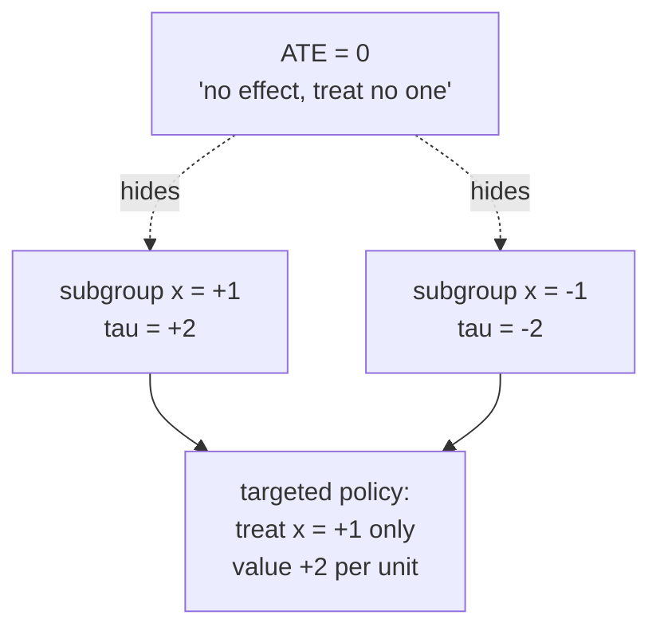

A clinical trial reports that a drug lifts recovery rates by three points on
average. That number decides nothing for a specific patient: the drug might help
the young by ten points and harm the old by four, and the three-point average is
just where those cancel. Any decision about *who* to treat needs the effect as a
function of patient characteristics, not a single number. That function is the
**conditional average treatment effect** (CATE), and this lesson defines it and
states exactly what it takes to recover it from data.

## From potential outcomes to a function of covariates

Each unit $i$ has two potential outcomes, $Y_i(1)$ under treatment and $Y_i(0)$
under control (the potential-outcomes framework from
[B5](/pillar/B/B5/potential-outcomes)). The **individual treatment effect** is
their difference, $\tau_i = Y_i(1) - Y_i(0)$. It is never observed: a unit is
either treated or not, so one of the two outcomes is always missing. This is the
fundamental problem of causal inference, and it rules out estimating $\tau_i$ for
a named individual.

What can be estimated is an average over units that share covariates<FN n="3" />.
Let $X_i \in \mathbb{R}^d$ be the observed pre-treatment covariates of unit $i$
(age, blood pressure, prior history). The **conditional average treatment
effect** is the expected individual effect among units with covariate value $x$:

$$
\tau(x) = E[\,Y(1) - Y(0) \mid X = x\,].
$$

Averaging $\tau(x)$ over the whole covariate distribution returns the
**average treatment effect** (ATE),

$$
\mathrm{ATE} = E[\,Y(1) - Y(0)\,] = E_X[\,\tau(X)\,].
$$

So the ATE is one scalar; $\tau(x)$ is a whole surface over covariate space, and
the ATE is its mean. The drug example is exactly the case where that surface is
not flat: $\tau(\text{young})$ and $\tau(\text{old})$ have opposite signs, and
their covariate-weighted average is small even though each effect is large.

## Why the average hides the decision

The thing a decision-maker actually wants is the **sign and size of $\tau(x)$**
for the units in front of them, not the population average. A worked contrast
makes the gap concrete. Suppose covariate $X$ is uniform on $\{-1, +1\}$ (two
equally sized subgroups) and the true effect is

$$
\tau(x) = 2x, \qquad \text{so } \tau(-1) = -2,\ \tau(+1) = +2.
$$

The ATE is $E_X[\tau(X)] = \tfrac{1}{2}(-2) + \tfrac{1}{2}(+2) = 0$. A study
powered to estimate only the ATE concludes "no effect" and treats no one. But a
policy that treats the $x = +1$ subgroup and withholds from $x = -1$ collects
$+2$ per treated unit and avoids $-2$ per withheld unit: average benefit $+2$
versus the $0$ of the ATE-blind policy. The heterogeneity *is* the value, and the
ATE threw it away.



## Identification: turning $\tau(x)$ into estimable conditional means

$\tau(x)$ is written with potential outcomes, which are partly unobserved. To
estimate it from a sample of observed $(X_i, W_i, Y_i)$, where $W_i \in \{0, 1\}$
is the treatment actually received and $Y_i = Y_i(W_i)$ the observed outcome, the
counterfactual half of $\tau(x)$ must be expressed through observable conditional
means. Three assumptions make that possible<FN n="1" />.

**Assumption 1 (consistency).** The observed outcome equals the potential outcome
for the treatment received: $Y_i = W_i Y_i(1) + (1 - W_i) Y_i(0)$. This links the
data to the potential outcomes and is definitional given well-defined treatments.

**Assumption 2 (conditional ignorability).** Given the covariates, treatment is
independent of the potential outcomes:

$$
\{Y(0), Y(1)\} \perp W \mid X.
$$

This says $X$ contains every common cause of treatment and outcome; within a
covariate stratum, who got treated is as good as random. It is also called
*unconfoundedness* or *selection on observables*. It is the assumption that fails
when a hidden confounder drives both $W$ and $Y$, and pillar
[M6](/pillar/M/M6/unconfoundedness-failure) is devoted to what happens when it
fails.

**Assumption 3 (overlap, or positivity).** Every covariate value has a chance of
each treatment: the propensity score
$e(x) = P(W = 1 \mid X = x)$ (from
[B5](/pillar/B/B5/propensity-scores)) satisfies

$$
0 < e(x) < 1 \quad \text{for all } x \text{ in the support}.
$$

Without overlap, some stratum has no treated (or no control) units, and $\tau(x)$
there is supported by no data and cannot be estimated, only extrapolated.

### The identification step

Under these assumptions $\tau(x)$ becomes a difference of two regression
functions on observed data. Write
$\mu_w(x) = E[\,Y \mid X = x, W = w\,]$ for the observed outcome regression in
arm $w$.

**Step 1.** Start from the conditional mean of the treated potential outcome and
condition additionally on $W = 1$, which is allowed because ignorability makes
$Y(1)$ independent of $W$ given $X$:

$$
E[\,Y(1) \mid X = x\,] = E[\,Y(1) \mid X = x, W = 1\,].
$$

**Step 2.** On the event $W = 1$, consistency gives $Y(1) = Y$, so the
right-hand side is an observable regression:

$$
E[\,Y(1) \mid X = x, W = 1\,] = E[\,Y \mid X = x, W = 1\,] = \mu_1(x).
$$

**Step 3.** Repeat with $W = 0$ for the control arm, giving
$E[\,Y(0) \mid X = x\,] = \mu_0(x)$. Subtracting the two:

$$
\tau(x) = E[\,Y(1) \mid X{=}x\,] - E[\,Y(0) \mid X{=}x\,] = \mu_1(x) - \mu_0(x).
$$

The CATE is the gap between the treated-arm and control-arm outcome regressions.
Overlap (Assumption 3) is what guarantees both $\mu_1(x)$ and $\mu_0(x)$ have data
to be estimated from at $x$. Every estimator in this subsection is a different way
of estimating this gap well: the meta-learners model $\mu_1$ and $\mu_0$ directly,
the R- and DR-learners residualize to make the estimate robust to errors in those
nuisance models, and causal forests localize the regression with adaptive
weights<FN n="2" />.

## A numeric check

The identification is exact, not approximate: when ignorability holds, the
observed-data difference $\mu_1(x) - \mu_0(x)$ equals the true $\tau(x)$ even
though treatment is confounded (treated units have systematically different $X$).
The code generates data where treatment depends on $X$, computes the true CATE
from the simulation, and recovers it from the within-stratum observed means.

```python
import numpy as np

rng = np.random.default_rng(0)
n = 200_000

# One binary covariate x in {-1, +1}; treatment depends on x (confounded).
x = rng.choice([-1.0, 1.0], size=n)
e = np.where(x == 1.0, 0.8, 0.2)          # propensity: x=+1 treated 80%, x=-1 20%
W = (rng.random(n) < e).astype(float)

# True potential outcomes: effect tau(x) = 2x, plus an x main effect.
Y0 = 0.5 * x + rng.normal(0, 1, n)
Y1 = Y0 + 2.0 * x                          # tau(x) = Y1 - Y0 = 2x
Y = W * Y1 + (1 - W) * Y0                  # consistency: observe one arm

# True CATE from the simulation (we can peek; in real data we cannot).
tau_true = {xv: 2.0 * xv for xv in (-1.0, 1.0)}

# Identified CATE from observed within-stratum means mu_1 - mu_0.
tau_hat = {}
for xv in (-1.0, 1.0):
    m1 = Y[(x == xv) & (W == 1)].mean()
    m0 = Y[(x == xv) & (W == 0)].mean()
    tau_hat[xv] = m1 - m0

ate = 0.5 * tau_hat[-1.0] + 0.5 * tau_hat[1.0]
print("tau(-1): true", tau_true[-1.0], " estimated", round(tau_hat[-1.0], 3))
print("tau(+1): true", tau_true[1.0], "  estimated", round(tau_hat[1.0], 3))
print("ATE (averages the two):", round(ate, 3))

assert abs(tau_hat[-1.0] - (-2.0)) < 0.05
assert abs(tau_hat[1.0] - 2.0) < 0.05
assert abs(ate) < 0.05                     # ATE near 0 despite large CATEs
```

The estimated stratum CATEs land at $-2$ and $+2$ despite the heavy confounding
(the $x = +1$ stratum is 80% treated, the $x = -1$ stratum only 20%), because
conditioning on $x$ removes the confounding; their average, the ATE, is near zero,
exactly the value that would mislead a decision-maker who stopped at the ATE.

## Exercises

**Exercise 1.** A program has $\tau(x) = 4 - 2x$ for a covariate $x$ uniform on
$[0, 3]$. Compute the ATE, find the covariate value where the effect changes
sign, and state which units a value-maximizing policy treats.

<details>
<summary>Solution</summary>

**Step 1.** The ATE is the mean of $\tau(x)$ over the uniform distribution on
$[0,3]$:

$$
\mathrm{ATE} = \frac{1}{3}\int_0^3 (4 - 2x)\,dx
= \frac{1}{3}\big[4x - x^2\big]_0^3 = \frac{1}{3}(12 - 9) = 1.
$$

**Step 2.** The effect is zero where $4 - 2x = 0$, i.e. $x = 2$. For $x < 2$ the
effect is positive (up to $4$ at $x=0$); for $x > 2$ it is negative (down to
$-2$ at $x=3$).

**Step 3.** A value-maximizing policy treats a unit exactly when its effect is
positive, so it treats units with $x < 2$ and withholds from $x > 2$. The ATE of
$1$ hides that one quarter of the support ($x \in (2,3]$) is actively harmed.

</details>

**Exercise 2.** Show that conditional ignorability $\{Y(0),Y(1)\} \perp W \mid X$
implies the propensity score is the only covariate function needed for the
treated-arm identification step, i.e. that $E[Y(1)\mid X=x]$ does not depend on
$e(x)$ beyond what overlap guarantees. Then give a one-line data example where
ignorability fails and $\mu_1(x) - \mu_0(x) \neq \tau(x)$.

<details>
<summary>Solution</summary>

**Step 1.** Ignorability gives
$E[Y(1)\mid X=x, W=1] = E[Y(1)\mid X=x]$ directly: conditioning on $W$ adds
nothing once $X$ is fixed. The propensity $e(x)$ governs *how many* treated units
sit at $x$ (and thus the variance of the estimate), but not the *value* of the
conditional mean. Overlap $0 < e(x) < 1$ only ensures the conditioning event
$W=1$ at $x$ has positive probability so the mean is well defined.

**Step 2.** Failure example: a hidden variable $U$ raises both the chance of
treatment and the outcome, and $U$ is not in $X$. Then treated units at $x$ have
higher $U$ on average, so $\mu_1(x) = E[Y\mid x, W{=}1]$ is inflated by the $U$
gap and $\mu_1(x) - \mu_0(x)$ overstates $\tau(x)$. Concretely, with
$Y = \tau(x)W + U + \varepsilon$ and $P(W{=}1)$ increasing in $U$, the naive
difference picks up $E[U\mid x, W{=}1] - E[U\mid x, W{=}0] > 0$ on top of
$\tau(x)$.

</details>

**Exercise 3 (code).** On a simulation with a continuous covariate, confirm that
the naive treated-minus-control difference of *marginal* means is biased by
confounding, while the covariate-stratified difference recovers the ATE. Use a
binned stratification and a fixed seed, ending in an assert that the stratified
estimate beats the naive one.

<details>
<summary>Solution</summary>

```python
import numpy as np

rng = np.random.default_rng(0)
n = 100_000

x = rng.uniform(-2, 2, n)
e = 1 / (1 + np.exp(-1.5 * x))             # propensity rises with x
W = (rng.random(n) < e).astype(float)
tau = 1.0 + 0.5 * x                        # true CATE
Y0 = 1.0 * x + rng.normal(0, 1, n)         # x also drives the outcome: confounding
Y1 = Y0 + tau
Y = W * Y1 + (1 - W) * Y0

ate_true = (1.0 + 0.5 * x).mean()          # ~ 1.0 over symmetric x

# Naive: difference of marginal means (confounded by x).
naive = Y[W == 1].mean() - Y[W == 0].mean()

# Stratified: difference within covariate bins, then averaged.
bins = np.linspace(-2, 2, 41)
idx = np.clip(np.digitize(x, bins), 1, len(bins) - 1)
diffs, weights = [], []
for b in np.unique(idx):
    m = idx == b
    t, c = m & (W == 1), m & (W == 0)
    if t.sum() > 0 and c.sum() > 0:
        diffs.append(Y[t].mean() - Y[c].mean())
        weights.append(m.sum())
strat = np.average(diffs, weights=weights)

print("true ATE", round(ate_true, 3),
      "| naive", round(naive, 3),
      "| stratified", round(strat, 3))

assert abs(naive - ate_true) > 0.3                 # naive is badly biased
assert abs(strat - ate_true) < 0.05                # stratifying on x fixes it
```

The naive contrast is inflated because high-$x$ units are both more likely to be
treated and have higher baseline outcomes; stratifying on $x$ breaks that link
and recovers the ATE near $1$.

</details>

The next lesson turns the identification $\tau(x) = \mu_1(x) - \mu_0(x)$ into
practical estimators by wrapping any regression learner into S-, T-, and
X-learners.

<Footnotes>
  <FNItem n="1">**Imbens, G. W., & Rubin, D. B.** (2015). *Causal Inference for Statistics, Social, and Biomedical Sciences*. Cambridge University Press. Potential outcomes, ignorability, overlap, and identification of treatment effects.</FNItem>
  <FNItem n="2">**Künzel, S. R., Sekhon, J. S., Bickel, P. J., & Yu, B.** (2019). "Metalearners for estimating heterogeneous treatment effects using machine learning". *PNAS*, 116(10), 4156-4165. Frames CATE estimation and the identification used here ([arXiv:1706.03461](https://arxiv.org/abs/1706.03461)).</FNItem>
  <FNItem n="3">**Athey, S., & Imbens, G. W.** (2016). "Recursive partitioning for heterogeneous causal effects". *PNAS*, 113(27), 7353-7360. Motivates estimating the CATE surface rather than a single average effect ([doi:10.1073/pnas.1510489113](https://doi.org/10.1073/pnas.1510489113)).</FNItem>
</Footnotes>
