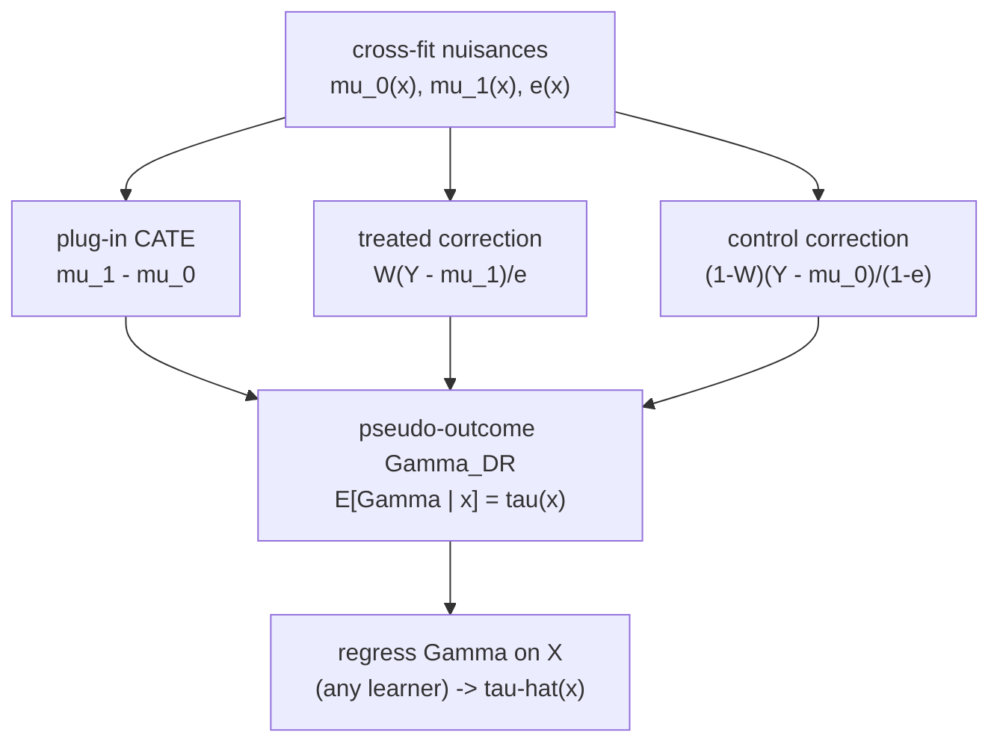

The R-learner folds robustness into a custom loss. The **DR-learner** reaches the
same robustness through a more modular route: it manufactures, for each unit, a
single number $\hat\Gamma_i$ whose conditional expectation given $X = x$ equals the
CATE $\tau(x)$. Once such a **pseudo-outcome** exists, estimating $\tau$ is an
ordinary regression: regress $\hat\Gamma$ on $X$ with any off-the-shelf learner.
The "DR" is for **doubly robust**: the construction stays valid if *either* the
outcome model *or* the propensity model is correct, not necessarily both<FN n="2" />.

## What a pseudo-outcome must satisfy

The goal is a transformed target $\Gamma_i$ built from observed
$(X_i, W_i, Y_i)$ and the nuisances, such that

$$
E[\,\Gamma \mid X = x\,] = \tau(x).
$$

If this holds, then regressing $\Gamma$ on $X$ (minimizing
$E[(\Gamma - g(X))^2]$ over functions $g$) returns $g^\star(x) = E[\Gamma\mid X=x]
= \tau(x)$, because the conditional mean is always the least-squares projection.
The whole problem is finding a $\Gamma$ with the right conditional mean and as
little variance as possible.

## The IPW pseudo-outcome and its fragility

A first construction uses the propensity score alone. The **inverse-probability
weighted** (IPW) pseudo-outcome is

$$
\Gamma^{\mathrm{IPW}} = \left(\frac{W}{e(X)} - \frac{1 - W}{1 - e(X)}\right) Y.
$$

**Its mean is the CATE.** Condition on $X = x$ and use ignorability so that
$E[Y \mid X, W=w] = \mu_w(x)$ and $E[W\mid X] = e(x)$:

$$
E[\Gamma^{\mathrm{IPW}}\mid X{=}x]
= \frac{e(x)}{e(x)}\mu_1(x) - \frac{1 - e(x)}{1 - e(x)}\mu_0(x)
= \mu_1(x) - \mu_0(x) = \tau(x).
$$

The treated term keeps a unit only when $W=1$ (probability $e(x)$) and reweights
by $1/e(x)$, so the surviving mass averages back to $\mu_1(x)$; the control term is
symmetric. IPW is correct, but fragile: when $e(x)$ is near $0$ or $1$ the weight
$1/e(x)$ or $1/(1-e(x))$ explodes, and a single mismeasured propensity ruins the
estimate. It also uses no outcome model, wasting information.

## The AIPW (doubly-robust) pseudo-outcome

The fix augments IPW with the outcome models, subtracting their predicted
contribution from the reweighted residual. The **augmented IPW** (AIPW)
pseudo-outcome is

$$
\Gamma^{\mathrm{DR}} = \big(\mu_1(X) - \mu_0(X)\big)
+ \frac{W\,(Y - \mu_1(X))}{e(X)}
- \frac{(1 - W)\,(Y - \mu_0(X))}{1 - e(X)}.
$$

Read it as a plug-in CATE $\mu_1 - \mu_0$ plus two **correction terms**, each a
reweighted residual of the realized arm. The corrections vanish in expectation if
the outcome model is right (residuals mean-zero) and the reweighting fixes the
plug-in if the outcome model is wrong but the propensity is right. That dual
insurance is the double robustness.

### The conditional mean equals $\tau(x)$

**Step 1.** Condition the whole expression on $X = x$ and split by treatment arm.
The first term $\mu_1(x) - \mu_0(x)$ is deterministic given $x$, so it passes
through.

**Step 2.** Take the treated correction term. By the tower rule, condition first
on $(X, W)$:

$$
E\!\left[\frac{W(Y - \mu_1(X))}{e(X)}\,\Big|\,X{=}x\right]
= \frac{1}{e(x)}\,E\big[W\,(Y - \mu_1(x))\mid X{=}x\big].
$$

On the event $W = 1$ (which has probability $e(x)$ given $x$), ignorability gives
$E[Y \mid x, W{=}1] = \mu_1(x)$, so $E[Y - \mu_1(x)\mid x, W{=}1] = 0$. On $W=0$
the factor $W$ kills the term. Hence the conditional expectation is $0$.

**Step 3.** The control correction term is symmetric and also has conditional mean
$0$. So

$$
E[\Gamma^{\mathrm{DR}}\mid X{=}x] = (\mu_1(x) - \mu_0(x)) + 0 - 0 = \tau(x),
$$

provided **both** nuisances are correct. The next step shows it survives one being
wrong.

### Double robustness

Suppose the propensity is correct, $\hat e = e$, but the outcome models are
arbitrary functions $\bar\mu_w \neq \mu_w$. Redo Step 2 with $\bar\mu_1$ in place
of $\mu_1$:

$$
\frac{1}{e(x)}E[W(Y - \bar\mu_1(x))\mid x]
= \frac{1}{e(x)}\,e(x)\,\big(\mu_1(x) - \bar\mu_1(x)\big)
= \mu_1(x) - \bar\mu_1(x).
$$

The plug-in first term contributes $\bar\mu_1(x) - \bar\mu_0(x)$, and adding the
two corrections gives

$$
\big(\bar\mu_1 - \bar\mu_0\big) + \big(\mu_1 - \bar\mu_1\big) - \big(\mu_0 -
\bar\mu_0\big) = \mu_1(x) - \mu_0(x) = \tau(x).
$$

The wrong outcome models cancel exactly when the propensity is right. The mirror
calculation shows that if the outcome models are right, the correction terms have
mean zero regardless of $\hat e$, so a wrong propensity is tolerated too. Either
nuisance correct suffices: that is double robustness.



## The DR-learner algorithm

1. **Cross-fit the nuisances.** On held-out folds estimate $\hat\mu_0$,
   $\hat\mu_1$, and $\hat e$, so the pseudo-outcome for a unit never uses a model
   fit on that unit (this is what licenses the orthogonality)<FN n="3" />.
2. **Form the pseudo-outcome** $\hat\Gamma_i$ for every unit from the plug-in plus
   both corrections.
3. **Regress** $\hat\Gamma$ on $X$ with any supervised learner; the fit is
   $\hat\tau(x)$.

Kennedy (2023) proves this two-stage procedure attains oracle-like CATE error
rates: the second-stage regression behaves almost as if it had been handed the
true $\Gamma$, because cross-fitting plus the doubly-robust form makes the
first-stage nuisance error enter only at second order<FN n="1" />.

## Numeric check

The figure plots the DR-learner's $\hat\tau(x)$ against the true $\tau(x) = 1 +
x$ under a misspecified outcome model (a constant, deliberately wrong), showing the
estimate still tracks the truth because the propensity model is correct.


```python
import numpy as np

rng = np.random.default_rng(0)
n = 40000

x = rng.normal(0, 1, n)
e_true = 1 / (1 + np.exp(-x))                  # true propensity
W = (rng.random(n) < e_true).astype(float)
tau = 1.0 + x                                  # true CATE
mu0 = 0.5 * x                                  # true control surface
Y = mu0 + tau * W + rng.normal(0, 0.5, n)

# WRONG outcome models: just use the global means (ignore x entirely).
mu0_hat = np.full(n, Y[W == 0].mean())
mu1_hat = np.full(n, Y[W == 1].mean())
# CORRECT propensity: fit logistic regression on [1, x] by Newton/IRLS.
B = np.column_stack([np.ones(n), x])
beta = np.zeros(B.shape[1])
for _ in range(25):
    p = 1 / (1 + np.exp(-(B @ beta)))
    grad = B.T @ (W - p)
    H = (B * (p * (1 - p))[:, None]).T @ B
    beta += np.linalg.solve(H, grad)
e_hat = np.clip(1 / (1 + np.exp(-(B @ beta))), 0.02, 0.98)

# Doubly-robust pseudo-outcome.
Gamma = (mu1_hat - mu0_hat) \
    + W * (Y - mu1_hat) / e_hat \
    - (1 - W) * (Y - mu0_hat) / (1 - e_hat)

# Regress Gamma on [1, x] for a linear CATE estimate.
a, b = np.linalg.lstsq(np.column_stack([np.ones(n), x]), Gamma, rcond=None)[0]
print("DR-learner CATE: tau(x) ~", round(a, 3), "+", round(b, 3), "x  (true 1 + x)")

# Outcome model is wrong, but correct propensity rescues the estimate.
assert abs(a - 1.0) < 0.1
assert abs(b - 1.0) < 0.1
```

The outcome models are deliberately useless (flat global means), yet the
DR-learner recovers $\tau(x) \approx 1 + x$ because the propensity model is correct
and the IPW correction terms repair the plug-in.

## Exercises

**Exercise 1.** Verify by hand that the IPW pseudo-outcome has conditional mean
$\tau(x)$ for a two-point covariate. Take $e(x) = 0.25$, $\mu_1(x) = 3$,
$\mu_0(x) = 1$. Compute $E[\Gamma^{\mathrm{IPW}}\mid x]$ from the arm
probabilities and confirm it equals $\tau(x) = 2$.

<details>
<summary>Solution</summary>

**Step 1.** The treated term contributes only when $W=1$, which happens with
probability $e(x) = 0.25$, and then $Y$ has mean $\mu_1(x) = 3$:

$$
E\!\left[\frac{W}{e(x)}Y\,\Big|\,x\right] = \frac{1}{0.25}\cdot 0.25 \cdot 3 = 3 =
\mu_1(x).
$$

**Step 2.** The control term contributes when $W=0$, probability $1 - e(x) =
0.75$, with mean $\mu_0(x) = 1$:

$$
E\!\left[\frac{1-W}{1-e(x)}Y\,\Big|\,x\right] = \frac{1}{0.75}\cdot 0.75 \cdot 1 = 1
= \mu_0(x).
$$

**Step 3.** The difference is $3 - 1 = 2 = \tau(x)$. The reweighting cancels the
arm probabilities, leaving the regression means.

</details>

**Exercise 2.** Prove the double-robustness claim from the other side: assume the
outcome models are correct ($\hat\mu_w = \mu_w$) but the propensity is an arbitrary
$\bar e \neq e$. Show $E[\Gamma^{\mathrm{DR}}\mid x] = \tau(x)$ still holds.

<details>
<summary>Solution</summary>

**Step 1.** With $\hat\mu_w = \mu_w$, the treated correction term has conditional
mean
$\frac{1}{\bar e(x)}E[W(Y - \mu_1(x))\mid x]$. By ignorability,
$E[Y - \mu_1(x)\mid x, W{=}1] = 0$, so $E[W(Y - \mu_1(x))\mid x] = e(x)\cdot 0 = 0$
regardless of the (wrong) weight $1/\bar e(x)$.

**Step 2.** The same holds for the control correction: its conditional mean is
$\frac{1}{1-\bar e(x)}E[(1-W)(Y - \mu_0(x))\mid x] = 0$.

**Step 3.** Both corrections vanish, leaving only the plug-in
$\mu_1(x) - \mu_0(x) = \tau(x)$. The wrong propensity never enters because it
multiplies residuals that are already mean-zero. Combined with the in-lesson
calculation (right propensity tolerates wrong outcome), either nuisance correct
suffices.

</details>

**Exercise 3 (code).** Demonstrate the *complementary* robustness direction
numerically: make the propensity model wrong (a constant) but the outcome models
correct, and confirm the DR-learner still recovers the CATE. Assert the recovered
slope is within tolerance of the true slope.

<details>
<summary>Solution</summary>

```python
import numpy as np

rng = np.random.default_rng(2)
n = 40000

x = rng.normal(0, 1, n)
e_true = 1 / (1 + np.exp(-x))
W = (rng.random(n) < e_true).astype(float)
tau = 1.0 + x
mu0 = 0.5 * x
Y = mu0 + tau * W + rng.normal(0, 0.5, n)

# CORRECT outcome models: regress Y on [1, x] within each arm.
def fit_pred(mask):
    A = np.column_stack([np.ones(mask.sum()), x[mask]])
    coef = np.linalg.lstsq(A, Y[mask], rcond=None)[0]
    return coef[0] + coef[1] * x                # predict over all units
mu0_hat = fit_pred(W == 0)
mu1_hat = fit_pred(W == 1)

# WRONG propensity: a single constant (ignores x).
e_hat = np.full(n, W.mean())

Gamma = (mu1_hat - mu0_hat) \
    + W * (Y - mu1_hat) / e_hat \
    - (1 - W) * (Y - mu0_hat) / (1 - e_hat)

a, b = np.linalg.lstsq(np.column_stack([np.ones(n), x]), Gamma, rcond=None)[0]
print("slope with wrong propensity:", round(b, 3), "(true 1.0)")

# Correct outcome model rescues the estimate despite the wrong propensity.
assert abs(b - 1.0) < 0.1
```

With the outcome models correct, the correction terms are mean-zero whatever the
propensity, so the constant (wrong) $\hat e$ does no damage and the slope lands
near $1.0$.

</details>

The next lesson moves from these two-stage estimators to forests: generalized
random forests solve a *local* version of the moment condition behind these
losses, using the forest itself to supply adaptive, data-driven weights and honest
splitting for valid confidence intervals.

<Footnotes>
  <FNItem n="1">**Kennedy, E. H.** (2023). "Towards optimal doubly robust estimation of heterogeneous causal effects". *Electronic Journal of Statistics*, 17(2), 3008-3049. Defines the DR-learner pseudo-outcome and proves its oracle CATE rates ([arXiv:2004.14497](https://arxiv.org/abs/2004.14497)).</FNItem>
  <FNItem n="2">**Robins, J. M., Rotnitzky, A., & Zhao, L. P.** (1994). "Estimation of regression coefficients when some regressors are not always observed". *JASA*, 89(427), 846-866. Origin of the augmented IPW / doubly-robust estimating equation ([doi:10.1080/01621459.1994.10476818](https://doi.org/10.1080/01621459.1994.10476818)).</FNItem>
  <FNItem n="3">**Chernozhukov, V., et al.** (2018). "Double/debiased machine learning for treatment and structural parameters". *The Econometrics Journal*, 21(1), C1-C68. Cross-fitting that makes the two-stage DR-learner orthogonal ([doi:10.1111/ectj.12097](https://doi.org/10.1111/ectj.12097)).</FNItem>
</Footnotes>
