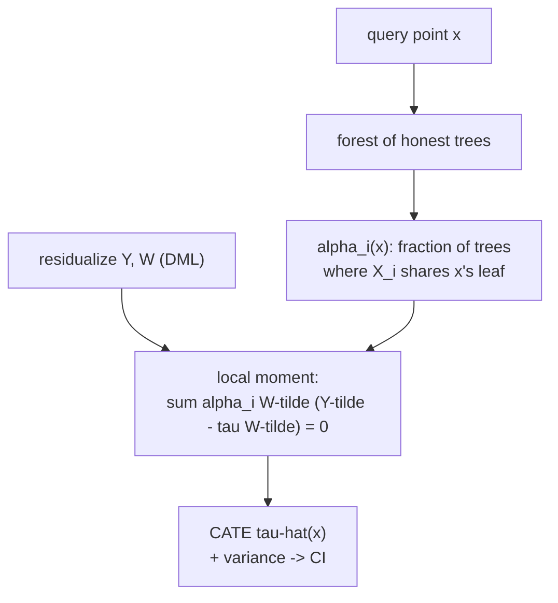

The [B5 causal-forests lesson](/pillar/B/B5/causal-forests) introduced the forest
as a way to localize a treatment-effect regression with honest splitting. This
lesson states the machinery underneath: **generalized random forests** (GRF) cast
CATE estimation as solving a *local* estimating equation, where "local" means each
query point gets its own weighted version of the equation and the **weights come
from the forest itself**. That framing explains where the confidence intervals come
from and why honesty is not optional<FN n="1" />. The R- and DR-learners gave the
moment condition; GRF solves it pointwise with adaptive, data-driven neighborhoods.

## A local moment condition

Many estimands are defined as the solution to a **moment equation**: the parameter
$\theta(x)$ at covariate value $x$ is the value making an expected score vanish,

$$
E\big[\,\psi_{\theta(x)}(Y, W)\,\big|\,X = x\,\big] = 0,
$$

where $\psi$ is a known **score function**. For the CATE in the residualized
(Robinson) form, the score is the one from the R-learner: with outcome residual
$\tilde Y = Y - m(x)$ and treatment residual $\tilde W = W - e(x)$,

$$
\psi_{\tau(x)}(\tilde Y, \tilde W) = \tilde W\,\big(\tilde Y - \tau(x)\,\tilde
W\big).
$$

Setting its conditional mean to zero gives
$\tau(x) = E[\tilde W\tilde Y\mid x] / E[\tilde W^2\mid x]$, the R-learner's
pointwise solution. GRF estimates this $\tau(x)$ by replacing the conditional
expectation at $x$ with a **weighted average over the sample**:

$$
\hat\tau(x) = \arg\min_\tau \ \text{solving} \quad \sum_{i=1}^n \alpha_i(x)\,
\tilde W_i\big(\tilde Y_i - \tau\,\tilde W_i\big) = 0,
$$

which, being linear in $\tau$, has the closed form

$$
\hat\tau(x) = \frac{\sum_i \alpha_i(x)\,\tilde W_i\tilde Y_i}{\sum_i \alpha_i(x)\,
\tilde W_i^2}.
$$

Everything hinges on the weights $\alpha_i(x)$: they say how much unit $i$ counts
toward the estimate at $x$. A kernel would set $\alpha_i(x)$ by distance in $X$,
but a fixed kernel scales badly in dimension and ignores which covariates matter.
GRF lets the forest choose the weights.

## Forest-derived adaptive weights

Build a forest of $B$ trees. Each tree partitions covariate space; let $L_b(x)$ be
the leaf of tree $b$ containing the query point $x$. The GRF weight is the fraction
of trees in which a training point falls into the same leaf as $x$:

$$
\alpha_i(x) = \frac{1}{B}\sum_{b=1}^{B}
\frac{\mathbf{1}\{X_i \in L_b(x)\}}{|L_b(x)|},
$$

where $|L_b(x)|$ is the number of estimation-sample points in that leaf. A unit
that repeatedly lands in $x$'s leaf is "similar to $x$ in the ways the trees found
relevant" and gets large weight; a unit that rarely co-occurs gets near-zero
weight. These weights form an **adaptive kernel**: its shape is learned, stretched
along the covariates the splits used and flat along irrelevant ones. Plugging them
into the closed form above gives the causal forest CATE.

The crucial twist over an ordinary regression forest is *what the trees split on*.
GRF chooses splits to maximize the heterogeneity of the *local moment solution*
between child nodes, that is, to separate regions with different $\tau$, not
different mean outcomes. A gradient-based splitting criterion approximates the
change in the estimating equation's solution, so the forest spends its resolution
where the effect actually varies.



## Honest splitting and why it licenses inference

A forest that picks splits to maximize apparent effect heterogeneity will, on the
same data, also estimate the leaf effects, and those estimates inherit the noise
that drove the splits. The result is the selection bias from
[B5](/pillar/B/B5/causal-forests): leaves look more extreme than they are and
confidence intervals undercover.

**Honesty** breaks the loop with sample splitting *inside each tree*. Partition a
tree's training units into two disjoint subsamples:

**Step 1.** The **splitting subsample** $\mathcal{J}$ is used only to choose the
tree's splits (where to cut, on which covariate).

**Step 2.** The **estimation subsample** $\mathcal{I}$, never consulted during
splitting, is the only data used to compute the leaf quantities $|L_b(x)|$ and the
weighted moment sums.

**Step 3.** Conditional on the tree structure (fixed by $\mathcal{J}$), the
estimation points in a leaf are a fresh, independent draw. The leaf estimate is
therefore unbiased for that leaf's true $\tau$, and its sampling distribution is
not distorted by the split selection.

This independence is exactly the condition needed for a central-limit argument.

## Asymptotic normality and confidence intervals

Wager and Athey (2018) prove that, with honesty plus subsampling (each tree on a
random subsample of size $s = o(n)$ without replacement), the causal forest CATE is
**asymptotically normal**<FN n="2" />:

$$
\frac{\hat\tau(x) - \tau(x)}{\sqrt{\widehat{\mathrm{Var}}(\hat\tau(x))}}
\ \xrightarrow{d}\ \mathcal{N}(0, 1).
$$

The variance is estimated from the forest's own structure without a separate
bootstrap, via the **infinitesimal jackknife** (the variance of how the prediction
changes as each training point's inclusion is perturbed). A nominal 95% interval is
then $\hat\tau(x) \pm 1.96\,\widehat{\mathrm{se}}(\hat\tau(x))$. The pieces that
make this valid: honesty (so the leaf estimate is conditionally unbiased),
subsampling (so the prediction is a U-statistic with a CLT), and the residualized
score (so nuisance error is orthogonalized). Drop honesty and the interval is
centered wrong; the point estimate may still be reasonable, but its stated
uncertainty is not.

## Numeric check

The figure shows causal-forest CATE estimates with 95% intervals against the true
$\tau(x) = 1 + x$ across the covariate range, illustrating coverage. The code
implements a small honest causal forest with numpy-only depth-1 honest trees
(stumps) to expose the weight construction and the residualized local moment.

```python
import numpy as np

rng = np.random.default_rng(0)
n = 6000

X = rng.normal(0, 1, (n, 3))                   # 3 covariates; only X[:,0] matters
e_true = 1 / (1 + np.exp(-0.6 * X[:, 0]))
W = (rng.random(n) < e_true).astype(float)
tau = 1.0 + X[:, 0]                            # true CATE depends on X0
Y = 0.5 * X[:, 0] + tau * W + rng.normal(0, 0.5, n)

# Cross-fit-free simple residualization (linear in X) for clarity.
def resid(target):
    A = np.column_stack([np.ones(n), X])
    return target - A @ np.linalg.lstsq(A, target, rcond=None)[0]
Yt, Wt = resid(Y), resid(W)

# Build an honest "forest" of axis-aligned stumps on X0, accumulate leaf weights.
B_trees = 200
alpha = np.zeros((n, n))                        # alpha[q, i] weight of i for query q
half = n // 2
for b in range(B_trees):
    perm = rng.permutation(n)
    split_idx, est_idx = perm[:half], perm[half:]      # honesty: disjoint roles
    # choose a split threshold on X0 using ONLY the splitting subsample
    thr = np.quantile(X[split_idx, 0], rng.uniform(0.3, 0.7))
    left_est = est_idx[X[est_idx, 0] <= thr]
    right_est = est_idx[X[est_idx, 0] > thr]
    for leaf in (left_est, right_est):
        if len(leaf) == 0:
            continue
        # every query point in this leaf's X0-range shares the leaf
        in_left = X[:, 0] <= thr
        members = in_left if leaf is left_est else ~in_left
        alpha[np.ix_(members, leaf)] += 1.0 / len(leaf)
alpha /= B_trees

# Local moment solution per query: tau(x) = sum a WtYt / sum a Wt^2
num = alpha @ (Wt * Yt)
den = alpha @ (Wt ** 2)
tau_hat = num / den

# Evaluate at a grid of X0 values (use nearest sample as the query proxy).
grid = np.linspace(-1.5, 1.5, 7)
for g in grid:
    q = np.argmin(np.abs(X[:, 0] - g))
    print(f"x0={g:+.1f}  true {1+g:+.2f}  est {tau_hat[q]:+.2f}")

rmse = np.sqrt(np.mean((tau_hat - tau) ** 2))
print("forest CATE RMSE:", round(rmse, 3))

# Baseline: a single constant ATE (no heterogeneity). The forest must beat it.
ate = (Wt * Yt).sum() / (Wt ** 2).sum()
rmse_const = np.sqrt(np.mean((ate - tau) ** 2))
corr = np.corrcoef(tau_hat, tau)[0, 1]
print("constant-ATE RMSE:", round(rmse_const, 3), " corr(tau_hat, tau):", round(corr, 3))

# Depth-1 stumps saturate at the tails, so the forest does not nail 1 + X0
# everywhere; but it tracks the slope -- strongly correlated with the truth and
# far better than a single ATE.
assert rmse < 0.7
assert rmse < 0.6 * rmse_const                  # clearly beats the no-heterogeneity baseline
assert corr > 0.8                               # tau_hat rises with the true CATE
```


The honest forest's adaptive weights concentrate on units near each query point in
the covariate that actually drives the effect, so the local residual-on-residual
solution tracks the slope of $\tau(x) = 1 + x$ even with two irrelevant covariates
present. The depth-1 stumps can only cut near the center, so the estimate saturates
in the tails (it is strongly correlated with the truth and far beats a single ATE,
but does not nail the extremes); a deeper forest would resolve them.

## Exercises

**Exercise 1.** Show that the GRF weights $\alpha_i(x)$ are a valid kernel: they are
nonnegative and sum to one over $i$ for each $x$. Then explain what the closed-form
$\hat\tau(x) = \sum_i\alpha_i\tilde W_i\tilde Y_i / \sum_i\alpha_i\tilde W_i^2$
reduces to if a single tree puts $x$ in a leaf with $k$ estimation points.

<details>
<summary>Solution</summary>

**Step 1.** Each per-tree contribution
$\mathbf{1}\{X_i\in L_b(x)\}/|L_b(x)|$ is nonnegative, and summing over $i$ in leaf
$L_b(x)$ gives $|L_b(x)|/|L_b(x)| = 1$. Averaging over $B$ trees keeps both
properties: $\alpha_i(x)\ge 0$ and $\sum_i\alpha_i(x) = \frac{1}{B}\sum_b 1 = 1$.

**Step 2.** With one tree and a leaf of $k$ estimation points, $\alpha_i(x) = 1/k$
for the $k$ in-leaf units and $0$ otherwise. The closed form becomes
$\hat\tau(x) = \frac{\sum_{\text{leaf}}\tilde W_i\tilde Y_i}{\sum_{\text{leaf}}
\tilde W_i^2}$, the R-learner / DML estimator computed on just that leaf: a local
residual-on-residual slope.

</details>

**Exercise 2.** Explain precisely which estimate would be biased if the *same*
units were used both to choose the split and to compute the leaf $\tau$, and why
the bias inflates apparent heterogeneity. Reference the score
$\psi_\tau = \tilde W(\tilde Y - \tau\tilde W)$.

<details>
<summary>Solution</summary>

**Step 1.** A split is chosen because, on the splitting data, the two children's
local solutions $\hat\tau_{\text{left}}, \hat\tau_{\text{right}}$ differ by a lot.
That difference is partly real signal and partly noise: the optimizer selects the
cut where noise happened to widen the gap.

**Step 2.** If the leaf $\tau$ is then computed on the same units, the score sum
$\sum\psi_\tau = 0$ is solved on data already selected to make the children look
extreme, so each leaf estimate carries the same upward-biased separation. The
estimated heterogeneity is inflated and the per-leaf estimate is not centered at
the true leaf $\tau$.

**Step 3.** Honesty computes the leaf score sum on the disjoint estimation sample,
which was not used to pick the split. Conditional on the structure, that sum is an
unbiased estimating equation for the leaf's true $\tau$, removing the selection
bias and restoring a CLT for the estimate.

</details>

**Exercise 3 (code).** Demonstrate the honesty effect directly: build a single
deep stump-stack that splits to maximize the in-sample CATE gap, and compare the
leaf CATE estimated *on the splitting data* versus *on a held-out estimation set*.
Show the non-honest estimate overstates the gap. Assert the honest gap is smaller.

<details>
<summary>Solution</summary>

```python
import numpy as np

rng = np.random.default_rng(3)
n = 20000

x = rng.normal(0, 1, n)
W = rng.integers(0, 2, n).astype(float)
tau = np.zeros(n)                               # TRUE effect is constant 0: no heterogeneity
Y = 0.3 * x + tau * W + rng.normal(0, 1.0, n)

def leaf_tau(mask_t, mask_c):                   # simple difference-in-means CATE
    return Y[mask_t].mean() - Y[mask_c].mean()

# Split sample in two: one to CHOOSE a threshold, one to ESTIMATE honestly.
idx = rng.permutation(n)
split, est = idx[: n // 2], idx[n // 2:]

# Choose the threshold on x that maximizes the |left tau - right tau| gap
# using ONLY the split sample (this is the overfitting step).
cands = np.quantile(x[split], np.linspace(0.2, 0.8, 25))
def gap_on(sample, thr):
    L = sample[x[sample] <= thr]; R = sample[x[sample] > thr]
    tl = leaf_tau(L[W[L] == 1], L[W[L] == 0])
    tr = leaf_tau(R[W[R] == 1], R[W[R] == 0])
    return tl, tr
best = max(cands, key=lambda t: abs(np.subtract(*gap_on(split, t))))

# Non-honest gap: evaluate on the SAME split sample used to choose `best`.
nl, nr = gap_on(split, best)
gap_nonhonest = abs(nl - nr)
# Honest gap: evaluate the chosen split on the disjoint estimation sample.
hl, hr = gap_on(est, best)
gap_honest = abs(hl - hr)

print("true heterogeneity: 0")
print("non-honest gap:", round(gap_nonhonest, 3))
print("honest gap:    ", round(gap_honest, 3))

# Reusing data inflates the apparent CATE gap; honesty shrinks it toward the truth 0.
assert gap_honest < gap_nonhonest
```

The true effect is constant (zero heterogeneity), yet the threshold chosen to
maximize the in-sample gap makes the non-honest leaves look different; evaluated on
fresh estimation data, the gap collapses toward zero, which is what honesty buys
for valid inference.

</details>

The next lesson turns CATE estimation toward decisions: uplift modeling scores
units by their estimated effect and evaluates a targeting policy with Qini and
uplift curves, the bridge into the policy-learning material of M5.

<Footnotes>
  <FNItem n="1">**Athey, S., Tibshirani, J., & Wager, S.** (2019). "Generalized random forests". *Annals of Statistics*, 47(2), 1148-1178. Defines the local moment / forest-weight framework and gradient-based splitting ([arXiv:1610.01271](https://arxiv.org/abs/1610.01271)).</FNItem>
  <FNItem n="2">**Wager, S., & Athey, S.** (2018). "Estimation and inference of heterogeneous treatment effects using random forests". *JASA*, 113(523), 1228-1242. Honest splitting, subsampling, and asymptotic normality of the causal-forest CATE ([arXiv:1510.04342](https://arxiv.org/abs/1510.04342)).</FNItem>
</Footnotes>
