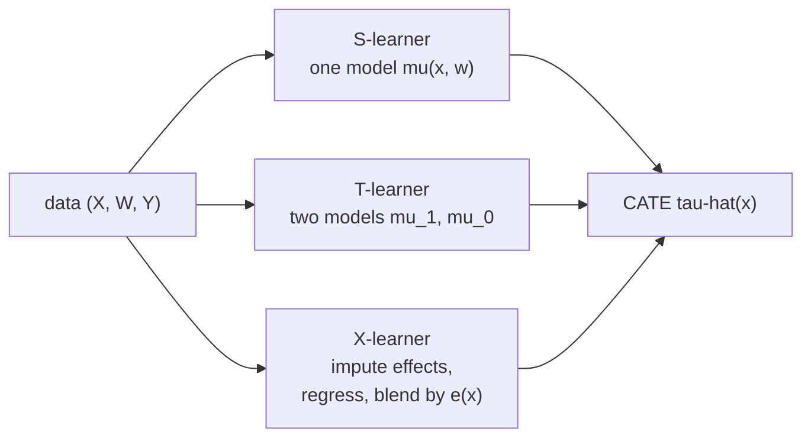

The previous lesson reduced the CATE to a difference of outcome regressions,
$\tau(x) = \mu_1(x) - \mu_0(x)$. That reduction is an invitation: any regression
method (linear models, gradient boosting, neural nets) estimates a conditional
mean, so any of them can be turned into a CATE estimator by plugging it into that
formula. A **meta-learner** is a recipe that does exactly this, wrapping a generic
**base learner** so the choice of regression algorithm is left open. Three recipes
dominate<FN n="1" />. They differ in *how* they split the labor between base
models, and that choice decides which one survives when treatment is rare.

The
[B5 causal-forests lesson](/pillar/B/B5/causal-forests) introduced S, T, and X at
a sketch level; this lesson derives each, works the bias of the S-learner
numerically, and pins down why the X-learner's propensity weighting is the right
combination under imbalance.

## Setup and notation

Data is $(X_i, W_i, Y_i)$ with covariates $X_i$, binary treatment $W_i \in
\{0,1\}$, and observed outcome $Y_i$. Under the ignorability and overlap of the
previous lesson, $\tau(x) = \mu_1(x) - \mu_0(x)$ where
$\mu_w(x) = E[Y \mid X=x, W=w]$. Write $\hat\mu$ for an estimate of a regression
function produced by the base learner, and $e(x) = P(W=1\mid X=x)$ for the
propensity score.



## The T-learner: two models

The most direct reading of $\tau(x) = \mu_1(x) - \mu_0(x)$ fits the two regressions
separately, each on its own arm.

**Step 1.** Fit $\hat\mu_1$ by regressing $Y$ on $X$ using only the treated units
$\{i : W_i = 1\}$.

**Step 2.** Fit $\hat\mu_0$ by regressing $Y$ on $X$ using only the control units
$\{i : W_i = 0\}$.

**Step 3.** The CATE estimate is the difference:

$$
\hat\tau_T(x) = \hat\mu_1(x) - \hat\mu_0(x).
$$

The "T" is for *two*. Its strength is that each arm is modeled with full freedom;
nothing forces the treated and control surfaces to share a shape. Its weakness is
data efficiency. If $n_1$ treated units are far fewer than $n_0$ controls, then
$\hat\mu_1$ is fit on a small sample and is noisy, and that noise passes straight
into $\hat\tau_T$ even in regions where $\tau$ is actually smooth. The T-learner
also cannot borrow strength: a flat $\tau(x) \approx 0$ would be best estimated by
letting the two models agree, but the T-learner estimates them independently and
their difference carries the sum of both models' variance.

## The S-learner: one model

The S-learner ("S" for *single*) treats $W$ as just another feature. It fits one
model on the pooled data,

$$
\hat\mu(x, w) = E[Y \mid X=x, W=w],
$$

and reads the CATE as the model's response to flipping that feature:

$$
\hat\tau_S(x) = \hat\mu(x, 1) - \hat\mu(x, 0).
$$

Pooling is the strength: both arms share the same model, so the baseline surface
is estimated on all $n$ units and only the *treatment-dependent* part has to be
learned from the contrast. When the true effect is small, this is efficient.

The weakness is structural and worth deriving, because it is the meta-learner
failure mode that bites most often. A regularized base learner penalizes using the
$W$ feature, and if $W$ enters weakly it can be **dropped entirely**, collapsing
$\hat\tau_S$ to zero.

**Worked bias.** Take a tree-style or ridge base learner on the model
$Y = \beta x + \gamma\, x w + \varepsilon$, so the true CATE is
$\tau(x) = \gamma x$. If the learner includes the interaction feature $xw$, it
recovers $\hat\tau_S(x) = \hat\gamma x$. But if regularization shrinks the
$w$-related coefficients toward zero (because $W$ explains little marginal
variance compared to the always-present $x$), $\hat\gamma \to 0$ and the estimated
CATE flattens to $\hat\tau_S(x) \approx 0$. The heterogeneity is real but the
penalty erased it<FN n="2" />. The S-learner is biased *toward no effect*, which is
the dangerous direction for a decision-maker: it recommends treating no one
precisely when targeting would pay.

## The X-learner: impute, regress, blend

The X-learner ("X" for *cross*) is built to fix the T-learner's imbalance problem.
Its idea: even though no unit reveals its own $\tau_i$, you can *impute* an
individual effect for each unit using the **other** arm's model, then smooth those
imputed effects into a CATE.

**Step 1.** Fit $\hat\mu_0$ and $\hat\mu_1$ as in the T-learner.

**Step 2.** Impute an individual effect for every unit, using the model from the
arm it did *not* receive:

$$
\tilde\tau_i = Y_i - \hat\mu_0(X_i) \ \text{ for treated } (W_i = 1), \qquad
\tilde\tau_j = \hat\mu_1(X_j) - Y_j \ \text{ for control } (W_j = 0).
$$

A treated unit's $Y_i$ is its observed $Y(1)$; subtracting the model's estimate of
its missing $Y(0)$ gives an estimate of $\tau_i$. The control case is symmetric.

**Step 3.** Regress the imputed effects on $X$ within each arm, giving two CATE
models: $\hat\tau_1(x)$ from the treated imputations, $\hat\tau_0(x)$ from the
control imputations.

**Step 4.** Combine them with a propensity weight:

$$
\hat\tau_X(x) = e(x)\,\hat\tau_0(x) + \big(1 - e(x)\big)\,\hat\tau_1(x).
$$

The weighting is the crux, and the key is to track which arm's model each
component leans on. The treated-imputation model $\hat\tau_1$ is fit on
$\tilde\tau_i = Y_i - \hat\mu_0(X_i)$, so its accuracy is governed by the
**control** model $\hat\mu_0$. The control-imputation model $\hat\tau_0$ is fit on
$\tilde\tau_j = \hat\mu_1(X_j) - Y_j$, governed by the **treated** model
$\hat\mu_1$. So $\hat\tau_1$ is reliable where controls are abundant (low $e(x)$),
and $\hat\tau_0$ is reliable where treated units are abundant (high $e(x)$).

**Reading the weights.** Where treatment is rare, $e(x)$ is small, so $1 - e(x)$
is near $1$ and the blend puts almost all weight on $\hat\tau_1$. That is the right
move: $\hat\tau_1$'s imputations $Y_i - \hat\mu_0(X_i)$ rest on $\hat\mu_0$, which
is well estimated precisely because controls are plentiful there. Symmetrically,
where treatment is common, $e(x)$ is near $1$ and $\hat\tau_0$ (resting on the
well-estimated $\hat\mu_1$) gets the weight. Each component is up-weighted exactly
where its imputation step leans on the plentiful arm's model, so the combination
stays accurate across covariate space even when one arm is small.

The payoff: with $n_1 \ll n_0$, the X-learner leans on the well-estimated control
model for its imputations and avoids the variance the T-learner inherits from the
tiny treated sample. The
[X-learner paper](https://arxiv.org/abs/1706.03461) proves this gives faster CATE
convergence rates than T under imbalance.

## Numeric comparison under imbalance

The figure plots the three learners' CATE estimates against the true $\tau(x) =
1 + x$ on data with only 10% treated. The S-learner (ridge base, interaction
shrunk) flattens toward the mean; the T-learner is noisy because $\hat\mu_1$ sees
few units; the X-learner tracks the truth.


The code below reproduces the comparison with numpy-only linear base learners so
the mechanism is visible.

```python
import numpy as np

rng = np.random.default_rng(0)
n = 6000

x = rng.normal(0, 1, n)
e_true = 0.10                                  # 10% treated: heavy imbalance
W = (rng.random(n) < e_true).astype(float)
tau = 1.0 + x                                  # true CATE
Y0 = 0.5 * x + rng.normal(0, 1, n)
Y1 = Y0 + tau
Y = W * Y1 + (1 - W) * Y0

def fit(xx, yy):                               # linear base learner: [1, x]
    A = np.column_stack([np.ones_like(xx), xx])
    return np.linalg.lstsq(A, yy, rcond=None)[0]

def pred(coef, xx):
    return coef[0] + coef[1] * xx

# T-learner
c1, c0 = fit(x[W == 1], Y[W == 1]), fit(x[W == 0], Y[W == 0])
tau_T = pred(c1, x) - pred(c0, x)

# X-learner: impute with the other arm's model, regress, blend by e(x)
imp_treat = Y[W == 1] - pred(c0, x[W == 1])     # treated: Y - mu0
imp_ctrl = pred(c1, x[W == 0]) - Y[W == 0]      # control: mu1 - Y
d1 = fit(x[W == 1], imp_treat)                  # tau_1 from treated imputations
d0 = fit(x[W == 0], imp_ctrl)                   # tau_0 from control imputations
ex = np.full(n, W.mean())                       # constant propensity estimate
tau_X = ex * pred(d0, x) + (1 - ex) * pred(d1, x)

def rmse(est):
    return np.sqrt(np.mean((est - tau) ** 2))

print("T-learner RMSE:", round(rmse(tau_T), 3))
print("X-learner RMSE:", round(rmse(tau_X), 3))

# Under 10% treatment the X-learner's blend beats the raw two-model difference.
assert rmse(tau_X) < rmse(tau_T)
```

The X-learner wins because its treated-arm CATE model is built from imputations
that lean on the abundant control model, so the scarce treated sample does not
dominate the variance the way it does in the T-learner.

## Exercises

**Exercise 1.** For the model $Y = 2 + x + (3 + x)W + \varepsilon$ (true CATE
$\tau(x) = 3 + x$), write the population T-learner and S-learner-with-interaction
estimates and confirm both recover $\tau(x)$. Then state what the S-learner returns
if regularization forces the coefficient on $W$ and on $xW$ to zero.

<details>
<summary>Solution</summary>

**Step 1 (T-learner).** In population, $\mu_1(x) = E[Y\mid x, W{=}1] = 2 + x +
(3 + x) = 5 + 2x$ and $\mu_0(x) = 2 + x$. The difference is
$\hat\tau_T(x) = (5 + 2x) - (2 + x) = 3 + x = \tau(x)$.

**Step 2 (S-learner with interaction).** Fit
$\mu(x,w) = \gamma_0 + \gamma_1 x + \gamma_2 w + \gamma_3 xw$. Matching the SCM
gives $\gamma_2 = 3$, $\gamma_3 = 1$, so
$\hat\tau_S(x) = \gamma_2 + \gamma_3 x = 3 + x = \tau(x)$. Both are correct when
the interaction is present.

**Step 3 (shrunk S-learner).** With the $w$ and $xw$ coefficients driven to zero,
$\hat\mu(x,1) = \hat\mu(x,0)$, so $\hat\tau_S(x) = 0$ for all $x$. The whole effect
is erased, biased toward "no effect".

</details>

**Exercise 2.** Explain, in terms of which arm's sample each imputation leans on,
why the X-learner weight on $\hat\tau_1$ (the model fit on treated-unit
imputations) should be large where treatment is *rare*. Tie your answer to the
$(1 - e(x))$ factor in the blend.

<details>
<summary>Solution</summary>

**Step 1.** The treated-unit imputations are $\tilde\tau_i = Y_i - \hat\mu_0(X_i)$.
Their accuracy is governed by the accuracy of $\hat\mu_0$, the *control* model.

**Step 2.** Where treatment is rare, $e(x)$ is small, so controls are abundant and
$\hat\mu_0$ is well estimated. The treated imputations are therefore reliable
exactly in the low-$e$ region, and so is the CATE model $\hat\tau_1$ fit on them.

**Step 3.** The blend multiplies $\hat\tau_1$ by $1 - e(x)$, which is near $1$
when $e(x)$ is small. So $\hat\tau_1$ receives nearly full weight precisely where
its underlying imputations rest on the plentiful control arm. The symmetric
argument gives $\hat\tau_0$ the weight $e(x)$, large where treatment is common and
$\hat\mu_1$ is well estimated. Each component is up-weighted where it is reliable.

</details>

**Exercise 3 (code).** Construct an S-learner with an explicit ridge penalty
(numpy `np.linalg.solve` on the regularized normal equations) on the model
$Y = x + (2x)W + \varepsilon$, and show that as the penalty grows the estimated
CATE slope shrinks toward zero (the S-learner bias). Assert the heavily penalized
slope is at least 5x smaller than the lightly penalized one.

<details>
<summary>Solution</summary>

```python
import numpy as np

rng = np.random.default_rng(0)
n = 4000

x = rng.normal(0, 1, n)
W = rng.integers(0, 2, n).astype(float)
Y = x + (2.0 * x) * W + rng.normal(0, 0.5, n)   # true CATE = 2x

# S-learner design with interaction: features [1, x, W, xW].
Phi = np.column_stack([np.ones(n), x, W, x * W])

def ridge_slope(lam):
    # Regularized normal equations; do not penalize the intercept (index 0).
    p = Phi.shape[1]
    R = lam * np.eye(p)
    R[0, 0] = 0.0
    beta = np.linalg.solve(Phi.T @ Phi + R, Phi.T @ Y)
    return beta[3]                              # coefficient on xW = CATE slope

slope_light = ridge_slope(1.0)
slope_heavy = ridge_slope(20000.0)

print("CATE slope, light penalty:", round(slope_light, 3))
print("CATE slope, heavy penalty:", round(slope_heavy, 3))

# Heavy regularization shrinks the interaction, flattening the CATE.
assert slope_light > 1.5                        # near the true slope 2
assert slope_heavy < slope_light / 5            # collapsed toward 0
```

The interaction coefficient carries the heterogeneity; penalizing it pulls the
S-learner's CATE toward a flat zero, the structural bias derived above.

</details>

The next lesson removes the S-learner's plug-in fragility entirely: the R-learner
residualizes outcome and treatment first, yielding an objective whose minimizer is
$\tau(x)$ and that is first-order insensitive to errors in the nuisance models.

<Footnotes>
  <FNItem n="1">**Künzel, S. R., Sekhon, J. S., Bickel, P. J., & Yu, B.** (2019). "Metalearners for estimating heterogeneous treatment effects using machine learning". *PNAS*, 116(10), 4156-4165. Defines the S-, T-, and X-learners and proves the X-learner's rate advantage under imbalance ([arXiv:1706.03461](https://arxiv.org/abs/1706.03461)).</FNItem>
  <FNItem n="2">**Hastie, T., Tibshirani, R., & Friedman, J.** (2009). *The Elements of Statistical Learning* (2nd ed.). Springer. Regularization and the bias of penalized regression that underlies the S-learner failure mode.</FNItem>
</Footnotes>
