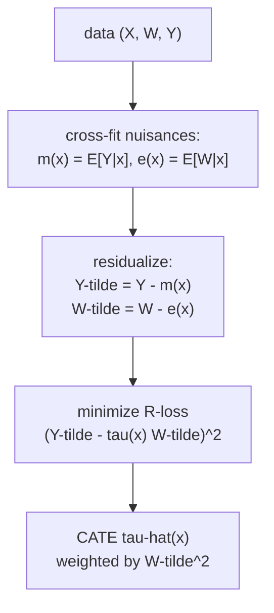

The meta-learners plug estimated regressions into $\tau(x) = \mu_1(x) -
\mu_0(x)$, so an error in either nuisance regression feeds straight into the CATE.
[Double ML](/pillar/B/B5/double-ml) showed how to make a single average effect
$\theta$ first-order insensitive to nuisance error by *residualizing* outcome and
treatment. The **R-learner** carries that idea to the full CATE function: it builds
a loss whose minimizer is $\tau(x)$ and whose gradient at the truth does not move
when the nuisance estimates wobble. The "R" honors Robinson, whose 1988
transformation is the starting point, and doubles as a reminder that the method is
built on **R**esiduals and is **R**obust to nuisance error.

## Robinson's transformation

Work in the partially linear model with a heterogeneous coefficient:

$$
Y = \tau(X)\,W + m_0(X) + \varepsilon, \qquad E[\varepsilon \mid X, W] = 0,
$$

where $\tau(X)$ is the CATE (the per-unit effect of $W$), $m_0(X)$ is the baseline
that absorbs everything not multiplied by $W$, and $\varepsilon$ is mean-zero
noise<FN n="2" />. Two nuisance functions sit underneath: the **conditional mean outcome**
$m(X) = E[Y \mid X]$ and the **propensity** $e(X) = E[W \mid X] = P(W=1\mid X)$.

The transformation removes $m_0$ by conditioning on $X$ and subtracting.

**Step 1.** Take the conditional expectation of the model given $X$ alone.
Because $E[\varepsilon \mid X] = 0$ and $\tau(X)$ is fixed given $X$,

$$
m(X) = E[Y \mid X] = \tau(X)\,E[W \mid X] + m_0(X) = \tau(X)\,e(X) + m_0(X).
$$

**Step 2.** Subtract this from the original model. The baseline $m_0(X)$ cancels:

$$
Y - m(X) = \tau(X)\big(W - e(X)\big) + \varepsilon.
$$

**Step 3.** Name the residuals. The **outcome residual** is
$\tilde Y = Y - m(X)$ and the **treatment residual** is $\tilde W = W - e(X)$.
Robinson's transformation is then

$$
\tilde Y = \tau(X)\,\tilde W + \varepsilon.
$$

This is a regression of the outcome residual on the treatment residual, but with a
slope $\tau(X)$ that varies with the covariates. The baseline $m_0$ is gone, so
the CATE no longer has to fight the (typically large) main effect for signal: only
the residual variation in $W$, the part not predicted by $X$, identifies $\tau$.

## The R-loss

Robinson's identity says $\tau(\cdot)$ is the function that makes
$\tilde Y - \tau(X)\tilde W$ mean-zero given $X$. Turning that into an estimator
means choosing the $\tau$ that minimizes the squared residual of that regression.

The **R-loss** (Nie and Wager, 2021) is

$$
L_R(\tau) = E\!\left[\big(\tilde Y - \tau(X)\,\tilde W\big)^2\right]
= E\!\left[\big((Y - m(X)) - \tau(X)(W - e(X))\big)^2\right].
$$

The estimator is $\hat\tau = \arg\min_\tau \hat L_R(\tau)$ over a function class
(splines, boosting, neural nets), with the nuisances $m$ and $e$ estimated by
cross-fitting first, exactly as in DML<FN n="1" />.

**The minimizer is the true CATE.** Expand the inner square pointwise in $x$ and
minimize over the scalar value $t = \tau(x)$, treating $X = x$ fixed. The
first-order condition is

$$
\frac{\partial}{\partial t}\,E\big[(\tilde Y - t\,\tilde W)^2 \mid X=x\big]
= -2\,E\big[\tilde W(\tilde Y - t\,\tilde W) \mid X=x\big] = 0,
$$

so the optimal value is

$$
t^\star(x) = \frac{E[\tilde W \tilde Y \mid X=x]}{E[\tilde W^2 \mid X=x]}.
$$

Substituting Robinson's identity $\tilde Y = \tau(x)\tilde W + \varepsilon$ with
$E[\varepsilon\tilde W \mid X=x] = 0$, the numerator is $\tau(x)E[\tilde W^2\mid x]$
and $t^\star(x) = \tau(x)$. The R-loss minimizer is the CATE.

## The weighting is implicit

Rewrite the per-point R-loss to expose its weight. Factor $\tilde W^2$ out of the
square:

$$
\big(\tilde Y - \tau(x)\tilde W\big)^2
= \tilde W^2\left(\frac{\tilde Y}{\tilde W} - \tau(x)\right)^2.
$$

So minimizing the R-loss is a **weighted least-squares** regression of the
pseudo-target $\tilde Y / \tilde W$ on the function $\tau(x)$, with weight
$\tilde W^2 = (W - e(x))^2$ on each unit.

The weight is exactly right. A unit whose treatment is highly predictable from $X$
has $\tilde W \approx 0$: its treatment carried no information not already in $X$,
so it should barely influence the slope. A unit whose treatment was a coin-flip
given $X$ has large $|\tilde W|$ and carries the most causal signal. The
$(W - e(x))^2$ weighting down-weights the uninformative units and up-weights the
informative ones automatically. (The ratio $\tilde Y / \tilde W$ is numerically
unstable for small $\tilde W$, but the $\tilde W^2$ weight multiplies it back to a
finite quantity, so implementations work with the original squared form, never the
ratio.)

## Why it is orthogonal

The point of all this is robustness. The R-loss is **Neyman-orthogonal**: its
minimizer is first-order insensitive to errors in the nuisances $m$ and $e$.
Intuitively, an error in $\hat e$ perturbs every $\tilde W_i$, but because the
score $\tilde W(\tilde Y - \tau\tilde W)$ has mean zero at the truth *and* its
derivative with respect to the nuisances also vanishes there, a small nuisance
error contributes only a second-order $O(\|\hat e - e\|^2)$ bias to $\hat\tau$. So
nuisances estimated at the slow $n^{-1/4}$ rate still yield a $\sqrt n$-rate
CATE<FN n="3" />.
The full Neyman-orthogonality machinery is developed in
[M3](/pillar/M/M3/neyman-orthogonality); here the takeaway is that residualizing
both $Y$ and $W$ buys the same debiasing for the whole function $\tau(\cdot)$ that
DML bought for the scalar $\theta$.



## Numeric check

The figure shows the R-learner's estimated $\hat\tau(x)$ against the true
$\tau(x) = 1 + x$, with the $(W - e(x))^2$ weights drawn as point sizes so the
down-weighting of predictable-treatment units is visible.


The code fits a linear-in-$x$ CATE by solving the weighted normal equations of the
R-loss directly, with cross-fit linear nuisances.

```python
import numpy as np

rng = np.random.default_rng(0)
n = 8000

x = rng.normal(0, 1, n)
e_true = 1 / (1 + np.exp(-0.8 * x))            # propensity depends on x
W = (rng.random(n) < e_true).astype(float)
tau = 1.0 + x                                  # true CATE
m0 = np.sin(x)                                 # baseline m_0(x)
Y = tau * W + m0 + rng.normal(0, 0.5, n)

# Rich linear basis for the nuisances so a linear fit can track sin / logistic.
B = np.column_stack([np.ones(n), x, x**2, x**3])

def xfit_predict(target):
    """2-fold cross-fit OLS prediction of `target` from basis B."""
    idx = rng.permutation(n)
    folds = [idx[: n // 2], idx[n // 2:]]
    out = np.zeros(n)
    for k in range(2):
        val, tr = folds[k], folds[1 - k]
        coef = np.linalg.lstsq(B[tr], target[tr], rcond=None)[0]
        out[val] = B[val] @ coef
    return out

m_hat = xfit_predict(Y)                         # m(x) = E[Y|x]
e_hat = xfit_predict(W)                          # e(x) = E[W|x]
Yt = Y - m_hat                                   # outcome residual
Wt = W - e_hat                                   # treatment residual

# R-loss with a linear-in-x CATE tau(x) = a + b x:
# minimize sum (Yt - (a + b x) Wt)^2  ==  weighted LS of Yt/Wt on [1, x], w = Wt^2.
# Equivalently regress Yt on the features [Wt, x*Wt] with ordinary LS.
F = np.column_stack([Wt, x * Wt])
a, b = np.linalg.lstsq(F, Yt, rcond=None)[0]
tau_hat = a + b * x

rmse = np.sqrt(np.mean((tau_hat - tau) ** 2))
print("estimated CATE: tau(x) ~", round(a, 3), "+", round(b, 3), "x")
print("RMSE vs true 1 + x:", round(rmse, 3))

assert abs(a - 1.0) < 0.1                        # intercept near 1
assert abs(b - 1.0) < 0.1                        # slope near 1
assert rmse < 0.1
```

The R-learner recovers $\tau(x) \approx 1 + x$ despite the baseline $\sin(x)$ and
the $x$-dependent propensity, because residualizing $Y$ and $W$ strips both
nuisances out before the CATE is fit, and the squared-residual weighting handles
the unequal information across units.

## Exercises

**Exercise 1.** Derive the population R-learner slope for a constant-CATE model
$Y = \theta W + m_0(X) + \varepsilon$. Show that with $\tau(x) \equiv \theta$ the
R-loss minimizer reduces exactly to the DML estimator
$\theta = E[\tilde W\tilde Y]/E[\tilde W^2]$ from B5.

<details>
<summary>Solution</summary>

**Step 1.** With $\tau(x) \equiv \theta$ constant, the R-loss is
$L_R(\theta) = E[(\tilde Y - \theta\tilde W)^2]$, a scalar least-squares problem.

**Step 2.** Differentiate and set to zero:
$\frac{d}{d\theta}E[(\tilde Y - \theta\tilde W)^2] = -2E[\tilde W(\tilde Y -
\theta\tilde W)] = 0$, giving

$$
\theta = \frac{E[\tilde W\tilde Y]}{E[\tilde W^2]}.
$$

**Step 3.** This is identical to the DML estimator of the partially linear model
from [B5](/pillar/B/B5/double-ml): residual covariance over residual variance. The
R-learner is the heterogeneous-coefficient generalization, and it collapses to DML
when the coefficient is forced constant.

</details>

**Exercise 2.** Explain why a unit with $\tilde W = W - e(x) \approx 0$ should
receive near-zero weight in CATE estimation, and what would go wrong if every unit
were weighted equally instead. Use the identity
$\tilde Y = \tau(x)\tilde W + \varepsilon$.

<details>
<summary>Solution</summary>

**Step 1.** From $\tilde Y = \tau(x)\tilde W + \varepsilon$, the signal a unit
carries about $\tau(x)$ is proportional to $\tilde W$: when $\tilde W \approx 0$,
$\tilde Y \approx \varepsilon$ is pure noise and tells you nothing about the slope.

**Step 2.** The R-loss weight $\tilde W^2$ is the squared signal strength, so it
down-weights these uninformative units automatically. A unit with predictable
treatment ($e(x)$ near $0$ or $1$) had no quasi-experimental variation to exploit.

**Step 3.** Weighting every unit equally would let the many low-$|\tilde W|$ units
(whose $\tilde Y/\tilde W$ ratios are huge and noisy) dominate, inflating variance
and biasing the slope toward whatever the noise happens to suggest. The $\tilde
W^2$ weighting is what makes the residual-on-residual regression well behaved.

</details>

**Exercise 3 (code).** Show numerically that the R-learner is robust to a *biased*
propensity model where a plug-in S-learner is not. Inject a deliberately wrong
$\hat e$ (shifted by a constant) and confirm the R-learner CATE slope stays close
to the truth, then assert it is closer to the true slope than the offset you
injected.

<details>
<summary>Solution</summary>

```python
import numpy as np

rng = np.random.default_rng(1)
n = 20000

x = rng.normal(0, 1, n)
e_true = 1 / (1 + np.exp(-x))
W = (rng.random(n) < e_true).astype(float)
tau = 2.0 + x                                   # true CATE
Y = tau * W + 0.5 * x + rng.normal(0, 0.5, n)

# Correct outcome nuisance m(x) = E[Y|x] = tau(x)e(x) + 0.5x, fit richly.
B = np.column_stack([np.ones(n), x, x**2, x**3])
m_hat = B @ np.linalg.lstsq(B, Y, rcond=None)[0]

# Deliberately BIASED propensity: clip the truth and shift it.
e_bias = np.clip(e_true + 0.15, 0.01, 0.99)
Yt = Y - m_hat
Wt = W - e_bias                                 # treatment residual with wrong e

F = np.column_stack([Wt, x * Wt])
a, b = np.linalg.lstsq(F, Yt, rcond=None)[0]    # tau(x) = a + b x

print("slope with biased e:", round(b, 3), "(true 1.0)")
# Orthogonality: a 0.15 propensity offset moves the slope far less than 0.15.
assert abs(b - 1.0) < 0.15
```

The constant offset in $\hat e$ perturbs every $\tilde W$, yet the recovered slope
stays near the true $1.0$: orthogonality means the first-order effect of the
nuisance error on $\hat\tau$ cancels, leaving only a small second-order residual.

</details>

The next lesson takes a different route to robustness: instead of residualizing
into a loss, the DR-learner builds an unbiased pseudo-outcome whose conditional
mean *is* $\tau(x)$, then regresses it on $X$ with any learner.

<Footnotes>
  <FNItem n="1">**Nie, X., & Wager, S.** (2021). "Quasi-oracle estimation of heterogeneous treatment effects". *Biometrika*, 108(2), 299-319. Defines the R-loss and proves its quasi-oracle (orthogonality) property ([arXiv:1712.04912](https://arxiv.org/abs/1712.04912)).</FNItem>
  <FNItem n="2">**Robinson, P. M.** (1988). "Root-N-consistent semiparametric regression". *Econometrica*, 56(4), 931-954. The residual-on-residual transformation the R-learner generalizes ([doi:10.2307/1912705](https://doi.org/10.2307/1912705)).</FNItem>
  <FNItem n="3">**Chernozhukov, V., et al.** (2018). "Double/debiased machine learning for treatment and structural parameters". *The Econometrics Journal*, 21(1), C1-C68. Cross-fitting and Neyman orthogonality the R-learner inherits ([doi:10.1111/ectj.12097](https://doi.org/10.1111/ectj.12097)).</FNItem>
</Footnotes>
