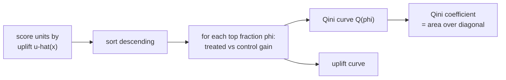

A marketing team can send a coupon to a limited number of customers. Ranking
customers by who is *likeliest to buy* wastes the budget on **sure things** (who
would have bought anyway) and **lost causes** (who never will). The coupon pays off
only for **persuadables**, customers who buy *because of* the coupon. Ranking by
predicted purchase probability cannot find them; ranking by the *treatment effect*
can. **Uplift modeling** is CATE estimation aimed at this targeting decision, and
its evaluation needs curves built for effects, not for accuracy<FN n="1" />. This
lesson covers the framing, the Qini and uplift curves, and estimating a policy's
value from logged data.

## Uplift is the CATE, viewed as a score

For a binary outcome $Y \in \{0, 1\}$ (purchase / no purchase) and binary
treatment $W$ (coupon / none), the **uplift** of a unit with covariates $x$ is just
the CATE:

$$
u(x) = \tau(x) = P(Y = 1 \mid X = x, \text{do}(W{=}1)) - P(Y = 1\mid X=x,
\text{do}(W{=}0)).
$$

Under the ignorability of the [first lesson](/pillar/M/M2/cate-estimand) this is
$\mu_1(x) - \mu_0(x)$ with $\mu_w(x) = P(Y{=}1\mid x, W{=}w)$, estimable by any
meta-learner<FN n="3" />. The four response types partition customers by the sign
of $u(x)$ and their baseline:

| Type | Buys if treated | Buys if not | uplift $u(x)$ |
|---|---|---|---|
| Persuadable | yes | no | $+1$ |
| Sure thing | yes | yes | $0$ |
| Lost cause | no | no | $0$ |
| Sleeping dog | no | yes | $-1$ |

A purchase-probability model scores sure things highest; an uplift model scores
persuadables highest and pushes sleeping dogs (whom the coupon *deters*) to the
bottom. Targeting by uplift is the value-maximizing policy, which
[M5](/pillar/M/M5/optimal-policies) develops formally.

## Evaluating an uplift ranking: the uplift and Qini curves

Accuracy metrics do not apply: the per-unit effect is never observed, so there is
no label to compare $\hat u(x)$ against. The trick is to evaluate the **ranking**
on a held-out set where both arms are present, by measuring the realized treatment
effect among the top-scored fraction.

Sort the validation units by $\hat u(x)$ descending. For each prefix of the top
$k$ units, split that prefix into its treated and control members and measure the
**incremental gain**: how many more positive outcomes the treated got than the
control, scaled to the same group size.

**The uplift curve.** Plot, against the fraction $\phi = k/n$ of the population
targeted, the difference in *response rate* between treated and control within the
top-$\phi$ prefix:

$$
\text{uplift}(\phi) = \bar Y_{\,1}(\phi) - \bar Y_{\,0}(\phi),
$$

where $\bar Y_{w}(\phi)$ is the mean outcome among the arm-$w$ units in the top
$\phi$. A good model puts high-uplift units first, so the curve starts high.

**The Qini curve.** The Qini reports the *cumulative incremental number of
positive outcomes* gained by treating the top $\phi$, corrected for the unequal
arm sizes in each prefix. With $n_t(\phi), n_c(\phi)$ the treated/control counts
and $Y_t(\phi), Y_c(\phi)$ their positive-outcome counts in the top $\phi$:

$$
Q(\phi) = Y_t(\phi) - Y_c(\phi)\,\frac{n_t(\phi)}{n_c(\phi)}.
$$

The factor $n_t/n_c$ rescales the control count to the treated group's size, so
$Q(\phi)$ is the extra conversions attributable to treating that prefix. Against
$Q$, a **random-targeting baseline** is the straight line from $(0,0)$ to
$(1, Q(1))$: a model with no skill gains conversions in proportion to how many it
treats. The **Qini coefficient** is the area between the model's Qini curve and
that diagonal, the uplift analogue of AUC<FN n="2" />. Larger area means the model
concentrates the gains in a small targeted fraction.



## The value of a targeting policy from logged data

A targeting policy $\pi(x) \in \{0, 1\}$ decides who to treat. Its **value** is the
expected outcome if everyone were assigned by $\pi$:

$$
V(\pi) = E\big[\,Y(\pi(X))\,\big].
$$

From **logged data** (units treated under some known logging propensity $e(x)$,
not under $\pi$) the value is estimated by **inverse-propensity weighting**: keep
each unit only when its logged action matches $\pi$, and reweight by the
probability of that action:

$$
\hat V(\pi) = \frac{1}{n}\sum_{i=1}^n
\frac{\mathbf{1}\{W_i = \pi(X_i)\}}{\,P(W_i\mid X_i)\,}\,Y_i,
\qquad P(W_i\mid X_i) = e(X_i)^{W_i}(1 - e(X_i))^{1 - W_i}.
$$

The indicator drops units whose logged treatment disagrees with $\pi$; the
$1/P(W\mid X)$ weight corrects for the logging policy oversampling some actions.
The conditional mean of each kept-and-reweighted term is $E[Y(\pi(x))\mid x]$, so
$\hat V(\pi)$ is unbiased for $V(\pi)$ under overlap. The **incremental value** of a
targeting policy over treating no one is $\hat V(\pi) - \hat V(\pi \equiv 0)$, the
estimated lift from deploying the model. This IPW value estimator is the entry
point to off-policy evaluation, taken up in detail in
[M5](/pillar/M/M5/off-policy-evaluation).

## Numeric check

The figure plots a Qini curve for an uplift model against the random-targeting
diagonal, with the shaded Qini area. The code builds a synthetic targeting problem
with all four response types, scores units by a T-learner uplift, and computes the
Qini curve and the IPW policy value.


```python
import numpy as np

rng = np.random.default_rng(0)
n = 20000

x = rng.uniform(-1, 1, n)                       # one covariate
e = 0.5                                          # randomized logging (A/B test)
W = (rng.random(n) < e).astype(float)
# Uplift rises with x: high-x are persuadables, low-x are sleeping dogs.
p0 = 0.3 + 0.0 * x                               # baseline buy prob
uplift = 0.4 * x                                 # true CATE in {-0.4..0.4}
p1 = np.clip(p0 + uplift, 0, 1)
Y = np.where(W == 1, rng.random(n) < p1, rng.random(n) < p0).astype(float)

# T-learner uplift score: difference of within-arm response means by x-bin.
bins = np.linspace(-1, 1, 21)
b = np.clip(np.digitize(x, bins), 1, len(bins) - 1)
score = np.zeros(n)
for k in np.unique(b):
    m = b == k
    t, c = m & (W == 1), m & (W == 0)
    if t.sum() and c.sum():
        score[m] = Y[t].mean() - Y[c].mean()

# Qini curve: sort by score desc, accumulate treated/control gains.
order = np.argsort(-score)
Ws, Ys = W[order], Y[order]
nt = np.cumsum(Ws)                               # treated count in prefix
nc = np.cumsum(1 - Ws)                           # control count in prefix
yt = np.cumsum(Ys * Ws)                          # treated positives
yc = np.cumsum(Ys * (1 - Ws))                    # control positives
with np.errstate(divide="ignore", invalid="ignore"):
    qini = yt - yc * np.where(nc > 0, nt / nc, 0.0)
phi = np.arange(1, n + 1) / n

# Qini coefficient: area between curve and the random diagonal.
diag = phi * qini[-1]
qini_coef = np.trapz(qini - diag, phi)
print("Qini at full population:", round(qini[-1], 1))
print("Qini coefficient (area over diagonal):", round(qini_coef, 1))

# IPW value of "treat the top 50% by score" vs treat-nobody.
pi = (score >= np.median(score)).astype(float)
prob = np.where(W == 1, e, 1 - e)
match = (W == pi)
V_pi = np.mean(match / prob * Y)
match0 = (W == 0)
V_none = np.mean(match0 / (1 - e) * Y)
print("policy value:", round(V_pi, 3), " treat-nobody value:", round(V_none, 3))

assert qini_coef > 0                             # model beats random targeting
assert V_pi > V_none                             # targeting the top half lifts value
```

The Qini coefficient is positive (the model ranks persuadables ahead of sleeping
dogs, so its curve bows above the diagonal), and the IPW value of treating the
top-scored half exceeds treating nobody, confirming the uplift ranking turns into
real lift.

## Exercises

**Exercise 1.** Classify each response type by $(\mu_1, \mu_0)$ and state which the
coupon should target. For a population that is 20% persuadable ($u=+1$), 30% sure
things, 40% lost causes, and 10% sleeping dogs ($u=-1$), compute the average uplift
and the value gained by perfectly targeting only persuadables.

<details>
<summary>Solution</summary>

**Step 1.** With $\mu_1, \mu_0$ the buy probabilities under treatment / control:
persuadable $(1, 0)$ has $u=+1$; sure thing $(1,1)$ and lost cause $(0,0)$ have
$u=0$; sleeping dog $(0,1)$ has $u=-1$. Only persuadables are worth treating; sure
things and lost causes are wasted spend, sleeping dogs are actively harmed.

**Step 2.** Average uplift if everyone is treated:
$0.2(+1) + 0.3(0) + 0.4(0) + 0.1(-1) = 0.2 - 0.1 = 0.1$.

**Step 3.** Perfect targeting treats only the 20% persuadables, collecting $+1$
each for an average gain of $0.2$, and avoids the $-0.1$ that the sleeping dogs
would have cost under blanket treatment. The targeted value $0.2$ doubles the
blanket-treatment value $0.1$.

</details>

**Exercise 2.** Explain why the Qini curve rescales the control positives by
$n_t(\phi)/n_c(\phi)$ rather than comparing raw counts. What would the curve report
if treated and control prefixes had very different sizes and you skipped the
rescaling?

<details>
<summary>Solution</summary>

**Step 1.** In any prefix the treated and control subgroups generally have
different sizes $n_t(\phi) \neq n_c(\phi)$, because sorting by score does not
preserve the arm balance. Raw $Y_t - Y_c$ would then mix the treatment effect with
a pure size difference.

**Step 2.** Scaling the control positives by $n_t/n_c$ projects the control
response onto the treated group's size, so $Y_t - Y_c(n_t/n_c)$ estimates the
*incremental* conversions the treatment caused within a group of $n_t$ units.

**Step 3.** Without rescaling, a prefix that happened to contain more treated units
would show a large positive "gain" even with zero true uplift, because $Y_t$ counts
over more units than $Y_c$. The Qini would credit the model for an artifact of arm
imbalance rather than for real persuasion.

</details>

**Exercise 3 (code).** Show that an uplift-based ranking yields a higher Qini area
than ranking by predicted *purchase probability* on data with sure things and
persuadables. Build both rankings and assert the uplift ranking's Qini coefficient
is larger.

<details>
<summary>Solution</summary>

```python
import numpy as np

rng = np.random.default_rng(4)
n = 40000

# Two groups: "sure things" (high baseline, zero uplift) and
# "persuadables" (low baseline, high uplift).
group = rng.integers(0, 2, n)                   # 0 = sure thing, 1 = persuadable
p0 = np.where(group == 0, 0.8, 0.1)             # control buy prob
up = np.where(group == 0, 0.0, 0.5)             # true uplift
p1 = p0 + up
W = (rng.random(n) < 0.5).astype(float)
Y = np.where(W == 1, rng.random(n) < p1, rng.random(n) < p0).astype(float)

def qini_area(score):
    order = np.argsort(-score)
    Ws, Ys = W[order], Y[order]
    nt, nc = np.cumsum(Ws), np.cumsum(1 - Ws)
    yt, yc = np.cumsum(Ys * Ws), np.cumsum(Ys * (1 - Ws))
    with np.errstate(divide="ignore", invalid="ignore"):
        q = yt - yc * np.where(nc > 0, nt / nc, 0.0)
    phi = np.arange(1, n + 1) / n
    return np.trapz(q - phi * q[-1], phi)

# Ranking A: by predicted purchase probability (favors sure things).
prob_score = np.where(group == 0, 0.8, 0.1)
# Ranking B: by true uplift (favors persuadables).
uplift_score = up

qa, qb = qini_area(prob_score), qini_area(uplift_score)
print("Qini area, probability ranking:", round(qa, 1))
print("Qini area, uplift ranking:    ", round(qb, 1))

assert qb > qa                                  # uplift ranking targets better
```

Ranking by purchase probability puts sure things (zero uplift) first and wastes the
budget; ranking by uplift puts persuadables first, so its Qini curve bows higher
and its area is larger.

</details>

This closes the M2 estimation arc: from defining the CATE, through meta-learners,
the orthogonal R- and DR-learners, and forests, to turning estimated effects into a
scored, evaluable targeting policy. The next subsection, M3, opens the
semiparametric theory (influence functions and Neyman orthogonality) that explains
*why* the residualized and doubly-robust constructions used here are the right ones.

<Footnotes>
  <FNItem n="1">**Gutierrez, P., & Gérardy, J.-Y.** (2017). "Causal inference and uplift modelling: a review of the literature". *Proceedings of Machine Learning Research*, 67, 1-13. Response-type taxonomy, uplift and Qini curves.</FNItem>
  <FNItem n="2">**Radcliffe, N. J.** (2007). "Using control groups to target on predicted lift: building and assessing uplift models". *Direct Marketing Analytics Journal*, 1, 14-21. Origin of the Qini curve and coefficient.</FNItem>
  <FNItem n="3">**Künzel, S. R., Sekhon, J. S., Bickel, P. J., & Yu, B.** (2019). "Metalearners for estimating heterogeneous treatment effects using machine learning". *PNAS*, 116(10), 4156-4165. The meta-learner uplift scores used here ([arXiv:1706.03461](https://arxiv.org/abs/1706.03461)).</FNItem>
</Footnotes>
