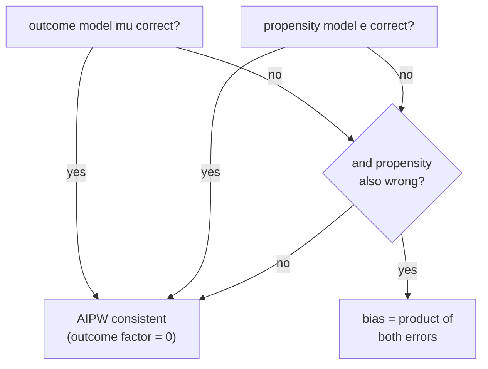

B5 gave two single-model estimators of the ATE: outcome regression (the
**direct method**, model $\mu_w(x) = E[Y \mid W=w, X=x]$, average the predicted
difference) and inverse-propensity weighting (model the propensity
$e(x) = P(W=1 \mid x)$, reweight). Each is consistent only if *its* model is right.
The previous lesson built the machinery (orthogonal scores) that should combine
them so that a single wrong model is survivable. This lesson does the combining
explicitly: the **augmented IPW** (AIPW) estimator is the efficient influence
function for the ATE turned into an estimator, and it is **doubly robust**:
consistent if **either** the outcome model **or** the propensity model is correct,
not necessarily both.

## The efficient influence function for the ATE

Under ignorability ($W \perp (Y(0), Y(1)) \mid X$) and overlap ($0 < e(x) < 1$),
the ATE $\theta = E[Y(1) - Y(0)]$ is identified, and its efficient influence
function (the EIF from lesson 1) is<FN n="1" />

$$
\phi(O; \eta) = \underbrace{\mu_1(X) - \mu_0(X)}_{\text{plug-in (direct)}} + \underbrace{\frac{W\,(Y - \mu_1(X))}{e(X)} - \frac{(1-W)\,(Y - \mu_0(X))}{1 - e(X)}}_{\text{augmentation}} - \theta,
$$

with nuisances $\eta = (\mu_0, \mu_1, e)$. The first part is the direct-method
estimand. The augmentation reweights the **residuals** $Y - \mu_w(X)$ by the
inverse propensity, correcting the plug-in for whatever the outcome model missed.
Setting the sample average of $\phi$ to zero gives the **AIPW estimator**

$$
\hat\theta_{\mathrm{AIPW}} = \frac{1}{n}\sum_{i=1}^n \left[ \hat\mu_1(X_i) - \hat\mu_0(X_i) + \frac{W_i\,(Y_i - \hat\mu_1(X_i))}{\hat e(X_i)} - \frac{(1-W_i)\,(Y_i - \hat\mu_0(X_i))}{1 - \hat e(X_i)} \right].
$$

Each unit contributes its predicted effect plus a residual correction applied only
through its own observed arm.

## The double-robustness identity

The key algebraic fact is how the *bias* of $\hat\theta_{\mathrm{AIPW}}$ factors.
Look at the treated half (the control half is symmetric). Write $\mu_1$ for the
working outcome model and $e$ for the working propensity, $\mu_1^\star$ and
$e^\star$ for the truths. The treated half estimates $E[Y(1)]$ via

$$
\psi_1 = \mu_1(X) + \frac{W\,(Y - \mu_1(X))}{e(X)}.
$$

**Step 1.** Take its expectation and use that $W$ is conditionally Bernoulli with
true probability $e^\star(X)$, and $E[Y \mid W=1, X] = \mu_1^\star(X)$:

$$
E[\psi_1 \mid X] = \mu_1(X) + \frac{e^\star(X)}{e(X)}\big(\mu_1^\star(X) - \mu_1(X)\big).
$$

The $W(Y - \mu_1)/e$ term has conditional mean $\frac{e^\star}{e}(\mu_1^\star - \mu_1)$
because $E[W \mid X] = e^\star$ and $E[Y - \mu_1 \mid W=1, X] = \mu_1^\star - \mu_1$.

**Step 2.** Subtract the target $\mu_1^\star(X)$ to get the conditional bias:

$$
E[\psi_1 \mid X] - \mu_1^\star(X) = \big(\mu_1(X) - \mu_1^\star(X)\big) + \frac{e^\star(X)}{e(X)}\big(\mu_1^\star(X) - \mu_1(X)\big).
$$

**Step 3.** Factor out $(\mu_1 - \mu_1^\star)$:

$$
\boxed{\;E[\psi_1 \mid X] - \mu_1^\star(X) = \Big(1 - \frac{e^\star(X)}{e(X)}\Big)\big(\mu_1(X) - \mu_1^\star(X)\big)\;}
$$

The bias is a **product of two errors**: the propensity error
$\big(1 - \frac{e^\star}{e}\big)$, which is zero when $e = e^\star$, and the
outcome error $(\mu_1 - \mu_1^\star)$, which is zero when $\mu_1 = \mu_1^\star$.

This is **double robustness**: the bias vanishes if **either** factor is zero.

- If the outcome model is correct ($\mu_1 = \mu_1^\star$), the second factor is
  zero regardless of the propensity. The estimator is consistent even with a
  badly wrong $\hat e$.
- If the propensity is correct ($e = e^\star$), the first factor is zero
  regardless of the outcome model. Consistent even with a badly wrong $\hat\mu$.

Only if **both** are wrong does the product survive and bias the estimate. The
same factoring holds for the control half with $e \to 1 - e$, so the full AIPW
estimator inherits the property.



Compare to the single-model estimators: the direct method needs $\mu$ right, IPW
needs $e$ right, and each fails entirely if its one model is wrong. AIPW gives two
chances and only fails if both miss. The connection to lesson 2: this "either model
correct" statement is the *exact-identity* strengthening of the rate-double-robust
product condition, because the bias is literally the product of the two model
errors.

## A numeric trace

Take a setting where the outcome model is correct but the propensity is wrong. With
$\mu_1^\star(x) = x$, suppose the working models are $\mu_1(x) = x$ (correct) and a
constant-misspecified $e(x) = 0.5$ while truly $e^\star(x) = \sigma(x)$. Then the
treated-half bias factor $(\mu_1 - \mu_1^\star) = 0$ at every $x$, so the product
is zero pointwise and AIPW returns the truth despite $e$ being wrong everywhere.
Swap which model is right and the same cancellation occurs through the other
factor. The code below runs both misspecification regimes.

## Implementation

```python
import numpy as np

rng = np.random.default_rng(0)
n = 60_000

# Ground truth: X confounds; true ATE = 1.0 (constant effect).
X = rng.normal(0, 1, n)
e_star = 1 / (1 + np.exp(-0.8 * X))            # true propensity
W = (rng.uniform(size=n) < e_star).astype(float)
mu0_star = 0.5 * X                              # true E[Y(0)|X]
mu1_star = 0.5 * X + 1.0                        # true E[Y(1)|X], ATE = 1.0
Y = np.where(W == 1, mu1_star, mu0_star) + rng.normal(0, 0.5, n)

def aipw(mu0, mu1, e):
    e = np.clip(e, 1e-3, 1 - 1e-3)
    psi = (mu1 - mu0
           + W * (Y - mu1) / e
           - (1 - W) * (Y - mu0) / (1 - e))
    return psi.mean()

# Correct outcome model, WRONG (constant) propensity:
print("outcome OK, propensity wrong:",
      round(aipw(mu0_star, mu1_star, np.full(n, 0.5)), 3))
# WRONG (constant) outcome model, correct propensity:
print("propensity OK, outcome wrong:",
      round(aipw(np.zeros(n), np.zeros(n), e_star), 3))
# Both wrong: biased
print("both wrong:               ",
      round(aipw(np.zeros(n), np.zeros(n), np.full(n, 0.5)), 3))

# Double robustness: either-correct cases land near the truth 1.0; both-wrong does not.
assert abs(aipw(mu0_star, mu1_star, np.full(n, 0.5)) - 1.0) < 0.03
assert abs(aipw(np.zeros(n), np.zeros(n), e_star) - 1.0) < 0.03
assert abs(aipw(np.zeros(n), np.zeros(n), np.full(n, 0.5)) - 1.0) > 0.1
```

The first two estimates sit on the true ATE of $1.0$ with only one model correct;
only when both models are wrong does AIPW miss, exactly as the bias-product identity
predicts.


## Exercises

**Exercise 1.** Starting from the EIF, show that when the propensity is correct
($e = e^\star$) the *expected* AIPW augmentation term has mean zero, so the
estimator reduces to an unbiased reweighting regardless of the outcome model.

<details>
<summary>Solution</summary>

**Step 1.** The treated augmentation is $\frac{W(Y - \mu_1(X))}{e^\star(X)}$. Take
its expectation conditional on $X$. Since $E[W \mid X] = e^\star(X)$ and
$E[Y - \mu_1(X) \mid W=1, X] = \mu_1^\star(X) - \mu_1(X)$,

$$
E\!\left[\frac{W(Y - \mu_1)}{e^\star} \,\Big|\, X\right] = \frac{e^\star}{e^\star}\big(\mu_1^\star - \mu_1\big) = \mu_1^\star(X) - \mu_1(X).
$$

**Step 2.** Add the plug-in $\mu_1(X)$:
$E[\psi_1 \mid X] = \mu_1(X) + (\mu_1^\star(X) - \mu_1(X)) = \mu_1^\star(X)$. The
outcome model cancels exactly; the augmentation supplies whatever the plug-in got
wrong. Averaging over $X$ gives $E[Y(1)]$ for any $\mu_1$, so AIPW is consistent
under a correct propensity. This is the second branch of double robustness.

</details>

**Exercise 2.** AIPW's variance blows up when the propensity approaches $0$ or $1$
(weak overlap). Using the EIF, write the asymptotic variance contribution of the
treated arm and identify the term that diverges as $e(X) \to 0$.

<details>
<summary>Solution</summary>

**Step 1.** The treated-arm influence contribution is
$\mu_1(X) + \frac{W(Y - \mu_1(X))}{e(X)} - E[Y(1)]$. Its variance includes the
augmentation's second moment,
$E\!\left[\frac{W (Y - \mu_1)^2}{e(X)^2}\right]$.

**Step 2.** Condition on $X$: $E[W \mid X] = e(X)$ and
$E[(Y - \mu_1)^2 \mid W=1, X] = \operatorname{Var}(Y \mid W=1, X) = \sigma_1^2(X)$
at the truth, giving the per-$X$ contribution
$\frac{e(X)\,\sigma_1^2(X)}{e(X)^2} = \frac{\sigma_1^2(X)}{e(X)}$.

**Step 3.** As $e(X) \to 0$, $\frac{\sigma_1^2(X)}{e(X)} \to \infty$. Units with
tiny propensity get enormous inverse weights, so the variance diverges. This is why
overlap is required for finite-variance estimation and why practitioners trim or
overlap-weight units with extreme $\hat e$.

</details>

**Exercise 3 (code).** Verify the double-robustness *identity* (not just
consistency) directly: simulate with a known $\mu_1^\star$ and a deliberately wrong
$\mu_1$, and confirm the empirical treated-half bias matches the product
$\big(1 - \frac{e^\star}{e}\big)(\mu_1 - \mu_1^\star)$ averaged over $X$.

<details>
<summary>Solution</summary>

```python
import numpy as np

rng = np.random.default_rng(3)
n = 400_000
X = rng.normal(0, 1, n)
e_star = 1 / (1 + np.exp(-0.8 * X))
W = (rng.uniform(size=n) < e_star).astype(float)
mu1_star = 0.5 * X + 1.0
Y1 = mu1_star + rng.normal(0, 0.5, n)        # treated potential outcome
Y = np.where(W == 1, Y1, 0.0)                # only treated outcomes used below

# wrong working models: mu1 off by a covariate-dependent error, e off by a constant
mu1 = mu1_star + 0.3 * X                      # outcome error = 0.3*X
e = np.full(n, 0.5)                           # wrong propensity

psi1 = mu1 + W * (Y - mu1) / e
emp_bias = (psi1 - mu1_star).mean()

# predicted bias from the identity: (1 - e*/e) * (mu1 - mu1*)
pred_bias = ((1 - e_star / e) * (mu1 - mu1_star)).mean()

assert np.isclose(emp_bias, pred_bias, atol=0.01)
print(f"empirical bias {emp_bias:.4f}  vs  identity {pred_bias:.4f}")
```

The empirical bias of the treated half matches the product-of-errors formula,
confirming the boxed identity term by term.

</details>

The next lesson reaches the same EIF-solving estimate from a different direction:
instead of adding an augmentation term, TMLE *updates the outcome model itself*
with a propensity-driven fluctuation until the plug-in already solves the EIF
equation.

<Footnotes>
  <FNItem n="1">**Robins, J. M., Rotnitzky, A., & Zhao, L. P.** (1994). "Estimation of regression coefficients when some regressors are not always observed". *Journal of the American Statistical Association*, 89(427), 846-866. Introduces the augmented IPW / doubly-robust estimating equation.</FNItem>
  <FNItem n="2">**Bang, H., & Robins, J. M.** (2005). "Doubly robust estimation in missing data and causal inference models". *Biometrics*, 61(4), 962-973. Clean statement and proof of the double-robustness property.</FNItem>
</Footnotes>
