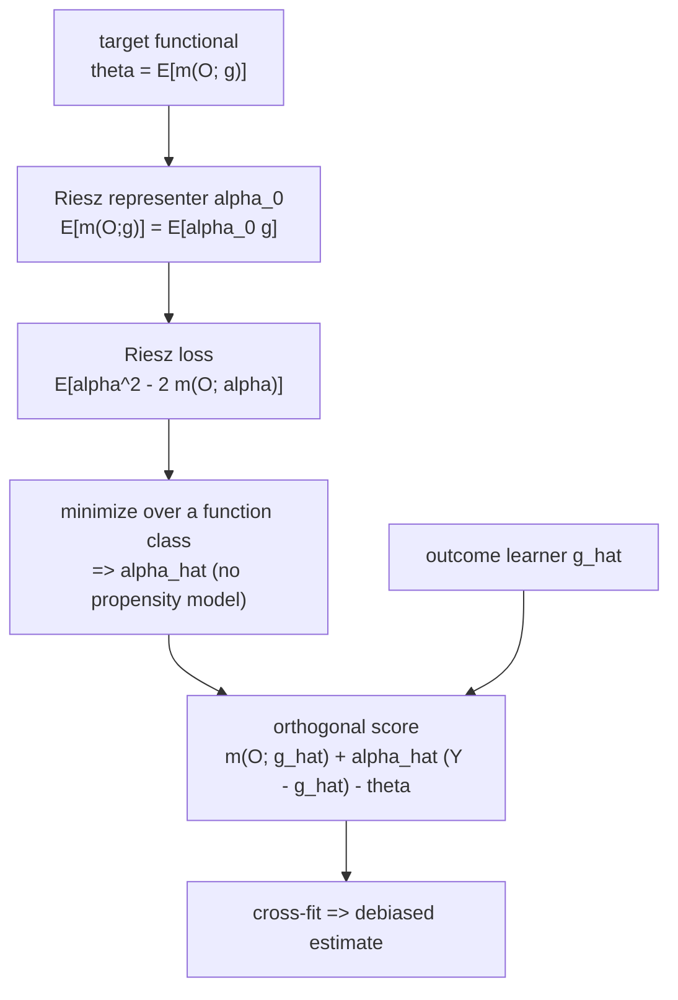

AIPW and TMLE both needed a hand-derived correction term: the inverse-propensity
weight $W/e - (1-W)/(1-e)$, obtained by working out the efficient influence function
of the ATE on paper. For a new estimand (an average derivative, a policy value, a
weighted average effect) the EIF has to be re-derived from scratch, which is exactly
the step practitioners get wrong. **Automatic debiased machine learning** (auto-DML)
removes that derivation. It shows the correction term is always a **Riesz
representer** $\alpha(x)$ of the target functional, and that $\alpha$ can be
**learned by minimizing a loss** that involves only the functional itself, never a
score derived by hand<FN n="1" />.

## Linear functionals and the bias of a plug-in

Many causal targets are **linear functionals of the outcome regression**. Write the
outcome regression as $g(W, X) = E[Y \mid W, X]$. A linear functional is

$$
\theta = E\big[m(O; g)\big],
$$

where $m$ is **linear in $g$** and known. Two examples:

- **ATE.** $m(O; g) = g(1, X) - g(0, X)$: evaluate the regression at both arms and
  difference. Linear in $g$.
- **Average derivative.** $m(O; g) = \partial_x g(x)$ for a continuous treatment:
  the mean slope. Also linear in $g$.

The naive plug-in $\hat\theta = \frac1n\sum_i m(O_i; \hat g)$ inherits the bias of
$\hat g$. The debiasing correction is what AIPW added; auto-DML identifies its
general form.

## The Riesz representer

Because $m(O; g)$ is linear and continuous in $g$, the **Riesz representation
theorem** guarantees a function $\alpha_0(W, X)$, the **Riesz representer**, such
that the functional's action equals an inner product against $\alpha_0$:

$$
E\big[m(O; g)\big] = E\big[\alpha_0(W, X)\, g(W, X)\big] \quad \text{for all } g .
$$

The representer $\alpha_0$ encodes "which weighting of $g$ does $m$ compute". For
the ATE, the representer is exactly the inverse-propensity weight:

$$
\alpha_0(W, X) = \frac{W}{e(X)} - \frac{1-W}{1-e(X)}.
$$

**Step 1.** Verify it represents the ATE functional. Compute
$E[\alpha_0(W,X)\,g(W,X)]$ by conditioning on $X$ and summing over the two arms,
using $P(W=1 \mid X) = e(X)$:

$$
E[\alpha_0 g \mid X] = e(X)\cdot\frac{g(1,X)}{e(X)} - (1-e(X))\cdot\frac{g(0,X)}{1-e(X)} = g(1,X) - g(0,X).
$$

**Step 2.** Average over $X$: $E[\alpha_0 g] = E[g(1,X) - g(0,X)] = E[m(O; g)]$. The
inverse-propensity weight is the Riesz representer of the ATE. The augmentation term
that AIPW added by hand, $\alpha_0(W,X)(Y - g(W,X))$, is the representer times the
outcome residual.

The general **Neyman-orthogonal (debiased) score** for any linear functional is

$$
\psi(O; \theta, g, \alpha) = m(O; g) + \alpha(W, X)\,\big(Y - g(W, X)\big) - \theta .
$$

Plug in the ATE representer and outcome regression and this is exactly AIPW. The
point of auto-DML is that $\alpha$ need not be derived: it can be learned.

## Learning the representer by minimizing the Riesz loss

The defining property $E[m(O;g)] = E[\alpha_0 g]$ holds for all $g$, in particular
for $g = \alpha$ itself. That makes $\alpha_0$ the minimizer of a loss with no
hand-derived score. Consider the population objective

$$
\mathcal L(\alpha) = E\big[\alpha(W, X)^2 - 2\, m(O; \alpha)\big] .
$$

The crucial move: $m(O; \alpha)$ uses the *same* operator $m$, now applied to the
candidate $\alpha$ in place of $g$. For the ATE, $m(O; \alpha) = \alpha(1, X) -
\alpha(0, X)$, computable from $\alpha$ alone without knowing the propensity.

**Step 1.** Rewrite the cross term using the representer identity
$E[m(O;\alpha)] = E[\alpha_0\,\alpha]$:

$$
\mathcal L(\alpha) = E[\alpha^2] - 2\,E[\alpha_0\,\alpha].
$$

**Step 2.** Complete the square by adding and subtracting $E[\alpha_0^2]$:

$$
\mathcal L(\alpha) = E\big[(\alpha - \alpha_0)^2\big] - E[\alpha_0^2].
$$

**Step 3.** The second term does not depend on $\alpha$, so minimizing
$\mathcal L$ minimizes $E[(\alpha - \alpha_0)^2]$, the mean-squared distance to the
true representer. The minimizer is $\alpha = \alpha_0$.

So the Riesz representer is recovered by minimizing the empirical **Riesz loss**

$$
\hat{\mathcal L}(\alpha) = \frac1n\sum_i \Big[\alpha(W_i, X_i)^2 - 2\, m(O_i; \alpha)\Big]
$$

over any function class (a linear basis, a forest, a neural net). No propensity
model, no score derivation: feed the loss the functional $m$ and it returns the
correction weight. This is the "automatic" in auto-DML. The estimator then plugs
$\hat\alpha$ and any outcome learner $\hat g$ into the orthogonal score above and
cross-fits, inheriting orthogonality and double robustness from the score's form.



## Concrete check: the loss recovers the inverse-propensity weight

For the ATE, the true representer is $1/e$ on treated units and $-1/(1-e)$ on
controls. Minimizing the Riesz loss over a flexible-enough class should return those
values. The code parameterizes $\alpha$ as a small basis expansion in $X$ per arm,
minimizes the empirical Riesz loss in closed form (it is quadratic in the
coefficients), and checks the fitted $\hat\alpha$ matches the known
inverse-propensity weight and that the resulting ATE estimate is correct.

## Implementation

```python
import numpy as np

rng = np.random.default_rng(0)
n = 80_000

X = rng.normal(0, 1, n)
e_star = 1 / (1 + np.exp(-0.8 * X))               # true propensity
W = (rng.uniform(size=n) < e_star).astype(float)
g1 = 0.5 * X + 1.0                                 # E[Y|W=1,X], true ATE = 1.0
g0 = 0.5 * X
Y = np.where(W == 1, g1, g0) + rng.normal(0, 0.5, n)

# Basis phi(x) = [1, x, x^2]; alpha(w,x) = w * (phi.beta1) + (1-w) * (phi.beta0).
phi = np.column_stack([np.ones(n), X, X**2])      # (n, 3)
# Stack the per-arm features so one linear model covers both arms:
#   feats[i] = [ W*phi , (1-W)*phi ]  (n, 6), so alpha = feats @ beta.
feats = np.hstack([W[:, None] * phi, (1 - W)[:, None] * phi])   # (n, 6)

# Riesz loss = mean(alpha^2) - 2*mean(m(O; alpha)),  with alpha = feats @ beta.
#   m(O; alpha) for the ATE = alpha(1,X) - alpha(0,X) = phi.beta1 - phi.beta0.
m_feats = np.hstack([phi, -phi])                  # (n, 6): m(O; alpha) = m_feats @ beta
# Quadratic in beta: minimize beta' A beta - 2 b' beta  =>  A beta = b.
A = feats.T @ feats / n                            # E[alpha^2] Hessian
b = m_feats.mean(axis=0)                           # E[m(O; alpha)] gradient piece
beta = np.linalg.solve(A, b)
alpha_hat = feats @ beta

# True inverse-propensity representer for comparison.
alpha_true = W / e_star - (1 - W) / (1 - e_star)

# Plug alpha_hat into the orthogonal score with the TRUE outcome regression g.
g_obs = np.where(W == 1, g1, g0)
m_term = g1 - g0                                   # m(O; g) for the ATE
theta = (m_term + alpha_hat * (Y - g_obs)).mean()

print(f"corr(alpha_hat, 1/e weight) = {np.corrcoef(alpha_hat, alpha_true)[0,1]:.3f}")
print(f"auto-DML ATE = {theta:.3f}   (true 1.0)")

assert np.corrcoef(alpha_hat, alpha_true)[0, 1] > 0.99   # loss recovers the IP weight
assert abs(theta - 1.0) < 0.03                           # debiased estimate is correct
```

The Riesz-loss minimizer reproduces the inverse-propensity weight to a correlation
above $0.99$ without ever fitting a propensity model, and the orthogonal score built
from it returns the true ATE.

## Exercises

**Exercise 1.** Derive the Riesz representer of the **average treated outcome**
functional $\theta = E[g(1, X)]$ (the mean outcome if everyone were treated). Show
it is $\alpha_0(W, X) = W / e(X)$.

<details>
<summary>Solution</summary>

**Step 1.** The functional is $m(O; g) = g(1, X)$, linear in $g$. Seek $\alpha_0$
with $E[g(1,X)] = E[\alpha_0(W,X)\,g(W,X)]$.

**Step 2.** Condition on $X$ and expand the right side over arms:
$E[\alpha_0 g \mid X] = e(X)\,\alpha_0(1,X)\,g(1,X) + (1-e(X))\,\alpha_0(0,X)\,g(0,X)$.
To match $g(1,X)$ for *every* $g$, the $g(0,X)$ coefficient must vanish
($\alpha_0(0,X) = 0$) and the $g(1,X)$ coefficient must equal $1$:
$e(X)\,\alpha_0(1,X) = 1$, so $\alpha_0(1,X) = 1/e(X)$.

**Step 3.** Combining, $\alpha_0(W,X) = W/e(X)$. The orthogonal score
$g(1,X) + \frac{W}{e(X)}(Y - g(1,X)) - \theta$ is the AIPW estimator of $E[Y(1)]$,
recovering the treated half of the ATU from the representer alone.

</details>

**Exercise 2.** Prove the completing-the-square step in full: starting from
$\mathcal L(\alpha) = E[\alpha^2] - 2E[m(O;\alpha)]$ and the representer identity,
show $\arg\min_\alpha \mathcal L(\alpha) = \alpha_0$ and that the minimum value is
$-E[\alpha_0^2]$.

<details>
<summary>Solution</summary>

**Step 1.** The representer identity says $E[m(O;\alpha)] = E[\alpha_0\,\alpha]$ for
any $\alpha$ (the operator $m$ acts the same on any input). Substitute:

$$
\mathcal L(\alpha) = E[\alpha^2] - 2E[\alpha_0\,\alpha].
$$

**Step 2.** Add and subtract $E[\alpha_0^2]$:

$$
\mathcal L(\alpha) = E[\alpha^2] - 2E[\alpha_0\alpha] + E[\alpha_0^2] - E[\alpha_0^2] = E\big[(\alpha - \alpha_0)^2\big] - E[\alpha_0^2].
$$

**Step 3.** $E[(\alpha - \alpha_0)^2] \ge 0$ with equality iff $\alpha = \alpha_0$
almost surely, and the trailing $-E[\alpha_0^2]$ is constant in $\alpha$. So the
minimizer is $\alpha_0$ and the minimum value is $-E[\alpha_0^2]$. The loss is the
squared distance to the representer up to a constant, which is why empirical
minimization estimates $\alpha_0$ consistently over a rich class.

</details>

**Exercise 3 (code).** For the average treated outcome $E[Y(1)]$ (Exercise 1),
learn $\hat\alpha$ by minimizing the empirical Riesz loss over a per-arm linear
basis and verify $\hat\alpha \approx W/e(X)$ and that the plug-in orthogonal score
recovers the true $E[Y(1)]$.

<details>
<summary>Solution</summary>

```python
import numpy as np

rng = np.random.default_rng(7)
n = 100_000
X = rng.normal(0, 1, n)
e = 1 / (1 + np.exp(-0.8 * X))
W = (rng.uniform(size=n) < e).astype(float)
g1 = 0.5 * X + 1.0                       # E[Y(1)] = E[g1] = 1.0 (X mean 0)
Y = np.where(W == 1, g1, 0.5 * X) + rng.normal(0, 0.5, n)

phi = np.column_stack([np.ones(n), X, X**2])
feats = np.hstack([W[:, None] * phi, (1 - W)[:, None] * phi])   # alpha = feats @ beta
m_feats = np.hstack([phi, np.zeros_like(phi)])                  # m(O; alpha) = alpha(1,X)

A = feats.T @ feats / n
b = m_feats.mean(axis=0)
beta = np.linalg.solve(A, b)
alpha_hat = feats @ beta
alpha_true = W / e                        # representer of E[Y(1)]

theta = (g1 + alpha_hat * (Y - np.where(W == 1, g1, 0.5 * X))).mean()

assert np.corrcoef(alpha_hat, alpha_true)[0, 1] > 0.99
assert abs(theta - 1.0) < 0.03
print(f"corr={np.corrcoef(alpha_hat, alpha_true)[0,1]:.3f}, E[Y(1)]_hat={theta:.3f}")
```

The learned representer matches $W/e$ and the score returns $E[Y(1)] = 1$, all from
the functional $m(O;\alpha) = \alpha(1,X)$ with no propensity estimation.

</details>

The next lesson turns from *building* orthogonal estimators to *using* them for
inference: how to build cross-fitted confidence intervals from the orthogonal
score's variance and when the normal approximation can be trusted.

<Footnotes>
  <FNItem n="1">**Chernozhukov, V., Newey, W. K., & Singh, R.** (2022). "Automatic debiased machine learning of causal and structural effects". *Econometrica*, 90(3), 967-1027 ([arXiv:1809.05224](https://arxiv.org/abs/1809.05224)).</FNItem>
  <FNItem n="2">**Chernozhukov, V., Chetverikov, D., Demirer, M., Duflo, E., Hansen, C., Newey, W., & Robins, J.** (2018). "Double/debiased machine learning for treatment and structural parameters". *The Econometrics Journal*, 21(1), C1-C68 ([doi:10.1111/ectj.12097](https://doi.org/10.1111/ectj.12097)).</FNItem>
</Footnotes>
