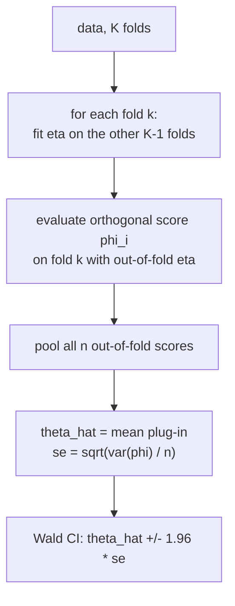

The previous lessons built estimators (AIPW, TMLE, auto-DML) that all solve the
same efficient-influence-function equation. Producing a point estimate is only half
the job: a causal claim needs a **confidence interval** and a standard error. This
lesson closes M3 by turning the orthogonal score into inference. Because an
orthogonal estimator is asymptotically linear with influence function equal to the
EIF, its standard error is just the sample standard deviation of the per-unit
scores. The two practical questions are how **cross-fitting** keeps that variance
estimate honest, and **when** the normal approximation behind the interval can be
trusted.

## From influence function to standard error

Lesson 1 established that an asymptotically linear estimator satisfies
$\sqrt n(\hat\theta - \theta_0) \xrightarrow{d} \mathcal N(0, V)$ with $V =
E[\phi(O)^2]$. The plug-in standard error follows directly. Let $\hat\phi_i =
\psi(O_i; \hat\theta, \hat\eta)$ be the per-unit orthogonal score evaluated at the
estimate (for AIPW, the EIF term for unit $i$). Then

$$
\hat V = \frac1n\sum_{i=1}^n \hat\phi_i^2, \qquad
\widehat{\mathrm{se}}(\hat\theta) = \sqrt{\frac{\hat V}{n}},
$$

and the **Wald confidence interval** at level $1-\alpha$ is

$$
\hat\theta \;\pm\; z_{1-\alpha/2}\,\widehat{\mathrm{se}}(\hat\theta),
\qquad z_{0.975} = 1.96 \text{ for } 95\%.
$$

No bootstrap, no delta method: the orthogonal score *is* the influence function, so
its sample variance is the asymptotic variance. This is the practical payoff of the
EIF construction. The score is mean-zero at the truth, so $\hat V$ is just the mean
square of the centered scores.

## Why cross-fitting is required for the variance, not only the bias

B5 introduced cross-fitting to remove the regularization *bias*. It is equally
needed for an honest *variance*. If $\hat\eta$ is fit on the same units used to
evaluate $\hat\phi_i$, the scores are correlated with the fitted nuisance, the
$o_P(n^{-1/2})$ remainder of the asymptotic-linearity expansion no longer vanishes,
and $\hat V$ is biased (usually downward, giving intervals that are too narrow and
under-cover).

**Cross-fitting** restores independence:

**Step 1.** Split the data into $K$ folds. For fold $k$, fit the nuisances
$\hat\eta^{(-k)}$ on the other $K-1$ folds.

**Step 2.** Evaluate the score $\hat\phi_i = \psi(O_i; \hat\theta,
\hat\eta^{(-k)})$ on fold $k$ using the **out-of-fold** nuisance. Each unit's score
uses a nuisance that never saw that unit.

**Step 3.** Pool all $n$ out-of-fold scores. The point estimate is
$\hat\theta = \frac1n\sum_i (\text{plug-in}_i)$ adjusted so $\frac1n\sum_i\hat\phi_i
= 0$, and the variance is $\hat V = \frac1n\sum_i \hat\phi_i^2$ over the pooled
scores. Because each $\hat\phi_i$ is independent of the nuisance that produced it,
the remainder is genuinely $o_P(n^{-1/2})$ and $\hat V$ is consistent for $V$.



Running the split with several random fold assignments and averaging (or taking the
median) the estimates and variances stabilizes the dependence on a single partition;
the DML paper recommends this median-of-splits aggregation<FN n="1" />.

## When the normal approximation is trustworthy

The interval relies on $\sqrt n(\hat\theta - \theta_0)$ being approximately normal
with the estimated variance. Three conditions decide whether that holds, and each
fails in a recognizable way.

- **Product-rate / orthogonality.** The bias must be $o(n^{-1/2})$ (lesson 2): both
  nuisances converging fast enough that $\|\hat\eta - \eta_0\|^2 = o(n^{-1/2})$. If
  the nuisance learners converge too slowly, the score is centered off $\theta_0$
  and the interval is centered on the wrong place, however tight.
- **Overlap.** The variance $V$ is finite only with strict overlap $0 < e(x) < 1$
  bounded away from the endpoints (lesson 3, Exercise 2). As $\hat e \to 0$ or $1$,
  the inverse weights make $\hat\phi_i$ heavy-tailed, the central limit theorem
  convergence slows, and the normal approximation degrades. A few units with tiny
  $\hat e$ can dominate $\hat V$ and make the interval erratic.
- **No estimated quantity on a boundary.** If $\theta_0$ sits at a boundary of the
  parameter space (an effect of exactly zero where the estimand is constrained
  nonnegative, a probability at $0$ or $1$), the limiting distribution is not
  normal and the Wald interval over- or under-covers.

A practical diagnostic: inspect the histogram of the per-unit scores $\hat\phi_i$.
If it is roughly symmetric and light-tailed, the normal approximation is sound; if a
handful of units (extreme propensities) carry most of the mass, trust the interval
less and consider trimming, overlap weights, or a larger sample.

## Coverage check by simulation

The honest test of an interval is its **coverage**: across many simulated datasets,
a nominal $95\%$ interval should contain the true ATE about $95\%$ of the time. The
code below runs cross-fit AIPW on repeated draws and reports empirical coverage,
which lands near $0.95$ when overlap is good.

## Implementation

```python
import numpy as np

rng = np.random.default_rng(0)
true_ate = 1.0

def one_dataset(n, seed):
    r = np.random.default_rng(seed)
    X = r.normal(0, 1, n)
    e = 1 / (1 + np.exp(-0.8 * X))                 # good overlap
    W = (r.uniform(size=n) < e).astype(float)
    g1, g0 = 0.5 * X + 1.0, 0.5 * X
    Y = np.where(W == 1, g1, g0) + r.normal(0, 0.5, n)

    # 2-fold cross-fitting with simple OLS nuisances (numpy only).
    idx = r.permutation(n)
    folds = [idx[:n // 2], idx[n // 2:]]
    phi = np.zeros(n)
    B = np.column_stack([np.ones(n), X, X**2])
    for k in range(2):
        te, tr = folds[k], folds[1 - k]
        # outcome models per arm, fit out-of-fold
        def fit(mask_w):
            m = (W[tr] == mask_w)
            coef = np.linalg.lstsq(B[tr][m], Y[tr][m], rcond=None)[0]
            return B[te] @ coef
        mu1, mu0 = fit(1), fit(0)
        # propensity by logistic-ish OLS on W (clip into (0,1)); cross-fit
        pc = np.linalg.lstsq(B[tr], W[tr], rcond=None)[0]
        eh = np.clip(B[te] @ pc, 0.02, 0.98)
        phi[te] = (mu1 - mu0
                   + W[te] * (Y[te] - mu1) / eh
                   - (1 - W[te]) * (Y[te] - mu0) / (1 - eh))
    theta = phi.mean()
    se = phi.std() / np.sqrt(n)
    return theta, se

# Repeat and measure coverage of the 95% Wald interval.
n, reps = 2000, 600
covered = 0
for s in range(reps):
    theta, se = one_dataset(n, s + 1)
    lo, hi = theta - 1.96 * se, theta + 1.96 * se
    covered += (lo <= true_ate <= hi)

coverage = covered / reps
print(f"empirical 95% coverage = {coverage:.3f}")
assert 0.90 < coverage < 0.98     # near nominal under good overlap
```

Empirical coverage sits near the nominal $0.95$, confirming that the standard error
read off the orthogonal score's sample variance produces calibrated intervals when
cross-fitting and overlap hold.


## Exercises

**Exercise 1.** A cross-fit AIPW analysis on $n = 2500$ units reports
$\hat\theta = 0.42$ and a per-unit score variance $\hat V = 6.25$. Compute the
standard error and the $95\%$ confidence interval, and state whether the effect is
significant at the $5\%$ level.

<details>
<summary>Solution</summary>

**Step 1.** The standard error is
$\widehat{\mathrm{se}} = \sqrt{\hat V / n} = \sqrt{6.25 / 2500} = \sqrt{0.0025} =
0.05$.

**Step 2.** The $95\%$ interval is $0.42 \pm 1.96 \times 0.05 = 0.42 \pm 0.098$,
i.e. $[0.322, 0.518]$.

**Step 3.** The interval excludes $0$ (equivalently the Wald statistic
$0.42 / 0.05 = 8.4$ exceeds $1.96$), so the effect is significant at the $5\%$
level. The point estimate is more than eight standard errors from zero.

</details>

**Exercise 2.** Explain why fitting the nuisance on the *same* fold used to evaluate
the score typically makes the estimated standard error too small, and what that does
to coverage.

<details>
<summary>Solution</summary>

**Step 1.** A flexible learner fit on the evaluation units overfits them: it drives
the in-sample residual $Y_i - \hat\mu(X_i)$ below its true conditional standard
deviation. The orthogonal score's augmentation term is built from those residuals,
so the per-unit scores $\hat\phi_i$ are artificially small.

**Step 2.** Then $\hat V = \frac1n\sum_i\hat\phi_i^2$ underestimates the true
$V = E[\phi^2]$, so $\widehat{\mathrm{se}} = \sqrt{\hat V / n}$ is too small and the
Wald interval is too narrow.

**Step 3.** A too-narrow interval contains the truth less often than its nominal
level: coverage drops below $95\%$ (under-coverage). Cross-fitting uses out-of-fold
nuisances, so the residuals carry their honest variance and $\hat V$ is consistent,
restoring coverage. This is why cross-fitting matters for inference, not only for
the point estimate's bias.

</details>

**Exercise 3 (code).** Demonstrate that weak overlap breaks the normal
approximation. Re-run the coverage simulation with a strong propensity slope (so
some $\hat e$ are near $0$ or $1$) and show empirical coverage of the $95\%$
interval falls noticeably below nominal.

<details>
<summary>Solution</summary>

```python
import numpy as np

true_ate = 1.0

def one_dataset(n, seed, slope):
    r = np.random.default_rng(seed)
    X = r.normal(0, 1, n)
    e = 1 / (1 + np.exp(-slope * X))               # large slope => weak overlap
    W = (r.uniform(size=n) < e).astype(float)
    g1, g0 = 0.5 * X + 1.0, 0.5 * X
    Y = np.where(W == 1, g1, g0) + r.normal(0, 0.5, n)
    B = np.column_stack([np.ones(n), X, X**2])
    idx = r.permutation(n); folds = [idx[:n // 2], idx[n // 2:]]
    phi = np.zeros(n)
    for k in range(2):
        te, tr = folds[k], folds[1 - k]
        def fit(w):
            m = (W[tr] == w)
            return B[te] @ np.linalg.lstsq(B[tr][m], Y[tr][m], rcond=None)[0]
        mu1, mu0 = fit(1), fit(0)
        eh = np.clip(B[te] @ np.linalg.lstsq(B[tr], W[tr], rcond=None)[0], 0.01, 0.99)
        phi[te] = (mu1 - mu0 + W[te] * (Y[te] - mu1) / eh
                   - (1 - W[te]) * (Y[te] - mu0) / (1 - eh))
    return phi.mean(), phi.std() / np.sqrt(n)

def coverage(slope, reps=500, n=2000):
    c = 0
    for s in range(reps):
        th, se = one_dataset(n, s + 1, slope)
        c += (th - 1.96 * se <= true_ate <= th + 1.96 * se)
    return c / reps

good = coverage(0.8)     # good overlap
weak = coverage(3.0)     # weak overlap: extreme propensities
print(f"coverage good overlap = {good:.3f}, weak overlap = {weak:.3f}")
assert good > weak        # weak overlap degrades coverage
assert weak < 0.93        # falls below nominal
```

The strong-slope design drives some propensities toward $0$ and $1$, the inverse
weights inflate a few scores, and coverage drops below the nominal $95\%$: the
diagnostic to watch for before trusting a debiased-ML interval.

</details>

This closes the orthogonal-estimation core of M3: an estimator built from the
efficient influence function comes with its own standard error, and cross-fitting
plus overlap are what make the resulting interval honest. M4 carries the same EIF
and targeting ideas into neural counterfactual models (Dragonnet's targeted
regularization is the TMLE update inside a network).

<Footnotes>
  <FNItem n="1">**Chernozhukov, V., Chetverikov, D., Demirer, M., Duflo, E., Hansen, C., Newey, W., & Robins, J.** (2018). "Double/debiased machine learning for treatment and structural parameters". *The Econometrics Journal*, 21(1), C1-C68. Cross-fitting, the orthogonal-score variance estimator, and median-of-splits aggregation ([doi:10.1111/ectj.12097](https://doi.org/10.1111/ectj.12097)).</FNItem>
  <FNItem n="2">**Tsiatis, A. A.** (2006). *Semiparametric Theory and Missing Data.* Springer. Asymptotic normality of asymptotically linear estimators and the influence-function variance.</FNItem>
</Footnotes>
