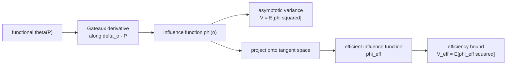

B5 showed that double machine learning recovers an unbiased treatment effect even
when the nuisance functions are fit by flexible learners. That lesson stated the
estimator and asserted it reaches "the semiparametric efficiency bound" without
saying what that bound is or where it comes from. This lesson supplies the missing
object: the **influence function**. It is the single linear summary that controls
both the asymptotic variance of an estimator and the floor that no regular
estimator can beat.

The whole of orthogonal estimation (Neyman orthogonality, AIPW, TMLE, auto-DML)
is built on one quantity, the **efficient influence function**. Everything in M3
is a different way to construct or estimate it, so the payoff for understanding it
once is large.

## Estimators as functionals of a distribution

A target parameter is a number computed from the data distribution $P$. Write it
as $\theta(P)$, a **functional** mapping a distribution to a real number. Two
running examples:

- The mean: $\theta(P) = E_P[Y] = \int y \, dP(y)$.
- The ATE under ignorability: $\theta(P) = E_P[\mu_1(X) - \mu_0(X)]$, where
  $\mu_w(x) = E_P[Y \mid W = w, X = x]$ is the **outcome regression** (the mean
  outcome among units with treatment $w$ and covariates $x$).

An estimator $\hat\theta$ is what happens when the true $P$ is replaced by the
empirical distribution $\hat P_n$ that puts mass $1/n$ on each of the $n$ observed
data points $O_1, \dots, O_n$ (here $O = (Y, W, X)$). The **plug-in estimator** is
$\hat\theta = \theta(\hat P_n)$. The question of efficiency is: how fast does
$\hat\theta - \theta(P)$ shrink, and with what variance?

## Asymptotically linear estimators

An estimator is **asymptotically linear** with **influence function** $\phi$ if it
admits the expansion

$$
\hat\theta - \theta(P) = \frac{1}{n}\sum_{i=1}^n \phi(O_i) + o_P(n^{-1/2}),
$$

where $\phi$ has mean zero, $E_P[\phi(O)] = 0$, and finite variance. The term
$o_P(n^{-1/2})$ is a remainder that vanishes faster than $1/\sqrt n$, so it does
not affect the limiting distribution.

This expansion says the estimation error is, to first order, an **average of a
fixed per-observation function** $\phi$. The function $\phi(O_i)$ is the
contribution, or "influence", of data point $O_i$ on the estimate. Once an
estimator is written in this form, its large-sample behavior is read off
immediately by the central limit theorem applied to the average:

$$
\sqrt n \,\big(\hat\theta - \theta(P)\big) \xrightarrow{d} \mathcal N\!\big(0,\; V\big),
\qquad V = E_P\big[\phi(O)^2\big].
$$

The asymptotic variance is the second moment of the influence function (it equals
the variance because $\phi$ has mean zero). So the influence function carries
everything: consistency (mean zero), the $\sqrt n$ rate, normality, and the
variance constant.

## The influence function as a Gateaux derivative

Where does $\phi$ come from for a given functional $\theta(P)$? It is the
**directional derivative** of $\theta$ at $P$ in the direction of a point mass.
Define the contaminated distribution

$$
P_\varepsilon = (1 - \varepsilon) P + \varepsilon \delta_o,
$$

which mixes $P$ with a point mass $\delta_o$ at the observation value $o$, with
mixing weight $\varepsilon \in [0, 1]$. The **influence function** is

$$
\phi(o) = \left. \frac{d}{d\varepsilon} \theta(P_\varepsilon) \right|_{\varepsilon = 0}.
$$

This is the **Gateaux derivative** of $\theta$ in the direction $\delta_o - P$. It
measures how the parameter moves when an infinitesimal amount of probability is
moved onto the single point $o$. By convention the derivative is centered so
$E_P[\phi] = 0$; subtract the mean if a raw computation does not come out
centered.

**Worked derivation for the mean.** Take $\theta(P) = E_P[Y]$.

**Step 1.** Evaluate the functional at the contaminated distribution. Because the
mean is linear in $P$,

$$
\theta(P_\varepsilon) = (1 - \varepsilon)\, E_P[Y] + \varepsilon\, y,
$$

where $y$ is the $Y$-coordinate of the contamination point $o$. The mass
$\varepsilon$ at $o$ contributes its own value $y$; the rest keeps the old mean.

**Step 2.** Differentiate in $\varepsilon$ and set $\varepsilon = 0$:

$$
\frac{d}{d\varepsilon}\theta(P_\varepsilon) = -E_P[Y] + y, \qquad
\phi(o) = y - E_P[Y].
$$

The influence function of the mean is the **centered observation** $y - E_P[Y]$.
It is already mean zero, and $E_P[\phi^2] = \operatorname{Var}_P(Y)$, recovering
the familiar fact that the sample mean has asymptotic variance equal to the
population variance.

## The efficient influence function and the variance bound

A nonparametric or semiparametric model does not pin down a single influence
function; many estimators of the same $\theta$ are asymptotically linear with
*different* $\phi$. Among all of them there is a distinguished one.

The **efficient influence function** (EIF), written $\phi^{\mathrm{eff}}$, is the
influence function of the **best regular asymptotically linear estimator**: the one
with the smallest asymptotic variance. Its variance is the **semiparametric
efficiency bound**

$$
V^{\mathrm{eff}} = E_P\big[\phi^{\mathrm{eff}}(O)^2\big],
$$

and no regular estimator of $\theta$ in the model can have asymptotic variance
below $V^{\mathrm{eff}}$<FN n="1" />. "Regular" rules out pathological
super-efficient estimators that beat the bound at one parameter value by being
worse in a neighborhood. The EIF is the projection of any influence function onto
the model's **tangent space** (the closed span of allowed score directions); for a
fully nonparametric model the tangent space is everything, so the EIF is unique and
equals the canonical gradient of $\theta$<FN n="2" />.



Three consequences are used repeatedly in the rest of M3.

- **The EIF defines the estimator.** Given $\phi^{\mathrm{eff}}$, the estimator
  that solves $\frac1n\sum_i \phi^{\mathrm{eff}}(O_i; \hat\eta) = 0$ for the
  nuisances $\hat\eta$ is efficient. AIPW (lesson 3) is this construction for the
  ATE.
- **The EIF is Neyman-orthogonal.** Its Gateaux derivative with respect to the
  nuisances is zero, which is exactly the property that makes plug-in ML nuisances
  harmless to first order (lesson 2).
- **The EIF gives free inference.** A confidence interval comes from the sample
  variance of $\phi^{\mathrm{eff}}(O_i; \hat\eta)$ (lesson 6).

## Concrete scale: comparing two influence functions

The influence function makes "one estimator is more efficient than another"
quantitative. Consider estimating $\theta = E[Y]$ from a sample where each unit
also carries a covariate $X$ correlated with $Y$. Two unbiased estimators:

- The **plain mean** $\hat\theta_1 = \bar Y$ has $\phi_1(o) = y - \theta$ and
  variance $\operatorname{Var}(Y)$.
- A **regression-adjusted mean** that subtracts a known mean-zero control
  $c(X)$ correlated with $Y$ has $\phi_2(o) = (y - c(x)) - \theta$ and variance
  $\operatorname{Var}(Y - c(X))$.

If $Y$ has variance $1$ and $c(X)$ explains a fraction $\rho^2 = 0.49$ of its
variance (correlation $0.7$), the adjusted estimator has asymptotic variance
$1 - 0.49 = 0.51$, slightly more than half of the plain mean's. Same target, same
$\sqrt n$ rate, but the influence function with the smaller second moment needs
roughly half the sample to hit the same confidence-interval width. The efficiency
bound is the smallest such variance achievable.

```python
import numpy as np

rng = np.random.default_rng(0)
n = 200_000
# Y depends on X; c(x) = 0.7 * x is a known mean-zero control (X standard normal).
X = rng.normal(0, 1, n)
Y = 0.7 * X + np.sqrt(1 - 0.7**2) * rng.normal(0, 1, n)   # Var(Y) = 1
theta = 0.0

phi1 = Y - theta                 # plain-mean influence function
phi2 = (Y - 0.7 * X) - theta     # regression-adjusted influence function

V1 = (phi1**2).mean()
V2 = (phi2**2).mean()
print(f"plain mean   variance ~ {V1:.3f}")   # ~ 1.00
print(f"adjusted     variance ~ {V2:.3f}")   # ~ 0.51
assert V2 < V1                                # adjustment lowers the variance
assert np.isclose(V2, 1 - 0.7**2, atol=0.02)  # matches 1 - rho^2
```

The second moment of each influence function reproduces the predicted asymptotic
variances, and the adjusted estimator sits at the lower one.

## Exercises

**Exercise 1.** Derive the influence function of the variance functional
$\theta(P) = \operatorname{Var}_P(Y) = E_P[(Y - \mu)^2]$ with $\mu = E_P[Y]$, by
the Gateaux-derivative route. Treat $\mu$ as a function of $P$ (it moves with the
contamination too).

<details>
<summary>Solution</summary>

**Step 1.** Write $\theta(P) = E_P[Y^2] - \mu(P)^2$ with $\mu(P) = E_P[Y]$. Both
pieces are functionals of $P$, so differentiate each along
$P_\varepsilon = (1-\varepsilon)P + \varepsilon\delta_o$.

**Step 2.** The mean-square term is linear in $P$, so by the same computation as
the mean its derivative at $\varepsilon = 0$ is $y^2 - E_P[Y^2]$. The mean term
$\mu(P_\varepsilon)$ has derivative $y - \mu$ (the influence function of the mean),
and by the chain rule the derivative of $-\mu(P_\varepsilon)^2$ is
$-2\mu \cdot (y - \mu)$.

**Step 3.** Add the pieces:

$$
\phi(o) = \big(y^2 - E_P[Y^2]\big) - 2\mu(y - \mu)
        = (y - \mu)^2 - \operatorname{Var}_P(Y).
$$

This is mean zero and says the variance estimator's influence is the centered
squared deviation. Its second moment, $E[(Y-\mu)^4] - \operatorname{Var}(Y)^2$, is
the asymptotic variance of the sample variance.

</details>

**Exercise 2.** An estimator has influence function
$\phi(o) = a\,(y - \theta) + (1-a)\,(z - \theta)$ for a constant $a \in [0,1]$,
where $Y$ and $Z$ are two mean-$\theta$ measurements with variances $\sigma_Y^2$,
$\sigma_Z^2$ and correlation $0$. Find the $a$ that minimizes the asymptotic
variance, and state the resulting bound.

<details>
<summary>Solution</summary>

**Step 1.** Since $Y$ and $Z$ are uncorrelated and each centered,
$V(a) = E[\phi^2] = a^2\sigma_Y^2 + (1-a)^2\sigma_Z^2$.

**Step 2.** Differentiate and set to zero:
$V'(a) = 2a\sigma_Y^2 - 2(1-a)\sigma_Z^2 = 0$, giving

$$
a^\star = \frac{\sigma_Z^2}{\sigma_Y^2 + \sigma_Z^2}.
$$

**Step 3.** Substitute back. The minimum is

$$
V(a^\star) = \frac{\sigma_Y^2 \sigma_Z^2}{\sigma_Y^2 + \sigma_Z^2},
$$

the inverse-variance-weighted (precision-weighted) combination, which is the
efficiency bound for this family of linear combinations. Equal variances give
$\sigma^2/2$, the familiar halving from averaging two independent measurements.

</details>

**Exercise 3 (code).** Verify the asymptotic-linearity expansion for the sample
mean: with $\phi(o) = y - \theta$, confirm on simulated data that
$\hat\theta - \theta$ equals $\frac1n\sum_i \phi(O_i)$ exactly (the remainder is
zero for this linear functional), and that the sample variance of $\phi$ predicts
the spread of $\hat\theta$ across many draws.

<details>
<summary>Solution</summary>

```python
import numpy as np

rng = np.random.default_rng(1)
theta = 3.0
sigma = 2.0

# 1) the expansion is exact for the mean: error == average of phi
Y = rng.normal(theta, sigma, 5000)
err = Y.mean() - theta
avg_phi = (Y - theta).mean()
assert np.isclose(err, avg_phi)   # remainder is identically zero here

# 2) E[phi^2] = sigma^2 predicts the across-draws variance of sqrt(n)*(theta_hat - theta)
n, reps = 1000, 4000
errs = np.array([rng.normal(theta, sigma, n).mean() - theta for _ in range(reps)])
emp_var = n * errs.var()          # variance of sqrt(n) * error
assert np.isclose(emp_var, sigma**2, rtol=0.1)
print(f"E[phi^2] = {sigma**2}, empirical sqrt(n)-variance = {emp_var:.3f}")
```

The first assertion shows the influence-function average *is* the error for a
linear functional; the second shows $E[\phi^2]$ is the asymptotic variance.

</details>

The next lesson takes the EIF's defining property, that its derivative with respect
to the nuisance vanishes, and names it Neyman orthogonality, the reason debiased ML
tolerates slow nuisance estimation.

<Footnotes>
  <FNItem n="1">**Tsiatis, A. A.** (2006). *Semiparametric Theory and Missing Data.* Springer. Chapters 3-4 develop influence functions, the tangent space, and the efficiency bound.</FNItem>
  <FNItem n="2">**Hines, O., Dukes, O., Diaz-Ordaz, K., & Vansteelandt, S.** (2022). "Demystifying statistical learning based on efficient influence functions". *The American Statistician*, 76(3), 292-304. ([arXiv:2107.00681](https://arxiv.org/abs/2107.00681)).</FNItem>
</Footnotes>
