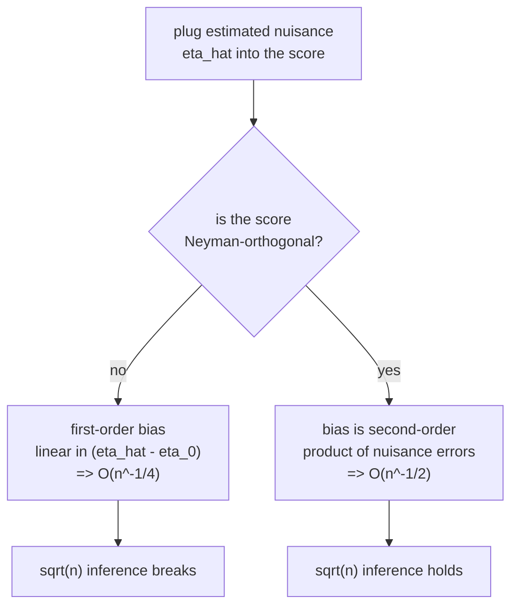

B5 observed that plugging a regularized ML nuisance into a naive estimator injects
a **regularization bias** of order $n^{-1/2}$ or worse, and that double machine
learning escapes it by residualizing both outcome and treatment. The previous
lesson identified the efficient influence function as the object behind that
escape. This lesson isolates the exact property of a moment condition that makes
nuisance error harmless: **Neyman orthogonality**. It is the difference between an
estimator that inherits the slow convergence of its nuisance learner and one that
keeps a clean $\sqrt n$ rate.

## Moment conditions with a nuisance

Many estimators are defined by a **moment condition**: the target $\theta$ is the
value that makes the population average of a score function vanish,

$$
E_P\big[\psi(O; \theta, \eta)\big] = 0,
$$

where $\psi$ is the **score**, $\theta$ the parameter of interest, and $\eta$ a
**nuisance**: functions that must be estimated but are not themselves the target
(for the ATE, $\eta = (\mu_0, \mu_1, e)$, the two outcome regressions and the
propensity score). The estimator solves the empirical version
$\frac1n\sum_i \psi(O_i; \hat\theta, \hat\eta) = 0$ after plugging in an estimated
$\hat\eta$.

The danger is that $\hat\eta \neq \eta_0$ (the true nuisance). If $\hat\theta$
reacts at first order to the error $\hat\eta - \eta_0$, then the nuisance's slow
estimation rate (machine learners converge at $n^{-1/4}$ in high dimensions, not
$n^{-1/2}$) leaks straight into $\hat\theta$ and destroys $\sqrt n$ inference.

## The definition

A score $\psi$ is **Neyman-orthogonal** at the truth $(\theta_0, \eta_0)$ if its
**Gateaux derivative with respect to the nuisance is zero**:

$$
\left. \frac{d}{dr}\, E_P\big[\psi(O; \theta_0, \eta_0 + r(\eta - \eta_0))\big] \right|_{r=0} = 0
\quad\text{for every direction } \eta.
$$

Read $\eta_0 + r(\eta - \eta_0)$ as moving from the true nuisance $\eta_0$ toward
some perturbed $\eta$, a fraction $r$ of the way. The condition says the *expected
score does not move* as you start down any such direction. The moment is flat in
the nuisance at the truth.

Write $\partial_\eta E_P[\psi]$ for that directional derivative. Neyman
orthogonality is

$$
\partial_\eta \, E_P\big[\psi(O; \theta_0, \eta_0)\big][\eta - \eta_0] = 0
\quad \text{for all } \eta.
$$

A non-orthogonal score has $\partial_\eta E_P[\psi] \neq 0$, so a nuisance error
$\hat\eta - \eta_0$ produces a first-order bias proportional to it.

## Why orthogonality kills the first-order bias

Expand the empirical moment around the truth to see the mechanism. Let
$\hat\theta$ solve $\frac1n\sum_i \psi(O_i; \hat\theta, \hat\eta) = 0$.

**Step 1.** Taylor-expand the population moment in *both* arguments around
$(\theta_0, \eta_0)$:

$$
0 \approx E_P[\psi(\theta_0, \eta_0)] + \partial_\theta E_P[\psi]\,(\hat\theta - \theta_0) + \partial_\eta E_P[\psi]\,[\hat\eta - \eta_0] + R,
$$

with $R$ collecting second-order terms. The first term is zero by the moment
condition at the truth.

**Step 2.** Solve for the estimation error:

$$
\hat\theta - \theta_0 \approx -\frac{1}{\partial_\theta E_P[\psi]}\Big( \underbrace{\partial_\eta E_P[\psi]\,[\hat\eta - \eta_0]}_{\text{nuisance bias}} + R \Big).
$$

The nuisance bias term is **linear** in the nuisance error $\hat\eta - \eta_0$. If
the nuisance converges at rate $n^{-1/4}$, this term is also $n^{-1/4}$, which
dwarfs the $n^{-1/2}$ statistical noise and kills inference.

**Step 3.** Neyman orthogonality sets $\partial_\eta E_P[\psi] = 0$, so the linear
nuisance term **vanishes**. What remains is the second-order remainder $R$, which
is a *product* of nuisance errors, of order $\|\hat\eta - \eta_0\|^2$. If two
nuisances each converge at $n^{-1/4}$, their product is $n^{-1/2}$, fast enough to
be negligible against the $\sqrt n$ sampling noise. This is the **product-rate**
or **rate-double-robustness** condition: $\sqrt n \cdot \|\hat\eta - \eta_0\|^2 \to
0$ suffices<FN n="1" />.



The slogan: an orthogonal moment trades a *sum* of nuisance errors (deadly) for a
*product* of them (survivable).

## The partially linear model, orthogonalized

The DML score from B5 is the canonical example. For the partially linear model
$Y = \theta W + g(X) + \varepsilon$, the **non-orthogonal** score is the naive
$\psi^{\text{naive}} = (Y - \theta W - \hat g(X))\,W$. Its derivative with respect
to $g$ is $-E[W \cdot \delta g(X)]$, which is generally nonzero because $W$ and $X$
are dependent: error in $\hat g$ biases $\hat\theta$ at first order.

The **orthogonalized** (Robinson) score uses residualized treatment. With
$m_0(X) = E[W \mid X]$ the propensity and $\ell_0(X) = E[Y \mid X]$ the outcome
mean,

$$
\psi(O; \theta, \eta) = \big(\underbrace{Y - \ell_0(X)}_{\tilde Y} - \theta\,\underbrace{(W - m_0(X))}_{\tilde W}\big)\,\tilde W,
\qquad \eta = (\ell_0, m_0).
$$

**Step 1.** Check orthogonality in the direction of an outcome-model error
$\ell_0 \to \ell_0 + r\,\delta\ell$. The score picks up $-r\,\delta\ell(X)\,\tilde
W$, whose expectation is $-r\,E[\delta\ell(X)\,\tilde W]$. Since
$E[\tilde W \mid X] = E[W - m_0(X) \mid X] = 0$, the inner conditional expectation
is zero, so $E[\delta\ell(X)\,\tilde W] = 0$. The derivative vanishes.

**Step 2.** Check the propensity direction $m_0 \to m_0 + r\,\delta m$. At the true
$\theta_0$, the residual $\tilde Y - \theta_0 \tilde W$ equals $\varepsilon$, which
is mean-zero given $X$. The score's derivative in this direction is proportional to
$E[\varepsilon \cdot \delta m(X)] = E[\delta m(X)\,E[\varepsilon \mid X]] = 0$.

Both nuisance directions give zero, so the Robinson score is Neyman-orthogonal.
This is precisely why B5's DML estimator kept its $\sqrt n$ rate with
gradient-boosted nuisances: the residualization built orthogonality into the
moment.

## Concrete demonstration: bias that ignores nuisance error

A direct way to feel orthogonality is to deliberately corrupt the nuisance and
watch the estimate. Inject an outcome-nuisance error of size $b$ in a direction
correlated with the treatment (here $b\,X$, since $W$ and $X$ are dependent) and
sweep $b$. A non-orthogonal estimator's error grows **linearly** in $b$; the
orthogonal estimator's error stays near zero, because its derivative in this
nuisance direction is zero (Step 1 of the Robinson check above).

```python
import numpy as np

rng = np.random.default_rng(0)
n = 40_000
theta = 2.0
X = rng.normal(0, 1, n)
m0 = 0.6 * X                       # true propensity mean E[W|X]
W = m0 + rng.normal(0, 1, n)
g = np.sin(X)                      # true nuisance g(X) = E[Y|X] - theta*E[W|X]
Y = theta * W + g + rng.normal(0, 0.5, n)
ell0 = g + theta * m0              # true outcome mean E[Y|X]

def naive_theta(b):                # NON-orthogonal: outcome nuisance off by b*X
    g_hat = g + b * X
    # solve (Y - theta*W - g_hat) * W = 0 for theta
    num = ((Y - g_hat) * W).mean()
    return num / (W * W).mean()

def orth_theta(b):                 # orthogonal Robinson score, outcome nuisance off by b*X
    Yt = Y - (ell0 + b * X)
    Wt = W - m0                    # propensity correct
    return (Wt * Yt).mean() / (Wt * Wt).mean()

for b in [0.0, 0.2, 0.4]:
    print(f"bias={b:.1f}  naive err={abs(naive_theta(b)-theta):.4f}"
          f"   orthogonal err={abs(orth_theta(b)-theta):.4f}")

# orthogonal score is flat to first order: its error at small bias is far below naive
assert abs(orth_theta(0.2) - theta) < abs(naive_theta(0.2) - theta)
assert abs(orth_theta(0.0) - theta) < 0.02
```

The naive estimator's error tracks the injected bias almost one-for-one
($0.088$ at $b = 0.2$, $0.177$ at $b = 0.4$), while the orthogonal estimator
barely moves (it stays under $0.003$): its sensitivity to first-order nuisance
error is zero by construction.

## Exercises

**Exercise 1.** Show that the inverse-propensity-weighting (IPW) score for the ATE,
$\psi^{\mathrm{IPW}} = \frac{W Y}{e(X)} - \frac{(1-W)Y}{1-e(X)} - \theta$, is
**not** Neyman-orthogonal in the propensity $e$, by computing the derivative of its
expectation along $e \to e + r\,\delta e$ at the truth.

<details>
<summary>Solution</summary>

**Step 1.** Take the treated term $\frac{WY}{e(X)}$ and differentiate in $r$ along
$e + r\,\delta e$. The chain rule gives
$-\frac{WY}{e(X)^2}\,\delta e(X)$ at $r = 0$.

**Step 2.** Take the expectation. Use $E[WY \mid X] = e(X)\,\mu_1(X)$ (treated
units have probability $e$ and mean outcome $\mu_1$):

$$
E\!\left[-\frac{WY}{e^2}\,\delta e\right] = -E\!\left[\frac{e\mu_1}{e^2}\delta e\right] = -E\!\left[\frac{\mu_1(X)}{e(X)}\,\delta e(X)\right].
$$

**Step 3.** This is generally nonzero (it vanishes only if $\mu_1 \equiv 0$). The
control term adds an analogous nonzero piece. So the raw IPW score has a first-order
nuisance derivative: it is **not** orthogonal, and IPW inherits the propensity
model's estimation rate. AIPW (next lesson but one) adds the augmentation term that
cancels exactly this derivative.

</details>

**Exercise 2.** In the orthogonality expansion, suppose the outcome nuisance
converges at rate $n^{-\alpha}$ and the propensity at rate $n^{-\beta}$. The
second-order remainder of an orthogonal score is of order the *product*
$n^{-(\alpha+\beta)}$. State the weakest condition on $\alpha, \beta$ under which
$\sqrt n$ inference survives, and give one $(\alpha,\beta)$ pair where one rate is
slow but the product condition still holds.

<details>
<summary>Solution</summary>

**Step 1.** Survival needs $\sqrt n \cdot n^{-(\alpha+\beta)} \to 0$, i.e.
$\frac12 - (\alpha + \beta) < 0$, which rearranges to

$$
\alpha + \beta > \tfrac12.
$$

**Step 2.** Neither rate alone must reach $1/2$. Take $\alpha = 0.4$,
$\beta = 0.3$. Each is slower than the parametric $n^{-1/2}$, yet
$\alpha + \beta = 0.7 > 0.5$, so the product term is $o(n^{-1/2})$ and inference
holds. This is the rate form of double robustness: one model may be estimated
poorly if the other compensates. A common sufficient condition is each at
$n^{-1/4}$, giving $\alpha + \beta = 1/2$ at the boundary, made strict with any
extra log factor.

</details>

**Exercise 3 (code).** Confirm the product-rate behavior numerically. For the
orthogonal Robinson score, corrupt *both* nuisances by independent biases $b_\ell$
and $b_m$ and verify that the resulting estimate error is well approximated by the
*product* $b_\ell \cdot b_m$ (times a constant), not by either bias alone.

<details>
<summary>Solution</summary>

```python
import numpy as np

rng = np.random.default_rng(2)
n = 200_000
theta = 2.0
X = rng.normal(0, 1, n)
m0 = 0.6 * X
W = m0 + rng.normal(0, 1, n)
g = np.sin(X)
Y = theta * W + g + rng.normal(0, 0.5, n)
ell0 = g + theta * m0
denom = ((W - m0) ** 2).mean()        # true residual-treatment variance (fixed normalizer)

def orth_err(bl, bm):
    # corrupt each nuisance in a mean-zero direction (b*X); normalize by the true
    # residual variance so the bias is exactly the moment's product cross-term.
    Yt = Y - (ell0 + bl * X)
    Wt = W - (m0 + bm * X)
    return (Wt * Yt).mean() / denom - theta

# single-nuisance corruption leaves the estimate (nearly) unbiased ...
assert abs(orth_err(0.5, 0.0)) < 0.02
assert abs(orth_err(0.0, 0.5)) < 0.02
# ... but corrupting BOTH produces a bias that scales like the product b_l * b_m.
e1 = orth_err(0.5, 0.5)
e2 = orth_err(1.0, 1.0)        # both biases doubled -> product 4x -> error ~4x
assert abs(e2 / e1 - 4.0) < 0.5
print(f"both biased: err(0.5,0.5)={e1:.4f}, err(1,1)={e2:.4f}, ratio={e2/e1:.2f}")
```

A single corrupted nuisance leaves the orthogonal estimate essentially unbiased;
only the *product* of the two errors moves it, and doubling both biases roughly
quadruples the error, the quadratic signature of orthogonality.

</details>

The next lesson constructs the canonical orthogonal score for the ATE, the AIPW /
doubly-robust estimator, directly from the efficient influence function, and turns
the product-rate condition into the stronger "either model correct" guarantee.

<Footnotes>
  <FNItem n="1">**Chernozhukov, V., Chetverikov, D., Demirer, M., Duflo, E., Hansen, C., Newey, W., & Robins, J.** (2018). "Double/debiased machine learning for treatment and structural parameters". *The Econometrics Journal*, 21(1), C1-C68. Defines Neyman-orthogonal scores and the product-rate condition ([doi:10.1111/ectj.12097](https://doi.org/10.1111/ectj.12097)).</FNItem>
  <FNItem n="2">**Hines, O., Dukes, O., Diaz-Ordaz, K., & Vansteelandt, S.** (2022). "Demystifying statistical learning based on efficient influence functions". *The American Statistician*, 76(3), 292-304 ([arXiv:2107.00681](https://arxiv.org/abs/2107.00681)).</FNItem>
</Footnotes>
