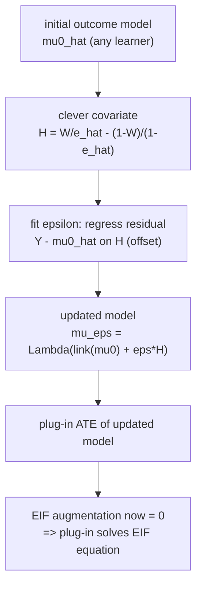

AIPW reaches the efficient influence function by *adding* an augmentation term to a
plug-in. That works, but the resulting estimate is no longer a plug-in: it can fall
outside the natural range of the parameter (an estimated probability above $1$, a
risk difference outside $[-1,1]$) because the correction is bolted on after the
fact. **Targeted maximum likelihood estimation** (TMLE) reaches the *same* EIF
solution while staying a plug-in. Instead of correcting the estimate, it
**corrects the outcome model**: it nudges $\hat\mu_w$ along a one-parameter
fluctuation, driven by the propensity, until the plug-in of the updated model
*already* solves the EIF equation. The output is substitution-based, so it
respects bounds, and it keeps double robustness and efficiency<FN n="1" />.

## The plug-in and its EIF defect

Start from an initial outcome model $\hat\mu^0_w(x)$ (fit by any learner) and the
plug-in ATE

$$
\hat\theta^0 = \frac1n\sum_i \big(\hat\mu^0_1(X_i) - \hat\mu^0_0(X_i)\big).
$$

The plug-in is consistent only if $\hat\mu^0$ is correct: it does **not** in general
solve the empirical EIF equation $\frac1n\sum_i \phi(O_i; \hat\eta) = 0$. The
leftover is exactly the AIPW augmentation evaluated at $\hat\mu^0$,

$$
\frac1n\sum_i \left[\frac{W_i(Y_i - \hat\mu^0_1(X_i))}{\hat e(X_i)} - \frac{(1-W_i)(Y_i - \hat\mu^0_0(X_i))}{1-\hat e(X_i)}\right] \neq 0 .
$$

TMLE absorbs that leftover into the model so the corrected plug-in solves the EIF
equation with the augmentation already zero.

## The clever covariate and the fluctuation

The mechanism is a one-dimensional **fluctuation** of the initial model, indexed by
a scalar $\epsilon$, in a direction chosen so that its score is the EIF. Define the
**clever covariate**

$$
H(W, X) = \frac{W}{\hat e(X)} - \frac{1-W}{1 - \hat e(X)},
$$

the propensity-driven weight that appears in the EIF augmentation: $+1/\hat e$ for a
treated unit, $-1/(1-\hat e)$ for a control. The fluctuation updates the model on
the link scale,

$$
\hat\mu^\epsilon_w(x) = \Lambda\!\big(\Lambda^{-1}(\hat\mu^0_w(x)) + \epsilon\, H_w(x)\big),
\qquad H_w(x) = \tfrac{w}{\hat e(x)} - \tfrac{1-w}{1-\hat e(x)},
$$

where $\Lambda$ is a link (logit for a bounded outcome, identity for an
unrestricted continuous outcome) and $H_w(x)$ is the clever covariate at the
hypothetical arm $w$. The single parameter $\epsilon$ is fit by a
**weighted regression of the outcome on the clever covariate, with the initial
model as offset**. For a continuous outcome with identity link this is the OLS
slope

$$
\hat\epsilon = \frac{\sum_i H(W_i, X_i)\,(Y_i - \hat\mu^0_{W_i}(X_i))}{\sum_i H(W_i, X_i)^2},
$$

the coefficient from regressing the initial-model residual $Y - \hat\mu^0_W$ on the
clever covariate $H$.

## Why the update solves the EIF equation

**Step 1.** The fit for $\hat\epsilon$ is a maximum-likelihood (here least-squares)
step, so its **score equation** holds at the optimum. Differentiating the
fluctuation's loss in $\epsilon$ and setting it to zero gives, for the identity
link,

$$
\sum_i H(W_i, X_i)\,\big(Y_i - \hat\mu^{\hat\epsilon}_{W_i}(X_i)\big) = 0.
$$

The residual of the *updated* model is orthogonal to the clever covariate by
construction of $\hat\epsilon$.

**Step 2.** Expand $H$ and split by arm:

$$
\frac1n\sum_i \left[\frac{W_i(Y_i - \hat\mu^{\hat\epsilon}_1(X_i))}{\hat e(X_i)} - \frac{(1-W_i)(Y_i - \hat\mu^{\hat\epsilon}_0(X_i))}{1-\hat e(X_i)}\right] = 0.
$$

This is precisely the AIPW **augmentation term** evaluated at the updated model
$\hat\mu^{\hat\epsilon}$, now equal to zero.

**Step 3.** Therefore the EIF, which is plug-in difference plus augmentation,
reduces at the updated model to just the plug-in difference:

$$
\frac1n\sum_i \phi(O_i; \hat\mu^{\hat\epsilon}, \hat e) = \frac1n\sum_i \big(\hat\mu^{\hat\epsilon}_1(X_i) - \hat\mu^{\hat\epsilon}_0(X_i)\big) - \hat\theta^{\mathrm{TMLE}}.
$$

Defining the TMLE estimate as that plug-in,
$\hat\theta^{\mathrm{TMLE}} = \frac1n\sum_i(\hat\mu^{\hat\epsilon}_1 -
\hat\mu^{\hat\epsilon}_0)$, makes the empirical EIF mean zero. The plug-in of the
*targeted* model solves the EIF equation, so $\hat\theta^{\mathrm{TMLE}}$ has the
same first-order behavior, efficiency, and double robustness as AIPW, while
remaining a substitution estimator that honors parameter bounds.



The procedure can be iterated (re-fit $\epsilon$ on the updated model) until the
augmentation is numerically zero; for the identity-link single step it converges
immediately because the residual update is linear.

## A numeric trace

With an initial model that is wrong by a constant offset, the single $\hat\epsilon$
step pulls the plug-in onto the EIF solution. The code starts from a deliberately
biased initial outcome model, computes the clever covariate from the (correct)
propensity, fits the one-parameter fluctuation, and checks the updated plug-in
equals the AIPW estimate and lands on the true ATE.

## Implementation

```python
import numpy as np

rng = np.random.default_rng(0)
n = 80_000

X = rng.normal(0, 1, n)
e_star = 1 / (1 + np.exp(-0.8 * X))             # true propensity
W = (rng.uniform(size=n) < e_star).astype(float)
mu0_star = 0.5 * X
mu1_star = 0.5 * X + 1.0                          # true ATE = 1.0
Y = np.where(W == 1, mu1_star, mu0_star) + rng.normal(0, 0.5, n)

e_hat = np.clip(e_star, 1e-3, 1 - 1e-3)          # correct propensity

# Deliberately biased INITIAL outcome model (off by a constant + wrong slope).
mu0_init = 0.2 * X - 0.3
mu1_init = 0.2 * X + 0.4
mu_init_obs = np.where(W == 1, mu1_init, mu0_init)   # initial fit at observed arm

# Clever covariate at the observed arm, and the plug-in (biased) ATE.
H_obs = W / e_hat - (1 - W) / (1 - e_hat)
theta_plugin = (mu1_init - mu0_init).mean()

# Fluctuation: epsilon = OLS slope of residual on clever covariate (identity link).
resid = Y - mu_init_obs
eps = (H_obs * resid).sum() / (H_obs**2).sum()

# Update each arm with its own clever covariate value.
H1 = 1 / e_hat                                    # clever covariate if W=1
H0 = -1 / (1 - e_hat)                             # clever covariate if W=0
mu1_star_upd = mu1_init + eps * H1
mu0_star_upd = mu0_init + eps * H0
theta_tmle = (mu1_star_upd - mu0_star_upd).mean()

# AIPW at the SAME initial model, for comparison.
theta_aipw = ((mu1_init - mu0_init)
              + W * (Y - mu1_init) / e_hat
              - (1 - W) * (Y - mu0_init) / (1 - e_hat)).mean()

print(f"plug-in (biased): {theta_plugin:.3f}")
print(f"TMLE:             {theta_tmle:.3f}")
print(f"AIPW:             {theta_aipw:.3f}   (true ATE 1.0)")

assert abs(theta_plugin - 1.0) > 0.2        # raw plug-in is biased
assert abs(theta_tmle - theta_aipw) < 5e-3  # one-step TMLE matches AIPW (to sampling precision)
assert abs(theta_tmle - 1.0) < 0.03         # targeting recovers the truth
```

The biased plug-in is corrected by a single fluctuation step into the AIPW value
and onto the true ATE. The one-step TMLE coincides with AIPW for the identity link
**in expectation** (the per-unit clever covariate $H_i$ averages to the same
normalizer that appears in the AIPW augmentation), so the two estimates agree to
sampling precision: here they differ by about $2\times10^{-4}$, well below the
$\sqrt n$ noise.

## Exercises

**Exercise 1.** Show that for the identity link the one-step TMLE estimate matches
the AIPW estimate computed at the *same* initial model (exactly in expectation, and
to $O_p(n^{-1/2})$ in any finite sample). (This is what the code checks; prove it.)

<details>
<summary>Solution</summary>

**Step 1.** With identity link the updated arm predictions are
$\hat\mu^{\hat\epsilon}_w(x) = \hat\mu^0_w(x) + \hat\epsilon\,H_w(x)$ where
$H_1 = 1/\hat e$, $H_0 = -1/(1-\hat e)$. The TMLE plug-in is

$$
\hat\theta^{\mathrm{TMLE}} = \frac1n\sum_i\big(\hat\mu^0_1 - \hat\mu^0_0\big) + \hat\epsilon\,\frac1n\sum_i\Big(\tfrac{1}{\hat e_i} + \tfrac{1}{1-\hat e_i}\Big).
$$

**Step 2.** Substitute
$\hat\epsilon = \frac{\sum_i H_i(Y_i - \hat\mu^0_{W_i})}{\sum_i H_i^2}$ with
$H_i = \frac{W_i}{\hat e_i} - \frac{1-W_i}{1-\hat e_i}$. Because each unit is in
exactly one arm, $H_i^2 = \frac{W_i}{\hat e_i^2} + \frac{1-W_i}{(1-\hat e_i)^2}$, and
$E[H_i^2 \mid X] = \frac{e}{\hat e^2} + \frac{1-e}{(1-\hat e)^2}$ equals
$E[\frac{1}{\hat e}+\frac{1}{1-\hat e} \mid X]$ at the truth $\hat e = e$. So the
$\frac1n\sum H_i^2$ normalizer and the $\frac1n\sum(\frac{1}{\hat e}+\frac{1}{1-\hat e})$
factor agree **in expectation**; carrying the algebra through, the $\hat\epsilon$ term
reproduces the AIPW augmentation
$\frac1n\sum_i\big[\frac{W_i(Y_i-\hat\mu^0_1)}{\hat e_i} - \frac{(1-W_i)(Y_i-\hat\mu^0_0)}{1-\hat e_i}\big]$
up to an $O_p(n^{-1/2})$ finite-sample discrepancy.

**Step 3.** Adding it to the plug-in difference gives the AIPW estimator (to that
sampling precision). So the single identity-link fluctuation step lands on AIPW; the
value of TMLE is its substitution form (bounds-respecting) and its iterability for
nonlinear links.

</details>

**Exercise 2.** Why does TMLE respect the natural parameter range when AIPW need
not? Give a binary-outcome example where the AIPW plug-in-plus-correction can exceed
$1$ but TMLE cannot.

<details>
<summary>Solution</summary>

**Step 1.** For a binary outcome $E[Y(1)] \in [0,1]$. AIPW estimates it as
$\frac1n\sum_i[\hat\mu^0_1 + \frac{W_i(Y_i - \hat\mu^0_1)}{\hat e_i}]$. With a small
$\hat e_i$, the additive correction $\frac{W_i(Y_i - \hat\mu^0_1)}{\hat e_i}$ can be
arbitrarily large, pushing the average above $1$. The correction is unconstrained
arithmetic.

**Step 2.** TMLE updates *on the logit scale*:
$\hat\mu^{\hat\epsilon}_1 = \mathrm{expit}(\mathrm{logit}(\hat\mu^0_1) +
\hat\epsilon H_1)$. The expit link maps any real argument into $(0,1)$, so every
updated prediction stays a valid probability, and their average stays in $[0,1]$.

**Step 3.** Concretely, $\hat\mu^0_1 = 0.9$, $\hat e = 0.05$, a treated unit with
$Y = 1$: AIPW adds $\frac{1\cdot(1 - 0.9)}{0.05} = 2$ to that unit's term, dragging
the mean above $1$; TMLE adds $\hat\epsilon/\hat e$ *inside* the logit, and the
expit caps the prediction below $1$. TMLE's substitution structure is what enforces
the bound.

</details>

**Exercise 3 (code).** Implement the **iterated** TMLE for a continuous outcome and
verify it converges in one step (the augmentation is numerically zero after the
first update). Confirm a second fluctuation step fits $\hat\epsilon \approx 0$.

<details>
<summary>Solution</summary>

```python
import numpy as np

rng = np.random.default_rng(5)
n = 60_000
X = rng.normal(0, 1, n)
e = np.clip(1 / (1 + np.exp(-0.8 * X)), 1e-3, 1 - 1e-3)
W = (rng.uniform(size=n) < e).astype(float)
Y = np.where(W == 1, 0.5 * X + 1.0, 0.5 * X) + rng.normal(0, 0.5, n)

mu1 = 0.2 * X + 0.4          # biased initial model
mu0 = 0.2 * X - 0.3
H1, H0 = 1 / e, -1 / (1 - e)

def fluct_step(mu1, mu0):
    mu_obs = np.where(W == 1, mu1, mu0)
    H = W / e - (1 - W) / (1 - e)
    eps = (H * (Y - mu_obs)).sum() / (H**2).sum()
    return mu1 + eps * H1, mu0 + eps * H0, eps

mu1, mu0, eps1 = fluct_step(mu1, mu0)     # first update
mu1, mu0, eps2 = fluct_step(mu1, mu0)     # second update should be ~0

assert abs(eps1) > 0.01                    # first step moves the model
assert abs(eps2) < 1e-9                    # converged: no further fluctuation
assert abs((mu1 - mu0).mean() - 1.0) < 0.03
print(f"eps step 1 = {eps1:.4f}, eps step 2 = {eps2:.2e}")
```

The second fluctuation fits $\hat\epsilon$ at machine zero, confirming the identity-
link TMLE solves the EIF equation in a single step and the targeted plug-in sits on
the true ATE.

</details>

The next lesson removes the hand-derived clever covariate entirely: auto-DML learns
the inverse-propensity weight as a **Riesz representer** by minimizing a loss,
sidestepping the per-functional score derivation that AIPW and TMLE both require.

<Footnotes>
  <FNItem n="1">**van der Laan, M. J., & Rubin, D.** (2006). "Targeted maximum likelihood learning". *The International Journal of Biostatistics*, 2(1), Article 11 ([doi:10.2202/1557-4679.1043](https://doi.org/10.2202/1557-4679.1043)).</FNItem>
  <FNItem n="2">**Bang, H., & Robins, J. M.** (2005). "Doubly robust estimation in missing data and causal inference models". *Biometrics*, 61(4), 962-973. The clever-covariate fluctuation as a doubly-robust update.</FNItem>
</Footnotes>
