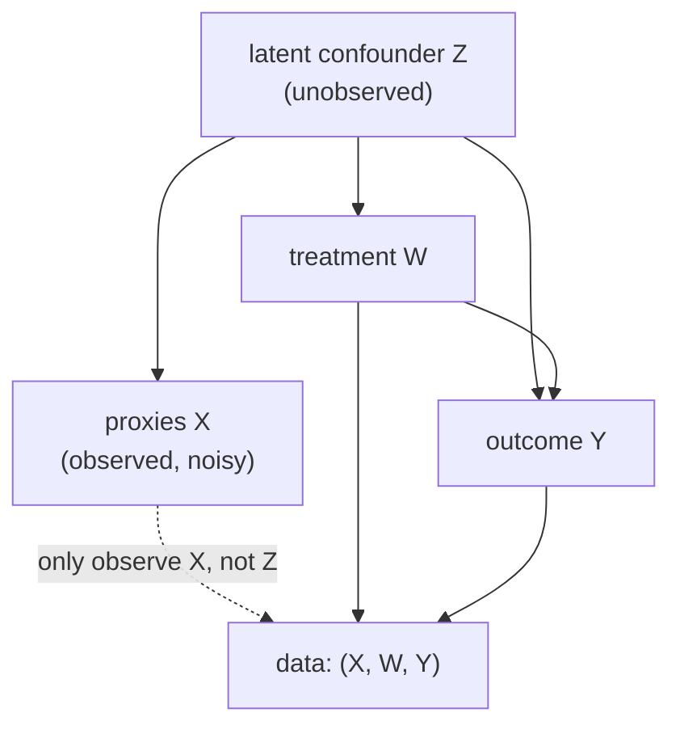

Every estimator so far assumed conditional ignorability: the measured covariates
$X$ contain all confounders, so adjusting for $X$ removes the bias. Often that
fails. The true confounder $Z$ (socioeconomic status, baseline health, latent
ability) is never measured directly; what the data holds is a set of noisy
**proxies** $X$ (zip code, a few lab values, a test score). Adjusting for the
proxies is not the same as adjusting for $Z$, and the residual bias can be large.
**CEVAE** (causal effect variational autoencoder) confronts this by treating $Z$
as a latent variable and learning a variational autoencoder (D4/vae) over the
joint structure of proxy, treatment, and outcome, recovering the effect through
the inferred latent rather than the raw proxies<FN n="1" />.

## The proxy structure

The assumed causal graph puts the latent confounder $Z$ upstream of everything:
$Z$ causes the proxies $X$, the treatment $W$, and the outcome $Y$.



The arrow $Z \to X$ is what makes the problem tractable: the proxies carry
information about $Z$, so a rich enough model can infer the distribution of $Z$
from $X$ (and from $W, Y$). Conditioning on the *true* $Z$ would block the
back-door path $W \leftarrow Z \to Y$ and identify the effect. CEVAE's bet is that
inferring $Z$ from its proxies and then conditioning on the inferred $Z$ recovers
the effect that conditioning on the noisy $X$ alone cannot<FN n="1" />.

## The generative model

CEVAE posits a latent-variable model factorized along the graph. The latent $Z$
has a standard normal prior $p(z) = \mathcal{N}(0, I)$; the three observed
channels are generated from $Z$ by decoder networks:

$$
p(x, w, y, z) = p(z)\, p(x \mid z)\, p(w \mid z)\, p(y \mid w, z).
$$

Each conditional is a neural network outputting distribution parameters:
$p(x \mid z)$ reconstructs the proxies, $p(w \mid z)$ is the latent propensity
(a Bernoulli with logit from a network on $z$), and $p(y \mid w, z)$ is the
outcome, with **separate heads per treatment arm** exactly as in TARNet, so that
the model can represent a different outcome surface for $w = 0$ and $w = 1$:

$$
p(y \mid w, z) = \mathcal{N}\big(\, \mu_w(z),\, \sigma^2 \big), \qquad \mu_w(z) = \begin{cases} \mu_0(z) & w = 0 \\ \mu_1(z) & w = 1. \end{cases}
$$

## The inference network

The posterior $p(z \mid x, w, y)$ is intractable, so CEVAE follows the VAE recipe
(D4/vae) and approximates it with an **encoder** $q(z \mid x, w, y)$, a network
that outputs the mean and variance of a Gaussian over $z$<FN n="2" />. To predict effects on a
*new* unit where only $x$ is available, CEVAE also trains two auxiliary networks
that predict $w$ and $y$ from $x$, so the encoder can be fed inferred $w, y$ at
test time. The encoder uses arm-specific branches just like the decoder:

$$
q(z \mid x, w, y) = \mathcal{N}\big( \mu_q(x, w, y),\, \mathrm{diag}\,\sigma_q^2(x, w, y) \big).
$$

## The objective

Training maximizes the evidence lower bound (ELBO), the same bound that trains any
VAE (D4/vae). For one unit it is the expected log-likelihood of the observed
$(x, w, y)$ under the decoder, minus the KL divergence pulling the encoder toward
the prior:

$$
\mathcal{L}_{\text{ELBO}} = \mathbb{E}_{q(z \mid x, w, y)}\big[ \log p(x \mid z) + \log p(w \mid z) + \log p(y \mid w, z) \big] - \mathrm{KL}\big( q(z \mid x, w, y) \,\|\, p(z) \big).
$$

**Step 1.** The reconstruction term has three pieces because the decoder
generates three channels. Reconstructing $x$ forces $Z$ to absorb the proxy
information; reconstructing $w$ forces $Z$ to carry the selection signal (the
confounding direction); reconstructing $y$ forces $Z$ plus the arm to explain the
outcome. A latent that reconstructs all three is one that has captured the shared
cause.

**Step 2.** The KL term regularizes the inferred $Z$ toward the standard-normal
prior, the same role it plays in a vanilla VAE: it keeps the latent space smooth
and prevents the encoder from memorizing each unit.

**Step 3.** The expectation over $q$ is estimated with the reparameterization
trick, $z = \mu_q + \sigma_q \odot \varepsilon$ with $\varepsilon \sim
\mathcal{N}(0, I)$, so gradients flow through the sampling step. Add the two
auxiliary losses (predicting $w$ and $y$ from $x$) to the ELBO and train
end to end.

## Reading off the effect

Once trained, the individual effect at a unit with proxies $x$ is computed by
integrating the outcome decoder over the inferred latent. Draw $z$ from the
encoder (using the auxiliary networks to supply $w, y$ if only $x$ is given), then
evaluate both outcome heads:

$$
\hat\tau(x) = \mathbb{E}_{q(z \mid x)}\big[\, \mu_1(z) - \mu_0(z) \,\big] \approx \frac{1}{L}\sum_{\ell=1}^{L} \big( \mu_1(z^{(\ell)}) - \mu_0(z^{(\ell)}) \big), \quad z^{(\ell)} \sim q(z \mid x).
$$

The key difference from TARNet is *what the heads condition on*. TARNet's heads
read off the representation $\Phi(x)$ of the noisy proxies; CEVAE's heads read off
the inferred latent confounder $z$, which (if the model is right) is the variable
the back-door criterion actually wants. Averaging over the posterior of $z$
propagates the uncertainty about the unmeasured confounder into the effect
estimate.

## Worked code: latent inference shrinks proxy bias

The VAE needs torch, but the *reason* CEVAE helps is numpy-checkable. Adjusting
for a noisy proxy leaves residual confounding bias; adjusting for the true latent
(which the VAE is trying to infer) removes it. The following simulates the proxy
structure and contrasts a regression that adjusts for the noisy proxy $X$ against
one that adjusts for the true confounder $Z$.

```python
import numpy as np

rng = np.random.default_rng(0)
n = 40000
tau = 1.0                                   # true constant effect

z = rng.normal(0, 1, n)                      # latent confounder
x = z + rng.normal(0, 1.0, n)                # noisy proxy of z
e = 1 / (1 + np.exp(-1.2 * z))               # propensity driven by z
w = (rng.uniform(size=n) < e).astype(float)
y = tau * w + 2.0 * z + rng.normal(0, 0.3, n)

def adjusted_effect(confounder):
    # OLS of y on [1, w, confounder]; effect = coefficient on w
    M = np.column_stack([np.ones(n), w, confounder])
    coef = np.linalg.lstsq(M, y, rcond=None)[0]
    return coef[1]

eff_proxy = adjusted_effect(x)               # adjust for noisy proxy only
eff_latent = adjusted_effect(z)              # adjust for true latent
print(f"true effect:            {tau:.3f}")
print(f"adjust for proxy X:     {eff_proxy:.3f}  (biased)")
print(f"adjust for latent Z:    {eff_latent:.3f}  (recovered)")

# the noisy proxy leaves residual confounding; the true latent removes it
assert abs(eff_proxy - tau) > 0.1
assert abs(eff_latent - tau) < 0.02
```

Adjusting for the noisy proxy leaves a clear bias because the proxy only partially
explains $Z$, so part of the back-door path $W \leftarrow Z \to Y$ stays open.
Adjusting for the true $Z$ closes it. CEVAE's encoder is the machinery that tries
to recover that $Z$ from the proxies, treatment, and outcome jointly, which a
single noisy regression on $X$ cannot do.

## Exercises

**Exercise 1.** In the CEVAE generative model, the latent $Z$ is forced to
reconstruct three channels: $X$, $W$, and $Y$. Explain what would go wrong if the
$W$-reconstruction term ($\log p(w \mid z)$) were dropped from the ELBO.

<details>
<summary>Solution</summary>

**Step 1.** Without the $\log p(w \mid z)$ term, nothing forces $Z$ to encode the
selection signal, the part of the confounder that drives treatment assignment.
The encoder could find a $Z$ that reconstructs the proxies and outcomes while
ignoring the direction along which treatment is confounded.

**Step 2.** That $Z$ would fail to block the back-door path $W \leftarrow Z \to
Y$, because the confounding component is exactly the one $W$-reconstruction
demands. The effect read off such a latent inherits residual confounding, the same
failure as adjusting for an incomplete proxy. The $W$ term is what makes $Z$ a
*confounder* representation rather than a generic compression of $X$.

</details>

**Exercise 2.** The effect read-off averages $\mu_1(z) - \mu_0(z)$ over the
encoder posterior $q(z \mid x)$. Contrast this with TARNet, which evaluates its
heads at a single deterministic $\Phi(x)$. What does the averaging buy, and what
does it cost?

<details>
<summary>Solution</summary>

**Step 1.** Averaging over the posterior propagates the model's uncertainty about
the unmeasured confounder into the effect estimate. When the proxies pin down $Z$
poorly (wide posterior), the spread of $\mu_1(z) - \mu_0(z)$ across sampled $z$
reflects that the effect is genuinely less certain for this unit. TARNet's
deterministic head gives a point estimate with no such uncertainty channel.

**Step 2.** The cost is variance and model dependence: the estimate now depends on
the posterior being calibrated, which rests on the VAE having learned the right
latent structure. A misspecified generative model produces a confidently wrong
posterior, so CEVAE trades TARNet's simpler, weaker assumptions for stronger
structural ones that, when correct, handle unmeasured confounding.

</details>

**Exercise 3 (code).** The worked example shows proxy adjustment is biased. Show
that the bias *shrinks as the proxy gets less noisy*: sweep the proxy noise
standard deviation from large to small and verify the proxy-adjusted effect
approaches the true effect monotonically. This quantifies how much CEVAE can
recover, since a cleaner latent is what its encoder is reaching for.

<details>
<summary>Solution</summary>

```python
import numpy as np

rng = np.random.default_rng(3)
n = 40000
tau = 1.0
z = rng.normal(0, 1, n)
e = 1 / (1 + np.exp(-1.2 * z))
w = (rng.uniform(size=n) < e).astype(float)
y = tau * w + 2.0 * z + rng.normal(0, 0.3, n)

def adjusted_effect(confounder):
    M = np.column_stack([np.ones(n), w, confounder])
    return np.linalg.lstsq(M, y, rcond=None)[0][1]

noises = [2.0, 1.0, 0.5, 0.2, 0.05]
effs = []
for s in noises:
    x = z + rng.normal(0, s, n)               # proxy with noise level s
    effs.append(adjusted_effect(x))
for s, eff in zip(noises, effs):
    print(f"proxy noise {s:>4}:  effect {eff:.3f}")

# less proxy noise => proxy explains z better => bias shrinks toward 0
biases = [abs(eff - tau) for eff in effs]
assert all(biases[i] >= biases[i + 1] - 1e-3 for i in range(len(biases) - 1))
assert biases[-1] < 0.05
```

As the proxy noise falls, the proxy explains $Z$ ever better and the adjusted
effect converges to the truth. CEVAE's value is greatest in the high-noise regime,
where no single proxy is good enough and the encoder must pool $X$, $W$, and $Y$
to reconstruct the latent confounder.

</details>

The next lesson handles the case where no proxy is available but an *instrument*
is: Deep IV replaces two-stage least squares with two neural stages, a treatment
density given the instrument, then an outcome network trained against it.

<Footnotes>
  <FNItem n="1">**Louizos, C., Shalit, U., Mooij, J., Sontag, D., Zemel, R., & Welling, M.** (2017). "Causal effect inference with deep latent-variable models". *NeurIPS*. The CEVAE model and its proxy-confounder structure. [arXiv:1705.08821](https://arxiv.org/abs/1705.08821)</FNItem>
  <FNItem n="2">**Kingma, D. P., & Welling, M.** (2014). "Auto-encoding variational Bayes". *ICLR*. The VAE, ELBO, and reparameterization trick CEVAE builds on. [arXiv:1312.6114](https://arxiv.org/abs/1312.6114)</FNItem>
</Footnotes>
