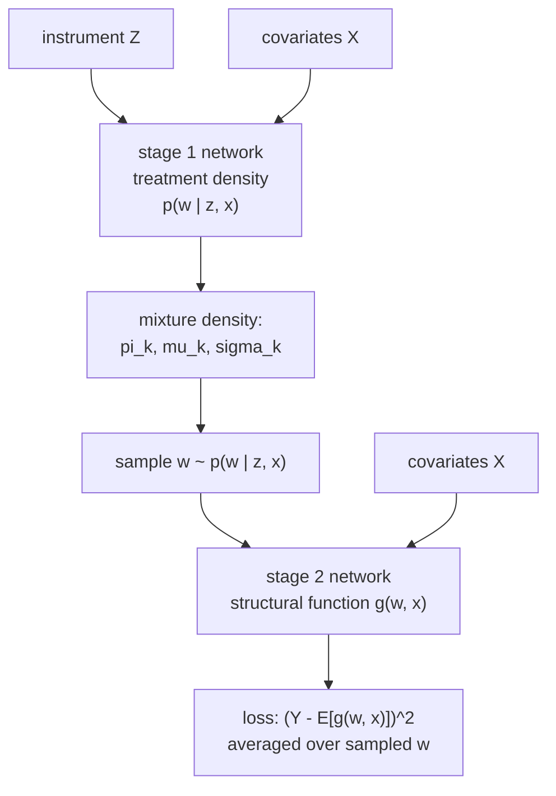

CEVAE handled unmeasured confounding through proxies. When no proxy exists but an
**instrument** does, B5/iv-estimation gave the classical tool: two-stage least
squares (2SLS). An instrument $Z$ shifts the treatment $W$ but affects the outcome
$Y$ only through $W$, so the part of $W$ that $Z$ predicts is unconfounded.
Classical 2SLS regresses $W$ on $Z$ linearly, then regresses $Y$ on the fitted
$\hat W$. That linearity is the limitation: it can only recover a linear treatment
response. **Deep IV** keeps the two-stage logic but makes both stages neural, so
the recovered response can be an arbitrary nonlinear function of the
treatment<FN n="1" />.

## Why a plug-in fails and what 2SLS really estimates

Start from the structural equation. The outcome is generated by an unknown
**structural function** $g$ of treatment and covariates, plus a confounded error:

$$
Y = g(W, X) + \varepsilon, \qquad \mathbb{E}[\varepsilon \mid W] \ne 0.
$$

The error correlates with $W$ (that is the confounding), so regressing $Y$ on $W$
estimates $g$ plus the bias from $\varepsilon$. The instrument's defining property
is exclusion: $Z$ affects $Y$ only through $W$, so $\mathbb{E}[\varepsilon \mid
Z, X] = 0$. Taking the conditional expectation of the structural equation given
the instrument and covariates removes the error,

$$
\mathbb{E}[Y \mid Z, X] = \mathbb{E}\big[ g(W, X) \mid Z, X \big] = \int g(w, X)\, p(w \mid Z, X)\, dw.
$$

**Step 1.** The left side is observable: it is a regression of $Y$ on $(Z, X)$.

**Step 2.** The right side is the structural function $g$ averaged against the
*conditional treatment distribution* $p(w \mid Z, X)$, the distribution of
treatment given the instrument and covariates.

**Step 3.** This is an integral equation for the unknown $g$. Linear 2SLS solves
its special case where $g$ is linear and $p(w \mid Z, X)$ is summarized by its
mean $\hat W$. Plugging the conditional mean $\hat W$ into a nonlinear $g$ is
*wrong*, because $\mathbb{E}[g(W)] \ne g(\mathbb{E}[W])$ for nonlinear $g$ (Jensen).
Deep IV solves the integral equation directly instead of taking the plug-in
shortcut.

## The two neural stages



**Stage 1: the treatment density.** A network estimates the full conditional
distribution $p(w \mid z, x)$, not just its mean. For a continuous treatment this
is a **mixture density network**<FN n="2" />: the network outputs the parameters
of a Gaussian mixture,

$$
\hat p(w \mid z, x) = \sum_{k=1}^{K} \pi_k(z, x)\, \mathcal{N}\big( w;\, \mu_k(z, x),\, \sigma_k^2(z, x) \big),
$$

with mixture weights $\pi_k$, means $\mu_k$, and variances $\sigma_k^2$ all output
by the network and trained by maximum likelihood on the observed $(z, x, w)$
triples. Capturing the whole density, not the mean, is what lets Stage 2 integrate
$g$ correctly.

**Stage 2: the structural function.** A second network $\hat g(w, x)$ is trained
to minimize the outcome loss with the treatment *integrated out* against the Stage
1 density:

$$
\hat g = \arg\min_{g} \;\; \frac{1}{n} \sum_{i=1}^{n} \left( y_i - \int g(w, x_i)\, \hat p(w \mid z_i, x_i)\, dw \right)^2.
$$

The inner integral is the model's prediction of $\mathbb{E}[Y \mid Z, X]$, matched
to the observed $y_i$. It is estimated by sampling $B$ treatments from the Stage 1
mixture and averaging $g$ over them, so the loss for one unit is

$$
\left( y_i - \frac{1}{B}\sum_{b=1}^{B} g\big( w_i^{(b)},\, x_i \big) \right)^2, \qquad w_i^{(b)} \sim \hat p(w \mid z_i, x_i).
$$

Once $\hat g$ is fit, the causal response is read off directly: the effect of
moving treatment from $w$ to $w'$ at covariates $x$ is
$\hat g(w', x) - \hat g(w, x)$, with no confounding because $g$ was identified
through the instrument.

```python-static
import torch
import torch.nn as nn

class MixtureDensityNet(nn.Module):
    """Stage 1: p(w | z, x) as a K-component Gaussian mixture."""
    def __init__(self, in_dim, K=10, hidden=64):
        super().__init__()
        self.body = nn.Sequential(nn.Linear(in_dim, hidden), nn.ReLU(),
                                  nn.Linear(hidden, hidden), nn.ReLU())
        self.pi = nn.Linear(hidden, K)       # mixture logits
        self.mu = nn.Linear(hidden, K)       # component means
        self.log_sigma = nn.Linear(hidden, K)

    def forward(self, zx):
        h = self.body(zx)
        return self.pi(h), self.mu(h), self.log_sigma(h)

def mdn_nll(pi_logits, mu, log_sigma, w):
    # negative log-likelihood of observed w under the mixture
    log_pi = torch.log_softmax(pi_logits, dim=-1)
    var = torch.exp(2 * log_sigma)
    comp = -0.5 * ((w[:, None] - mu) ** 2 / var) - log_sigma
    return -(torch.logsumexp(log_pi + comp, dim=-1)).mean()

class StructuralNet(nn.Module):
    """Stage 2: g(w, x)."""
    def __init__(self, x_dim, hidden=64):
        super().__init__()
        self.net = nn.Sequential(nn.Linear(x_dim + 1, hidden), nn.ReLU(),
                                 nn.Linear(hidden, hidden), nn.ReLU(),
                                 nn.Linear(hidden, 1))
    def forward(self, w, x):
        return self.net(torch.cat([w[:, None], x], dim=-1)).squeeze(-1)

def stage2_loss(g, x, y, w_samples):
    # w_samples: (n, B) draws from stage-1 density; average g over them
    preds = torch.stack([g(w_samples[:, b], x) for b in range(w_samples.shape[1])], 1)
    return ((y - preds.mean(dim=1)) ** 2).mean()
```

## The Jensen gap, concretely

The reason the density matters, not just the mean, is sharpest on a curved
structural function. Suppose $g(w) = w^2$ and, at some instrument value, the
treatment given the instrument is symmetric around mean $0$ with variance
$\sigma^2 = 1$. The plug-in estimate uses the mean: $g(\bar w) = 0^2 = 0$. The
correct quantity integrates the square over the distribution:
$\mathbb{E}[g(w)] = \mathbb{E}[w^2] = \mathrm{Var}(w) + \bar w^2 = 1 + 0 = 1$. The
plug-in is off by the entire variance term. Deep IV's Stage 1 density and Stage 2
sampling recover the $1$; a mean-plug-in would report $0$.

## Worked code: density-averaging vs mean-plug-in

The networks need torch, but the integral equation Deep IV solves runs in numpy.
The following builds a nonlinear structural function and a conditional treatment
density, then shows that averaging $g$ over the density matches the true
$\mathbb{E}[Y \mid Z]$ while plugging in the conditional mean does not, the exact
error Deep IV avoids.

```python
import numpy as np

rng = np.random.default_rng(0)

def g(w):                                    # nonlinear structural function
    return 0.5 * w ** 2 - 0.3 * w

# at a fixed instrument value, the treatment density is a 2-component mixture
# (e.g. an instrument that pushes treatment toward two regimes)
n_samp = 200000
comp = rng.uniform(size=n_samp) < 0.5
w = np.where(comp, rng.normal(-1.0, 0.5, n_samp), rng.normal(2.0, 0.5, n_samp))

# truth: E[Y | Z] = E[g(w)] under the full treatment density
true_EY = g(w).mean()

# Deep-IV-style: average g over samples from the density (Stage 2 estimator)
density_avg = g(w).mean()                     # same integral, what Deep IV targets

# naive plug-in: g evaluated at the conditional MEAN of the treatment
mean_plug = g(w.mean())

print(f"true  E[g(w)]:        {true_EY:.4f}")
print(f"density-averaged g:   {density_avg:.4f}")
print(f"mean-plug-in g(E[w]): {mean_plug:.4f}")

# density-averaging is exact; the plug-in is off because g is nonlinear (Jensen)
assert np.isclose(density_avg, true_EY)
assert abs(mean_plug - true_EY) > 0.3
```

Averaging the structural function over the treatment density reproduces
$\mathbb{E}[Y \mid Z]$ exactly, while evaluating it at the conditional mean is off
by the Jensen gap. Deep IV's first stage exists to provide that density so the
second stage can integrate correctly, which is the whole advantage over a
linear-mean 2SLS.

## Exercises

**Exercise 1.** State the two instrument conditions (relevance and exclusion) in
terms of the structural equation $Y = g(W, X) + \varepsilon$, and identify which
one fails if the instrument $Z$ has a direct arrow into $Y$.

<details>
<summary>Solution</summary>

**Step 1.** *Relevance*: $Z$ shifts the treatment, $p(w \mid z, x)$ depends on
$z$. Without it, Stage 1 produces a density that ignores $Z$, the instrument
carries no exogenous variation, and $g$ is unidentified (the integral equation
becomes degenerate).

**Step 2.** *Exclusion*: $Z$ affects $Y$ only through $W$, so
$\mathbb{E}[\varepsilon \mid Z, X] = 0$. A direct arrow $Z \to Y$ violates
exclusion: now $\mathbb{E}[Y \mid Z, X]$ picks up the direct effect of $Z$ on top
of the channel through $W$, and the integral equation no longer isolates $g$. So a
direct $Z \to Y$ arrow breaks exclusion, not relevance.

</details>

**Exercise 2.** For the structural function $g(w) = a w^2 + b w + c$, derive the
bias of the mean-plug-in $g(\bar w)$ relative to the correct $\mathbb{E}[g(w)]$ in
terms of the treatment variance $\sigma_w^2 = \mathrm{Var}(w \mid z, x)$.

<details>
<summary>Solution</summary>

**Step 1.** The correct quantity is

$$
\mathbb{E}[g(w)] = a\,\mathbb{E}[w^2] + b\,\mathbb{E}[w] + c = a(\sigma_w^2 + \bar w^2) + b\bar w + c.
$$

**Step 2.** The plug-in is $g(\bar w) = a\bar w^2 + b\bar w + c$. Subtracting,

$$
\mathbb{E}[g(w)] - g(\bar w) = a\,\sigma_w^2.
$$

The bias is the curvature $a$ times the conditional treatment variance. It
vanishes only when $g$ is linear ($a = 0$) or the instrument pins the treatment
exactly ($\sigma_w^2 = 0$), which is why linear 2SLS gets away with the plug-in
and Deep IV does not.

</details>

**Exercise 3 (code).** Verify the Exercise 2 result numerically: for
$g(w) = a w^2 + b w + c$ with chosen $a, b, c$, confirm that
$\mathbb{E}[g(w)] - g(\bar w)$ equals $a\,\sigma_w^2$ for a sampled treatment
distribution, and that it is zero when $a = 0$.

<details>
<summary>Solution</summary>

```python
import numpy as np

rng = np.random.default_rng(1)
n = 500000
a, b, c = 0.7, -0.4, 1.2
w = rng.normal(1.5, 0.9, n)                   # treatment given (z, x)

def g(w, a):
    return a * w ** 2 + b * w + c

exact = g(w, a).mean()
plug = g(w.mean(), a)
sigma2 = w.var()
print(f"E[g] - g(mean):  {exact - plug:.4f}")
print(f"a * Var(w):      {a * sigma2:.4f}")

# the Jensen gap equals curvature times treatment variance
assert np.isclose(exact - plug, a * sigma2, atol=1e-2)

# linear structural function (a = 0) has no gap: plug-in is exact
exact0 = g(w, 0.0).mean()
plug0 = g(w.mean(), 0.0)
assert np.isclose(exact0, plug0, atol=1e-3)
```

The measured Jensen gap matches $a\,\sigma_w^2$ and collapses to zero when the
structural function is linear, confirming that Deep IV's density-averaging matters
exactly to the extent the treatment response is curved.

</details>

This closes the deep causal inference discipline: representation balancing,
two-head and propensity-aware networks, generative imputation, latent-confounder
VAEs, and neural instruments. The next subsection (M5) turns estimated effects
into decisions, defining the optimal treatment policy and its value.

<Footnotes>
  <FNItem n="1">**Hartford, J., Lewis, G., Leyton-Brown, K., & Taddy, M.** (2017). "Deep IV: A flexible approach for counterfactual prediction". *ICML*. The two-stage mixture-density / structural-network estimator. [arXiv:1612.09596](https://arxiv.org/abs/1612.09596)</FNItem>
  <FNItem n="2">**Bishop, C. M.** (1994). "Mixture density networks". *Technical Report NCRG/94/004, Aston University*. The Gaussian-mixture density network used in Stage 1. [link](https://publications.aston.ac.uk/id/eprint/373/)</FNItem>
</Footnotes>
