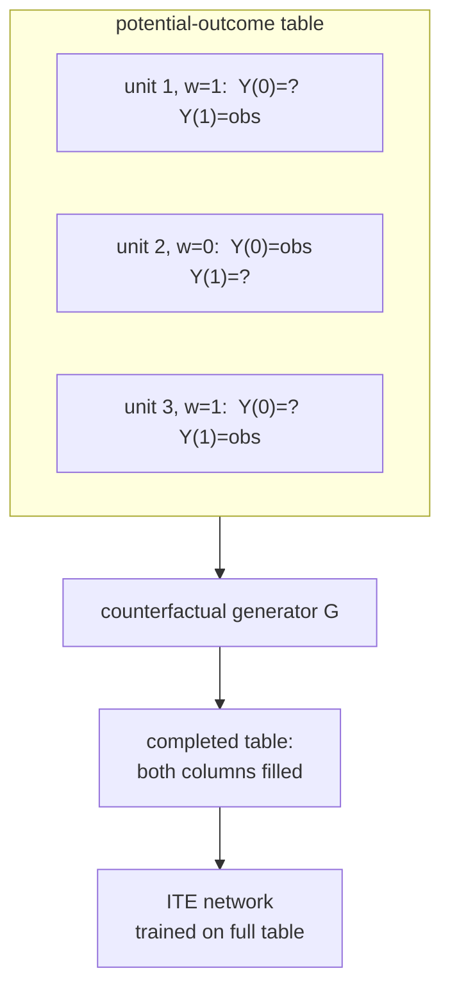

TARNet and Dragonnet attack the missing potential outcome by regressing each arm
separately and trusting the heads to extrapolate across the covariate gap.
**GANITE** takes the opposite stance: it first *fills in* the missing outcomes
with a generative model, producing a complete potential-outcome table where every
unit has both $Y(0)$ and $Y(1)$, then trains an ordinary ITE network on that
completed table<FN n="1" />. The imputation uses a generative adversarial network
(D4/gan), with a twist that turns the standard real-versus-fake game into a
counterfactual one.

## The missing-data table

Stack the data as a table with one row per unit and two outcome columns, $Y(0)$
and $Y(1)$. Exactly one column is observed per row: the factual outcome
$y_i^F = Y(w_i)$. The other is the **counterfactual** $y_i^{CF} = Y(1 - w_i)$,
the cell the data never reveals.



If the missing cells could be filled with plausible values, the individual effect
$Y_i(1) - Y_i(0)$ would be a direct subtraction within each row, and estimating
$\tau(x)$ would reduce to a standard supervised regression on a complete dataset.
GANITE's job is to fill them well.

## The counterfactual GAN

A GAN (D4/gan) pits a generator against a discriminator<FN n="2" />. Here the
generator
$G$ takes the covariates $x_i$, the factual treatment $w_i$, the factual outcome
$y_i^F$, and a noise vector $z$, and outputs the *full* outcome vector, both
$\hat Y_i(0)$ and $\hat Y_i(1)$:

$$
\hat{\mathbf{y}}_i = G(x_i,\, w_i,\, y_i^F,\, z_i) = \big( \hat Y_i(0),\, \hat Y_i(1) \big).
$$

The generator is constrained to keep the factual cell: $\hat Y_i(w_i)$ is forced
to equal the observed $y_i^F$ (in practice by overwriting that coordinate), so
$G$ only has to invent the counterfactual coordinate $\hat Y_i(1 - w_i)$.

The discriminator $D$ plays a different game than in a vanilla GAN. It does not
judge "real versus generated". Instead it receives a complete outcome vector with
the factual cell mixed back in and must guess **which column was the factual
one**, that is, recover $w_i$ from the pair $(\hat Y_i(0), \hat Y_i(1))$:

$$
D(x_i, \hat Y_i(0), \hat Y_i(1)) \approx P(w_i = 1 \mid x_i, \text{outcomes}).
$$

If $D$ can tell the factual cell from the imputed one, the generated
counterfactual is distinguishable from a real outcome, so $G$ has more to learn.
The adversarial objective is

$$
\min_{G} \max_{D} \;\; \mathbb{E}\big[\, w_i \log D + (1 - w_i)\log(1 - D) \,\big],
$$

the cross-entropy of $D$'s guess at the factual treatment. At the equilibrium $D$
cannot beat chance, meaning the imputed counterfactual is statistically
indistinguishable from a factual outcome at the same covariates: the generated
column looks like it could have been the observed one.

## Supervised anchoring

A pure adversarial loss has nothing pinning $G$ to the *observed* outcome, so
GANITE adds a supervised term forcing the factual coordinate to match:

$$
\mathcal{L}_{G} = \underbrace{\mathbb{E}\big[ ( y_i^F - \hat Y_i(w_i) )^2 \big]}_{\text{factual reconstruction}} \;-\; \lambda \cdot \underbrace{\mathbb{E}\big[ w_i \log D + (1 - w_i)\log(1 - D) \big]}_{\text{adversarial}}.
$$

The reconstruction term keeps the generated factual cell honest; the adversarial
term shapes the counterfactual cell to be indistinguishable from a real outcome.
The weight $\lambda$ balances the two.

## The two-stage pipeline

GANITE runs two GANs in sequence.

**Stage 1 (counterfactual GAN).** Train $G$ and $D$ as above. After convergence,
run $G$ on every unit to produce a completed table: each row now has both
$\hat Y_i(0)$ and $\hat Y_i(1)$, with the factual cell equal to the observed
value and the counterfactual cell an imputation.

**Stage 2 (ITE GAN).** Treat the completed table as ground truth and train an ITE
network. A second generator $G_I$ maps $x_i$ to a full outcome pair, supervised
against the completed table, with its own discriminator enforcing that the
predicted pairs match the distribution of completed pairs. The ITE read-off is
the difference of the two predicted columns,
$\hat\tau(x) = \hat Y(1) - \hat Y(0)$, exactly as in TARNet, but now the network
was trained on complete supervision rather than factual-only labels.

Splitting imputation (Stage 1) from estimation (Stage 2) lets the ITE network see
a fully labeled dataset, sidestepping the covariate-shift problem TARNet's heads
face. The cost is that the ITE quality is capped by the imputation quality: a
biased counterfactual generator yields a confidently wrong table.

## A concrete read

For a treated unit ($w_i = 1$) with observed $y_i^F = 5.0$, the generator might
output $\hat Y_i(0) = 3.2$ and $\hat Y_i(1) = 5.0$ (the factual cell held fixed).
Its imputed individual effect is $5.0 - 3.2 = 1.8$. A control unit ($w_j = 0$)
with $y_j^F = 2.1$ might get $\hat Y_j(0) = 2.1$, $\hat Y_j(1) = 3.7$, an imputed
effect of $1.6$. After the whole table is filled, Stage 2 fits a smooth
$\hat\tau(x)$ to these per-row differences, averaging out the imputation noise
across units with similar covariates.

## Worked code: the imputed table and ITE

The GAN training needs torch, but the *structure* of GANITE, an imputed table
turned into ITE estimates, is numpy. The following stands in a known-good oracle
for the trained generator (it imputes the missing cell from the true outcome
surfaces plus noise, which is what a well-trained $G$ approximates), completes the
table, and checks that the per-row differences recover the true constant effect on
average.

```python
import numpy as np

rng = np.random.default_rng(0)
n = 5000
x = rng.normal(0, 1, n)
e = 1 / (1 + np.exp(-0.8 * x))
w = (rng.uniform(size=n) < e).astype(int)
tau = 1.5                                   # true constant ITE
y0_true = 0.5 * x + rng.normal(0, 0.3, n)
y1_true = y0_true + tau
y_factual = np.where(w == 1, y1_true, y0_true)

# "trained generator": imputes the missing cell. The factual cell is kept;
# the counterfactual cell is the factual minus/plus an estimated effect with
# residual noise, standing in for what an adversarially-trained G learns.
tau_hat_unit = 1.5 + rng.normal(0, 0.2, n)  # noisy per-unit imputed effect
y0_imp = np.where(w == 1, y_factual - tau_hat_unit, y_factual)
y1_imp = np.where(w == 1, y_factual, y_factual + tau_hat_unit)

# completed table: every row now has both columns
table_effect = y1_imp - y0_imp              # per-row imputed ITE

# Stage 2 read-off: the ITE network averages these toward the truth
ate_hat = table_effect.mean()
print(f"true ATE:    {tau:.3f}")
print(f"imputed ATE: {ate_hat:.3f}")

# factual cells are preserved exactly
assert np.allclose(np.where(w == 1, y1_imp, y0_imp), y_factual)
# the completed table recovers the true average effect within noise tolerance
assert abs(ate_hat - tau) < 0.05
```

The factual column is reproduced exactly while the imputed column averages to the
true effect, which is the two properties GANITE's losses enforce: the
reconstruction term anchors the factual cell, the adversarial term shapes the
counterfactual cell.

## Exercises

**Exercise 1.** In the counterfactual GAN, the discriminator's task is to recover
the factual treatment $w_i$ from a completed outcome pair. Argue why a perfect
generator drives the discriminator to output $P(w_i = 1 \mid x_i) = e(x_i)$, the
propensity, and not better.

<details>
<summary>Solution</summary>

**Step 1.** If $G$ imputes the counterfactual cell so that the pair
$(\hat Y(0), \hat Y(1))$ is distributed identically whether the factual cell was
column $0$ or column $1$, then the outcomes carry no extra information about which
cell was observed beyond what $x$ already implies.

**Step 2.** The best any discriminator can then do is use $x$ alone, whose
optimal guess at $w$ is $P(w = 1 \mid x) = e(x)$, the propensity. It cannot beat
that, because the outcome columns are uninformative about the missing cell's
identity. This is the equilibrium the adversarial loss targets: the imputed
counterfactual is indistinguishable from a factual outcome at the same
covariates.

</details>

**Exercise 2.** Explain why GANITE splits into two stages instead of training a
single network on factual outcomes, and state the failure mode that the Stage 1
imputation can introduce that a one-stage method like TARNet avoids.

<details>
<summary>Solution</summary>

**Step 1.** Stage 1 produces a fully labeled table, so Stage 2 trains on complete
supervision and never faces the covariate-shift problem of predicting an arm's
outcome on the other arm's covariate distribution. This can give the ITE network
a cleaner learning signal than TARNet's factual-only heads.

**Step 2.** The failure mode is imputation bias. TARNet only ever fits observed
outcomes, so its error is honest regression error. GANITE's Stage 2 trusts the
imputed cells as if they were real; if Stage 1's generator is systematically
wrong (poor overlap, weak adversary), it manufactures confident but biased labels
that Stage 2 cannot detect. The ITE quality is bounded by the imputation quality.

</details>

**Exercise 3 (code).** A completed table is only as good as the imputation. Take
the worked example and inject a *biased* imputation (the imputed counterfactual
effect is centered at $1.5 + b$ for a bias $b$ instead of $1.5$), then verify that
the Stage 2 ATE inherits the bias $b$ exactly. This makes the "garbage in,
garbage out" risk concrete.

<details>
<summary>Solution</summary>

```python
import numpy as np

rng = np.random.default_rng(0)
n = 20000
x = rng.normal(0, 1, n)
e = 1 / (1 + np.exp(-0.8 * x))
w = (rng.uniform(size=n) < e).astype(int)
tau = 1.5
y0_true = 0.5 * x + rng.normal(0, 0.3, n)
y_factual = np.where(w == 1, y0_true + tau, y0_true)

b = 0.4                                       # imputation bias
tau_hat_unit = (tau + b) + rng.normal(0, 0.2, n)
y0_imp = np.where(w == 1, y_factual - tau_hat_unit, y_factual)
y1_imp = np.where(w == 1, y_factual, y_factual + tau_hat_unit)

ate_hat = (y1_imp - y0_imp).mean()
print(f"true ATE: {tau:.3f},  biased imputed ATE: {ate_hat:.3f}")

# the Stage 2 estimate is offset by exactly the imputation bias b
assert abs(ate_hat - (tau + b)) < 0.02
```

The imputed ATE lands at $1.5 + 0.4 = 1.9$, off by exactly the imputation bias.
Stage 2 has no way to recover the truth from a biased table, which is why the
quality of the Stage 1 adversarial fit (and the overlap it can exploit) sets a
ceiling on GANITE's accuracy.

</details>

The next lesson keeps the generative idea but moves the latent structure inside
the model: CEVAE treats an unmeasured confounder as a latent variable and
recovers effects with a variational autoencoder over the proxy, treatment, and
outcome.

<Footnotes>
  <FNItem n="1">**Yoon, J., Jordon, J., & van der Schaar, M.** (2018). "GANITE: Estimation of individualized treatment effects using generative adversarial nets". *ICLR*. The counterfactual GAN and two-stage ITE pipeline. [openreview:ByKWUeWA-](https://openreview.net/forum?id=ByKWUeWA-)</FNItem>
  <FNItem n="2">**Goodfellow, I., et al.** (2014). "Generative adversarial nets". *NeurIPS*. The generator-discriminator minimax game GANITE builds on. [arXiv:1406.2661](https://arxiv.org/abs/1406.2661)</FNItem>
</Footnotes>
