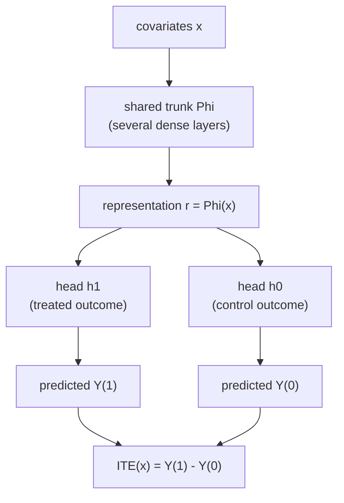
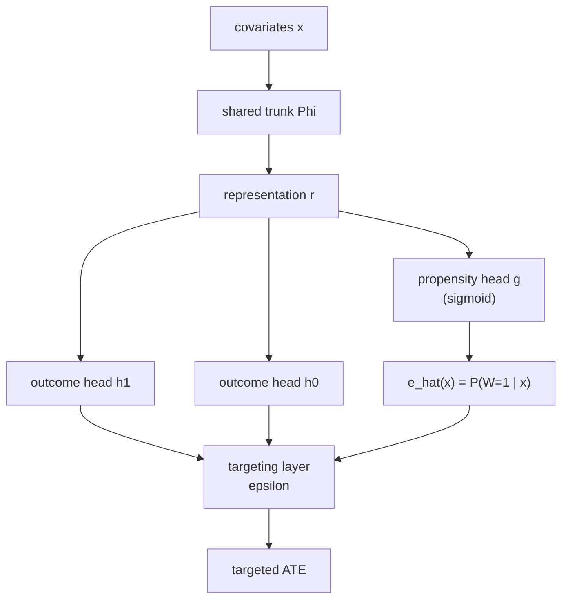

The previous lesson left a recipe: route both potential-outcome heads through a
shared representation $\Phi$, fit the factual outcomes, and optionally penalize
the representation imbalance. This lesson is that recipe as a network. **TARNet**
(treatment-agnostic representation network) is the bare two-head architecture;
**Dragonnet** bolts on a propensity head and a targeting step that makes the
estimated average effect solve the same efficient-estimating equation AIPW does
(M3/aipw). Both read the ITE off the difference of the two heads.

## Why two heads, not one input feature

The naive baseline (the S-learner of M2/meta-learners) feeds the treatment
indicator $w$ as one more input coordinate: $\hat Y = f([x, w])$. A flexible
network is free to ignore that single coordinate among hundreds, so the estimated
effect $f([x, 1]) - f([x, 0])$ can collapse to near zero whenever the outcome
variation in $x$ dwarfs the treatment effect. TARNet removes that failure mode by
giving the treatment its own output head, so the two potential-outcome surfaces
cannot share parameters past the trunk and the effect cannot be regularized
away<FN n="1" />.

## The TARNet architecture

A shared trunk $\Phi$ maps the covariates $x$ to a representation
$r = \Phi(x) \in \mathbb{R}^d$. Two heads then map $r$ to the two potential
outcomes: $h_0$ for $w = 0$ and $h_1$ for $w = 1$.



Training uses only the **factual** head for each unit. A treated unit
($w_i = 1$) contributes a loss through $h_1$, a control unit through $h_0$. With
squared loss the objective is

$$
\mathcal{L}_{\text{TARNet}} = \frac{1}{n} \sum_{i=1}^n \Big( w_i \,\big(y_i - h_1(\Phi(x_i))\big)^2 + (1 - w_i)\,\big(y_i - h_0(\Phi(x_i))\big)^2 \Big).
$$

Each unit's outcome is observed for the arm it received, so each term uses a real
label. The control head is never trained on treated units, which is the
covariate-shift problem from the previous lesson. Adding the IPM penalty
$\alpha\,\mathrm{IPM}(\hat p_\Phi^{w=1}, \hat p_\Phi^{w=0})$ on the trunk output
turns TARNet into CFR; TARNet is the $\alpha = 0$ case. Once trained, the ITE at
any $x$ is

$$
\hat\tau(x) = h_1(\Phi(x)) - h_0(\Phi(x)),
$$

evaluating *both* heads at every $x$, including the counterfactual one each unit
never realized.

```python-static
import torch
import torch.nn as nn

class TARNet(nn.Module):
    def __init__(self, in_dim, rep_dim=64, hidden=64):
        super().__init__()
        self.trunk = nn.Sequential(
            nn.Linear(in_dim, hidden), nn.ELU(),
            nn.Linear(hidden, rep_dim), nn.ELU(),
        )
        # one head per treatment arm
        self.h0 = nn.Sequential(nn.Linear(rep_dim, hidden), nn.ELU(),
                                nn.Linear(hidden, 1))
        self.h1 = nn.Sequential(nn.Linear(rep_dim, hidden), nn.ELU(),
                                nn.Linear(hidden, 1))

    def forward(self, x):
        r = self.trunk(x)
        return self.h0(r).squeeze(-1), self.h1(r).squeeze(-1)  # y0_hat, y1_hat

def factual_loss(y0_hat, y1_hat, y, w):
    # each unit contributes only through the head of its observed arm
    return (w * (y - y1_hat) ** 2 + (1 - w) * (y - y0_hat) ** 2).mean()

# ITE estimate: evaluate both heads at every x, take the difference
def ite(model, x):
    y0_hat, y1_hat = model(x)
    return y1_hat - y0_hat
```

## Dragonnet: a propensity head

TARNet predicts outcomes but never models the treatment assignment. AIPW
(M3/aipw) showed that the efficient estimator of the average effect needs the
propensity $e(x) = P(W = 1 \mid x)$ as well as the outcomes. Dragonnet adds a
third head off the *same* trunk that predicts the propensity<FN n="2" />.



The propensity head $g$ ends in a sigmoid and is trained with a cross-entropy
loss against the observed treatment $w_i$. Sharing the trunk has a deliberate
side effect: forcing $\Phi$ to predict treatment keeps in the representation
exactly the covariate directions that drive selection, which are the confounders
the effect estimate must adjust for. The base Dragonnet objective is the factual
outcome loss plus a propensity term,

$$
\mathcal{L}_{\text{Dragon}} = \frac{1}{n}\sum_i \Big( (1 - w_i)(y_i - h_0)^2 + w_i (y_i - h_1)^2 \Big) + \beta \cdot \frac{1}{n}\sum_i \mathrm{CE}\big(w_i,\, \hat e(x_i)\big),
$$

with $\mathrm{CE}$ the binary cross-entropy and $\beta$ a weight.

## Targeted regularization

The outcome heads minimize prediction error, not effect error, so the plug-in
average effect $\frac{1}{n}\sum_i (h_1 - h_0)$ is not guaranteed to be the
efficient estimate. Dragonnet's **targeted regularization** adds a single trained
scalar $\epsilon$ and a perturbed outcome that nudges the fit to solve the AIPW
estimating equation<FN n="2" />.

**Step 1.** Define a perturbation of the factual prediction that uses the
propensity head. For a unit with treatment $w_i$, the *clever covariate* is

$$
H(w_i, x_i) = \frac{w_i}{\hat e(x_i)} - \frac{1 - w_i}{1 - \hat e(x_i)},
$$

the same inverse-propensity weight that appears in the AIPW correction term.

**Step 2.** Form the targeted prediction by adding $\epsilon\, H$ to the factual
outcome head $\hat y_i = w_i h_1 + (1 - w_i) h_0$:

$$
\tilde y_i = \hat y_i + \epsilon \, H(w_i, x_i).
$$

**Step 3.** Add the squared error of this targeted prediction to the loss:

$$
\mathcal{L} = \mathcal{L}_{\text{Dragon}} + \gamma \cdot \frac{1}{n}\sum_i \big( y_i - \tilde y_i \big)^2.
$$

Minimizing over $\epsilon$ sets the derivative of the targeting term to zero,
which is exactly the empirical AIPW estimating equation: the residual
$y_i - \hat y_i$ becomes orthogonal to the clever covariate $H$. The plug-in ATE
read off the corrected heads then inherits AIPW's double robustness and
semiparametric efficiency, without a separate post-hoc correction step. This is
the targeting idea of TMLE (M3/tmle) folded into the network's loss.

## A concrete read-off

Suppose a trained Dragonnet, evaluated at a unit with $x$, returns
$h_0(\Phi(x)) = 2.0$, $h_1(\Phi(x)) = 3.6$, and $\hat e(x) = 0.7$. The ITE at this
unit is $\hat\tau(x) = 3.6 - 2.0 = 1.6$. The propensity $0.7$ does not enter the
ITE directly; it enters the *average* effect through the targeting correction,
where units with extreme propensities (near $0$ or $1$, poor overlap) get a
larger clever-covariate magnitude and so a larger correction. A unit with
$\hat e(x) = 0.95$ has clever covariate $1/0.95 \approx 1.05$ if treated, but
$-1/0.05 = -20$ if it were control, flagging that control predictions at that $x$
rest on almost no data.

## Worked code: the targeting step in numpy

The architecture needs torch, but the targeting algebra is numpy. The following
fits the single $\epsilon$ that minimizes the targeting loss given frozen outcome
and propensity predictions, and checks that the resulting residual is orthogonal
to the clever covariate, the AIPW estimating equation.

```python
import numpy as np

rng = np.random.default_rng(0)
n = 4000
x = rng.normal(0, 1, n)
e = 1 / (1 + np.exp(-0.8 * x))            # true propensity
w = (rng.uniform(size=n) < e).astype(float)
mu0 = 0.5 * x
mu1 = 0.5 * x + 1.5
y = np.where(w == 1, mu1, mu0) + rng.normal(0, 0.3, n)

# frozen network outputs: slightly biased outcome heads, good propensity
h0 = 0.5 * x - 0.2
h1 = 0.5 * x + 1.5 + 0.2
e_hat = np.clip(e, 1e-2, 1 - 1e-2)

# clever covariate H and factual prediction y_hat
H = w / e_hat - (1 - w) / (1 - e_hat)
y_hat = w * h1 + (1 - w) * h0

# epsilon that minimizes sum_i (y - (y_hat + eps*H))^2 is a 1-D OLS slope
resid = y - y_hat
eps = (H * resid).sum() / (H * H).sum()
print(f"fitted epsilon: {eps:.4f}")

# after targeting, the new residual is orthogonal to H (the AIPW equation)
new_resid = y - (y_hat + eps * H)
print(f"<H, residual> before: {(H * resid).mean():.4f}")
print(f"<H, residual> after:  {(H * new_resid).mean():.4f}")
assert abs((H * new_resid).mean()) < 1e-9
```

The inner product of the clever covariate with the residual is driven to zero by
the fitted $\epsilon$, which is the finite-sample statement that the targeted
estimate solves AIPW's efficient estimating equation.

## Exercises

**Exercise 1.** A TARNet is trained on a dataset where $70\%$ of units are
controls. Explain why the treated head $h_1$ has higher variance than the control
head $h_0$ even though they share the trunk, and what the IPM penalty does to this
imbalance.

<details>
<summary>Solution</summary>

**Step 1.** The two heads are trained on disjoint subsets: $h_1$ sees only the
$30\%$ treated units, $h_0$ the $70\%$ controls. A head fit on fewer examples has
higher estimation variance, so $h_1$ is noisier, and its predictions on the
control covariate region (where it has no training points) are extrapolations.

**Step 2.** The IPM penalty does not add data, but it constrains $\Phi$ so the
two arms' representations overlap. After balancing, the treated head is evaluated
(at counterfactual queries) on a representation region its training points
already cover, so its extrapolation error shrinks even though its sample count is
unchanged. The penalty trades a little factual fit for this reduced
extrapolation, which is the U-shaped trade-off of the previous lesson.

</details>

**Exercise 2.** Show that minimizing the targeting term
$\frac{1}{n}\sum_i (y_i - \hat y_i - \epsilon H_i)^2$ over the scalar $\epsilon$
forces $\frac{1}{n}\sum_i H_i (y_i - \hat y_i - \epsilon H_i) = 0$, and identify
this as the empirical AIPW estimating equation.

<details>
<summary>Solution</summary>

**Step 1.** Differentiate the targeting loss with respect to $\epsilon$:

$$
\frac{\partial}{\partial \epsilon}\, \frac{1}{n}\sum_i (y_i - \hat y_i - \epsilon H_i)^2 = -\frac{2}{n}\sum_i H_i (y_i - \hat y_i - \epsilon H_i).
$$

Setting it to zero gives $\frac{1}{n}\sum_i H_i (y_i - \tilde y_i) = 0$ with
$\tilde y_i = \hat y_i + \epsilon H_i$, so the targeted residual is orthogonal to
$H$.

**Step 2.** Substituting $H_i = w_i/\hat e_i - (1 - w_i)/(1 - \hat e_i)$ expands
the condition into $\frac{1}{n}\sum_i \big[ \frac{w_i}{\hat e_i}(y_i - \tilde y_i) - \frac{1 - w_i}{1 - \hat e_i}(y_i - \tilde y_i) \big] = 0$,
which is the
inverse-propensity-weighted residual condition AIPW solves. The plug-in ATE
$\frac{1}{n}\sum_i(\tilde h_1 - \tilde h_0)$ from a fit satisfying it equals the
AIPW estimate.

</details>

**Exercise 3 (code).** With frozen, *correct* outcome heads ($h_0 = \mu_0$,
$h_1 = \mu_1$) the residual $y_i - \hat y_i$ is already mean-zero noise, so the
fitted targeting $\epsilon$ should be near zero. Simulate this and assert that
$|\epsilon|$ is small, then break it by biasing the heads and show $\epsilon$
grows to compensate.

<details>
<summary>Solution</summary>

```python
import numpy as np

rng = np.random.default_rng(2)
n = 8000
x = rng.normal(0, 1, n)
e = 1 / (1 + np.exp(-0.8 * x))
w = (rng.uniform(size=n) < e).astype(float)
mu0, mu1 = 0.5 * x, 0.5 * x + 1.5
y = np.where(w == 1, mu1, mu0) + rng.normal(0, 0.3, n)
e_hat = np.clip(e, 1e-2, 1 - 1e-2)
H = w / e_hat - (1 - w) / (1 - e_hat)

def fit_eps(h0, h1):
    y_hat = w * h1 + (1 - w) * h0
    r = y - y_hat
    return (H * r).sum() / (H * H).sum()

eps_correct = fit_eps(mu0, mu1)              # heads correct
eps_biased = fit_eps(mu0 - 0.4, mu1 + 0.4)   # heads biased apart
print(f"epsilon, correct heads: {eps_correct:.4f}")
print(f"epsilon, biased heads:  {eps_biased:.4f}")

assert abs(eps_correct) < 0.05               # nothing to correct
assert abs(eps_biased) > abs(eps_correct)    # targeting absorbs the head bias
```

When the heads are right the residual carries no propensity-weighted signal and
$\epsilon \approx 0$; when the heads are biased, $\epsilon$ moves to restore the
orthogonality condition, which is targeted regularization repairing a
misspecified outcome model.

</details>

The next lesson swaps the discriminative heads for a generative model: GANITE
imputes the missing potential outcome with a counterfactual GAN, then trains an
ITE network on the completed table.

<Footnotes>
  <FNItem n="1">**Shalit, U., Johansson, F. D., & Sontag, D.** (2017). "Estimating individual treatment effect: generalization bounds and algorithms". *ICML*. Introduces TARNet and CFR. [arXiv:1606.03976](https://arxiv.org/abs/1606.03976)</FNItem>
  <FNItem n="2">**Shi, C., Blei, D. M., & Veitch, V.** (2019). "Adapting neural networks for the estimation of treatment effects". *NeurIPS*. Dragonnet's propensity head and targeted regularization. [arXiv:1906.02120](https://arxiv.org/abs/1906.02120)</FNItem>
</Footnotes>
