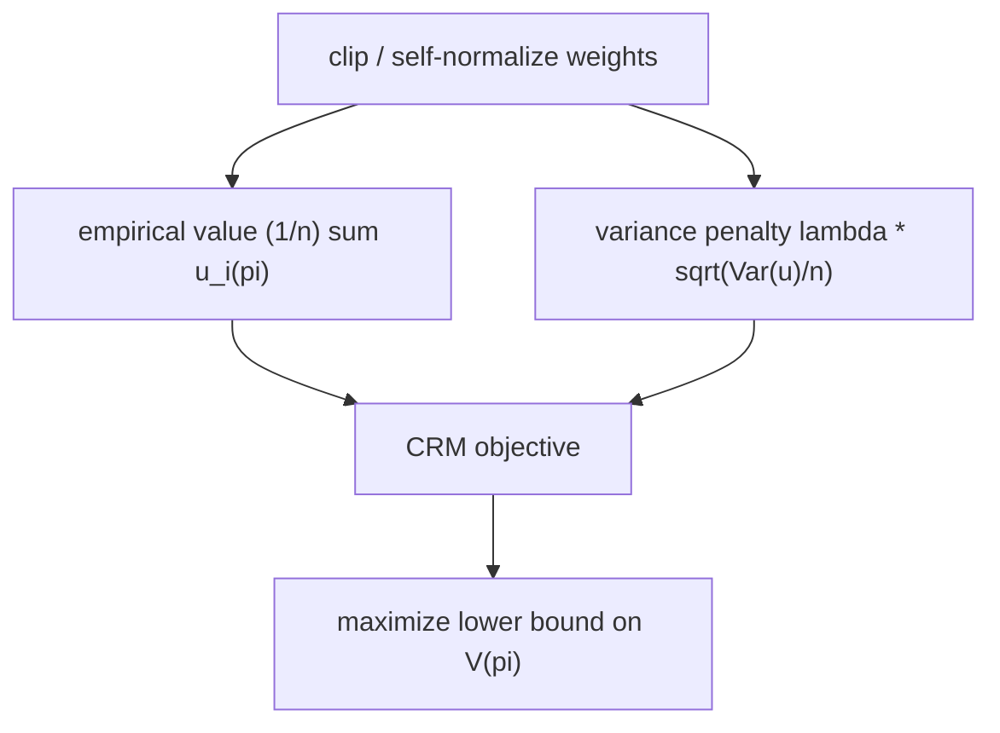

The policy-learning objective of the previous lesson maximized an importance-weighted
value. When overlap is poor, that objective is dominated by a handful of log
entries with enormous weights $\pi(a \mid x)/\mu(a \mid x)$, and the learner
overfits to them: it picks the policy that happened to put weight on the few
lucky high-reward records, not the policy with high true value. **Counterfactual
risk minimization** (CRM) is the principled fix: it keeps the off-policy objective
but adds a penalty for its own variance, and it tames the weights with clipping
and self-normalization<FN n="1" />. This lesson builds each piece and shows why
the empirical objective alone is not enough.

## The overfitting problem in off-policy learning

Learning maximizes $\hat V_{\mathrm{IPS}}(\pi) = \frac{1}{n}\sum_i w_i(\pi)\,r_i$
over $\pi$, where $w_i(\pi) = \pi(a_i \mid x_i)/\mu(a_i \mid x_i)$. Two failures
compound:

- **High variance.** $\mathrm{Var}[w_i r_i]$ scales with $\mathbb{E}[w^2]$, which
  is large under poor overlap. The objective is a noisy estimate of the value.
- **Variance that depends on $\pi$.** Different policies put mass on different
  log entries, so each $\pi$ has its own objective variance. A policy that
  concentrates its mass on a few high-weight records has a *higher-variance*
  objective, and maximizing the empirical value rewards exactly such policies: a
  high empirical value can be a high-variance fluke rather than a high true value.

Standard empirical risk minimization assumes every hypothesis is evaluated with
the same noise level. Here the noise level is policy-dependent, so the learner
must be told to prefer low-variance objectives. CRM does this with a
**generalization bound**.

## The CRM objective: value minus a variance penalty

CRM minimizes a counterfactual risk (negative value) plus a penalty proportional
to the empirical standard deviation of the per-sample objective<FN n="1" />.
Writing $u_i(\pi) = w_i(\pi)\,r_i$ for the per-sample value contribution and
$\widehat{\mathrm{Var}}$ for the sample variance, the objective is

$$
\hat\pi = \arg\max_{\pi \in \Pi}
\left[\, \frac{1}{n}\sum_{i=1}^n u_i(\pi)
\;-\; \lambda \sqrt{\frac{\widehat{\mathrm{Var}}\big(u_1(\pi), \dots, u_n(\pi)\big)}{n}} \,\right],
$$

with a tuning constant $\lambda > 0$. The first term is the empirical value
(reward, larger better); the second subtracts a confidence-interval half-width.
The penalty comes from a sample-variance generalization bound: with high
probability the true value exceeds the empirical value minus $O(\sqrt{\widehat{\mathrm{Var}}/n})$,
so maximizing the penalized objective maximizes a lower bound on the true value.

**Step 1. Why the standard deviation, not the variance.** A Bernstein-type
concentration inequality controls a mean by its empirical variance: with
probability at least $1 - \delta$,

$$
V(\pi) \;\ge\; \frac{1}{n}\sum_i u_i(\pi) - c\,\sqrt{\frac{\widehat{\mathrm{Var}}(u(\pi))}{n}} - \frac{c'}{n},
$$

uniformly over $\pi \in \Pi$. The square-root of variance over $n$ is the
dominant ($1/\sqrt n$) term, so the penalty is a standard deviation, matching the
scale of the value. Maximizing the right side maximizes a uniform lower bound on
$V(\pi)$, which is the safe thing to optimize from finite data.

**Step 2. What the penalty discourages.** Two policies with the same empirical
value but different variances are no longer tied: the one whose per-sample
contributions $u_i$ are spread out (because it leans on a few high-weight records)
pays a larger penalty and loses. CRM systematically prefers policies whose value
estimate rests on many records rather than a few, which is exactly the property a
trustworthy off-policy estimate needs.



## Taming the weights: clipping

The variance penalty controls overfitting, but the underlying weights can still be
unboundedly large. **Weight clipping** caps each importance weight at a threshold
$M$:

$$
\bar w_i = \min(w_i, M).
$$

Clipping trades bias for variance, the standard guard for importance weights in
production off-policy systems<FN n="3" />. The clipped estimator
$\frac{1}{n}\sum_i \bar w_i r_i$ drops the mass above $M$, biasing the value
*downward* (assuming positive rewards), but it bounds each term by $M\cdot
r_{\max}$, capping the variance. Small $M$: low variance, large bias. Large $M$:
unbiased, high variance. The minimum-MSE $M$ sits between, and the figure below
traces the U-shaped MSE.


## Taming the weights: self-normalization

Clipping caps individual weights; **self-normalization** fixes a different
pathology. The raw IPS weights satisfy $\mathbb{E}[\frac{1}{n}\sum_i w_i] = 1$ in
expectation, but in any finite sample $\frac{1}{n}\sum_i w_i \neq 1$, and this
random total scale is multiplied into the estimate. The **self-normalized**
estimator (SNIPS) divides by the realized weight sum instead of $n$<FN n="2" />:

$$
\hat V_{\mathrm{SNIPS}}(\pi) = \frac{\sum_i w_i\, r_i}{\sum_i w_i}.
$$

This is a weighted average of rewards with weights $w_i$, so it always lands in
the range of observed rewards, unlike raw IPS which can exceed it when the weights
happen to sum above $n$. SNIPS is **biased** (a ratio of two random quantities is
not the ratio of their means) but the bias is $O(1/n)$ and vanishes, while its
variance is far lower and it is invariant to a constant rescaling of the weights.
The cost is **equivariance to reward shift**: SNIPS is not invariant to adding a
constant to all rewards, so rewards are usually centered before applying it.

## A concrete contrast

Take a single context, target $\pi$ always picking action $1$, logging
$\mu(1) = 0.05$ so the weight on an $a = 1$ entry is $1/0.05 = 20$. True reward of
action $1$ is $r = 1$, so $V(\pi) = 1$. With $n = 100$ logs, on average $5$ took
action $1$.

- **Raw IPS** on a sample where $6$ entries (one extra) took action $1$:
  $\frac{1}{100}\sum w_i r_i = \frac{6 \cdot 20 \cdot 1}{100} = 1.2$, a 20%
  overshoot from a single extra lucky record, the high-variance failure.
- **SNIPS** on the same sample: $\frac{6 \cdot 20 \cdot 1}{6 \cdot 20} = 1.0$
  exactly, because the denominator absorbs the same extra weight. The estimate
  is pinned to the reward scale.
- **Clipped IPS** with $M = 10$: each $a=1$ term contributes $10$ instead of $20$,
  giving $\frac{6 \cdot 10 \cdot 1}{100} = 0.6$, biased low but with half the
  variance of raw IPS.

SNIPS removes the scale fluctuation, clipping removes the heavy tail, and the CRM
penalty stops the learner from chasing whichever policy got the lucky sample. The
three are complementary and usually combined.

## Worked code

The simulation compares raw IPS, clipped IPS, and SNIPS across repeated logged
datasets under poor overlap, confirming SNIPS has the lowest variance among the
unbiased-in-the-limit estimators and that clipping reduces variance at the cost of
a downward bias.

```python
import numpy as np

rng = np.random.default_rng(0)

def one_log(n=300, sharp=2.5):
    x = rng.normal(0, 1, n)
    p1 = 1.0 / (1.0 + np.exp(-sharp * x))   # logging prob of action 1; small for x<0
    a = (rng.uniform(size=n) < p1).astype(float)
    # positive reward for action 1; target always picks action 1, so the rare
    # a=1 records at x<0 carry huge weights 1/p1 -> poor overlap, heavy tails.
    r = np.maximum(a * (1.0 + 0.3 * x) + rng.normal(0, 0.1, n), 0.0)
    mu = np.where(a == 1, p1, 1 - p1)
    pi = np.ones(n)                         # target policy: always action 1
    w = (a == pi).astype(float) / mu
    return w, r

# true value of the target policy via a large oracle sample
xo = rng.normal(0, 1, 2_000_000)
V_true = np.maximum(1.0 + 0.3 * xo, 0.0).mean()

def ips(w, r):    return (w * r).mean()
def clip(w, r, M): return (np.minimum(w, M) * r).mean()
def snips(w, r):   return (w * r).sum() / max(w.sum(), 1e-12)

R = 600
e_ips = np.array([ips(*one_log())      for _ in range(R)])
e_clp = np.array([clip(*one_log(), 8)  for _ in range(R)])
e_snp = np.array([snips(*one_log())    for _ in range(R)])

for name, e in [("IPS", e_ips), ("clip M=8", e_clp), ("SNIPS", e_snp)]:
    print(f"{name:9s} mean {e.mean():.3f}  std {e.std():.3f}  (true {V_true:.3f})")

# SNIPS variance is below raw IPS; clipping biases the mean downward
assert e_snp.std() < e_ips.std()
assert e_clp.mean() < V_true - 0.02      # clipping drops upper-tail mass
assert abs(e_snp.mean() - V_true) < 0.05 # SNIPS stays near the truth
```

SNIPS keeps its mean near the true value (about $1.02$ against a truth of $1.00$)
with markedly smaller spread than raw IPS ($\mathrm{std}\approx0.08$ versus
$0.11$), while the clipped estimator's mean sits below the truth (about $0.93$),
the downward bias clipping pays for its variance reduction.

## Exercises

**Exercise 1.** A log for one context has weights $w = (10, 10, 0, 0, 0)$ (target
always picks action $1$; first two entries took it under $\mu(1) = 0.1$) and
rewards $r = (1, 3, 0, 0, 0)$. Compute the raw IPS, the SNIPS, and the clipped-IPS
($M = 5$) value estimates by hand.

<details>
<summary>Solution</summary>

**Step 1. Raw IPS** averages $w_i r_i$ over all five entries:

$$
\hat V_{\mathrm{IPS}} = \frac{10\cdot 1 + 10\cdot 3 + 0 + 0 + 0}{5} = \frac{40}{5} = 8.
$$

**Step 2. SNIPS** divides by the weight sum instead of $n$:

$$
\hat V_{\mathrm{SNIPS}} = \frac{10\cdot 1 + 10\cdot 3}{10 + 10} = \frac{40}{20} = 2,
$$

the weighted average of the two observed rewards $1$ and $3$, which sits inside
their range.

**Step 3. Clipped IPS** caps each weight at $M = 5$, so $\bar w = (5,5,0,0,0)$:

$$
\hat V_{\mathrm{clip}} = \frac{5\cdot 1 + 5\cdot 3}{5} = \frac{20}{5} = 4.
$$

Clipping halves the weights, dragging the estimate from $8$ toward $0$: biased
low relative to raw IPS, the variance-reduction trade.

</details>

**Exercise 2.** Show that SNIPS is invariant to multiplying every weight by a
constant $c > 0$, and that raw IPS is not. Explain why this makes SNIPS robust to
a misspecified normalizing constant in $\mu$.

<details>
<summary>Solution</summary>

**Step 1.** Replace $w_i$ by $c\,w_i$ in SNIPS:

$$
\frac{\sum_i (c w_i) r_i}{\sum_i c w_i} = \frac{c \sum_i w_i r_i}{c \sum_i w_i}
= \frac{\sum_i w_i r_i}{\sum_i w_i},
$$

unchanged: the $c$ cancels between numerator and denominator.

**Step 2.** For raw IPS, $\frac{1}{n}\sum_i (c w_i) r_i = c \cdot \frac{1}{n}\sum_i
w_i r_i$, which scales by $c$. A wrong overall scale in the weights multiplies the
raw estimate directly.

**Step 3.** If the logging probabilities are known only up to a constant (an
unnormalized $\mu$, or a propensity model off by a global factor), SNIPS returns
the same value while raw IPS is biased by that factor. This is why SNIPS is the
safer default when $\mu$ is estimated rather than exactly known.

</details>

**Exercise 3 (code).** Implement the CRM objective for two candidate policies and
verify the variance penalty can flip the ranking. Build a logged dataset where
policy A has slightly higher empirical value but much higher per-sample variance
than policy B; confirm that with a large enough $\lambda$ the CRM objective prefers
B.

<details>
<summary>Solution</summary>

```python
import numpy as np

rng = np.random.default_rng(5)
n = 500

# per-sample value contributions u_i for two policies:
# A: high mean but heavy-tailed (a few huge weighted rewards)
uA = np.full(n, 0.95)
uA[:8] = 0.95 + rng.normal(8, 2, 8)       # a few high-weight lucky records
# B: slightly lower mean, tight spread
uB = rng.normal(1.0, 0.2, n)

def crm(u, lam):
    return u.mean() - lam * np.sqrt(u.var() / n)

# empirical value: A edges B
assert uA.mean() > uB.mean()
# no penalty: A wins
assert crm(uA, 0.0) > crm(uB, 0.0)
# large penalty: B wins because A's per-sample variance is far larger
lam = 5.0
assert crm(uB, lam) > crm(uA, lam)
print(f"value A {uA.mean():.3f} (std {uA.std():.2f}), "
      f"B {uB.mean():.3f} (std {uB.std():.2f}); CRM(lam={lam}) prefers B")
```

Without the penalty the higher-mean policy A wins, but its per-sample variance is
large; the variance penalty subtracts more from A than from B, and beyond a
threshold $\lambda$ the CRM objective ranks the lower-variance policy B above it.

</details>

CRM keeps off-policy learning honest in one batch of logged data; the next lesson
places the whole machinery in the contextual-bandit frame and connects it to
exploration and to off-policy reinforcement learning.

<Footnotes>
  <FNItem n="1">**Swaminathan, A., & Joachims, T.** (2015). "Counterfactual Risk Minimization: Learning from Logged Bandit Feedback". *ICML*. Introduces the sample-variance-penalized off-policy objective. [arXiv:1502.02362](https://arxiv.org/abs/1502.02362)</FNItem>
  <FNItem n="2">**Swaminathan, A., & Joachims, T.** (2015). "The Self-Normalized Estimator for Counterfactual Learning". *NeurIPS*. The self-normalized importance-sampling estimator (SNIPS) that fixes the propensity-overfitting of the raw estimator.</FNItem>
  <FNItem n="3">**Bottou, L., Peters, J., Quiñonero-Candela, J., et al.** (2013). "Counterfactual Reasoning and Learning Systems". *JMLR* 14, 3207-3260. Importance-weighting, clipping, and confidence bounds for off-policy learning in production systems. [arXiv:1209.2355](https://arxiv.org/abs/1209.2355)</FNItem>
</Footnotes>
