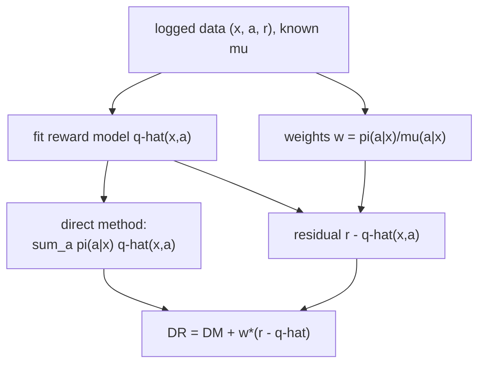

The previous lesson defined a policy's value $V(\pi) = \mathbb{E}[Y(\pi(X))]$ but
assumed access to the potential outcomes. In practice the only evidence is a
**log**: contexts that arrived, actions a deployed system took, and the rewards
those actions earned. To decide whether to roll out a new policy $\pi$, its value
must be estimated from data generated by a different **logging policy** $\mu$
without ever running $\pi$. This is **off-policy evaluation** (OPE), and it is the
counterfactual question of M2 wearing decision-theory clothes: what reward *would*
$\pi$ have earned on the same contexts.

## The logged bandit feedback setting

The log is $n$ tuples $(x_i, a_i, r_i)$ where context $x_i$ is drawn from the
population, the logged action $a_i \sim \mu(\cdot \mid x_i)$ is sampled from the
logging policy with known probability $\mu(a_i \mid x_i)$, and the reward
$r_i = Y_i(a_i)$ is observed only for the action taken. This is **bandit
feedback**: the rewards of the actions not taken are missing, exactly the
fundamental problem of causal inference (one potential outcome per unit). The
target is the value of a fixed evaluation policy $\pi$,

$$
V(\pi) = \mathbb{E}\Big[\, \textstyle\sum_a \pi(a \mid x)\, Y(a) \,\Big]
       = \mathbb{E}\big[\, Y(\pi(X)) \,\big].
$$

Two assumptions make $V(\pi)$ identifiable, the same pair behind AIPW in M3.
**Unconfoundedness**: given $x$, the logged action is independent of the
potential outcomes (the log records every variable $\mu$ used). **Overlap**: every
action $\pi$ might take has positive logging probability,
$\mu(a \mid x) > 0$ wherever $\pi(a \mid x) > 0$. Without overlap, the log
contains no evidence about an action $\pi$ wants to take.

## The direct method (DM)

The most obvious estimator fits a **reward model** $\hat q(x, a) \approx
\mathbb{E}[Y(a) \mid x]$ on the log (a supervised regression of $r$ on $(x, a)$),
then plugs the policy in:

$$
\hat V_{\mathrm{DM}}(\pi) = \frac{1}{n} \sum_{i=1}^n \sum_a \pi(a \mid x_i)\, \hat q(x_i, a).
$$

DM is a low-variance estimator: it is a smooth average of a fitted function. Its
weakness is **bias**. If $\hat q$ is wrong (misspecified model, extrapolation into
action-context regions the log under-covers), $\hat V_{\mathrm{DM}}$ inherits the
error with no correction, and the bias does not shrink with $n$.

## Inverse propensity scoring (IPS)

The complementary estimator makes no model of the reward and instead reweights the
logged rewards so they represent the target policy. The tool is the **importance
weight**, the ratio of how often $\pi$ would take the logged action to how often
$\mu$ did:

$$
w_i = \frac{\pi(a_i \mid x_i)}{\mu(a_i \mid x_i)}.
$$

The **IPS** estimator is the weighted average reward:

$$
\hat V_{\mathrm{IPS}}(\pi) = \frac{1}{n} \sum_{i=1}^n w_i\, r_i
= \frac{1}{n} \sum_{i=1}^n \frac{\pi(a_i \mid x_i)}{\mu(a_i \mid x_i)}\, r_i.
$$

**Unbiasedness.** Condition on $x$ and take the expectation over the logged
action $a \sim \mu(\cdot \mid x)$ and reward:

$$
\mathbb{E}\Big[\tfrac{\pi(a \mid x)}{\mu(a \mid x)} Y(a) \,\Big|\, x\Big]
= \sum_a \mu(a \mid x)\,\frac{\pi(a \mid x)}{\mu(a \mid x)}\,\mathbb{E}[Y(a) \mid x]
= \sum_a \pi(a \mid x)\,\mathbb{E}[Y(a) \mid x].
$$

The $\mu(a \mid x)$ cancels, leaving the reward averaged under $\pi$. Taking the
outer expectation over $x$ gives $\mathbb{E}[\hat V_{\mathrm{IPS}}] = V(\pi)$:
IPS is **unbiased** whenever overlap holds and $\mu$ is known. The price is
**variance**: the weight $w_i$ is large when $\pi$ favors an action $\mu$ rarely
took, and the variance of $w_i r_i$ scales with $\mathbb{E}[w^2]$, which blows up
as overlap degrades. A single log entry with a tiny $\mu(a_i \mid x_i)$ can
dominate the whole estimate.

## The doubly-robust (DR) estimator

DM is biased but stable; IPS is unbiased but volatile. The **doubly-robust**
estimator combines them so that each fixes the other's flaw. Start from the
direct-method baseline, then add an IPS correction applied to the *residual* of
the reward model rather than the raw reward<FN n="1" />:

$$
\hat V_{\mathrm{DR}}(\pi) = \frac{1}{n} \sum_{i=1}^n
\underbrace{\sum_a \pi(a \mid x_i)\, \hat q(x_i, a)}_{\text{direct method}}
\;+\;
\underbrace{w_i\,\big(r_i - \hat q(x_i, a_i)\big)}_{\text{IPS-corrected residual}}.
$$

The structure mirrors the augmented inverse-probability-weighting (AIPW) estimator
of M3<FN n="2" />: a plug-in term plus an importance-weighted correction for the
plug-in's error on the logged action.

**Step 1. Why the correction has the right mean.** Condition on $x$ and average
the correction over $a \sim \mu(\cdot \mid x)$:

$$
\mathbb{E}\Big[\tfrac{\pi(a \mid x)}{\mu(a \mid x)}\big(Y(a) - \hat q(x, a)\big) \,\Big|\, x\Big]
= \sum_a \pi(a \mid x)\,\big(\mathbb{E}[Y(a)\mid x] - \hat q(x, a)\big).
$$

This is the gap between the true policy value at $x$ and the direct-method term.
Adding it back to the direct-method term recovers $\sum_a \pi(a\mid x)\,
\mathbb{E}[Y(a) \mid x]$ exactly, for *any* $\hat q$. So if $\mu$ is correct, DR
is unbiased no matter how wrong $\hat q$ is.

**Step 2. Double robustness.** Suppose instead $\hat q = q$ is the *correct*
reward model but the logging probabilities $\hat\mu$ used in the weights are
wrong. Then the correction term has conditional mean
$\sum_a \tfrac{\pi(a\mid x)}{\hat\mu(a\mid x)}\mu(a\mid x)\,(q(x,a) - q(x,a)) = 0$:
the residual $r - \hat q$ has mean zero given $x$, so the whole correction
vanishes in expectation regardless of the weights, and DR reduces to the
(correct) direct method. DR is **consistent if either** the reward model
**or** the logging probabilities is correct, hence "doubly robust".

**Step 3. Variance.** Where DM is right, $r_i - \hat q(x_i, a_i)$ is small, so the
importance weight multiplies a small residual instead of the full reward. DR
keeps IPS's unbiasedness but with the variance driven by the *residual* scale, not
the reward scale. With a good $\hat q$, DR's variance is far below IPS's and close
to DM's, while staying unbiased.



## A concrete contrast

Take a single context value (so the weights are scalars) with two actions and a
deterministic target $\pi$ that always picks action $1$. The logging policy took
action $1$ with probability $\mu = 0.1$ and action $0$ with probability $0.9$.
True mean rewards are $q(\cdot, 1) = 2$ and $q(\cdot, 0) = 0$, so $V(\pi) = 2$.

- **IPS** uses only the rare $a = 1$ logs, each with weight $1/0.1 = 10$. With
  10% of entries carrying weight $10$ and the rest weight $0$, the estimate
  averages to $2$ but its variance is large: an estimate built from few
  high-weight points.
- **DM** with a reasonable $\hat q(\cdot, 1) \approx 2$ returns $\approx 2$ with
  tiny variance, but a biased $\hat q(\cdot, 1) = 1.5$ returns $1.5$ and stays
  there as $n$ grows.
- **DR** with the biased $\hat q(\cdot, 1) = 1.5$ corrects on the $a=1$ logs:
  $1.5 + 10\,(2 - 1.5) = 1.5 + 5 = 6.5$ on those points, $1.5$ elsewhere;
  averaging $0.1 \cdot 6.5 + 0.9 \cdot 1.5 = 0.65 + 1.35 = 2$. It recovers the
  truth despite the bad model, with variance set by the residual $0.5$ rather
  than the reward $2$.

The figure plots how the three estimators' spread grows as overlap worsens: IPS
variance explodes, DM stays flat but biased, DR tracks DM while staying near the
truth.


## Worked code

A logged bandit simulation builds $(x, a, r)$ under a logging policy, evaluates a
target policy with all three estimators, and confirms IPS and DR hit the true
value while a biased DM misses, with DR's variance below IPS's.

```python
import numpy as np

rng = np.random.default_rng(0)

# true reward means: q(x,a) = a * (0.5 + x); target value computed by oracle
def true_value():
    x = rng.normal(0, 1, 5_000_000)
    pi1 = (x > 0).astype(float)            # target: treat when x>0
    return (pi1 * (0.5 + x)).mean()        # E[ pi(1|x) * q(x,1) ], q(x,0)=0
V_true = true_value()

def logged_dataset(n, sharp=3.0):
    x = rng.normal(0, 1, n)
    p1 = 1.0 / (1.0 + np.exp(-sharp * x))  # logging mu(a=1|x)
    a = (rng.uniform(size=n) < p1).astype(float)
    r = a * (0.5 + x) + rng.normal(0, 0.5, n)
    mu = np.where(a == 1, p1, 1 - p1)      # prob of action taken
    pi = (x > 0).astype(float)             # target action
    return x, a, r, mu, pi

def estimates(x, a, r, mu, pi):
    w = (a == pi).astype(float) / mu       # weight; pi deterministic
    # biased reward model: shrunk slope 0.5+x -> 0.3+0.7x
    q1 = 0.3 + 0.7 * x
    q0 = np.zeros_like(x)
    q_taken = np.where(a == 1, q1, q0)
    q_target = np.where(pi == 1, q1, q0)
    ips = (w * r).mean()
    dm = q_target.mean()
    dr = (q_target + w * (r - q_taken)).mean()
    return ips, dm, dr

# many repeats to compare spread
R = 400
ips_s, dm_s, dr_s = [], [], []
for _ in range(R):
    ips_s.append(estimates(*logged_dataset(2000))[0])
    dm_s.append(estimates(*logged_dataset(2000))[1])
    dr_s.append(estimates(*logged_dataset(2000))[2])
ips_s, dm_s, dr_s = map(np.array, (ips_s, dm_s, dr_s))

print(f"true V(pi)        = {V_true:.4f}")
print(f"IPS  {ips_s.mean():.4f} +/- {ips_s.std():.4f}")
print(f"DM   {dm_s.mean():.4f} +/- {dm_s.std():.4f}  (biased model)")
print(f"DR   {dr_s.mean():.4f} +/- {dr_s.std():.4f}")

# IPS and DR are ~unbiased; the biased DM misses; DR has lower variance than IPS
assert abs(ips_s.mean() - V_true) < 0.02
assert abs(dr_s.mean() - V_true) < 0.02
assert abs(dm_s.mean() - V_true) > 0.03
assert dr_s.std() < ips_s.std()
```

IPS and DR center on the true value while the deliberately biased DM is off; the
final assert confirms DR's spread is smaller than IPS's, the variance reduction
that makes DR the default OPE estimator.

## Exercises

**Exercise 1.** A log has four entries for a single context, target policy that
always picks action $1$, and logging $\mu(1 \mid x) = 0.25$. Two entries took
action $1$ with rewards $3$ and $5$; two took action $0$ with rewards $0$ and $0$.
Compute the IPS estimate of $V(\pi)$ by hand.

<details>
<summary>Solution</summary>

**Step 1.** The weight is $w = \pi(a \mid x)/\mu(a \mid x)$. For the two
action-$1$ entries, $\pi(1 \mid x) = 1$ and $\mu(1 \mid x) = 0.25$, so $w = 4$.
For the two action-$0$ entries, $\pi(0 \mid x) = 0$, so $w = 0$.

**Step 2.** IPS averages $w_i r_i$ over all four entries:

$$
\hat V_{\mathrm{IPS}} = \frac{1}{4}\big(4 \cdot 3 + 4 \cdot 5 + 0 + 0\big)
= \frac{12 + 20}{4} = 8.
$$

The unbiasedness check: the $a=1$ rewards average $4$, the weight $4$ scales them
back up by the fraction $1/0.25$ of entries that took the action, and the
action-$0$ entries drop out because $\pi$ never picks action $0$.

</details>

**Exercise 2.** Show that the DR estimator equals IPS plus a control variate, and
that its conditional variance given $x$ is minimized when $\hat q(x, a) =
\mathbb{E}[Y(a) \mid x]$.

<details>
<summary>Solution</summary>

**Step 1.** Rearrange the DR summand. With deterministic-or-stochastic $\pi$,
write $\hat q^\pi(x) = \sum_a \pi(a \mid x)\hat q(x,a)$ for the direct-method term:

$$
\hat q^\pi(x_i) + w_i(r_i - \hat q(x_i, a_i))
= w_i r_i + \big(\hat q^\pi(x_i) - w_i\,\hat q(x_i, a_i)\big).
$$

The first piece is the IPS summand; the second is a **control variate** with
conditional mean zero, since
$\mathbb{E}[w\,\hat q(x,a) \mid x] = \sum_a \pi(a\mid x)\hat q(x,a) = \hat q^\pi(x)$.
Adding a mean-zero term keeps DR unbiased and only changes its variance.

**Step 2.** The DR summand can be written $w_i(r_i - \hat q(x_i,a_i)) +
\hat q^\pi(x_i)$. Given $x$, $\hat q^\pi(x)$ is a constant, so the conditional
variance comes from $w(Y(a) - \hat q(x,a))$. The weighted residual has the
smallest variance when the residual itself is smallest in mean square, i.e. when
$\hat q(x,a) = \mathbb{E}[Y(a) \mid x]$, where $Y(a) - \hat q(x,a)$ is pure
outcome noise with no model error. Any model error adds to the residual and
inflates the variance.

</details>

**Exercise 3 (code).** On the logged simulation, replace the biased reward model
with the *correct* one $\hat q(x, 1) = 0.5 + x$. Verify on a single large dataset
that DR with the correct model has lower variance than IPS, estimated by
bootstrapping the per-sample estimator values.

<details>
<summary>Solution</summary>

```python
import numpy as np

rng = np.random.default_rng(2)
n = 20000
x = rng.normal(0, 1, n)
p1 = 1.0 / (1.0 + np.exp(-3.0 * x))
a = (rng.uniform(size=n) < p1).astype(float)
r = a * (0.5 + x) + rng.normal(0, 0.5, n)
mu = np.where(a == 1, p1, 1 - p1)
pi = (x > 0).astype(float)
w = (a == pi).astype(float) / mu

q1 = 0.5 + x            # correct reward model for a=1
q_taken = np.where(a == 1, q1, 0.0)
q_target = np.where(pi == 1, q1, 0.0)

ips_terms = w * r                          # per-sample IPS contributions
dr_terms = q_target + w * (r - q_taken)    # per-sample DR contributions

# variance of the mean ~ var(terms)/n; compare the per-sample variances
v_ips = ips_terms.var()
v_dr = dr_terms.var()
assert v_dr < v_ips
print(f"per-sample var: IPS {v_ips:.3f}, DR {v_dr:.3f}")
```

With the correct reward model the DR correction multiplies pure outcome noise, so
its per-sample variance falls well below IPS's, which carries the full reward
scale in every weighted term.

</details>

The next lesson turns this evaluation machinery around: instead of scoring a fixed
$\pi$, it maximizes the off-policy value over a policy class to *learn* the policy.

<Footnotes>
  <FNItem n="1">**Dudík, M., Langford, J., & Li, L.** (2011). "Doubly Robust Policy Evaluation and Learning". *ICML*. Introduces the doubly-robust off-policy estimator combining a reward model with importance weighting. [arXiv:1103.4601](https://arxiv.org/abs/1103.4601)</FNItem>
  <FNItem n="2">**Robins, J. M., Rotnitzky, A., & Zhao, L. P.** (1994). "Estimation of Regression Coefficients When Some Regressors Are Not Always Observed". *JASA* 89(427), 846-866. The augmented inverse-probability-weighting estimator behind the DR construction. [doi:10.1080/01621459.1994.10476818](https://doi.org/10.1080/01621459.1994.10476818)</FNItem>
</Footnotes>
