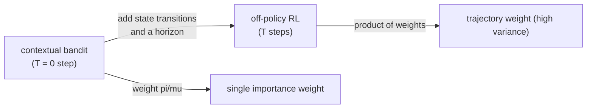

The first four lessons learned a treatment policy from a fixed log. That setting
has a name already taught in B4 under a different motivation: the **contextual
bandit**. A bandit observes a context, picks an action, sees the reward of that
action only, and never the rewards of the others. That is exactly the logged
treatment data of this subsection: covariates as context, treatment as action,
outcome as reward, with bandit feedback. This lesson makes the correspondence
precise, contrasts the **online** bandit of B4 (which explores) with the
**offline** bandit of policy learning (which cannot), and shows the offline
bandit as the one-step case of off-policy reinforcement learning.

## The dictionary: causal policy learning is a contextual bandit

B4 framed the contextual bandit as a sequential decision problem: at each round,
observe context $x_t$, choose arm $a_t$, receive reward $r_t = Y_t(a_t)$. The
policy-learning problem of this subsection is the same object with a causal
vocabulary.

| Contextual bandit (B4) | Causal policy learning (M5) |
|---|---|
| context $x_t$ | covariates $x_i$ |
| arm $a_t$ | treatment $a_i$ |
| reward $r_t$ | outcome $Y_i(a_i)$ |
| reward model $f_a(x)$ | conditional mean $\mathbb{E}[Y(a) \mid x]$ |
| bandit feedback | one potential outcome observed |
| behavior policy | logging policy $\mu$ |
| regret vs. best arm | regret vs. $\pi^\star = \mathbb{1}\{\tau > 0\}$ |

Both minimize regret against the policy that picks the best action per context.
The only structural difference is *who generates the data and when*.

## Online versus offline: the exploration divide

The decisive split is whether the learner controls the data collection.

**Online (B4).** The agent acts and learns in a loop. It can **explore**: take an
action it is unsure about to gather information, accepting short-term reward loss
for long-term knowledge. LinUCB from B4 explores by an optimism bonus
$\alpha\sqrt{x^\top A^{-1} x}$<FN n="3" />; Thompson sampling explores by sampling
from a posterior. Exploration guarantees overlap: every action gets tried in every
context region, so the data eventually covers the action space.

**Offline (M5).** The log is fixed and was collected by someone else's policy
$\mu$. The learner **cannot explore**: it can only reweight what $\mu$ happened to
try. If $\mu$ never took action $a$ in a context region, no estimator can recover
the value of taking $a$ there. This is the **overlap** assumption made flesh: the
offline learner is bounded by the support of the logging policy. Where the online
learner fixes a coverage gap by exploring into it, the offline learner can only
report that the gap exists.


The offline setting is what policy learning, OPE, and CRM all addressed: estimate
and optimize value from a fixed log, with the importance weight $\pi/\mu$ and its
variance penalties standing in for the exploration the offline learner is denied.

## Pessimism: the offline counterpart of optimism

Online bandits are **optimistic**: act as if uncertain actions might be good, to
provoke exploration. Offline learners must be **pessimistic**: where the log is
thin, assume the worst, because no future data will correct a mistake. Concretely,
an offline learner penalizes actions in low-coverage regions (high importance
weight, large estimated variance), which is exactly the role of the CRM
sample-variance penalty and of weight clipping from the previous lesson. The same
uncertainty estimate $x^\top A^{-1} x$ that LinUCB *adds* as an exploration bonus,
an offline learner *subtracts* as a penalty. Optimism and pessimism are the two
faces of the same uncertainty quantity, signed by whether the learner can still
gather data.

## The reinforcement-learning bridge

A contextual bandit is a one-step Markov decision process: the context is the
state, the action transitions to a terminal state, and the reward is immediate
with no future. Reinforcement learning (pillar H) generalizes to **sequences**:
the action changes the next state, rewards accumulate over a horizon, and the
value of a policy is the expected **return** $\sum_t \gamma^t r_t$ rather than a
single reward. **Off-policy RL** then asks the same question this subsection asked,
one level up: estimate the return of a target policy from trajectories logged
under a behavior policy.

The importance-weight machinery carries over directly. For a trajectory of length
$T$, the per-step weights multiply along the path:

$$
w_{0:T} = \prod_{t=0}^{T} \frac{\pi(a_t \mid s_t)}{\mu(a_t \mid s_t)},
$$

and the **importance-sampling return estimator** averages $w_{0:T}\sum_t \gamma^t r_t$
over trajectories<FN n="1" />. This is IPS with a *product* of weights, and the
product is the source of RL's notorious variance: it can grow exponentially in the
horizon $T$. The contextual bandit is the $T = 0$ special case where the product
collapses to a single weight $\pi(a \mid x)/\mu(a \mid x)$, recovering the IPS
estimator of the OPE lesson. The doubly-robust idea also lifts to the sequential
case as **per-step doubly-robust** and related estimators, controlling the
product's variance with a learned value function in the same way DR controlled the
single weight with a reward model<FN n="2" />.



## A concrete scale: the variance of the product

To see why the horizon hurts, take a target and logging policy that differ by a
constant per-step weight ratio. Suppose at every step the taken action has
$\pi(a \mid s)/\mu(a \mid s) = 1.5$ on average, with the second moment of the
per-step weight equal to $\mathbb{E}[w^2] = 3$ (a moderate mismatch). For
independent steps the trajectory weight's second moment is the product:

- $T = 0$ (bandit): $\mathbb{E}[w_{0:0}^2] = 3$. Manageable variance.
- $T = 5$: $\mathbb{E}[w_{0:5}^2] = 3^6 = 729$. The effective sample size has
  collapsed by two orders of magnitude.
- $T = 10$: $\mathbb{E}[w_{0:10}^2] = 3^{11} \approx 1.77 \times 10^5$. The
  estimate is dominated by a single trajectory.

The bandit case ($T = 0$) is the regime where importance weighting is practical;
the exponential growth in $T$ is why off-policy RL needs the variance-control
tools (clipping, self-normalization, doubly-robust value functions, marginalized
importance sampling) that this subsection introduced in their simplest, one-step
form.

## Worked code

The simulation measures how the variance of the importance-sampling return grows
with the horizon, confirming the product-of-weights blow-up and the bandit case as
the low-variance baseline.

```python
import numpy as np

rng = np.random.default_rng(0)

# per-step weight w = pi/mu has mean ~1 (unbiased) but heavy second moment.
# model log-weight as normal so E[w]=1 and E[w^2] is controlled:
# if log w ~ N(-s^2/2, s^2) then E[w]=1, E[w^2]=exp(s^2).
s2 = np.log(3.0)             # so per-step E[w^2] = 3
n_traj = 20000

def is_return_variance(T):
    # product of (T+1) per-step weights, times a unit reward sum
    logw = rng.normal(-s2 / 2, np.sqrt(s2), size=(n_traj, T + 1)).sum(axis=1)
    w = np.exp(logw)
    ret = w * 1.0            # unit return so variance is the weight's variance
    return ret.mean(), ret.var()

for T in [0, 5, 10]:
    m, v = is_return_variance(T)
    print(f"T={T:2d}  estimator mean {m:.3f}  variance {v:.1f}  (E[w^2]~{3.0**(T+1):.0f})")

# the estimator stays ~unbiased (mean near 1) but variance explodes with horizon
m0, v0 = is_return_variance(0)
m10, v10 = is_return_variance(10)
assert abs(m0 - 1.0) < 0.05            # bandit case: unbiased, low variance
assert v10 > 100 * v0                  # horizon-10 variance dwarfs the bandit
```

The importance-sampling return stays centered near $1$ at every horizon (it is
unbiased) but its variance grows by orders of magnitude from the $T = 0$ bandit
to a horizon of $10$, the product-of-weights pathology that the one-step tools of
this subsection were the antidote to.

## Exercises

**Exercise 1.** Map the following online-bandit notions to their offline policy-learning
counterparts and state, in one phrase each, why the offline version cannot do what
the online version does: (a) exploration bonus, (b) regret against the best arm,
(c) the requirement that every arm be tried.

<details>
<summary>Solution</summary>

**(a) Exploration bonus.** Offline counterpart: an uncertainty *penalty*
(pessimism). The online learner adds a bonus to under-tried actions to provoke
exploration; the offline learner cannot act, so it subtracts a penalty to avoid
relying on under-covered actions it can never verify.

**(b) Regret against the best arm.** Offline counterpart: regret against
$\pi^\star = \mathbb{1}\{\tau(x) > 0\}$, the per-context best action. Identical
target; the offline learner just estimates it from a fixed log rather than
shrinking regret round by round.

**(c) Every arm must be tried.** Offline counterpart: the overlap assumption
$\mu(a \mid x) > 0$. Online, the learner *makes* this hold by exploring; offline,
it is a property of the given log that the learner can only check, not enforce.

</details>

**Exercise 2.** Show that the trajectory importance weight $w_{0:T} =
\prod_{t=0}^T \pi(a_t \mid s_t)/\mu(a_t \mid s_t)$ reduces to the contextual-bandit
weight when $T = 0$, and that $\mathbb{E}_\mu[w_{0:T}] = 1$ when the per-step
weights are conditionally unbiased.

<details>
<summary>Solution</summary>

**Step 1.** At $T = 0$ the product has a single factor:
$w_{0:0} = \pi(a_0 \mid s_0)/\mu(a_0 \mid s_0)$, which with $s_0 = x$ and
$a_0 = a$ is exactly the contextual-bandit importance weight $\pi(a\mid x)/\mu(a\mid x)$
of the OPE lesson.

**Step 2.** For the mean, take expectations under $\mu$ step by step, conditioning
on the history. Each per-step factor has conditional mean

$$
\mathbb{E}_\mu\!\left[\frac{\pi(a_t \mid s_t)}{\mu(a_t \mid s_t)} \,\Big|\, s_t\right]
= \sum_{a} \mu(a \mid s_t)\frac{\pi(a \mid s_t)}{\mu(a \mid s_t)}
= \sum_a \pi(a \mid s_t) = 1.
$$

**Step 3.** Apply the tower rule from the last step inward: each factor integrates
to $1$ given its past, so the full product has $\mathbb{E}_\mu[w_{0:T}] = 1$. The
estimator is unbiased at every horizon; only its variance grows.

</details>

**Exercise 3 (code).** Verify the pessimism-optimism duality numerically. For a
linear-reward contextual bandit with design matrix $A = X^\top X + \lambda I$,
compute the per-context uncertainty $x^\top A^{-1} x$, and confirm that a
high-coverage context (many similar logged points) has lower uncertainty than a
low-coverage one, so the offline penalty (and the online bonus) is larger exactly
where the log is thin.

<details>
<summary>Solution</summary>

```python
import numpy as np

rng = np.random.default_rng(7)
d = 4
lam = 1.0

# logged contexts cluster near a "covered" direction e1; few elsewhere
X_covered = rng.normal(0, 1, (500, d))
X_covered[:, 1:] *= 0.1                      # mass concentrated on feature 0
A = X_covered.T @ X_covered + lam * np.eye(d)
Ainv = np.linalg.inv(A)

x_covered = np.array([1.0, 0.0, 0.0, 0.0])   # along the dense direction
x_thin = np.array([0.0, 0.0, 0.0, 1.0])      # along a sparse direction

u_covered = x_covered @ Ainv @ x_covered
u_thin = x_thin @ Ainv @ x_thin

# the thin (low-coverage) direction has larger uncertainty -> larger bonus/penalty
assert u_thin > u_covered
print(f"uncertainty: covered {u_covered:.4f}, thin {u_thin:.4f}")
```

The uncertainty $x^\top A^{-1} x$ is small where many logged points lie (the
covered direction) and large where they are sparse, so the same quantity an online
LinUCB adds as an exploration bonus, an offline learner subtracts as a pessimism
penalty, is largest exactly in the under-covered region.

</details>

This closes the policy-learning subsection: effects became decisions, decisions
became an off-policy objective, and that objective became an offline bandit
sitting one step below reinforcement learning; the next subsection stress-tests the
untestable assumptions every estimator here has leaned on.

<Footnotes>
  <FNItem n="1">**Precup, D., Sutton, R. S., & Singh, S.** (2000). "Eligibility Traces for Off-Policy Policy Evaluation". *ICML*. Per-decision importance sampling for off-policy return estimation, the trajectory-weight generalization of bandit IPS.</FNItem>
  <FNItem n="2">**Jiang, N., & Li, L.** (2016). "Doubly Robust Off-policy Value Evaluation for Reinforcement Learning". *ICML*. Lifts the doubly-robust estimator to sequential decision processes. [arXiv:1511.03722](https://arxiv.org/abs/1511.03722)</FNItem>
  <FNItem n="3">**Li, L., Chu, W., Langford, J., & Schapire, R. E.** (2010). "A Contextual-Bandit Approach to Personalized News Article Recommendation". *WWW*. The LinUCB online contextual bandit. [arXiv:1003.0146](https://arxiv.org/abs/1003.0146)</FNItem>
</Footnotes>
