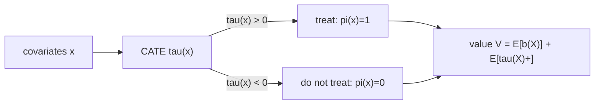

The CATE estimators of M2 answer "how much does treatment help this unit?". A
decision-maker needs the next step: who should actually be treated. A drug has a
fixed budget of doses, a marketing campaign a fixed cost per contact, a loan
program a fixed amount of capital. The question is not the size of the average
effect but which rule for assigning treatment, as a function of what is observed
about each unit, produces the most benefit. This lesson defines that rule, its
value, and proves which rule is optimal.

## A treatment policy and its value

A **policy** $\pi$ is a map from a unit's covariates $x \in \mathcal{X}$ to a
treatment decision. Take a binary treatment $a \in \{0, 1\}$ (treat or not).
A deterministic policy is $\pi : \mathcal{X} \to \{0, 1\}$, where $\pi(x) = 1$
means "treat a unit with covariates $x$". A stochastic policy instead returns a
probability $\pi(a \mid x)$ of each action.

Write $Y(a)$ for the **potential outcome** under action $a$ (the outcome the unit
would realize if assigned $a$), with the convention that larger $Y$ is better.
The outcome a policy produces on a unit is $Y(\pi(x))$: the potential outcome
under the action the policy picks for that unit. The **value** of a policy is the
expected outcome when it is applied to the whole population:

$$
V(\pi) = \mathbb{E}\big[\, Y(\pi(X)) \,\big],
$$

where the expectation is over the covariate distribution and the outcome noise.
For a deterministic policy this expands by conditioning on the decision:

$$
V(\pi) = \mathbb{E}\big[\, \pi(X)\, Y(1) + (1 - \pi(X))\, Y(0) \,\big].
$$

The goal is the policy of largest value, $\pi^\star = \arg\max_\pi V(\pi)$,
possibly within a class $\Pi$ of allowed policies (budget caps, fairness
constraints, interpretable rules)<FN n="1" />. This lesson treats the unconstrained case; M3
of this subsection handles a restricted class $\Pi$.

## The CATE controls the decision

The link from effects to decisions is the **conditional average treatment
effect** (CATE) from M2:

$$
\tau(x) = \mathbb{E}\big[\, Y(1) - Y(0) \mid X = x \,\big],
$$

the expected benefit of treating a unit with covariates $x$. The central claim
of this lesson is that the value-maximizing policy treats a unit exactly when its
CATE is positive.

**Step 1. Write the value as a baseline plus a gain.** Add and subtract $Y(0)$
inside the value of a deterministic $\pi$:

$$
V(\pi) = \mathbb{E}\big[\, Y(0) + \pi(X)\,(Y(1) - Y(0)) \,\big].
$$

**Step 2. Take the inner expectation over the outcome at fixed $x$.** By the
tower rule, condition on $X$ first:

$$
V(\pi) = \mathbb{E}\Big[\, \mathbb{E}[Y(0) \mid X] + \pi(X)\,\mathbb{E}[Y(1) - Y(0) \mid X] \,\Big]
       = \mathbb{E}\big[\, b(X) + \pi(X)\,\tau(X) \,\big],
$$

writing $b(x) = \mathbb{E}[Y(0) \mid X = x]$ for the baseline (untreated) mean.
The baseline term $\mathbb{E}[b(X)]$ does not depend on $\pi$: it is the value of
the never-treat policy. Every policy starts from that floor and adds the
**policy gain** $\mathbb{E}[\pi(X)\,\tau(X)]$.

**Step 3. Maximize pointwise.** The gain $\mathbb{E}[\pi(X)\,\tau(X)]$ is an
average over $x$ of $\pi(x)\,\tau(x)$. Since $\pi(x) \in \{0, 1\}$ enters each
term independently, the integrand is maximized at each $x$ on its own: pick
$\pi(x) = 1$ when $\tau(x) > 0$ (adding the positive $\tau(x)$) and $\pi(x) = 0$
when $\tau(x) < 0$ (adding zero rather than a negative number). When
$\tau(x) = 0$ either action gives the same contribution.

**Step 4. Read off the optimal policy.** The maximizer is the **CATE-sign
rule**<FN n="2" />:

$$
\pi^\star(x) = \mathbb{1}\{\tau(x) > 0\},
$$

and its value is the baseline plus the integrated positive part of the CATE,

$$
V(\pi^\star) = \mathbb{E}[\,b(X)\,] + \mathbb{E}\big[\, \max(\tau(X), 0) \,\big]
            = \mathbb{E}[\,b(X)\,] + \mathbb{E}\big[\, \tau(X)^+ \,\big].
$$

The optimal rule needs only the **sign** of $\tau(x)$, not its magnitude, and
never the baseline $b(x)$: a unit is treated based on whether treatment helps it,
regardless of how well it would do untreated.



## Regret and why the sign is enough

The shortfall of any policy from the optimum is its **regret**:

$$
R(\pi) = V(\pi^\star) - V(\pi)
       = \mathbb{E}\big[\, (\pi^\star(X) - \pi(X))\,\tau(X) \,\big].
$$

A unit contributes to regret only where $\pi$ disagrees with the sign rule, and
its contribution is weighted by $|\tau(x)|$. Disagreeing on a unit with a large
effect costs a lot; disagreeing where $\tau(x) \approx 0$ costs almost nothing.
This is the practical reason an estimated policy $\hat\pi$ can be good even with a
noisy $\hat\tau$: errors near the decision boundary $\tau(x) = 0$ are cheap, and
those are exactly the units the sign is hardest to call. Lesson M3 turns this
observation into a regret bound for learned policies.

## A concrete scale

To calibrate what value and regret mean, take a population where the CATE is
$\tau(X) = X$ with $X \sim \mathcal{N}(0, 1)$ (standardized covariate as the
effect itself) and baseline $b(X) = 1$. Three policies span the range.

- **Treat everyone** ($\pi \equiv 1$): gain $\mathbb{E}[X] = 0$, so $V = 1$. The
  units with $X < 0$ (where treatment hurts) exactly cancel those with $X > 0$.
- **Optimal sign rule** ($\pi^\star = \mathbb{1}\{X > 0\}$): gain
  $\mathbb{E}[\max(X, 0)] = 1/\sqrt{2\pi} \approx 0.399$, so $V \approx 1.399$.
  This is the largest value any policy attains.
- **Treat nobody** ($\pi \equiv 0$): gain $0$, so $V = 1$, the baseline floor.

Treat-everyone and treat-nobody tie at $1.0$ here, yet they are not the same
policy: treat-everyone wastes treatment on the harmful half and rescues the
helpful half, netting zero. The optimal rule keeps only the helpful half, lifting
the value by $0.399$. Its regret is zero by construction; treat-everyone has
regret $0.399$, all of it incurred on the $X < 0$ units it should have left
alone.

Sweeping the threshold $t$ in the family of rules "treat if $\hat\tau(x) > t$"
makes the optimum visible: with the oracle CATE the value peaks exactly at
$t = 0$, the sign rule. A noisy CATE estimate both shifts the peak off zero and
flattens it, the regret cost of imperfect $\hat\tau$ that the next lessons learn
to control.


## Worked code

The simulation below builds the $\tau(X) = X$ population, computes each policy's
value by Monte Carlo, and checks the three numbers above against the closed forms.

```python
import numpy as np

rng = np.random.default_rng(0)
n = 2_000_000
X = rng.normal(0, 1, n)
tau = X                       # CATE = covariate
b = np.ones(n)                # baseline E[Y(0)|X] = 1

# realized potential outcomes (noise cancels in the mean, kept for realism)
Y0 = b + rng.normal(0, 0.5, n)
Y1 = Y0 + tau

def value(treat):
    Y = np.where(treat, Y1, Y0)
    return Y.mean()

V_all = value(np.ones(n, dtype=bool))
V_star = value(tau > 0)
V_none = value(np.zeros(n, dtype=bool))

print(f"treat all : {V_all:.4f}")
print(f"optimal   : {V_star:.4f}")
print(f"treat none: {V_none:.4f}")

# closed forms: baseline 1, gain E[max(X,0)] = 1/sqrt(2*pi)
gain_star = 1.0 / np.sqrt(2 * np.pi)
assert np.isclose(V_star, 1.0 + gain_star, atol=2e-3)
assert np.isclose(V_all, 1.0, atol=2e-3)
assert V_star > V_all > V_none - 1e-3
print(f"optimal gain over baseline: {V_star - V_none:.4f}  (theory {gain_star:.4f})")
```

The optimal policy lands at the baseline plus $1/\sqrt{2\pi}$, treat-everyone at
the baseline, and the strict ordering $V(\pi^\star) > V(\text{all}) = V(\text{none})$
confirms the sign rule wins by exactly the integrated positive part of the CATE.

## Exercises

**Exercise 1.** A clinic has three patient types with CATEs $\tau_A = +4$,
$\tau_B = -1$, $\tau_C = +2$ (in outcome units, larger better), occurring in
proportions $0.5, 0.3, 0.2$. Baseline mean is $b = 10$ for all. Compute the value
of (i) the optimal policy, (ii) treat-everyone, and (iii) the regret of
treat-everyone.

<details>
<summary>Solution</summary>

**Step 1.** The optimal policy treats a type when its CATE is positive: treat $A$
and $C$, skip $B$. Its gain is
$0.5(4) + 0.2(2) = 2.0 + 0.4 = 2.4$, so $V(\pi^\star) = 10 + 2.4 = 12.4$.

**Step 2.** Treat-everyone adds every CATE, including the negative one:
$0.5(4) + 0.3(-1) + 0.2(2) = 2.0 - 0.3 + 0.4 = 2.1$, so
$V(\text{all}) = 10 + 2.1 = 12.1$.

**Step 3.** Regret is the value gap:
$R(\text{all}) = 12.4 - 12.1 = 0.3$. It equals exactly the harm done to type $B$:
$0.3 \times |{-1}| = 0.3$, the units the optimal rule leaves untreated.

</details>

**Exercise 2.** Prove that for any two deterministic policies $\pi_1, \pi_2$,
$V(\pi_1) - V(\pi_2) = \mathbb{E}[(\pi_1(X) - \pi_2(X))\,\tau(X)]$, and conclude
that the baseline $b(x)$ never affects which of two policies is better.

<details>
<summary>Solution</summary>

**Step 1.** From Step 2 of the derivation, each value decomposes as
$V(\pi_i) = \mathbb{E}[b(X)] + \mathbb{E}[\pi_i(X)\,\tau(X)]$.

**Step 2.** Subtract; the baseline term $\mathbb{E}[b(X)]$ is identical in both
and cancels:

$$
V(\pi_1) - V(\pi_2) = \mathbb{E}[\pi_1(X)\,\tau(X)] - \mathbb{E}[\pi_2(X)\,\tau(X)]
= \mathbb{E}\big[(\pi_1(X) - \pi_2(X))\,\tau(X)\big].
$$

**Step 3.** The difference depends only on the policies and $\tau$. Since $b$
does not appear, no choice of baseline can reverse the sign of the difference:
comparing policies is a question about $\tau$ alone. This is why the optimal rule
ignores $b$.

</details>

**Exercise 3 (code).** With $\tau(X) = X - c$ for a shift $c$ and
$X \sim \mathcal{N}(0, 1)$, the optimal policy treats when $X > c$. Verify by
simulation that its value gain equals the closed form
$\mathbb{E}[\max(X - c, 0)] = \phi(c) - c\,(1 - \Phi(c))$ for $c = 0.5$, where
$\phi$ is the standard normal density and $\Phi$ its CDF. Compute $\Phi$ from the
error function via $\Phi(c) = \tfrac{1}{2}(1 + \operatorname{erf}(c/\sqrt 2))$.

<details>
<summary>Solution</summary>

```python
import numpy as np
from math import erf

rng = np.random.default_rng(1)
n = 4_000_000
c = 0.5
X = rng.normal(0, 1, n)
tau = X - c

# optimal policy treats when tau > 0, i.e. X > c; gain = E[max(tau,0)]
gain_sim = np.maximum(tau, 0).mean()

phi = np.exp(-0.5 * c**2) / np.sqrt(2 * np.pi)   # standard normal density at c
Phi = 0.5 * (1 + erf(c / np.sqrt(2)))            # standard normal CDF at c
gain_closed = phi - c * (1 - Phi)

assert np.isclose(gain_sim, gain_closed, atol=2e-3)
print(f"simulated {gain_sim:.4f}  vs  closed form {gain_closed:.4f}")
```

The simulated gain of the threshold-at-$c$ policy matches the closed-form
$\phi(c) - c(1 - \Phi(c))$, confirming that the optimal value is the integrated
positive part of the shifted CATE.

</details>

With the optimal policy defined by the sign of $\tau$, the next lesson asks how to
score a *given* policy from logged data, when $\tau$ and the outcomes under the
untaken actions are unknown.

<Footnotes>
  <FNItem n="1">**Athey, S., & Wager, S.** (2021). "Policy Learning with Observational Data". *Econometrica* 89(1), 133-161. Defines policy value and regret over a policy class and the value-maximization view. [arXiv:1702.02896](https://arxiv.org/abs/1702.02896)</FNItem>
  <FNItem n="2">**Kitagawa, T., & Tetenov, A.** (2018). "Who Should Be Treated? Empirical Welfare Maximization Methods for Treatment Choice". *Econometrica* 86(2), 591-616. Frames treatment choice as maximizing welfare (policy value) and characterizes the optimal rule.</FNItem>
</Footnotes>
