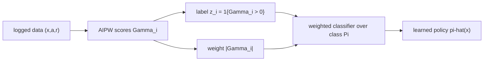

Off-policy evaluation scores a fixed policy. Policy *learning* searches a class
$\Pi$ for the policy of highest value. The optimal rule from the first lesson,
$\pi^\star(x) = \mathbb{1}\{\tau(x) > 0\}$, is unconstrained; in practice the
decision-maker wants a rule from a restricted class: a depth-2 tree a clinician
can read, a linear threshold, a budget-respecting assignment. This lesson turns
the OPE value estimators into a learning objective, shows two ways to optimize it
(outcome-weighted classification and policy trees), and bounds the regret of the
learned policy.

## Value maximization as the objective

The learning problem is to maximize the estimated value over the class, the
empirical-welfare-maximization view of treatment choice<FN n="3" />:

$$
\hat\pi = \arg\max_{\pi \in \Pi} \hat V(\pi),
$$

with $\hat V$ any unbiased OPE estimator from the previous lesson. Using the DR
form keeps the objective low-variance and robust to a misspecified reward model.
Writing $\Gamma_i$ for the **doubly-robust score** of treating unit $i$, the value
of a deterministic binary policy is, up to an additive constant,

$$
\hat V(\pi) = \frac{1}{n} \sum_{i=1}^n \pi(x_i)\, \hat\Gamma_i + \text{const},
\qquad
\hat\Gamma_i = \hat\mu_1(x_i) - \hat\mu_0(x_i)
+ \frac{a_i - \hat e(x_i)}{\hat e(x_i)(1 - \hat e(x_i))}\,(r_i - \hat\mu_{a_i}(x_i)),
$$

where $\hat\mu_a(x)$ is the reward model for action $a$, $\hat e(x) =
\hat\mu(1 \mid x)$ is the propensity, and $\hat\Gamma_i$ is the AIPW estimate of
the unit's CATE from M3<FN n="1" />. The constant collects the never-treat
baseline and drops out of the argmax. So the learner maximizes the sum of scores
over the units it chooses to treat: **treat the units with the largest positive
$\hat\Gamma_i$**, subject to the constraint that the treat/no-treat boundary lies
in $\Pi$.

This reframes policy learning as a **weighted classification** problem. Define a
label $z_i = \mathbb{1}\{\hat\Gamma_i > 0\}$ (would the score say treat?) and a
weight $|\hat\Gamma_i|$ (how much is at stake on this unit). Maximizing
$\sum_i \pi(x_i)\hat\Gamma_i$ over $\pi \in \Pi$ is equivalent to minimizing the
weighted misclassification of these labels:

$$
\hat\pi = \arg\min_{\pi \in \Pi} \sum_{i=1}^n |\hat\Gamma_i|\, \mathbb{1}\{\pi(x_i) \neq z_i\}.
$$

**Step 1. Split the value sum by the sign of the score.** Write
$\hat\Gamma_i = \mathrm{sgn}(\hat\Gamma_i)\,|\hat\Gamma_i|$ and group:

$$
\sum_i \pi(x_i)\hat\Gamma_i
= \sum_{i: \hat\Gamma_i > 0} \pi(x_i)|\hat\Gamma_i|
- \sum_{i: \hat\Gamma_i < 0} \pi(x_i)|\hat\Gamma_i|.
$$

**Step 2. Add and subtract the full positive mass.** Let
$P = \sum_{i:\hat\Gamma_i>0}|\hat\Gamma_i|$. Inserting $P$:

$$
\sum_i \pi(x_i)\hat\Gamma_i
= P - \Big[\underbrace{\sum_{i:\hat\Gamma_i>0}(1 - \pi(x_i))|\hat\Gamma_i|}_{\text{treat-positive misses}}
+ \underbrace{\sum_{i:\hat\Gamma_i \lt 0}\pi(x_i)|\hat\Gamma_i|}_{\text{treat-negative misses}}\Big].
$$

The two bracketed sums are exactly the weighted misclassifications: a positive-score
unit left untreated ($\pi(x_i) = 0$, so $1 - \pi(x_i) = 1$) and a negative-score
unit treated. $P$ is fixed, so maximizing value equals minimizing the bracket,
which is the weighted 0-1 loss of predicting $z_i$ with $\pi$. Any off-the-shelf
weighted classifier (a tree, a linear SVM, a logistic model) now solves policy
learning. This is **outcome-weighted learning**<FN n="2" />.



## Policy trees

When the class $\Pi$ is the set of shallow decision trees, the weighted-classification
view yields an exact greedy learner. A **policy tree** of depth $L$ partitions the
covariate space into at most $2^L$ leaves and assigns one action per leaf. The
value of a tree is $\sum_{\text{leaves } \ell} (\text{action}_\ell)\sum_{i \in \ell}\hat\Gamma_i$,
maximized leaf-by-leaf: assign each leaf to "treat" if the scores in it sum
positive, else "do not treat". The split search picks the threshold that most
separates positive-score from negative-score units, weighted by $|\hat\Gamma_i|$.
A depth-2 tree gives a rule a domain expert can audit: "treat if age above 50 and
biomarker above threshold". The Athey-Wager `policytree` learner does exactly
this with cross-fitted AIPW scores and provides the regret guarantee below.

## Regret of the learned policy

A learned policy $\hat\pi$ falls short of the best policy in the class. Two gaps
compose. Let $\pi^\star_\Pi = \arg\max_{\pi \in \Pi} V(\pi)$ be the best policy the
class can express. Then

$$
\underbrace{V(\pi^\star) - V(\hat\pi)}_{\text{total regret}}
= \underbrace{\big(V(\pi^\star) - V(\pi^\star_\Pi)\big)}_{\text{approximation}}
+ \underbrace{\big(V(\pi^\star_\Pi) - V(\hat\pi)\big)}_{\text{estimation}}.
$$

The **approximation** gap is how much value the unconstrained optimum has over the
best rule the class can represent; it is zero if $\pi^\star \in \Pi$ and is the
price of interpretability otherwise. The **estimation** gap is the learning error
from finite data and is the part a regret bound controls.

The Athey-Wager result bounds the estimation regret in terms of the **complexity
of the policy class** and the sample size. With doubly-robust scores and a class
$\Pi$ of VC dimension (a measure of class complexity) $\mathrm{VC}(\Pi)$, the
expected estimation regret satisfies<FN n="1" />

$$
\mathbb{E}\big[V(\pi^\star_\Pi) - V(\hat\pi)\big]
\;\le\; C\, S\, \sqrt{\frac{\mathrm{VC}(\Pi)}{n}},
$$

for a universal constant $C$, where $S$ is a scale set by the variance of the
efficient score (it shrinks under good overlap and a good reward model). The rate
is $O(\sqrt{\mathrm{VC}(\Pi)/n})$: regret decays like $1/\sqrt{n}$, and a richer
class (larger $\mathrm{VC}(\Pi)$) shrinks the approximation gap but pays a larger
estimation constant. The doubly-robust score is what makes $S$ small enough for
the bound to be useful; a raw IPS objective would carry the full weight variance
into $S$.


## A concrete reading of the bound

Take a binary-threshold class on one covariate, $\mathrm{VC}(\Pi) = 2$, with a
score scale $S = 1$ and constant $C = 1$ for illustration. The bound gives
estimation regret at most $\sqrt{2/n}$:

- $n = 200$: regret $\le \sqrt{2/200} = 0.1$.
- $n = 2000$: regret $\le \sqrt{2/2000} \approx 0.032$, a tenfold sample for a
  threefold tighter guarantee, the $1/\sqrt{n}$ signature.
- $n = 20000$: regret $\le \sqrt{2/20000} \approx 0.01$.

Doubling $\mathrm{VC}(\Pi)$ to $4$ (a depth-2 tree on two features, say) multiplies
each bound by $\sqrt{2} \approx 1.41$: the richer class needs roughly twice the
data for the same estimation guarantee, the cost it pays for a smaller
approximation gap.

## Worked code

The simulation learns a one-dimensional threshold policy by maximizing the
DR-scored value (equivalently, weighted classification) and measures its regret
against the oracle as $n$ grows, confirming the decay.

```python
import numpy as np

rng = np.random.default_rng(0)

# tau(x) = x, oracle treats x>0, baseline gain E[max(x,0)] = 1/sqrt(2*pi)
oracle_gain = 1.0 / np.sqrt(2 * np.pi)

def dr_scores(x, a, r, e, mu1, mu0):
    # AIPW score for the CATE of each unit
    mu_a = np.where(a == 1, mu1, mu0)
    correction = (a - e) / (e * (1 - e)) * (r - mu_a)
    return (mu1 - mu0) + correction

def learn_threshold(n):
    x = rng.normal(0, 1, n)
    e = 1.0 / (1.0 + np.exp(-0.8 * x))        # logging propensity (good overlap)
    a = (rng.uniform(size=n) < e).astype(float)
    r = a * x + rng.normal(0, 1.0, n)         # reward, true CATE = x
    # (deliberately rough) reward models so DR earns its keep
    mu1, mu0 = 0.7 * x, np.zeros(n)
    g = dr_scores(x, a, r, e, mu1, mu0)
    # best threshold t in 'treat if x > t': maximize sum of scores treated
    order = np.argsort(x)
    xs, gs = x[order], g[order]
    suffix = np.cumsum(gs[::-1])[::-1]        # sum of scores for x >= xs[k]
    k = int(np.argmax(suffix))
    return xs[k]                              # learned threshold

def regret(t):
    # population value-gain of 'treat if x>t' is E[x * 1{x>t}] = phi(t)
    phi = np.exp(-0.5 * t**2) / np.sqrt(2 * np.pi)
    return oracle_gain - phi

ns = [100, 400, 1600, 6400, 25600]
regs = []
for n in ns:
    rs = [regret(learn_threshold(n)) for _ in range(60)]
    regs.append(np.mean(rs))
for n, rg in zip(ns, regs):
    print(f"n={n:6d}  mean regret {rg:.4f}")

# regret decays: the largest n beats the smallest by well over 2x
assert regs[-1] < regs[0] / 2
assert regs[-1] < 0.01
```

The learned threshold's regret shrinks toward zero as $n$ grows, and the final
assert confirms it is more than halved across the sample range, the estimation
gap closing at the rate the bound predicts.

## Exercises

**Exercise 1.** Four units have DR scores $\hat\Gamma = (+3, -1, +2, -4)$. A policy
class can treat any subset (the unconstrained class). Which units does the
value-maximizing policy treat, and what is the value gain? Then restate the choice
as a weighted-classification target $z_i$ with weights $|\hat\Gamma_i|$.

<details>
<summary>Solution</summary>

**Step 1.** The unconstrained maximizer treats every unit with a positive score:
units $1$ and $3$. The value gain is the sum of treated scores:
$\sum_i \pi(x_i)\hat\Gamma_i = 3 + 2 = 5$ (treating the negative-score units $2$
and $4$ would subtract from this).

**Step 2.** As classification, the labels are $z_i = \mathbb{1}\{\hat\Gamma_i > 0\}
= (1, 0, 1, 0)$ with weights $|\hat\Gamma_i| = (3, 1, 2, 4)$. The optimal policy
matches every label (zero weighted misclassification) because the class is
unconstrained, so its weighted 0-1 loss is $0$ and its value gain is the full
positive mass $P = 3 + 2 = 5$.

</details>

**Exercise 2.** Prove that maximizing $\sum_i \pi(x_i)\hat\Gamma_i$ over a policy
class $\Pi$ is equivalent to minimizing the weighted misclassification
$\sum_i |\hat\Gamma_i|\,\mathbb{1}\{\pi(x_i) \neq z_i\}$ with $z_i =
\mathbb{1}\{\hat\Gamma_i > 0\}$.

<details>
<summary>Solution</summary>

**Step 1.** For one unit, compare the value contribution $\pi(x_i)\hat\Gamma_i$
against the constant $|\hat\Gamma_i|\,z_i = \max(\hat\Gamma_i, 0)$. Their
difference is

$$
\max(\hat\Gamma_i, 0) - \pi(x_i)\hat\Gamma_i.
$$

**Step 2.** Check the four cases. If $\hat\Gamma_i > 0$ ($z_i = 1$): the
difference is $\hat\Gamma_i(1 - \pi(x_i)) = |\hat\Gamma_i|\mathbb{1}\{\pi(x_i) \neq 1\}$.
If $\hat\Gamma_i < 0$ ($z_i = 0$): the difference is $-\pi(x_i)\hat\Gamma_i =
|\hat\Gamma_i|\,\pi(x_i) = |\hat\Gamma_i|\mathbb{1}\{\pi(x_i)\neq 0\}$. In both
cases the difference equals $|\hat\Gamma_i|\,\mathbb{1}\{\pi(x_i) \neq z_i\}$.

**Step 3.** Sum over $i$:
$\sum_i \max(\hat\Gamma_i, 0) - \sum_i \pi(x_i)\hat\Gamma_i =
\sum_i |\hat\Gamma_i|\mathbb{1}\{\pi(x_i) \neq z_i\}$. The first sum $P$ is
constant in $\pi$, so maximizing the value sum (second term) is the same as
minimizing the weighted misclassification (right side).

</details>

**Exercise 3 (code).** A depth-1 policy tree on one feature is a threshold rule.
Implement the leaf-assignment logic: given scores $\hat\Gamma_i$ and a candidate
split $x_i \le s$ vs $x_i > s$, assign each leaf "treat" if its score sum is
positive, then return the total value. Verify the best split over a grid recovers
a threshold near the true CATE sign change.

<details>
<summary>Solution</summary>

```python
import numpy as np

rng = np.random.default_rng(3)
n = 8000
x = rng.normal(0, 1, n)
# true CATE = x - 0.4, so sign changes at x = 0.4
gamma = (x - 0.4) + rng.normal(0, 0.3, n)   # noisy DR scores

def tree_value(s):
    left, right = x <= s, x > s
    # each leaf treats iff its score sum is positive; value = sum of treated
    v = 0.0
    for leaf in (left, right):
        v += max(gamma[leaf].sum(), 0.0)
    return v

grid = np.linspace(-1.5, 1.5, 121)
best_s = grid[np.argmax([tree_value(s) for s in grid])]

# the better leaf boundary sits near the true sign change at 0.4
assert abs(best_s - 0.4) < 0.2
print(f"best split {best_s:.3f}  (true sign change 0.4)")
```

The leaf-wise "treat if scores sum positive" rule, searched over thresholds,
locates the split near the true CATE sign change, which is the depth-1 policy tree
the value objective prescribes.

</details>

The regret bound assumed an honest, low-variance objective; the next lesson
confronts what happens when overlap is poor and the importance weights make the
raw objective itself too noisy to optimize.

<Footnotes>
  <FNItem n="1">**Athey, S., & Wager, S.** (2021). "Policy Learning with Observational Data". *Econometrica* 89(1), 133-161. Doubly-robust policy learning over a class with the $O(\sqrt{\mathrm{VC}/n})$ regret bound. [arXiv:1702.02896](https://arxiv.org/abs/1702.02896)</FNItem>
  <FNItem n="2">**Zhao, Y., Zeng, D., Rush, A. J., & Kosorok, M. R.** (2012). "Estimating Individualized Treatment Rules Using Outcome Weighted Learning". *JASA* 107(499), 1106-1118. Recasts treatment-rule estimation as weighted classification. [doi:10.1080/01621459.2012.695674](https://doi.org/10.1080/01621459.2012.695674)</FNItem>
  <FNItem n="3">**Kitagawa, T., & Tetenov, A.** (2018). "Who Should Be Treated? Empirical Welfare Maximization Methods for Treatment Choice". *Econometrica* 86(2), 591-616. Empirical welfare maximization over a restricted policy class.</FNItem>
</Footnotes>
