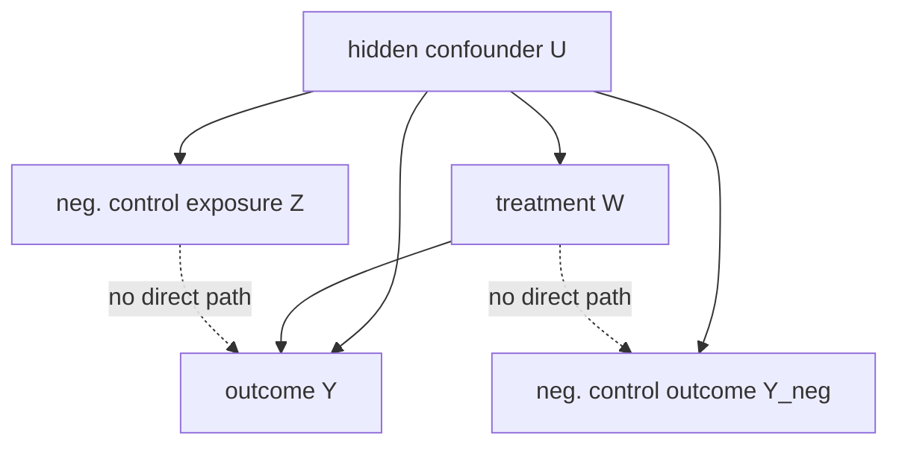

The previous two lessons accepted that hidden confounding cannot be removed and either
bounded its damage (sensitivity) or bounded the effect (partial identification). Proximal
causal inference takes a third route: if you cannot **measure** the confounder $U$, measure
**proxies** of it. A **negative control outcome** is a variable that $U$ affects but the
treatment provably does not; a **negative control exposure** is a variable that affects $U$
(or is a proxy for it) but does not affect the outcome except through $U$. Two such proxies,
combined through a learned **bridge function**, can recover the true effect that adjusting
for measured covariates alone cannot<FN n="1" />. This is the IV idea of B5 generalized: instead of
one instrument, a pair of proxies brackets the confounder.

## Negative controls: the falsification first

Start with the classical use. A **negative control outcome** $Y_{\text{neg}}$ is chosen so
that the treatment has no causal effect on it, yet it shares the confounder $U$ with the real
outcome $Y$. If adjustment for measured $X$ were sufficient (ignorability), the estimated
treatment "effect" on $Y_{\text{neg}}$ would be zero. A nonzero estimate is direct evidence
that $U$ still biases the analysis<FN n="2" />.

The canonical example: estimating whether a drug reduces mortality, with a negative control
outcome like "death from an accident" that the drug cannot plausibly affect. A measured
protective "effect" of the drug on accidental death signals that healthier patients were
selected into treatment, a confounding pattern that also biases the real mortality estimate.



The dashed arrows are the **exclusion restrictions** that make $Z$ and $Y_{\text{neg}}$
useful: the negative control exposure $Z$ does not affect $Y$ except through $U$, and the
treatment $W$ does not affect the negative control outcome $Y_{\text{neg}}$.

## From detection to correction: the proximal bridge

Detection is half the value. Proximal causal inference uses the same proxies to **correct**
the estimate, not just flag it. The structure needs two proxies of $U$:

- $Z$, a **proxy that is associated with the treatment side** (the negative control
  exposure), independent of $Y$ given $(U, X)$.
- $Y_{\text{neg}}$ (call it $W^\ast$ in the general theory), a **proxy on the outcome side**,
  independent of $W$ given $(U, X)$.

The key object is the **outcome bridge function** $h(W, X, Y_{\text{neg}})$, defined as a
solution to an integral equation that ties the proxies together. Informally, $h$ is the
function of the observable proxy $Y_{\text{neg}}$ (and $W, X$) that reproduces the
confounded outcome regression, so that averaging $h$ over the data subtracts off exactly the
part of $E[Y \mid W, X]$ that the hidden $U$ contaminates.

**The bridge equation.** A bridge function $h$ satisfies, for every value of the
treatment-side proxy $Z$ and treatment $W$,

$$
E\big[\, Y - h(W, X, Y_{\text{neg}}) \,\big|\, W, Z, X \,\big] = 0.
$$

This is a **conditional moment equation** of exactly the IV type from B5: $Z$ plays the role
of the instrument, providing variation that identifies $h$ without $h$ depending on $Z$
directly. Given a solution $h$, the treatment effect is recovered by a do-operator average:

$$
E[Y(w)] = E\big[\, h(w, X, Y_{\text{neg}}) \,\big],
$$

averaging the bridge at fixed treatment $w$ over the observed distribution of
$(X, Y_{\text{neg}})$. The contrast $E[Y(1)] - E[Y(0)]$ is the ATE, identified despite the
unmeasured $U$<FN ns="1, 3" />.

## The linear case, worked

The integral equation is abstract; the linear-Gaussian case makes it concrete and is solved
exactly like two-stage least squares. Posit the structural model with hidden $U$ (drop $X$
for clarity):

$$
Y = \tau W + \beta U + \varepsilon_Y, \qquad
Y_{\text{neg}} = \lambda U + \varepsilon_N, \qquad
Z = \gamma U + \varepsilon_Z,
$$

with $W$ also driven by $U$. The treatment $W$ does not enter $Y_{\text{neg}}$, and $Z$ does
not enter $Y$: the two exclusion restrictions.

**Step 1.** A linear bridge has the form $h(W, Y_{\text{neg}}) = b_0 + b_1 W + b_2 Y_{\text{neg}}$.
The bridge equation requires $E[Y - h \mid W, Z] = 0$, meaning $h$ matches $Y$ in conditional
mean given the instrument-like $Z$.

**Step 2.** Because $Y_{\text{neg}} = \lambda U + \varepsilon_N$, choosing $b_2 = \beta / \lambda$
makes $b_2 Y_{\text{neg}} = \beta U + (\beta/\lambda)\varepsilon_N$ reproduce the confounding
term $\beta U$ in $Y$ up to noise orthogonal to $Z$. The remaining coefficient $b_1$ then
isolates the treatment channel, giving $b_1 = \tau$.

**Step 3.** Estimation proceeds in two stages, as in IV. Regress $Y_{\text{neg}}$ on $(W, Z)$
to predict its $U$-driven part, then regress $Y$ on $(W, \widehat{Y_{\text{neg}}})$; the
coefficient on $W$ is the de-confounded $\hat\tau$. This is two-stage least squares with the
outcome proxy playing the endogenous-regressor role and $Z$ the instrument.

## A named confusion: proxy of the confounder vs. the confounder itself

Adjusting for a **noisy proxy** of $U$ as if it were $U$ does not remove the bias; it leaves
residual confounding proportional to the proxy's measurement error, and can even amplify
bias. Proximal inference deliberately does **not** plug the proxy into the regression. It
uses the proxy through the bridge equation, where the second proxy $Z$ supplies the
independent variation that corrects for the measurement error. The distinction is the whole
point: one proxy adjusted naively is harmful, two proxies combined through the bridge are
identifying.

## Implementation

A linear-Gaussian simulation where naive adjustment is biased by hidden $U$, and the
two-proxy bridge (two-stage least squares) recovers the true $\tau$.

```python
import numpy as np

rng = np.random.default_rng(0)
n = 200_000
tau = 1.5                      # true treatment effect

U = rng.normal(0, 1, n)        # hidden confounder
# Treatment driven by U (confounding) plus own noise.
W = 0.8 * U + rng.normal(0, 1, n)
# Two proxies of U: Z (treatment-side), N (outcome-side). Neither sees W or each other.
Z = 1.2 * U + rng.normal(0, 0.5, n)        # negative control exposure
N = 0.9 * U + rng.normal(0, 0.5, n)        # negative control outcome
# Outcome: tau*W + confounding through U.
Y = tau * W + 1.0 * U + rng.normal(0, 0.5, n)

def ols(Xmat, y):
    return np.linalg.lstsq(Xmat, y, rcond=None)[0]

# Naive: regress Y on [1, W], ignoring U. Biased upward by the confounding.
naive = ols(np.column_stack([np.ones(n), W]), Y)[1]

# Proximal two-stage least squares:
#   stage 1: predict outcome-proxy N from [1, W, Z]  (Z is the instrument)
#   stage 2: regress Y on [1, W, N_hat]; coef on W is de-confounded tau.
S1 = np.column_stack([np.ones(n), W, Z])
N_hat = S1 @ ols(S1, N)
S2 = np.column_stack([np.ones(n), W, N_hat])
tau_prox = ols(S2, Y)[1]

print(f"true tau   : {tau}")
print(f"naive      : {naive:.3f}  (confounded)")
print(f"proximal   : {tau_prox:.3f}  (bridge-corrected)")
assert abs(naive - tau) > 0.2          # naive is clearly biased
assert abs(tau_prox - tau) < 0.05      # proximal recovers the truth
```

The naive coefficient is pulled above $\tau$ by the shared $U$, while the two-proxy bridge
isolates the treatment channel and lands on $1.5$.

## Exercises

**Exercise 1.** In the linear proximal model
$Y = \tau W + \beta U + \varepsilon_Y$, $Y_{\text{neg}} = \lambda U + \varepsilon_N$, explain
why a linear bridge $h = b_0 + b_1 W + b_2 Y_{\text{neg}}$ with $b_2 = \beta/\lambda$ removes
the confounding term, and identify which coefficient equals the treatment effect.

<details>
<summary>Solution</summary>

**Step 1.** Substitute $Y_{\text{neg}} = \lambda U + \varepsilon_N$ into the bridge:

$$
b_2 Y_{\text{neg}} = \frac{\beta}{\lambda}(\lambda U + \varepsilon_N) = \beta U + \frac{\beta}{\lambda}\varepsilon_N.
$$

**Step 2.** This reproduces the confounding term $\beta U$ in $Y$. The leftover
$\frac{\beta}{\lambda}\varepsilon_N$ is the proxy's own noise, which is independent of the
treatment-side instrument $Z$, so it does not bias the moment $E[Y - h \mid W, Z] = 0$.

**Step 3.** With the $\beta U$ term matched by $b_2 Y_{\text{neg}}$, the residual
$Y - b_2 Y_{\text{neg}}$ has conditional mean $b_0 + \tau W$, so the bridge's treatment
coefficient $b_1$ must equal $\tau$. The treatment effect is read off as $b_1$.

</details>

**Exercise 2.** A negative control outcome $Y_{\text{neg}}$ is a variable the treatment
cannot affect. An analyst regresses $Y_{\text{neg}}$ on treatment (adjusting for measured
$X$) and finds a "significant effect" of $0.2$. Explain what this implies about the main
analysis and why it is a falsification test, not a correction.

<details>
<summary>Solution</summary>

**Step 1.** By construction the treatment has no causal path to $Y_{\text{neg}}$, so under
ignorability given $X$ the estimated effect on $Y_{\text{neg}}$ should be 0. A nonzero $0.2$
contradicts ignorability.

**Step 2.** The only way treatment associates with $Y_{\text{neg}}$ after adjusting for $X$
is through a shared unmeasured confounder $U$ (treatment and $Y_{\text{neg}}$ are both driven
by $U$). The same $U$ contaminates the main outcome $Y$, so the main estimate is biased too.

**Step 3.** This is falsification because it only **detects** the presence and rough sign of
confounding; it does not say by how much the main estimate is wrong. Correcting the estimate
requires the full proximal machinery (a second proxy $Z$ and the bridge function), not the
single negative control alone.

</details>

**Exercise 3 (code).** Reproduce the proximal correction with a different confounding
strength and a smaller sample, and verify the two-stage bridge estimate is closer to the true
$\tau$ than the naive regression. End in a true `assert`.

<details>
<summary>Solution</summary>

```python
import numpy as np

rng = np.random.default_rng(7)
n = 80_000
tau = 0.8

U = rng.normal(0, 1, n)
W = 1.0 * U + rng.normal(0, 1, n)        # stronger confounding
Z = 1.0 * U + rng.normal(0, 0.6, n)
N = 1.0 * U + rng.normal(0, 0.6, n)
Y = tau * W + 1.5 * U + rng.normal(0, 0.5, n)

def ols(Xmat, y):
    return np.linalg.lstsq(Xmat, y, rcond=None)[0]

naive = ols(np.column_stack([np.ones(n), W]), Y)[1]

S1 = np.column_stack([np.ones(n), W, Z])
N_hat = S1 @ ols(S1, N)
S2 = np.column_stack([np.ones(n), W, N_hat])
tau_prox = ols(S2, Y)[1]

assert abs(tau_prox - tau) < abs(naive - tau)    # bridge beats naive
assert abs(tau_prox - tau) < 0.05
print(f"naive {naive:.3f}, proximal {tau_prox:.3f}, true {tau}")
```

The proximal estimate is much nearer $\tau = 0.8$ than the naive coefficient, which is
inflated by the stronger hidden confounding.

</details>

The next lesson rounds out the robustness toolkit with refutation tests: placebo treatments,
random common causes, and data-subset checks that stress-test an estimate rather than
correct it.

<Footnotes>
  <FNItem n="1">**Miao, W., Geng, Z., & Tchetgen Tchetgen, E. J.** (2018). "Identifying causal effects with proxy variables of an unmeasured confounder". *Biometrika*, 105(4), 987-993. [arXiv:1609.08816](https://arxiv.org/abs/1609.08816)</FNItem>
  <FNItem n="2">**Lipsitch, M., Tchetgen Tchetgen, E., & Cohen, T.** (2010). "Negative Controls: A Tool for Detecting Confounding and Bias in Observational Studies". *Epidemiology*, 21(3), 383-388.</FNItem>
  <FNItem n="3">**Tchetgen Tchetgen, E. J., Ying, A., Cui, Y., Shi, X., & Miao, W.** (2020). "An Introduction to Proximal Causal Learning". [arXiv:2009.10982](https://arxiv.org/abs/2009.10982)</FNItem>
</Footnotes>
