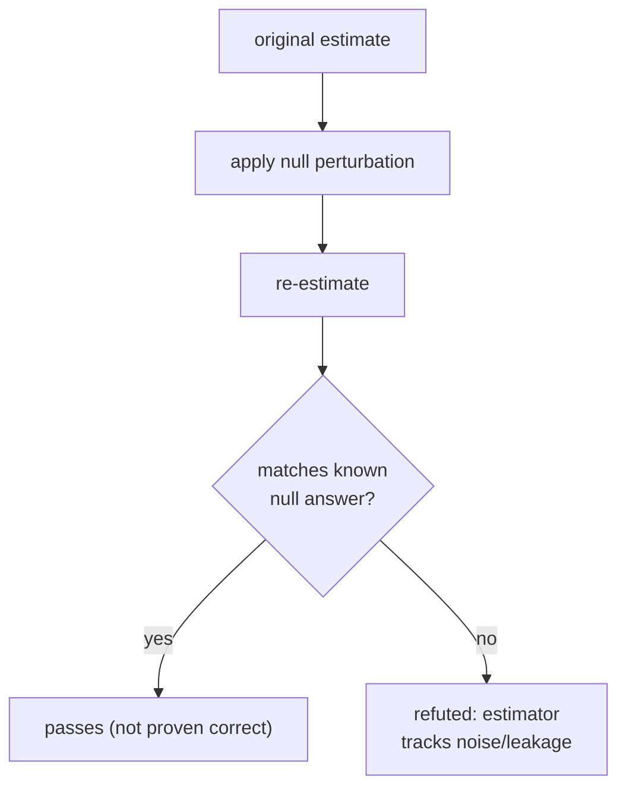

The earlier lessons quantified confounding (sensitivity, the E-value) or worked around it
(partial identification, proximal inference). Refutation tests are the cheap, automatic layer
that comes first in practice: take a finished estimate and perturb the analysis in a way that
**should not** change the answer if the estimate is sound, then check whether it does. A
**placebo treatment** replaces the real treatment with one known to have no effect; a **random
common cause** adds an irrelevant covariate; a **data-subset refuter** re-estimates on
subsamples. None of these proves an estimate correct, but each can falsify it: an estimate
that moves when it should not has a problem, and the *kind* of refuter that breaks it points
at the *kind* of problem<FN n="1" />. This is the causal analogue of unit tests.

## The logic: invariance under a null perturbation

Every refuter constructs a perturbation under which the true causal effect of interest is
**known in advance**, almost always zero or unchanged. The estimator is re-run on the
perturbed problem. A sound pipeline returns the known answer; a deviation reveals that the
estimator is responding to something other than the causal signal it claims to measure.



The asymmetry is the point: passing is weak evidence (the test could not see the flaw),
failing is strong evidence (the estimator demonstrably reacts to a null). Falsification, in
the Popperian sense, is all a refuter can deliver<FN n="2" />.

## The three core refuters

**Placebo treatment (permute or replace the treatment).** Replace the treatment $W$ with a
fake one $W^\ast$ that carries no causal effect, typically a random permutation of $W$ across
units. Permuting breaks any $W \to Y$ link while preserving the marginal treatment rate. The
re-estimated effect on $W^\ast$ should be approximately 0. Run it many times to get a **null
distribution** of placebo effects; the real estimate should sit far in its tail. If the real
estimate falls inside the placebo cloud, the pipeline manufactures "effects" from structure
unrelated to treatment.


**Random common cause (add an irrelevant covariate).** Append a freshly generated random
variable to the adjustment set and re-estimate. Because the new variable is independent of
everything, a correct estimator's answer should be **unchanged**. A large shift means the
estimator is unstable to the conditioning set, a sign of overfitting the nuisance models or
near-violations of overlap.

**Data-subset refuter (re-estimate on subsamples).** Re-run the estimate on random subsets
(for example 80% bootstraps). The point estimate should be **stable** across subsets up to
sampling noise. Wide swings indicate the result is driven by a small subgroup or a few
influential points, not a population-level effect.

A fourth, the **placebo (dummy) outcome**, replaces $Y$ with a random outcome unrelated to
$W$; the effect must vanish. It is the outcome-side mirror of the placebo treatment.

## Reading a failure

Each refuter probes a different failure mode, so which one breaks is diagnostic:

| refuter that fails | what it implies |
|---|---|
| placebo treatment (effect $\ne 0$) | pipeline finds effects where none exist: leakage, bad nuisance fit, or a coding error |
| random common cause (estimate shifts) | estimator unstable to the adjustment set: overfitting or weak overlap |
| data-subset (estimate swings) | result driven by a subgroup or influential points, not population-wide |
| placebo outcome (effect $\ne 0$) | outcome model latches onto treatment-correlated noise |

A finding that survives all four is not proven causal: every refuter is a null perturbation,
and unmeasured confounding (the subject of the rest of M6) is invisible to all of them. A
hidden confounder produces a *real* association that placebo permutation correctly leaves in
place and subset refuters reproduce stably. Refutation tests catch implementation and
stability flaws, not the untestable identification assumption. They are necessary, not
sufficient.

## A named confusion: refutation vs. sensitivity

A placebo test that passes and an E-value of 5 answer different questions. The placebo test
asks "does my code recover zero when the truth is zero?" (an implementation check). The
E-value asks "how strong a real confounder would overturn my nonzero finding?" (an
identification check). A pipeline can pass every refuter and still have an E-value of 1.2,
meaning a weak unmeasured confounder could explain the whole result. Reporting refuters
without sensitivity, or vice versa, leaves half the robustness story untold.

## Implementation

The placebo-treatment refuter on a confounded-but-adjusted estimate: the real adjusted
effect sits far outside the permutation null.

```python
import numpy as np

rng = np.random.default_rng(0)
n = 5000
tau = 1.0

X = rng.normal(0, 1, n)
W = (rng.uniform(size=n) < 1 / (1 + np.exp(-0.7 * X))).astype(float)
Y = tau * W + 0.5 * X + rng.normal(0, 0.5, n)

# Adjusted effect via residual-on-residual (FWL) with basis [1, X].
B = np.column_stack([np.ones(n), X])
def resid(v):
    return v - B @ np.linalg.lstsq(B, v, rcond=None)[0]

Wt, Yt = resid(W), resid(Y)
real = (Wt * Yt).mean() / (Wt ** 2).mean()

# Placebo: permute treatment, re-residualize, re-estimate. Repeat to build a null.
reps = 1000
placebo = np.empty(reps)
for r in range(reps):
    Wp = resid(rng.permutation(W))
    placebo[r] = (Wp * Yt).mean() / (Wp ** 2).mean()

# p-value: fraction of placebo effects as large as the real one (two-sided).
pval = (np.abs(placebo) >= np.abs(real)).mean()

print(f"real estimate   : {real:.3f}  (true tau = {tau})")
print(f"placebo mean    : {placebo.mean():.3f}  std {placebo.std():.3f}")
print(f"placebo p-value : {pval:.4f}")
assert abs(placebo.mean()) < 0.05      # placebo null centered at zero
assert pval < 0.01                     # real estimate far outside the null
```

The permuted-treatment effects cluster at zero while the real estimate lands near $\tau = 1$,
giving a placebo $p$-value below 0.01: the estimate passes this refuter.

## Exercises

**Exercise 1.** Explain why passing a placebo-treatment test is weak evidence for an estimate
but failing it is strong evidence against the estimate. Frame the answer in terms of what the
test can and cannot detect.

<details>
<summary>Solution</summary>

**Step 1.** The placebo test constructs a setting where the true effect is known to be zero
(treatment is permuted, breaking any causal link). A sound estimator must return zero there.

**Step 2.** Failing (a nonzero placebo effect) means the estimator reports an effect when the
truth is provably zero, so it is demonstrably reacting to non-causal structure: leakage, a
bug, or overfitting. That is a concrete, certain defect, hence strong evidence against.

**Step 3.** Passing only shows the estimator returns zero under *this particular* null. It
cannot see a real bias from unmeasured confounding, which produces a genuine association the
permutation leaves intact. So passing fails to rule out the most important threat, making it
weak positive evidence.

</details>

**Exercise 2.** A random-common-cause refuter adds an independent noise covariate to the
adjustment set and the estimate shifts from $0.40$ to $0.18$. State which failure mode this
points to and why a correct estimator would have been unchanged.

<details>
<summary>Solution</summary>

**Step 1.** The added covariate is independent of treatment, outcome, and all other
covariates by construction, so it carries no information about the effect. Conditioning on it
changes nothing in the population.

**Step 2.** A correct estimator's answer is therefore invariant to its inclusion. A shift
from $0.40$ to $0.18$ shows the estimate depends heavily on the exact adjustment set.

**Step 3.** This points to instability of the nuisance models: likely overfitting (the added
dimension perturbs a high-variance fit) or weak overlap (small propensity denominators that
react to any change in conditioning). The fix is more regularized or cross-fitted nuisances
and an overlap check, not the random covariate itself.

</details>

**Exercise 3 (code).** Build a **placebo-outcome** refuter: replace $Y$ with an independent
random outcome unrelated to $W$, re-estimate the adjusted effect many times, and verify the
placebo-outcome effects center at zero while the real effect does not. End in a true `assert`.

<details>
<summary>Solution</summary>

```python
import numpy as np

rng = np.random.default_rng(3)
n = 5000
tau = 1.0

X = rng.normal(0, 1, n)
W = (rng.uniform(size=n) < 1 / (1 + np.exp(-0.7 * X))).astype(float)
Y = tau * W + 0.5 * X + rng.normal(0, 0.5, n)

B = np.column_stack([np.ones(n), X])
def resid(v):
    return v - B @ np.linalg.lstsq(B, v, rcond=None)[0]

Wt = resid(W)
real = (Wt * resid(Y)).mean() / (Wt ** 2).mean()

reps = 1000
placebo = np.empty(reps)
for r in range(reps):
    Y_fake = rng.normal(0, 1, n)             # outcome unrelated to W
    placebo[r] = (Wt * resid(Y_fake)).mean() / (Wt ** 2).mean()

assert abs(placebo.mean()) < 0.05            # placebo-outcome null at zero
assert abs(real - tau) < 0.1                 # real effect near the truth
assert abs(real) > 5 * placebo.std()         # real far outside the null spread
print(f"real {real:.3f}, placebo mean {placebo.mean():.4f}, std {placebo.std():.4f}")
```

The placebo-outcome effects average to zero with small spread, while the real estimate stays
near $\tau = 1$, many null standard deviations away, so the estimate passes the
outcome-side refuter.

</details>

This closes subsection M6 and pillar M's robustness layer: with discovery, heterogeneous
effects, orthogonal estimation, neural counterfactuals, policy learning, and now a full
sensitivity-and-falsification toolkit, an estimate can be reported with an honest account of
exactly which untestable assumptions it rests on.

<Footnotes>
  <FNItem n="1">**Sharma, A., & Kiciman, E.** (2020). "DoWhy: An End-to-End Library for Causal Inference". [arXiv:2011.04216](https://arxiv.org/abs/2011.04216) Implements placebo-treatment, random-common-cause, and data-subset refuters.</FNItem>
  <FNItem n="2">**Rosenbaum, P. R.** (2002). *Observational Studies* (2nd ed.). Springer. Foundations for placebo and falsification reasoning in observational designs.</FNItem>
</Footnotes>
