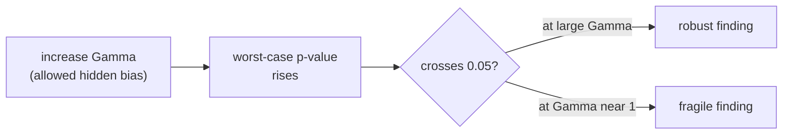

The previous lesson showed that an omitted confounder biases an adjusted estimate by
$\beta_U \delta$, and that the relevant question is "how strong would the confounder have
to be to overturn my finding?". Sensitivity analysis answers it with a single number.
**Rosenbaum's $\Gamma$** (gamma) reports, on the treatment-odds scale, how much hidden
confounding the data could tolerate before the result loses significance. The **E-value**
does the same on the risk-ratio scale and is computable from the point estimate alone. A
large $\Gamma$ or E-value means it would take an implausibly strong confounder to explain
the effect away; a value near 1 means a weak one suffices.

## Rosenbaum's sensitivity parameter $\Gamma$

In a study matched on measured covariates $X$, two units $i$ and $j$ with the same $X$
should have equal odds of being the treated one if ignorability holds. Hidden confounding
lets those odds differ. **Rosenbaum's model** bounds the ratio of treatment odds for any
matched pair<FN n="1" />:

$$
\frac{1}{\Gamma} \le \frac{\pi_i / (1 - \pi_i)}{\pi_j / (1 - \pi_j)} \le \Gamma,
\qquad \Gamma \ge 1,
$$

where $\pi_i = P(W_i {=} 1 \mid X_i, U_i)$ is unit $i$'s treatment probability given both
measured and hidden covariates.

- $\Gamma = 1$: matched units have identical treatment odds. This is exactly ignorability,
  no hidden confounding.
- $\Gamma = 2$: a hidden confounder could make one unit of a pair up to twice as likely to
  be treated as its match.

The sensitivity analysis asks: as $\Gamma$ rises from 1, at what value does the $p$-value
for the treatment effect cross 0.05? Call it $\Gamma^\star$. A study with $\Gamma^\star = 5$
is robust (only a confounder that multiplies treatment odds fivefold could overturn it);
one with $\Gamma^\star = 1.1$ is fragile.



## The E-value: sensitivity on the risk-ratio scale

Rosenbaum's $\Gamma$ needs the matched-pair structure and a worst-case $p$-value
computation. VanderWeele and Ding's **E-value** gives a closely related summary from just
the reported effect on the risk-ratio scale<FN n="2" />. A confounder $U$ can fully explain
an observed risk ratio only if it is associated with **both** the treatment and the outcome
at least as strongly as some threshold. The E-value is that threshold.

Let $RR_{UW}$ be the risk ratio relating $U$ to treatment and $RR_{UY}$ the risk ratio
relating $U$ to the outcome, each on the scale where larger means stronger association.
The key bound (Ding and VanderWeele) states that a confounder can move the observed risk
ratio $RR$ down to 1 (no effect) only if

$$
\frac{RR_{UW}\, RR_{UY}}{RR_{UW} + RR_{UY} - 1} \ge RR.
$$

The **E-value** is the smallest equal value of both associations that satisfies this,
i.e. setting $RR_{UW} = RR_{UY} = E$ and solving for the boundary.

### Deriving the formula

**Step 1.** Set both associations equal to $E$ and require the bound to hold with
equality at the point where the confounder just explains the effect:

$$
\frac{E \cdot E}{E + E - 1} = RR \quad\Longrightarrow\quad \frac{E^2}{2E - 1} = RR.
$$

**Step 2.** Clear the denominator:

$$
E^2 = RR\,(2E - 1) = 2 RR\, E - RR.
$$

**Step 3.** Rearrange into a quadratic in $E$:

$$
E^2 - 2 RR\, E + RR = 0.
$$

**Step 4.** Apply the quadratic formula, taking the larger root (the E-value is defined as
the minimum association strength, which corresponds to the root at least 1):

$$
E = \frac{2 RR \pm \sqrt{4 RR^2 - 4 RR}}{2} = RR \pm \sqrt{RR^2 - RR}.
$$

Taking the $+$ root:

$$
\boxed{\ E\text{-value} = RR + \sqrt{RR\,(RR - 1)}\ }.
$$

For a protective effect with $RR$ less than 1, apply the formula to $1/RR$ first so that
the input exceeds 1.


## A magnitude scale for the E-value

| observed risk ratio $RR$ | E-value | reading |
|---|---|---|
| 1.0 | 1.00 | any confounder could explain it |
| 1.25 | 1.81 | a modest confounder suffices |
| 2.0 | 3.41 | needs a confounder with $RR_{UW}, RR_{UY} \ge 3.4$ each |
| 3.0 | 5.45 | needs a very strong confounder on both arms |

A useful calibration: smoking raises lung-cancer risk with an $RR$ near 10, so a confounder
strong enough to fake a smoking-cancer association would itself be one of the strongest known
risk factors. An E-value of 1.8 is weak; an E-value above 4 is hard to dismiss because few
real confounders associate with both treatment and outcome at $RR \ge 4$.

## A named confusion: E-value of the estimate vs. of the confidence limit

Two E-values are reported. The E-value **of the point estimate** asks what confounder would
move $\hat{RR}$ to exactly 1. The E-value **of the confidence limit** asks what confounder
would move the limit of the interval (the value nearer 1) to 1, overturning **significance**
rather than the point estimate. The second is always smaller. A finding with point E-value
3.4 but confidence-limit E-value 1.3 is statistically fragile even though its central estimate
looks robust; report both.

## Implementation

```python
import numpy as np

def evalue(rr):
    """E-value for an observed risk ratio rr (handles protective rr < 1)."""
    rr = np.asarray(rr, dtype=float)
    rr = np.where(rr < 1.0, 1.0 / rr, rr)   # flip protective effects above 1
    return rr + np.sqrt(rr * (rr - 1.0))

# Spot values matching the magnitude table.
for rr in [1.0, 1.25, 2.0, 3.0]:
    print(f"RR = {rr:>4}:  E-value = {evalue(rr):.2f}")

# The E-value satisfies the defining quadratic E^2 - 2*RR*E + RR = 0.
rr = 2.0
E = evalue(rr)
assert np.isclose(E**2 - 2 * rr * E + rr, 0.0, atol=1e-9)

# A protective RR = 0.5 has the same E-value as its reciprocal RR = 2.0.
assert np.isclose(evalue(0.5), evalue(2.0))
print("E-value(0.5) == E-value(2.0):", round(float(evalue(0.5)), 4))
```

The printed E-values match the table, and the assertions confirm the formula is the root of
its quadratic and is symmetric under reciprocation of the risk ratio.

## Exercises

**Exercise 1.** A cohort study reports a risk ratio $RR = 1.5$ for an exposure. Compute the
E-value by hand and interpret it: how strong, on the risk-ratio scale, would an unmeasured
confounder's associations with both exposure and outcome have to be to fully explain the
finding?

<details>
<summary>Solution</summary>

**Step 1.** Apply the formula with $RR = 1.5$:

$$
E = RR + \sqrt{RR(RR-1)} = 1.5 + \sqrt{1.5 \cdot 0.5} = 1.5 + \sqrt{0.75}.
$$

**Step 2.** Evaluate the square root: $\sqrt{0.75} \approx 0.866$, so $E \approx 2.37$.

**Step 3.** Reading: a confounder could explain away the $RR = 1.5$ only if it is associated
with both the exposure and the outcome by a risk ratio of at least $2.37$ each. A confounder
weaker than that on either arm cannot account for the whole effect.

</details>

**Exercise 2.** Show that the E-value is always at least the observed risk ratio,
$E\text{-value} \ge RR$ for $RR \ge 1$, and that the two coincide only at $RR = 1$. Explain
what this means for a null finding.

<details>
<summary>Solution</summary>

**Step 1.** The E-value is $RR + \sqrt{RR(RR-1)}$. For $RR \ge 1$ the term under the root,
$RR(RR-1)$, is nonnegative, so the square root is real and $\ge 0$, giving
$E\text{-value} = RR + (\text{nonnegative}) \ge RR$.

**Step 2.** Equality $E\text{-value} = RR$ requires $\sqrt{RR(RR-1)} = 0$, i.e.
$RR(RR-1) = 0$. For $RR \ge 1$ this holds only at $RR = 1$ (the root $RR = 0$ is excluded).

**Step 3.** At $RR = 1$ the E-value is exactly 1: a null finding can be "explained" by a
confounder of association strength 1, meaning no confounding at all is required, because
there is nothing to explain. Sensitivity analysis is uninformative for a null result.

</details>

**Exercise 3 (code).** Verify numerically that the E-value formula is the inverse of the
defining association bound: for a grid of risk ratios, set $RR_{UW} = RR_{UY} = E\text{-value}(RR)$
and confirm that $\frac{RR_{UW} RR_{UY}}{RR_{UW} + RR_{UY} - 1}$ recovers the original $RR$.
End in a true `assert`.

<details>
<summary>Solution</summary>

```python
import numpy as np

def evalue(rr):
    rr = np.asarray(rr, dtype=float)
    rr = np.where(rr < 1.0, 1.0 / rr, rr)
    return rr + np.sqrt(rr * (rr - 1.0))

rr_grid = np.array([1.1, 1.5, 2.0, 2.5, 3.0, 4.0])
E = evalue(rr_grid)

# Plug E back into the Ding-VanderWeele bound with RR_UW = RR_UY = E.
recovered = (E * E) / (E + E - 1.0)

assert np.allclose(recovered, rr_grid, atol=1e-9)
print(np.round(recovered, 4))
```

Plugging the E-value back in as both confounder associations reproduces the original risk
ratio to machine precision, confirming it is the threshold strength.

</details>

The next lesson abandons a single corrected number entirely: partial identification
reports the whole interval of effects consistent with the data under weak assumptions.

<Footnotes>
  <FNItem n="1">**Rosenbaum, P. R.** (2002). *Observational Studies* (2nd ed.). Springer. Develops the sensitivity parameter $\Gamma$ and worst-case $p$-value bounds for matched designs.</FNItem>
  <FNItem n="2">**VanderWeele, T. J., & Ding, P.** (2017). "Sensitivity Analysis in Observational Research: Introducing the E-Value". *Annals of Internal Medicine*, 167(4), 268-274. [doi:10.7326/M16-2607](https://doi.org/10.7326/M16-2607)</FNItem>
</Footnotes>
