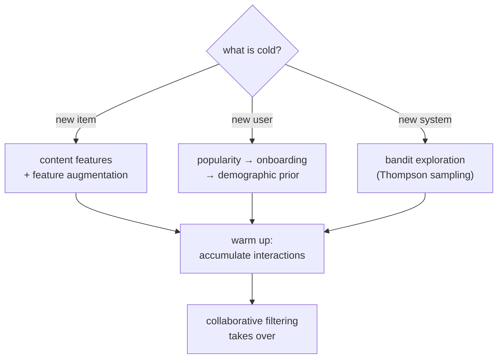

Every collaborative method needs interactions it does not yet have for someone
new. A user who just signed up has no history; an item just added has no
ratings; a brand-new platform has neither. This is the **cold-start** problem,
and it is not a corner case: a healthy product is constantly acquiring users and
items, so some fraction of every request is always cold. The strategies split
cleanly by *which* side is cold<FN n="2" />.

## New item: lean on content

A new item has no interaction signal but does have features (genre, text,
embedding), so the fallback is the content-based score from earlier in this
discipline. The item is placed in feature space and scored against existing user
profiles, with no ratings required. **Feature augmentation** strengthens this:
fold the content embedding into the collaborative model as side information so
the item is not a blank row but a row initialized from its attributes. The new
item earns interaction data over time and gradually transitions from
content-scored to collaboratively-scored.

## New user: ask, or borrow

A new user has no profile to score against. Three responses, in increasing cost:

- **Popularity fallback.** Serve the damped-popularity ranking until the user
  accumulates history. It is non-personalized but robust, and it is what most
  systems show on the very first visit.
- **Onboarding.** Ask directly. A short signup survey ("pick a few you like")
  seeds a profile from a handful of explicit signals; the design tension is
  length, since each extra question costs drop-off but buys personalization.
- **Demographic / context priors.** Borrow a profile from users who share
  observable attributes (region, device, referral), a stereotype that is wrong
  in detail but better than the global average on the first request.

## New system: bootstrap and explore

A new platform has the hardest version, no users and no items with history. Here
the only way to acquire the missing signal is to *spend impressions to learn*,
which makes cold start an instance of the **exploration vs exploitation**
trade-off. Always showing the current best item (pure exploitation) never
discovers that a rarely-shown item is actually excellent; always showing random
items (pure exploration) wastes impressions on known-bad ones. The principled
middle is a **bandit**: treat each item as an arm with unknown click rate and
choose to balance the two.

**Thompson sampling** is the clean version<FN n="1" />. Model each item's rate
with a Beta posterior $\text{Beta}(\alpha_i, \beta_i)$ updated by clicks and
skips, then on each request *sample* a rate from every item's posterior and show
the argmax of the samples. Items with high uncertainty occasionally draw a high
sample and get explored; items with many observations have tight posteriors and
are shown only if genuinely good. The exploration is automatic and decays as
evidence accumulates, exactly what a cold catalog needs.



## Check it on arrays

```python
import numpy as np

rng = np.random.default_rng(0)

# A cold catalog: 10 new items with unknown true click rates
n_items = 10
true_rate = rng.uniform(0.05, 0.5, n_items)
best = true_rate.argmax()
T = 4000

def simulate(policy):
    a = np.ones(n_items); b = np.ones(n_items)   # Beta(1,1) priors
    clicks = 0
    for t in range(T):
        if policy == "greedy":
            i = (a / (a + b)).argmax()            # show current best mean
        else:                                      # Thompson sampling
            i = rng.beta(a, b).argmax()           # show argmax of samples
        r = rng.random() < true_rate[i]
        clicks += r
        a[i] += r; b[i] += 1 - r
    return clicks, a, b

g_clicks, *_ = simulate("greedy")
t_clicks, a, b = simulate("thompson")

# Thompson identifies the best item: its posterior mean is the highest
post_mean = a / (a + b)
print(f"true best item: {best}  (rate {true_rate[best]:.2f})")
print(f"thompson's top item: {post_mean.argmax()}")
print(f"clicks  greedy: {g_clicks}   thompson: {t_clicks}")
assert post_mean.argmax() == best
```

Pure greedy can lock onto whichever item looked good early and never re-check the
rest; Thompson sampling keeps sampling uncertain items, identifies the truly best
new item, and collects more clicks over the cold run.

## Exercises

**Exercise 1.** A new user answers a 3-item onboarding survey, liking two
sci-fi titles and disliking one romance title. Using the content-profile
construction from the content-based lesson (mean-centered over the three
ratings, treat like as $+1$ and dislike as $-1$), state the sign of the profile
on the sci-fi and romance coordinates and why it is usable immediately.

<details>
<summary>Solution</summary>

**Step 1.** Ratings $(+1, +1, -1)$ have mean $+1/3$, so centered weights are
$(+2/3, +2/3, -4/3)$.

**Step 2.** The two liked sci-fi items carry positive centered weight, so the
sci-fi coordinate of the profile is positive; the disliked romance item carries
the (largest-magnitude) negative weight, so the romance coordinate is negative.

**Step 3.** This profile exists after three answers and zero interaction history,
so it can score any item by cosine right away. Onboarding converts the new-user
cold start into a tiny content-based problem.

</details>

**Exercise 2.** Explain why a pure-exploitation (greedy) policy on a cold catalog
can permanently miss the best item, referencing the Beta posterior.

<details>
<summary>Solution</summary>

**Step 1.** Greedy always shows the item with the highest posterior mean. Early
on, a genuinely good item can get an unlucky run of skips, dropping its
posterior mean below a mediocre item that got a lucky early click.

**Step 2.** Once another item leads, greedy stops showing the unlucky good item
entirely, so its posterior never updates again and stays stuck at the pessimistic
estimate.

**Step 3.** Thompson sampling avoids this because the good item's posterior, even
if its mean is low, still has spread; it occasionally samples high and gets shown
again, letting the evidence correct itself. Exploration is what repairs an unlucky
early estimate.

</details>

**Exercise 3 (code).** Add an $\varepsilon$-greedy policy (show a uniformly
random item with probability $\varepsilon = 0.1$, else the current best) to the
simulation and verify it, like Thompson, recovers the best item where pure greedy
may not.

<details>
<summary>Solution</summary>

```python
import numpy as np

rng = np.random.default_rng(2)
n_items = 10
true_rate = rng.uniform(0.05, 0.5, n_items)
best = true_rate.argmax()
T = 4000

a = np.ones(n_items); b = np.ones(n_items)
eps = 0.1
for t in range(T):
    if rng.random() < eps:
        i = rng.integers(n_items)              # explore uniformly
    else:
        i = (a / (a + b)).argmax()             # exploit current best
    r = rng.random() < true_rate[i]
    a[i] += r; b[i] += 1 - r

post_mean = a / (a + b)
assert post_mean.argmax() == best
print(f"true best: {best}   epsilon-greedy top: {post_mean.argmax()}")
```

The forced $10\%$ random exploration guarantees every item keeps getting sampled,
so the best item's posterior is corrected and rises to the top, the same outcome
Thompson reaches with smarter, uncertainty-driven exploration.

</details>

This closes the foundations; the next discipline rebuilds recommendation on
matrix factorization, where users and items become learned low-dimensional
embeddings rather than raw interaction rows.

<Footnotes>
  <FNItem n="1">**Chapelle, O., & Li, L.** (2011). "An empirical evaluation of Thompson sampling". *NeurIPS*. [https://papers.nips.cc/paper/2011/hash/e53a0a2978c28872a4505bdb51db06dc-Abstract.html](https://papers.nips.cc/paper/2011/hash/e53a0a2978c28872a4505bdb51db06dc-Abstract.html). Thompson sampling for exploration in recommendation and advertising.</FNItem>
  <FNItem n="2">**Schein, A. I., Popescul, A., Ungar, L. H., & Pennock, D. M.** (2002). "Methods and metrics for cold-start recommendations". *SIGIR*. [doi:10.1145/564376.564421](https://doi.org/10.1145/564376.564421). A taxonomy of cold-start settings and evaluation.</FNItem>
</Footnotes>
